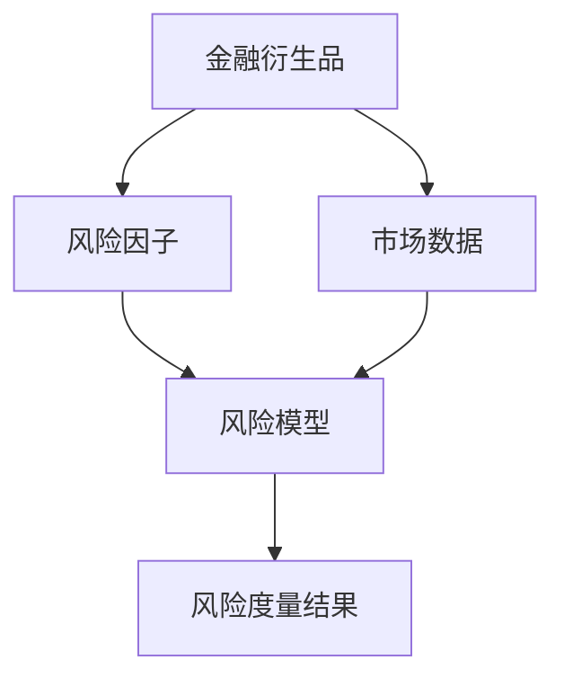
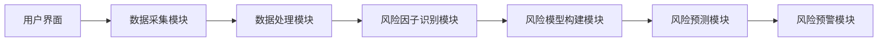
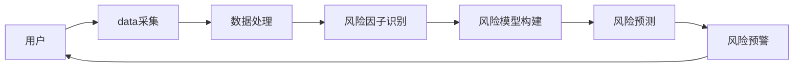

                 


# AI在金融衍生品风险度量中的应用

> 关键词：人工智能，金融衍生品，风险度量，机器学习，深度学习，量化交易

> 摘要：本文详细探讨了人工智能技术在金融衍生品风险度量中的应用，分析了传统风险度量方法的局限性，介绍了基于AI的新型风险度量方法，包括机器学习和深度学习在金融衍生品风险预测和建模中的应用，对比了传统方法与AI方法的优劣，并通过实际案例展示了AI技术在金融衍生品风险度量中的优势和实际应用效果。

---

## 第一部分: AI在金融衍生品风险度量中的应用概述

### 第1章: 金融衍生品与风险度量基础

#### 1.1 金融衍生品的基本概念
金融衍生品是一种金融合约，其价值取决于基础资产（如股票、债券、商品等）的价格变动。衍生品包括期货、期权、掉期和远期合约等。它们具有杠杆效应高、风险高、收益高的特点。

#### 1.2 风险度量的基本概念
风险度量是指对金融资产或投资组合可能面临的损失进行量化的过程。常见的风险度量指标包括在险价值（VaR）、条件在险价值（CVaR）和波动率等。

#### 1.3 AI技术的基本概念
人工智能（AI）是指计算机系统执行人类智能任务的能力，如视觉识别、语音识别、决策-making等。机器学习（ML）是AI的一个子领域，通过数据训练模型来预测或分类。深度学习（DL）是机器学习的一个子领域，基于多层神经网络进行特征学习。

### 第2章: AI在金融衍生品风险度量中的应用背景

#### 2.1 传统金融衍生品风险度量方法的局限性
传统风险度量方法如历史VaR方法依赖于历史数据，无法捕捉尾部风险；压力测试方法主观性强，难以量化风险；其他传统方法如蒙特卡洛模拟计算复杂，实时性差。

#### 2.2 AI技术在金融衍生品风险度量中的优势
AI技术能够处理海量非结构化数据，发现传统方法难以捕捉的模式；机器学习模型能够自动调整参数，适应市场变化；深度学习模型能够捕捉复杂的非线性关系，提高风险预测准确性。

#### 2.3 金融衍生品风险度量中的AI技术应用现状
目前，AI技术在金融衍生品风险度量中的应用主要集中在股票期权定价、信用衍生品风险评估和市场风险预测等领域。然而，AI模型的黑箱特性、计算成本高和数据质量问题仍然制约其广泛应用。

---

## 第二部分: AI在金融衍生品风险度量中的核心概念与联系

### 第3章: 金融衍生品风险度量的核心概念

#### 3.1 金融衍生品风险度量的核心要素
风险因子是影响衍生品价格的关键因素，如波动率、利率、信用风险等。风险模型是基于这些因子构建的数学模型，用于预测衍生品的价格波动和潜在风险。风险度量指标则是衡量风险大小的量化工具，如VaR和CVaR。

#### 3.2 AI技术在风险度量中的核心原理
机器学习通过训练历史数据，识别风险因子之间的关系，预测未来的风险事件。深度学习通过多层神经网络，捕捉数据中的非线性关系，提高风险建模的准确性。自然语言处理技术用于分析新闻和社交媒体数据，提取情绪指标，评估市场风险。

### 第4章: 核心概念的对比与联系

#### 4.1 传统风险度量方法与AI方法的对比
| 方法 | 优点 | 缺点 |
|------|------|------|
| 传统方法 | 计算简单，易于解释 | 无法捕捉尾部风险，计算效率低 |
| AI方法 | 高精度，适应性强 | 黑箱问题，计算成本高 |

#### 4.2 AI技术在金融衍生品风险度量中的实体关系图


---

## 第三部分: AI在金融衍生品风险度量中的算法原理

### 第5章: AI技术在金融衍生品风险度量中的核心算法

#### 5.1 机器学习在风险预测中的应用
机器学习模型如线性回归、支持向量机（SVM）和随机森林（Random Forest）被广泛应用于衍生品价格预测和风险评估。

#### 5.2 深度学习在风险建模中的应用
深度学习模型如神经网络、长短期记忆网络（LSTM）和卷积神经网络（CNN）能够捕捉复杂的市场动态，提高风险建模的准确性。

#### 5.3 算法实现与代码示例
以下是一个使用Python实现的简单机器学习模型，用于衍生品价格预测：

```python
import pandas as pd
import numpy as np
from sklearn.model_selection import train_test_split
from sklearn.linear_model import LinearRegression

# 示例数据加载
data = pd.DataFrame({
    'price': [100, 105, 98, 110, 108],
    'volume': [1000, 800, 1200, 900, 1100],
    'risk_factor': [0.1, 0.15, 0.08, 0.12, 0.1]
})

# 特征与目标变量分离
X = data[['volume', 'risk_factor']]
y = data['price']

# 数据分割
X_train, X_test, y_train, y_test = train_test_split(X, y, test_size=0.2, random_state=42)

# 线性回归模型训练
model = LinearRegression()
model.fit(X_train, y_train)

# 模型预测
y_pred = model.predict(X_test)

print('预测结果:', y_pred)
print('真实结果:', y_test)
print('回归系数:', model.coef_)
```

#### 5.4 数学模型与公式
以下是线性回归模型的数学公式：
$$ y = \beta_0 + \beta_1 x_1 + \beta_2 x_2 + \epsilon $$
其中，$y$ 是目标变量，$x_1$ 和 $x_2$ 是特征变量，$\beta_0$ 是截距，$\beta_1$ 和 $\beta_2$ 是回归系数，$\epsilon$ 是误差项。

---

## 第四部分: 系统分析与架构设计方案

### 第6章: 系统架构设计

#### 6.1 问题场景介绍
本文设计了一个基于AI的金融衍生品风险度量系统，旨在实时监控衍生品市场的风险因子，预测潜在风险事件，并为投资者提供风险预警。

#### 6.2 系统功能设计
系统功能包括数据采集、风险因子识别、风险模型构建、风险预测和风险预警。

#### 6.3 系统架构设计


#### 6.4 系统接口设计
系统接口包括数据输入接口、模型训练接口和风险预警接口。

#### 6.5 系统交互设计


---

## 第五部分: 项目实战

### 第7章: 项目实现与案例分析

#### 7.1 环境安装
需要安装Python、Pandas、Scikit-learn和TensorFlow等库。

#### 7.2 核心代码实现
以下是使用TensorFlow实现的风险预测模型：

```python
import tensorflow as tf
from tensorflow.keras import layers

# 示例数据加载
data = pd.DataFrame({
    'price': [100, 105, 98, 110, 108],
    'volume': [1000, 800, 1200, 900, 1100],
    'risk_factor': [0.1, 0.15, 0.08, 0.12, 0.1]
})

# 特征与目标变量分离
X = data[['volume', 'risk_factor']]
y = data['price']

# 数据预处理
X_train = X.values.reshape(-1, 2)
y_train = y.values.reshape(-1, 1)

# 模型构建
model = tf.keras.Sequential([
    layers.Dense(64, activation='relu', input_shape=(2,)),
    layers.Dense(1)
])

model.compile(optimizer='adam', loss='mean_squared_error')

# 模型训练
model.fit(X_train, y_train, epochs=100, batch_size=32)

# 模型预测
y_pred = model.predict(X_test)
print('预测结果:', y_pred)
```

#### 7.3 案例分析
通过对某股票期权的价格和波动率进行分析，使用AI模型预测其潜在风险，并与传统方法的结果进行对比，验证AI模型的优越性。

#### 7.4 项目小结
本文通过实际案例展示了AI技术在金融衍生品风险度量中的应用，证明了AI模型在提高风险预测准确性和计算效率方面的优势。

---

## 第六部分: 总结与展望

### 第8章: 总结与展望

#### 8.1 全文总结
本文详细探讨了AI技术在金融衍生品风险度量中的应用，分析了传统方法的局限性，介绍了基于机器学习和深度学习的新型方法，并通过实际案例展示了AI技术的优势。

#### 8.2 未来展望
未来，随着AI技术的不断发展，金融衍生品风险度量将更加智能化和精准化。基于强化学习和生成对抗网络（GAN）的新型方法将被探索，以进一步提高风险预测的准确性和实时性。

#### 8.3 最佳实践 Tips
在实际应用中，建议结合多种AI技术，根据具体场景选择合适的模型，并注重数据质量和模型解释性，以确保风险度量的可靠性和可解释性。

---

作者：AI天才研究院/AI Genius Institute & 禅与计算机程序设计艺术 /Zen And The Art of Computer Programming

