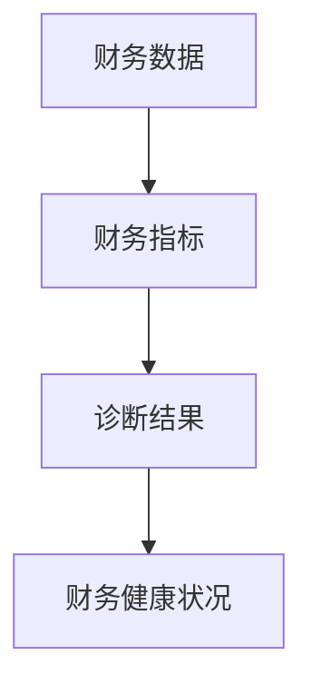
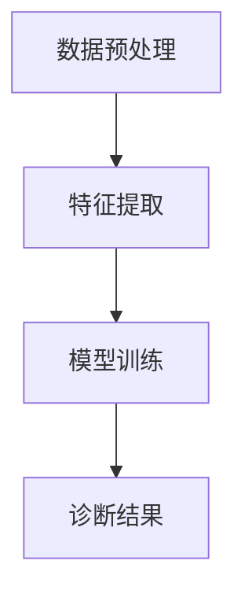
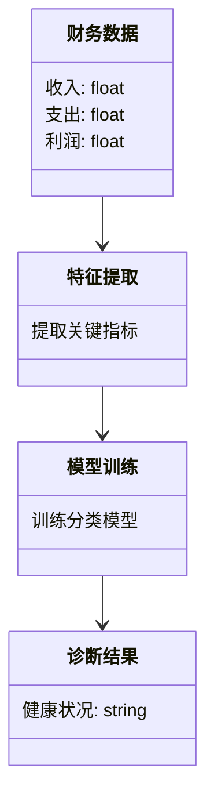
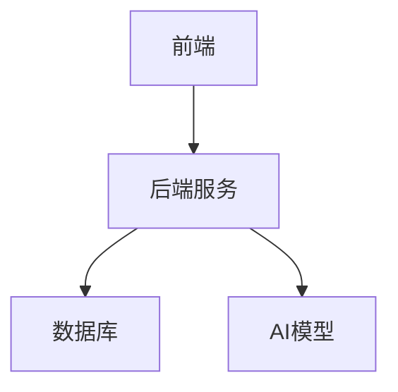

                 


```markdown
# AI增强型公司财务健康诊断

> 关键词：AI技术，财务诊断，机器学习，数据分析，企业财务健康

> 摘要：本文将探讨如何利用人工智能技术增强公司财务健康诊断的准确性与效率。通过分析财务数据，结合机器学习算法，提出一种基于AI的财务健康诊断方法，能够更精准地识别企业财务风险，优化财务管理。

---

## 第一部分: AI增强型公司财务健康诊断的背景与意义

### 第1章: 问题背景

#### 1.1 传统财务诊断的局限性
传统的财务诊断方法依赖于财务报表分析和人工判断，存在以下问题：
- 数据量大：企业财务数据复杂，人工分析效率低。
- 主观性高：不同分析师可能得出不同结论。
- 预测能力有限：难以准确预测财务风险。

#### 1.2 AI技术在财务诊断中的应用前景
人工智能技术，尤其是机器学习和深度学习，能够处理海量数据，发现潜在规律，提高诊断准确性。

#### 1.3 企业财务健康诊断的重要性
财务健康是企业生存和发展的关键，及时发现问题有助于避免财务危机。

### 第2章: 问题描述

#### 2.1 财务数据的复杂性
财务数据包括收入、支出、利润等，涉及多个维度。

#### 2.2 财务健康诊断的关键指标
如资产负债率、净利润率等。

#### 2.3 AI增强型诊断的核心目标
利用AI技术提高诊断效率和准确性。

### 第3章: 问题解决

#### 3.1 AI在财务数据处理中的优势
- 自动化处理：减少人工错误。
- 快速分析：提高效率。
- 深度学习：发现隐藏规律。

#### 3.2 AI增强型诊断的实现路径
- 数据收集：整合财务数据。
- 数据预处理：清洗和标准化。
- 模型训练：训练分类或回归模型。
- 结果解释：提供可理解的诊断结果。

#### 3.3 诊断结果的可解释性
确保AI模型的决策过程透明，便于财务团队理解和信任。

### 第4章: 边界与外延

#### 4.1 财务诊断的边界条件
- 数据范围：财务相关数据。
- 诊断目标：识别财务健康状况。

#### 4.2 AI增强型诊断的适用范围
适用于数据充足且结构化的财务数据。

#### 4.3 与其他诊断方法的对比
- 传统方法：依赖经验，效率低。
- AI方法：数据驱动，高效准确。

## 第二部分: AI增强型公司财务健康诊断的核心概念与联系

### 第5章: 核心概念

#### 5.1 核心概念术语说明
- 数据预处理：清洗、标准化等。
- 特征提取：选择关键财务指标。
- 模型训练：训练分类模型。

#### 5.2 概念属性特征对比

| 特性    | 传统方法         | AI方法           |
|---------|------------------|------------------|
| 数据量  | 小               | 大               |
| 精度    | 低               | 高               |
| 效率    | 低               | 高               |

#### 5.3 ER实体关系图



## 第三部分: 算法原理讲解

### 第6章: 算法原理

#### 6.1 机器学习算法选择
使用随机森林或神经网络。

#### 6.2 数学模型

随机森林分类模型：

$$
\text{预测概率} = \frac{\sum_{i=1}^{n} H(t_i, x)}{n}
$$

其中，$H(t_i, x)$ 是第i棵树的预测结果，$x$ 是输入样本。

### 第7章: 算法实现

#### 7.1 算法流程图



#### 7.2 核心代码实现

```python
import pandas as pd
from sklearn.ensemble import RandomForestClassifier

# 数据预处理
data = pd.read_csv('financial_data.csv')
X = data.drop('target', axis=1)
y = data['target']

# 特征提取
selected_features = ['revenue', 'profit', '负债率']
X = X[selected_features]

# 模型训练
model = RandomForestClassifier()
model.fit(X, y)

# 预测
predictions = model.predict(X)
```

## 第四部分: 系统分析与架构设计方案

### 第8章: 问题场景介绍

#### 8.1 系统功能设计

领域模型类图：



#### 8.2 系统架构设计

架构图：



## 第五部分: 项目实战

### 第9章: 项目实现

#### 9.1 环境安装

安装Python和必要的库：

```bash
pip install pandas scikit-learn
```

#### 9.2 核心代码实现

```python
import pandas as pd
from sklearn.ensemble import RandomForestClassifier

# 加载数据
data = pd.read_csv('financial_data.csv')

# 数据预处理
X = data[['收入', '支出', '利润']]
y = data['健康状况']

# 模型训练
model = RandomForestClassifier()
model.fit(X, y)

# 预测
predicted_health = model.predict(X)
```

## 第六部分: 最佳实践

### 第10章: 小结

AI增强型财务诊断提高了效率和准确性，为企业财务管理提供了新思路。

### 第11章: 注意事项

- 数据质量：确保数据准确。
- 模型调优：选择合适算法。
- 结果解释：便于财务团队理解。

### 第12章: 未来趋势

- 更复杂的模型：如深度学习。
- 实时诊断：动态分析财务状况。

### 第13章: 拓展阅读

推荐书籍和论文，深入理解AI在财务中的应用。

---

## 作者：AI天才研究院 & 禅与计算机程序设计艺术

本文由AI天才研究院撰写，旨在分享AI在财务健康诊断中的应用，转载请注明出处。
```

