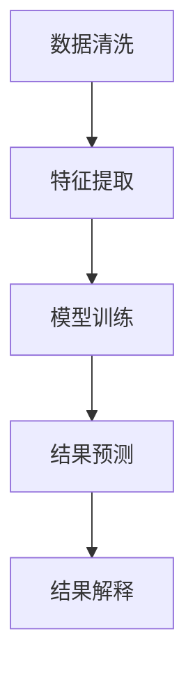
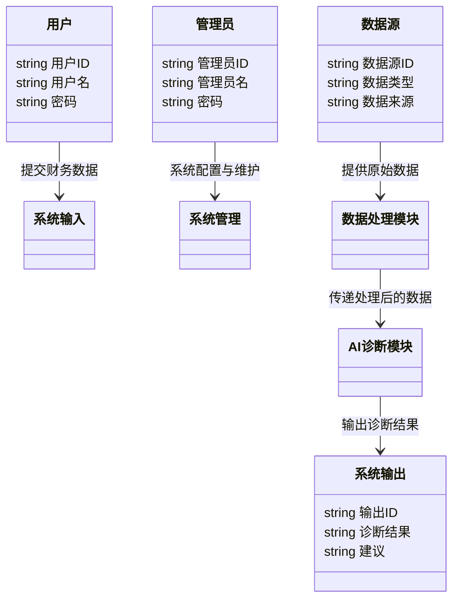

                 


# AI增强型公司财务健康诊断系统

> 关键词：AI，财务健康，诊断系统，企业分析，数据处理，机器学习

> 摘要：本文详细介绍了AI增强型公司财务健康诊断系统的设计与实现。通过分析传统财务诊断的局限性，结合人工智能技术，提出了一个高效的财务健康诊断系统。文章从系统背景、核心概念、算法原理、系统架构、项目实战等多个方面进行了深入探讨，并通过实际案例展示了系统的应用价值。

---

# 第一部分：背景介绍

## 第1章：问题背景与需求分析

### 1.1 财务健康诊断的背景与意义

#### 1.1.1 传统财务诊断的局限性
传统财务诊断方法依赖于人工分析，效率低且容易出错。企业财务数据的复杂性和多样性使得传统方法难以全面覆盖。

#### 1.1.2 AI技术在财务诊断中的潜力
人工智能技术能够快速处理大量数据，发现隐藏的模式和趋势，为财务诊断提供更精准的分析。

#### 1.1.3 企业财务健康诊断的核心价值
通过AI技术，企业可以实时监控财务健康状况，提前发现潜在风险，优化财务管理。

### 1.2 问题描述与目标设定

#### 1.2.1 财务数据的复杂性与多样性
企业财务数据包括收入、支出、资产、负债等多方面，数据量大且类型多样。

#### 1.2.2 企业财务健康诊断的关键指标
主要指标包括盈利能力、偿债能力、运营效率和成长能力。

#### 1.2.3 系统目标与功能定位
目标是开发一个基于AI的财务健康诊断系统，功能包括数据采集、分析、诊断和建议生成。

### 1.3 系统边界与外延

#### 1.3.1 系统功能的边界
系统仅负责财务数据的分析与诊断，不涉及数据录入和外部业务系统。

#### 1.3.2 与企业其他系统的交互
系统可以与ERP系统、财务管理系统等进行数据交互。

#### 1.3.3 系统的可扩展性与灵活性
系统设计应支持新增诊断指标和算法的扩展。

### 1.4 核心概念结构与组成

#### 1.4.1 数据来源与处理流程
数据来源包括财务报表、银行流水、销售数据等，处理流程包括清洗、转换和特征提取。

#### 1.4.2 AI算法的核心模块
包括数据预处理、特征选择、模型训练和结果解释。

#### 1.4.3 系统输出与结果展示
系统输出包括财务健康评分、风险预警和优化建议，结果通过可视化方式展示。

## 第2章：核心概念与技术原理

### 2.1 AI增强型财务诊断的核心概念

#### 2.1.1 数据驱动的财务分析
通过大量财务数据，利用AI技术进行模式识别和趋势预测。

#### 2.1.2 智能诊断算法
使用机器学习算法对财务数据进行分类、回归和聚类分析。

#### 2.1.3 可视化结果展示
通过图表、仪表盘等形式直观展示财务健康状况。

### 2.2 核心概念对比分析

#### 2.2.1 传统财务诊断 vs AI增强型诊断
传统诊断依赖人工分析，效率低；AI诊断速度快，精度高。

#### 2.2.2 不同AI算法的优劣势对比
对比决策树、随机森林、神经网络等算法在财务诊断中的表现。

#### 2.2.3 数据质量对诊断结果的影响
数据清洗和特征工程对模型性能至关重要。

### 2.3 系统架构的ER实体关系图

```mermaid
erDiagram
    user : 用户
    admin : 管理员
    data_source : 数据源
    system_output : 系统输出
    user --> system_input : 提交财务数据
    admin --> system_management : 系统配置与维护
    data_source --> data_processing : 提供原始数据
    data_processing --> ai_diagnosis : 传递处理后的数据
    ai_diagnosis --> system_output : 输出诊断结果
```

---

# 第二部分：算法原理与实现

## 第3章：算法原理与实现

### 3.1 算法概述

#### 3.1.1 算法选择与优化
选择适合财务诊断的机器学习算法，如随机森林和XGBoost，并进行调参优化。

#### 3.1.2 算法的输入与输出
输入是财务数据，输出是诊断结果和建议。

#### 3.1.3 算法的性能评估
通过准确率、召回率和F1分数评估模型性能。

### 3.2 算法实现流程



### 3.3 算法实现代码

```python
import pandas as pd
from sklearn.ensemble import RandomForestClassifier
from sklearn.metrics import accuracy_score

# 数据加载与预处理
data = pd.read_csv('financial_data.csv')
X = data.drop('label', axis=1)
y = data['label']

# 模型训练
model = RandomForestClassifier()
model.fit(X, y)

# 模型预测
y_pred = model.predict(X)

# 模型评估
print(f'准确率: {accuracy_score(y, y_pred)}')
```

---

# 第三部分：系统分析与架构设计

## 第4章：系统分析与架构设计

### 4.1 系统架构概述

#### 4.1.1 问题场景介绍
系统需要处理大量财务数据，实时分析企业财务健康状况。

#### 4.1.2 项目介绍
开发一个基于AI的财务健康诊断系统，帮助企业管理者做出决策。

#### 4.1.3 系统功能设计

##### 4.1.3.1 领域模型设计


#### 4.1.4 系统架构设计

##### 4.1.4.1 系统架构图
```mermaid
container 系统架构 {
    component 数据采集模块 {
        数据接口
    }
    component 数据处理模块 {
        数据清洗
        特征提取
    }
    component AI诊断模块 {
        模型训练
        模型预测
    }
    component 系统输出模块 {
        结果展示
        风险预警
    }
}
```

---

# 第四部分：项目实战

## 第5章：项目实战

### 5.1 环境安装与配置

#### 5.1.1 安装Python环境
安装Python 3.8及以上版本，建议使用Anaconda。

#### 5.1.2 安装依赖库
安装pandas、scikit-learn、xgboost等库。

### 5.2 系统核心实现

#### 5.2.1 数据预处理代码
```python
import pandas as pd
import numpy as np

# 数据加载
data = pd.read_csv('financial_data.csv')

# 数据清洗
data.dropna(inplace=True)
data = pd.get_dummies(data)
```

#### 5.2.2 AI诊断模块实现
```python
from xgboost import XGBClassifier

# 模型训练
model = XGBClassifier()
model.fit(X, y)

# 模型预测
y_pred = model.predict(X)
```

### 5.3 代码解读与分析

#### 5.3.1 数据预处理
数据清洗和特征工程是关键步骤，确保数据质量。

#### 5.3.2 AI诊断模块
使用XGBoost算法进行分类，预测财务健康状况。

### 5.4 案例分析与解读

#### 5.4.1 案例数据
使用某公司财务数据进行分析，展示系统输出结果。

#### 5.4.2 结果分析
通过诊断结果，提出优化建议，帮助企业改善财务状况。

### 5.5 项目小结

#### 5.5.1 系统性能
准确率高，处理速度快。

#### 5.5.2 实际应用价值
为企业提供实时、精准的财务诊断服务。

---

# 第五部分：最佳实践与总结

## 第6章：最佳实践与总结

### 6.1 小结

#### 6.1.1 系统优势
AI增强型诊断系统高效、精准，能够实时监控企业财务健康状况。

#### 6.1.2 系统劣势
依赖高质量数据，模型解释性较差。

### 6.2 注意事项

#### 6.2.1 数据安全
确保财务数据的安全性，防止数据泄露。

#### 6.2.2 模型优化
定期更新模型，保持诊断准确性。

### 6.3 拓展阅读

#### 6.3.1 AI在金融领域的应用
进一步了解AI在金融领域的其他应用。

#### 6.3.2 最新研究成果
阅读最新的研究成果，了解技术发展趋势。

---

# 作者：AI天才研究院/AI Genius Institute & 禅与计算机程序设计艺术 /Zen And The Art of Computer Programming

