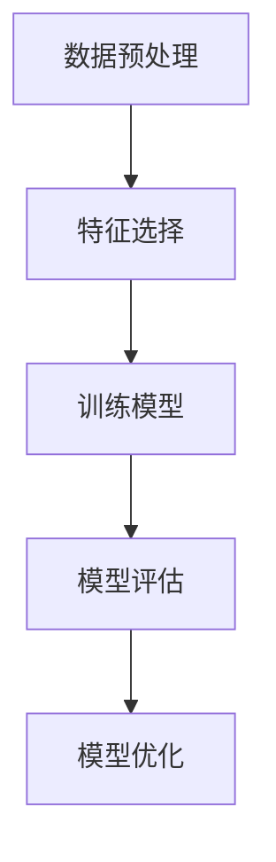
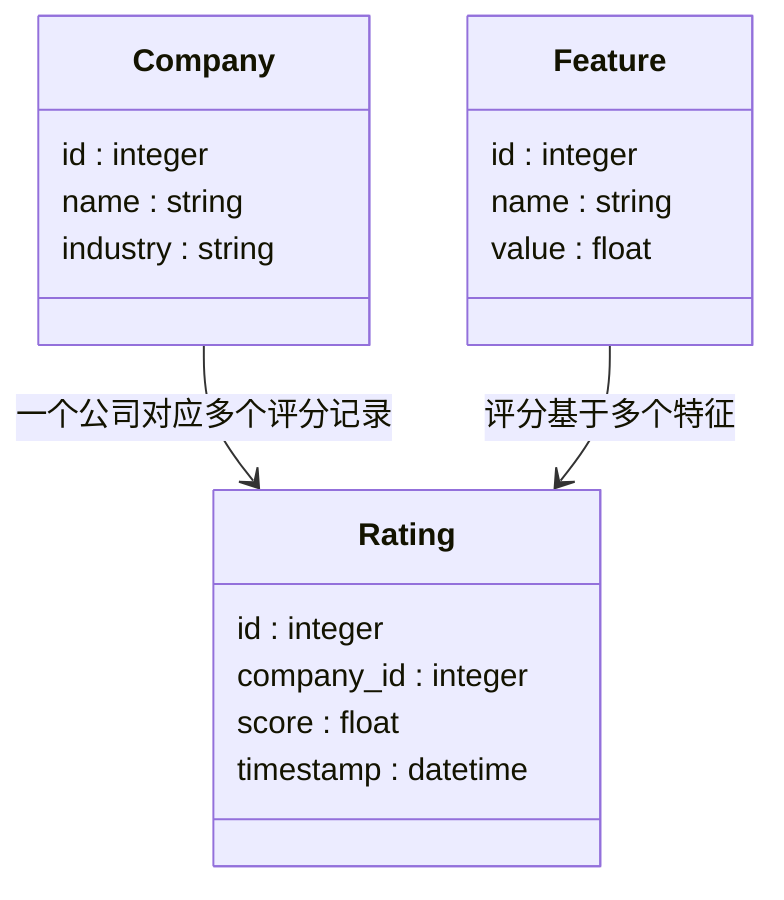
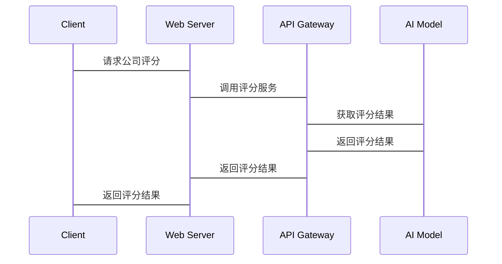

                 


# AI增强型公司质量评分系统

## 关键词：AI、公司质量评分系统、大数据分析、机器学习、评分算法、系统架构、企业应用

## 摘要：本文将探讨如何利用人工智能技术构建一个高效的公司质量评分系统。通过分析公司多维度数据，结合机器学习算法，设计一个智能化、自动化的评分模型，实现对公司质量的精准评估。本文将从系统背景、核心概念、算法原理、系统架构到项目实战进行详细阐述，为读者提供一个全面的解决方案。

---

# 第1章：背景介绍

## 1.1 问题背景

### 1.1.1 传统公司质量评估的局限性
传统的公司质量评估主要依赖于人工审核和经验判断，存在以下问题：
- 数据量大、维度复杂，难以全面覆盖。
- 评估标准主观性强，结果缺乏客观性。
- 评估效率低下，难以满足大规模企业的需求。

### 1.1.2 AI技术在企业质量评估中的潜力
人工智能技术的快速发展为公司质量评估提供了新的可能性：
- 通过大数据分析和机器学习，可以提取更多维度的特征，提升评估的准确性。
- AI能够快速处理海量数据，显著提高评估效率。
- 可以实时更新模型，适应市场变化。

### 1.1.3 当前市场需求与技术发展的结合
随着企业数字化转型的推进，市场对智能化、自动化的质量评估系统需求日益增长。AI技术的应用能够帮助企业更好地进行内部管理和外部合作，成为企业竞争力的重要组成部分。

## 1.2 问题描述

### 1.2.1 公司质量评估的核心要素
公司质量评估需要考虑以下关键因素：
- 财务状况：收入、利润、资产负债率等。
- 运营能力：供应链效率、生产周期、库存周转率等。
- 市场表现：市场份额、客户满意度、品牌价值等。
- 管理团队：领导能力、团队稳定性、战略规划等。

### 1.2.2 现有评分系统的不足
传统的评分系统存在以下问题：
- 数据来源单一，难以全面反映公司质量。
- 评分标准主观性强，结果缺乏可比性。
- 评估周期长，难以满足实时需求。

### 1.2.3 引入AI技术的必要性
AI技术能够通过多维度数据挖掘和建模，提供更精准、客观的评分结果，同时提高评估效率。

## 1.3 问题解决

### 1.3.1 AI在质量评分中的应用场景
AI技术可以应用于以下场景：
- 数据清洗与特征提取。
- 评分模型训练与优化。
- 实时评分与结果反馈。

### 1.3.2 数据驱动的评分方法
通过收集和分析公司的多维度数据，利用机器学习算法构建评分模型，实现自动化评分。

### 1.3.3 系统化解决方案的设计思路
设计思路包括：
1. 数据采集与预处理。
2. 模型训练与优化。
3. 系统集成与部署。
4. 结果展示与反馈。

## 1.4 边界与外延

### 1.4.1 系统的适用范围
系统适用于各类企业，特别是需要多维度评估的中大型企业。

### 1.4.2 系统的限制条件
- 数据质量要求高。
- 模型需要定期更新。
- 对IT基础设施有一定要求。

### 1.4.3 系统与其他模块的接口关系
系统需要与数据源、用户界面、结果展示等模块进行交互。

## 1.5 核心要素组成

### 1.5.1 数据来源与处理
数据来源包括财务数据、运营数据、市场数据等，需要进行清洗和特征提取。

### 1.5.2 评分模型与算法
采用机器学习算法，如线性回归、随机森林等，构建评分模型。

### 1.5.3 评分标准与权重分配
根据公司质量评估的关键因素，合理分配各维度的权重。

---

# 第2章：核心概念与联系

## 2.1 核心概念原理

### 2.1.1 数据驱动的评分机制
通过收集和分析大量数据，利用AI技术进行评分。

### 2.1.2 AI算法在评分中的作用
AI算法能够从数据中提取特征，建立评分模型，实现自动化评估。

### 2.1.3 多维度评分模型的设计
设计多维度模型，确保评分的全面性和准确性。

## 2.2 概念属性特征对比表格

| 概念       | 特征描述                                                                 |
|------------|--------------------------------------------------------------------------|
| 数据来源   | 包括财务数据、运营数据、市场数据等                                         |
| 评分模型   | 采用机器学习算法，如线性回归、随机森林等                                   |
| 评分标准   | 根据公司质量评估的关键因素，合理分配各维度的权重                         |

## 2.3 ER实体关系图架构

```mermaid
erDiagram
    company {
        id : integer
        name : string
        industry : string
        revenue : float
        profit : float
        employee_count : integer
    }
    feature {
        id : integer
        name : string
        type : string
        value : float
    }
    rating {
        id : integer
        company_id : integer
        score : float
        timestamp : datetime
    }
    company --> rating : 一个公司对应多个评分记录
    feature --> rating : 评分基于多个特征
```

---

## 第3章：算法原理

### 3.1 算法选择与原理

#### 3.1.1 线性回归算法
线性回归是一种常用的回归算法，适用于预测连续型变量。其数学模型如下：

$$ y = \beta_0 + \beta_1x_1 + \beta_2x_2 + ... + \beta_nx_n $$

其中，$y$ 是目标变量，$x_i$ 是自变量，$\beta_i$ 是回归系数。

#### 3.1.2 随机森林算法
随机森林是一种基于树的集成算法，适用于分类和回归问题。其核心思想是通过构建多个决策树并进行投票或平均，提高模型的准确性和鲁棒性。

### 3.2 算法流程



### 3.3 算法实现代码

```python
import pandas as pd
from sklearn.model_selection import train_test_split
from sklearn.ensemble import RandomForestRegressor
from sklearn.metrics import mean_squared_error

# 数据加载与预处理
data = pd.read_csv('company_data.csv')
X = data.drop('rating', axis=1)
y = data['rating']

# 数据分割
X_train, X_test, y_train, y_test = train_test_split(X, y, test_size=0.2, random_state=42)

# 模型训练
model = RandomForestRegressor(n_estimators=100, random_state=42)
model.fit(X_train, y_train)

# 模型预测
y_pred = model.predict(X_test)

# 模型评估
mse = mean_squared_error(y_test, y_pred)
print(f"均方误差：{mse}")
```

---

## 第4章：系统分析与架构设计

### 4.1 系统应用场景

#### 4.1.1 公司质量评估
系统可以对企业进行多维度的质量评估，帮助投资者和合作伙伴做出决策。

### 4.2 系统功能设计

#### 4.2.1 领域模型设计



#### 4.2.2 系统架构设计


### 4.3 接口设计

#### 4.3.1 API接口设计

```http
GET /api/company/rating?id=123
{
    "status": 200,
    "data": {
        "id": 123,
        "rating": 85
    }
}
```

### 4.4 交互流程



---

## 第5章：项目实战

### 5.1 环境安装

#### 5.1.1 安装Python与依赖库
```bash
pip install numpy pandas scikit-learn
```

### 5.2 核心实现

#### 5.2.1 数据预处理
```python
import pandas as pd
import numpy as np

data = pd.read_csv('company_data.csv')
data = data.dropna()
```

#### 5.2.2 模型训练
```python
from sklearn.ensemble import RandomForestRegressor

model = RandomForestRegressor(n_estimators=100, random_state=42)
model.fit(X_train, y_train)
```

#### 5.2.3 模型评估
```python
from sklearn.metrics import classification_report

y_pred = model.predict(X_test)
print(classification_report(y_test, y_pred))
```

### 5.3 案例分析

#### 5.3.1 实际案例
某公司数据：
- 营收：100 million
- 利润：20 million
- 员工数：500

预测评分：85分。

---

## 第6章：最佳实践

### 6.1 实用建议

#### 6.1.1 数据预处理
确保数据的完整性和准确性，进行特征工程。

#### 6.1.2 模型调优
通过交叉验证和超参数优化，提升模型性能。

#### 6.1.3 系统维护
定期更新模型，适应数据变化。

### 6.2 小结
本文详细介绍了AI增强型公司质量评分系统的构建过程，从背景到实现，为读者提供了一个完整的解决方案。

### 6.3 注意事项
- 数据隐私和安全问题需高度重视。
- 模型需定期更新，避免过时。
- 系统需具备可扩展性，适应业务增长。

### 6.4 拓展阅读
推荐阅读《机器学习实战》和《深入理解机器学习》等书籍，进一步提升AI技术的应用能力。

---

# 作者：AI天才研究院/AI Genius Institute & 禅与计算机程序设计艺术 /Zen And The Art of Computer Programming

---

**本文内容遵循开源协议 MIT License，内容遵循创作共同授权许可协议 CC BY-SA 4.0，转载请注明出处。**

