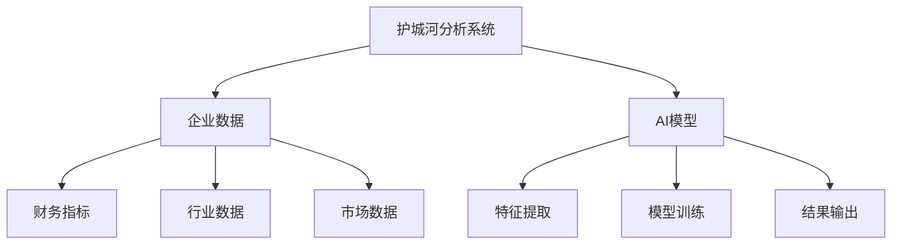
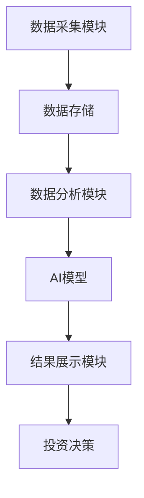
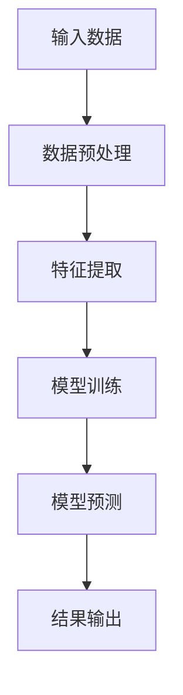

                 


# AI增强型巴菲特护城河分析系统

## 关键词：
- AI增强
- 巴菲特护城河
- 股票分析
- 机器学习
- 数据分析

## 摘要：
本文将探讨如何利用人工智能技术增强巴菲特护城河分析系统，提升投资决策的准确性和效率。通过结合AI算法与传统护城河分析方法，我们可以更深入地理解企业竞争优势，识别潜在投资机会。文章将详细阐述系统的构建过程，包括数据源的选择、AI模型的设计与优化、系统架构的实现，以及实际案例分析。最终，本文将为投资者提供一种基于AI的创新分析工具，帮助他们在复杂多变的市场环境中做出更明智的投资决策。

---

# 第一部分：AI增强型巴菲特护城河分析系统概述

## 第1章：背景介绍与核心概念

### 1.1 问题背景与问题描述

#### 1.1.1 传统巴菲特护城河分析的局限性
巴菲特的“护城河”理论强调企业竞争优势的持久性，主要通过企业定价权、成本优势、网络效应等因素来判断企业的长期盈利能力。然而，传统护城河分析方法依赖于人工分析和经验判断，存在主观性强、效率低下、难以量化等问题，尤其是在面对海量数据和复杂市场环境时，分析结果的准确性和全面性难以保证。

#### 1.1.2 AI技术在投资分析中的应用前景
人工智能技术的快速发展为投资分析带来了新的可能性。通过机器学习算法，我们可以从海量数据中提取潜在的模式和关系，提高分析的效率和准确性。AI技术能够处理非结构化数据，如新闻、社交媒体信息等，为企业护城河分析提供更全面的视角。

#### 1.1.3 结合AI增强护城河分析的必要性
结合AI技术，护城河分析可以实现自动化、智能化，帮助投资者快速识别潜在投资机会，降低人为判断的偏差，提高投资决策的科学性和精准性。AI增强型护城河分析系统能够实时更新数据，动态评估企业的竞争优势，为投资者提供持续的支持。

### 1.2 核心概念与问题解决

#### 1.2.1 护城河分析的核心要素
护城河分析的核心要素包括：
- **企业定价权**：企业是否能在价格波动中保持利润。
- **成本优势**：企业是否具备显著的成本优势，难以被竞争对手复制。
- **网络效应**：产品或服务是否随着用户数量的增加而增强。
- **创新能力和研发能力**：企业是否能持续推出创新产品或服务。

#### 1.2.2 AI在护城河分析中的作用
AI在护城河分析中的作用主要体现在：
- **数据处理**：AI能够快速处理海量数据，提取关键指标。
- **模式识别**：通过机器学习算法，识别传统方法难以察觉的潜在模式。
- **预测能力**：基于历史数据和市场趋势，预测企业未来的竞争优势。

#### 1.2.3 护城河分析的边界与外延
护城河分析的边界在于企业的核心竞争力，而外延则包括企业所处的宏观环境、行业趋势、政策变化等因素。AI技术可以将这些外部因素纳入分析范围，提供更全面的护城河评估。

### 1.3 系统核心要素与组成

#### 1.3.1 数据源的选择与整合
AI增强型护城河分析系统需要整合多来源数据，包括：
- **公司基本面数据**：收入、利润、市场份额等财务指标。
- **行业竞争数据**：行业趋势、竞争对手分析。
- **市场表现数据**：股票价格、成交量等市场数据。
- **外部信息**：新闻、社交媒体、专利申请等非结构化数据。

#### 1.3.2 AI模型的构建与训练
AI模型的构建需要经过数据预处理、特征提取、模型选择、训练与优化等步骤。常用的算法包括：
- **监督学习**：用于分类问题，如判断企业是否具备护城河。
- **无监督学习**：用于聚类分析，识别市场中的潜在趋势。
- **强化学习**：用于动态环境中的决策优化。

#### 1.3.3 系统架构的设计与实现
系统的架构设计需要考虑数据流、模块划分、接口设计等。一个典型的系统架构包括：
- **数据采集模块**：负责数据的获取与预处理。
- **数据分析模块**：执行护城河分析的核心算法。
- **结果展示模块**：以可视化形式呈现分析结果。

---

## 第2章：AI增强型巴菲特护城河分析系统的核心概念

### 2.1 护城河分析模型的原理

#### 2.1.1 护城河分析模型的输入与输出
- **输入**：企业基本面数据、行业数据、市场数据等。
- **输出**：企业护城河指数、投资建议、风险评估。

#### 2.1.2 护城河分析模型的评价指标
- **准确率**：模型预测的正确率。
- **召回率**：模型识别出的真正护城河企业的比例。
- **F1分数**：综合准确率和召回率的指标。

### 2.2 AI增强的核心算法

#### 2.2.1 强化学习在护城河分析中的应用
强化学习通过模拟投资决策过程，优化投资策略。例如，使用Q-learning算法，投资者可以在不同市场状态下选择最优动作。

#### 2.2.2 聚类分析与分类算法的对比
- **聚类分析**：用于将企业分成不同的竞争类别。
- **分类算法**：用于将企业分为具备护城河和不具备护城河两类。

### 2.3 数据源与特征工程

#### 2.3.1 数据源的选择与清洗
- 数据清洗：去除缺失值、异常值，处理数据偏差。
- 数据增强：通过特征工程提取更有代表性的特征，如将文本数据转化为向量表示。

#### 2.3.2 特征工程的实现与优化
- 特征选择：使用相关性分析或逐步回归选择重要特征。
- 特征变换：如主成分分析（PCA）降低维度。

### 2.4 核心概念的ER实体关系图



---

## 第3章：AI增强型巴菲特护城河分析系统的算法原理

### 3.1 算法原理概述

#### 3.1.1 强化学习算法的原理
强化学习通过智能体与环境的交互，逐步优化策略。例如，使用深度Q网络（DQN）模拟投资决策过程。

#### 3.1.2 聚类分析与分类算法的对比
- **聚类分析**：K-means算法用于将企业分为不同的竞争类别。
- **分类算法**：随机森林或支持向量机（SVM）用于分类企业是否具备护城河。

### 3.2 算法实现的数学模型

#### 3.2.1 强化学习的数学模型
深度Q网络的数学模型：
$$ Q(s, a) = \argmax_a Q(s,a) $$

#### 3.2.2 聚类分析的数学模型
K-means算法的数学模型：
$$ \argmin \sum_{i=1}^n \sum_{k=1}^K (x_i - c_k)^2 $$

### 3.3 算法实现的Python代码示例

#### 使用K-means进行聚类分析
```python
import numpy as np
from sklearn.cluster import KMeans

# 示例数据
X = np.array([[1, 2], [3, 4], [5, 6], [7, 8]])

# 聚类算法实现
kmeans = KMeans(n_clusters=2)
kmeans.fit(X)
print(kmeans.labels_)
```

#### 使用随机森林进行分类
```python
from sklearn.ensemble import RandomForestClassifier
from sklearn.model_selection import train_test_split

# 示例数据
X = [[1, 2], [3, 4], [5, 6], [7, 8]]
y = [0, 0, 1, 1]

# 数据分割
X_train, X_test, y_train, y_test = train_test_split(X, y, test_size=0.25)

# 分类模型实现
clf = RandomForestClassifier(n_estimators=2)
clf.fit(X_train, y_train)
print(clf.predict(X_test))
```

---

## 第4章：AI增强型巴菲特护城河分析系统的系统架构设计

### 4.1 系统功能设计

#### 4.1.1 数据采集模块
- 数据采集：从数据库、API等来源获取企业数据。
- 数据清洗：处理缺失值、异常值。

#### 4.1.2 数据分析模块
- 特征提取：将数据转化为模型可识别的特征。
- 模型训练：使用机器学习算法训练护城河分析模型。

#### 4.1.3 结果展示模块
- 可视化展示：以图表形式呈现分析结果。
- 投资建议：根据模型输出生成投资策略。

### 4.2 系统架构设计

#### 系统架构图


#### 数据流图


---

## 第5章：项目实战

### 5.1 环境搭建

#### 安装必要的库
```bash
pip install numpy pandas scikit-learn matplotlib
```

### 5.2 系统核心实现

#### 数据预处理代码
```python
import pandas as pd
import numpy as np

# 读取数据
data = pd.read_csv('company_data.csv')

# 数据清洗
data.dropna()
data = data.replace({np.nan: 0})

# 特征提取
features = data[['revenue', 'profit', 'market_share']]
```

#### 模型实现代码
```python
from sklearn.ensemble import RandomForestClassifier
from sklearn.model_selection import train_test_split

# 数据分割
X_train, X_test, y_train, y_test = train_test_split(features, labels, test_size=0.25)

# 模型训练
model = RandomForestClassifier(n_estimators=100)
model.fit(X_train, y_train)

# 预测结果
predictions = model.predict(X_test)
```

### 5.3 实际案例分析

#### 案例分析
假设我们有两家公司A和B，分别属于科技行业和传统制造业。通过AI模型分析，我们发现公司A具备强大的网络效应，而公司B的成本优势正在被竞争对手侵蚀。因此，AI模型会建议投资者优先考虑公司A的投资机会。

### 5.4 项目小结

通过实际案例分析，我们可以看到AI增强型护城河分析系统在实际投资中的应用价值。该系统能够帮助投资者快速识别具备竞争优势的企业，降低投资风险。

---

## 第6章：最佳实践与小结

### 6.1 最佳实践

#### 6.1.1 数据质量管理
确保数据的准确性和完整性，避免因数据问题导致分析偏差。

#### 6.1.2 模型优化
定期更新模型，引入新的数据和算法，保持模型的准确性。

### 6.2 小结

AI增强型巴菲特护城河分析系统通过结合AI技术与传统投资分析方法，显著提升了投资决策的效率和准确性。该系统不仅能够处理海量数据，还能识别传统方法难以察觉的潜在模式，为投资者提供了强有力的支持。

### 6.3 注意事项

- 数据隐私和合规性：确保数据处理符合相关法律法规。
- 模型解释性：选择可解释性较强的模型，便于投资者理解分析结果。
- 模型更新：定期更新模型，适应市场变化。

### 6.4 拓展阅读

- 《The Intelligent Investor》——巴菲特的经典投资著作。
- 《Hands-On Machine Learning with Scikit-Learn, Keras, and TensorFlow》——学习机器学习算法的优秀指南。

---

## 作者：AI天才研究院 & 禅与计算机程序设计艺术

通过本文的详细阐述，我们展示了如何利用AI技术增强巴菲特护城河分析系统，为投资者提供更高效、更精准的投资决策支持。未来，随着AI技术的不断发展，护城河分析系统将更加智能化、自动化，帮助投资者在复杂多变的市场中捕捉更多的投资机会。

