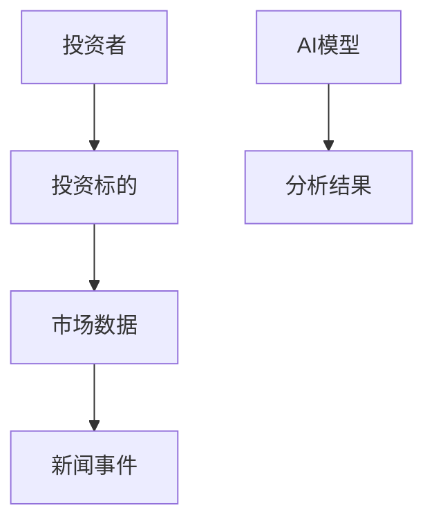
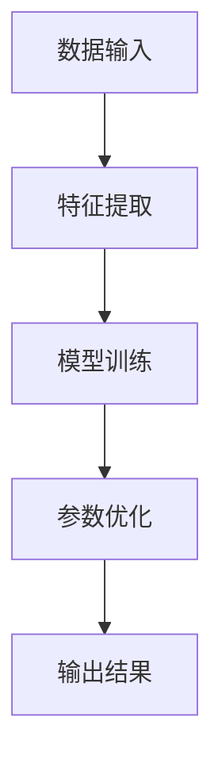
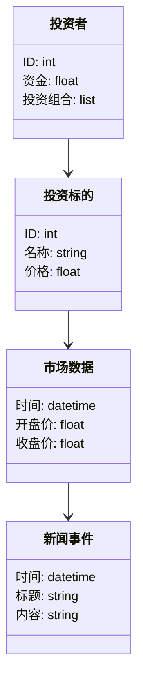
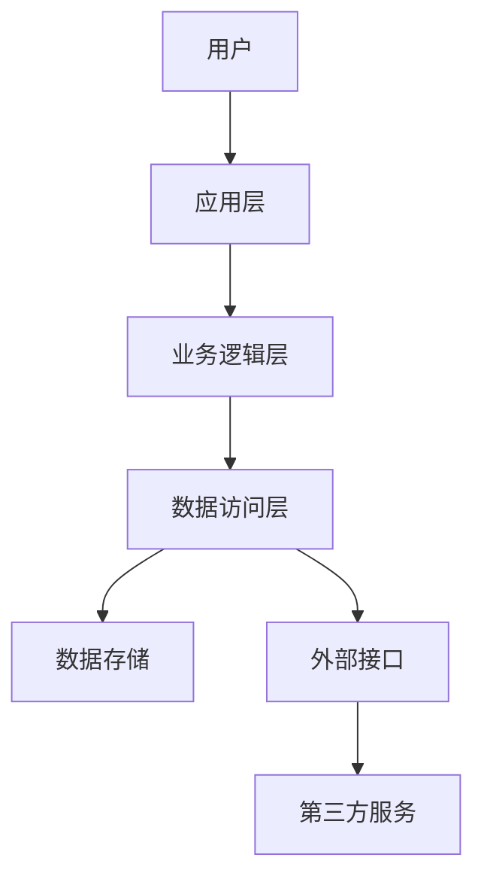
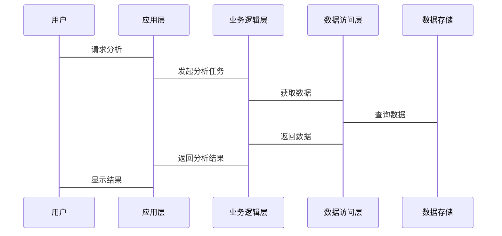

                 


# AI增强型特殊情况投资分析

> 关键词：AI增强型分析，特殊情况投资，机器学习，深度学习，时间序列分析，投资决策

> 摘要：本文将深入探讨AI技术在特殊情况投资分析中的应用，结合理论分析和实际案例，系统地介绍AI增强型分析的核心概念、算法原理、系统架构及项目实现。通过详细的技术分析和丰富的实战经验，为读者提供全面的指导。

---

# 第1章: 特殊情况投资分析的背景与挑战

## 1.1 问题背景

### 1.1.1 传统投资分析的局限性
传统的投资分析方法主要依赖于经验、市场趋势和基本财务指标。然而，这种方法在面对特殊情况（如市场崩盘、突发事件或黑天鹅事件）时往往显得力不从心，因为其难以捕捉复杂、非线性的市场变化。

### 1.1.2 特殊情况投资的定义与特点
特殊情况投资指的是在市场中出现极端或突发情况时的投资行为。这些情况通常具有低概率、高影响的特点，传统模型难以有效捕捉和预测。

### 1.1.3 AI技术在投资分析中的应用潜力
AI技术，尤其是机器学习和深度学习，能够通过分析海量数据，发现传统方法难以察觉的模式和规律，为特殊情况投资分析提供了新的可能性。

---

## 1.2 问题描述

### 1.2.1 特殊情况投资的复杂性
特殊情况往往伴随着高度的不确定性和复杂性，传统的统计模型难以应对。

### 1.2.2 数据稀疏性与不完全性
在特殊情况发生时，数据往往不完整或稀疏，这使得传统分析方法难以有效建模。

### 1.2.3 传统模型的局限性
传统模型通常基于平稳假设和线性关系，难以捕捉非平稳、非线性的市场变化。

---

## 1.3 问题解决

### 1.3.1 引入AI技术的必要性
AI技术能够处理非线性关系和复杂模式，为特殊情况投资分析提供了新的工具。

### 1.3.2 AI增强型分析的优势
通过结合AI技术，可以显著提高分析的准确性和实时性，捕捉市场中的微小变化。

### 1.3.3 实现路径与方法
从数据收集、特征提取到模型训练，AI增强型分析提供了一种系统化的解决方案。

---

## 1.4 边界与外延

### 1.4.1 AI增强型分析的适用范围
适用于突发事件、市场崩盘等特殊情况，但对平稳市场环境的适用性有限。

### 1.4.2 与传统分析方法的区分
AI增强型分析注重数据驱动，而传统方法更依赖经验判断。

### 1.4.3 技术边界与应用限制
AI模型的性能依赖于数据质量和模型训练的效果，存在过拟合和泛化能力不足的风险。

---

## 1.5 概念结构与核心要素

### 1.5.1 核心概念的层次结构
从数据、特征、模型到结果，形成了一个完整的分析链条。

### 1.5.2 核心要素的定义与关系
数据是基础，特征是关键，模型是工具，结果是目标。

### 1.5.3 案例分析与对比
通过具体案例分析，对比传统方法与AI增强型分析的优劣。

---

## 1.6 本章小结

---

# 第2章: AI增强型分析的核心概念与联系

## 2.1 核心概念原理

### 2.1.1 AI技术在投资分析中的应用原理
通过机器学习算法，AI能够从海量数据中提取有用信息，帮助投资者做出决策。

### 2.1.2 大数据分析与特征提取
利用大数据技术，从市场数据、新闻事件等多维度提取特征，为模型提供输入。

### 2.1.3 模型训练与优化
通过训练数据优化模型参数，提高模型的预测能力和稳定性。

---

## 2.2 核心概念属性对比

### 2.2.1 不同模型的性能对比
比较传统模型与AI模型在预测准确率、计算效率等方面的差异。

### 2.2.2 数据特征与模型表现的关系
分析数据特征对模型性能的影响，找到最优特征组合。

### 2.2.3 算法复杂度与计算效率的对比
评估不同算法在计算效率和准确率之间的 trade-off。

---

## 2.3 ER实体关系图



---

## 2.4 本章小结

---

# 第3章: AI增强型分析的算法原理

## 3.1 算法原理概述

### 3.1.1 机器学习算法的基本原理
通过训练数据学习特征与标签之间的关系，构建预测模型。

### 3.1.2 深度学习模型的原理
利用神经网络结构，自动提取数据特征，实现非线性建模。

### 3.1.3 时间序列分析的原理
通过分析历史数据，预测未来趋势，捕捉市场变化。

---

## 3.2 算法流程图



---

## 3.3 算法实现

### 3.3.1 时间序列分析

```python
import numpy as np
from statsmodels.tsa.arima.model import ARIMA

# 示例数据
data = np.random.random(100)

# ARIMA 模型训练
model = ARIMA(data, order=(1, 1, 1))
model_fit = model.fit()

# 预测结果
 forecast = model_fit.forecast(steps=5)
print(forecast)
```

### 3.3.2 深度学习模型

```python
import tensorflow as tf
from tensorflow.keras import layers

# 示例神经网络模型
model = tf.keras.Sequential([
    layers.Dense(64, activation='relu'),
    layers.Dense(1, activation='linear')
])

# 编译模型
model.compile(optimizer='adam', loss='mean_squared_error')

# 训练模型
model.fit(x_train, y_train, epochs=10, batch_size=32)
```

---

## 3.4 数学模型与公式

### 3.4.1 ARIMA模型

$$ ARIMA(p, d, q) $$

### 3.4.2 神经网络模型

$$ y = \sigma(Wx + b) $$

其中，$W$ 是权重矩阵，$b$ 是偏置项，$\sigma$ 是激活函数。

---

## 3.5 案例分析

通过具体案例分析，解释算法的实现过程和结果。

---

## 3.6 本章小结

---

# 第4章: 系统分析与架构设计方案

## 4.1 项目场景介绍

### 4.1.1 问题场景描述
在特殊情况发生时，如何利用AI技术快速分析市场变化，辅助投资决策。

### 4.1.2 项目目标
构建一个基于AI的特殊情况投资分析系统，提供实时分析和决策支持。

---

## 4.2 系统功能设计

### 4.2.1 领域模型



---

## 4.3 系统架构设计



---

## 4.4 系统接口设计

### 4.4.1 数据接口
定义数据输入格式和接口协议，确保数据的实时性和准确性。

### 4.4.2 模型接口
定义模型调用接口，支持实时预测和结果输出。

---

## 4.5 系统交互图



---

## 4.6 本章小结

---

# 第5章: 项目实战

## 5.1 环境安装

### 5.1.1 安装Python环境
使用Anaconda或virtualenv创建虚拟环境，安装Python 3.x。

### 5.1.2 安装依赖库
安装TensorFlow、Keras、Pandas、NumPy、Matplotlib等库。

---

## 5.2 系统核心实现

### 5.2.1 数据预处理
对市场数据和新闻数据进行清洗、特征提取和标准化处理。

### 5.2.2 模型训练
训练机器学习和深度学习模型，优化模型参数。

### 5.2.3 模型部署
将模型部署到生产环境，提供实时预测服务。

---

## 5.3 代码实现

### 5.3.1 数据处理代码

```python
import pandas as pd
import numpy as np

# 加载数据
data = pd.read_csv('market_data.csv')

# 数据清洗
data.dropna(inplace=True)
data = data[~data['volume'].isin([0])]

# 特征提取
features = data[['open', 'high', 'low', 'volume']]
target = data['close']
```

### 5.3.2 模型训练代码

```python
from sklearn.ensemble import RandomForestRegressor

# 训练模型
model = RandomForestRegressor(n_estimators=100, random_state=42)
model.fit(features, target)
```

---

## 5.4 代码解读与分析

解释代码的功能、作用和实现细节。

---

## 5.5 案例分析

通过具体案例分析，展示AI增强型分析的实际应用效果。

---

## 5.6 本章小结

---

# 第6章: 总结与展望

## 6.1 最佳实践

### 6.1.1 数据质量管理
确保数据的准确性和完整性，是模型性能的基础。

### 6.1.2 模型优化策略
通过交叉验证和超参数调优，提升模型的性能。

### 6.1.3 实时监控
建立实时监控机制，及时发现和应对市场变化。

---

## 6.2 小结

总结全文内容，强调AI增强型分析的重要性和应用前景。

---

## 6.3 注意事项

### 6.3.1 模型局限性
AI模型可能存在过拟合和泛化能力不足的问题。

### 6.3.2 数据隐私
注意数据隐私和合规性问题，确保合法使用数据。

### 6.3.3 技术风险
关注技术风险，如模型失效、数据泄露等。

---

## 6.4 拓展阅读

推荐相关领域的书籍和论文，供读者进一步学习。

---

作者：AI天才研究院/AI Genius Institute & 禅与计算机程序设计艺术/Zen And The Art of Computer Programming

