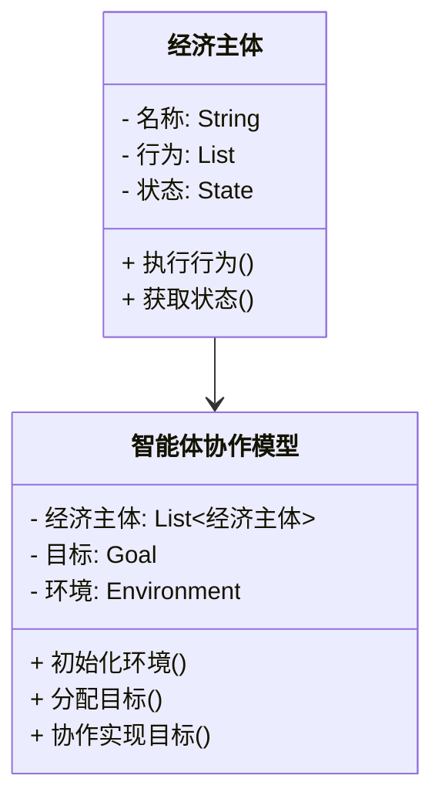
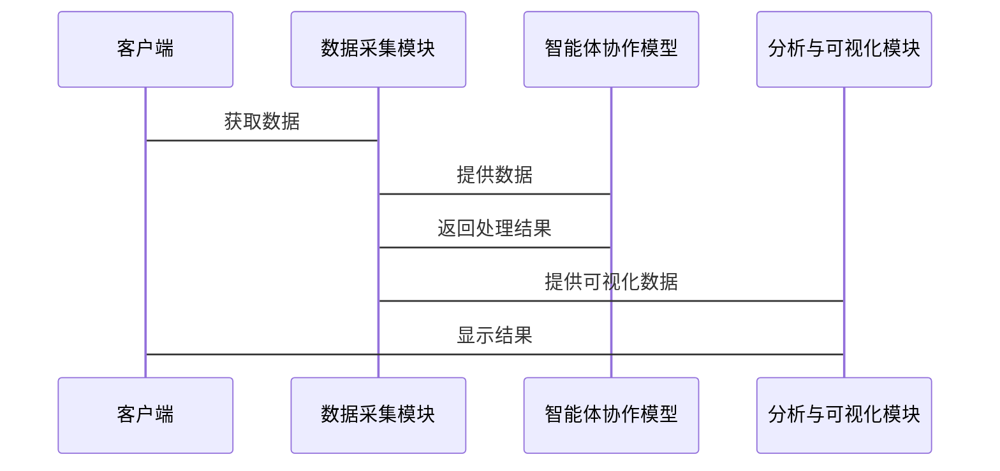

                 


# AI增强的宏观经济影响分析：多智能体协作模型

## 关键词
- AI
- 宏观经济影响分析
- 多智能体协作模型
- 宏观经济分析
- AI技术
- 协作模型

## 摘要
随着人工智能技术的迅速发展，宏观经济影响分析也在逐步向智能化方向转型。传统的宏观经济分析方法虽然在一定程度上能够揭示经济现象的本质，但在处理复杂性和动态性方面存在明显不足。本文将介绍一种基于多智能体协作模型的AI增强宏观经济影响分析方法，探讨其在经济预测、政策评估和复杂经济系统模拟中的应用。通过结合AI技术和多智能体协作模型，我们能够更准确地分析宏观经济变量之间的相互作用，为政策制定者和经济学者提供更有力的支持。

---

## 第一部分：AI增强的宏观经济影响分析基础

### 第1章：宏观经济影响分析概述

#### 1.1 宏观经济分析的基本概念
##### 1.1.1 宏观经济的定义与研究对象
宏观经济是研究整个经济体系运行规律的学科，其研究对象包括GDP、通货膨胀、就业率、货币政策、财政政策等宏观变量。通过分析这些变量之间的相互关系，我们可以更好地理解经济系统的整体运行机制。

##### 1.1.2 宏观经济影响分析的必要性
在经济全球化和信息化的今天，宏观经济影响分析的重要性愈发凸显。例如，政策制定者需要评估不同政策对经济的潜在影响，企业需要预测市场趋势以制定战略决策。传统的宏观经济分析方法虽然有用，但在面对复杂性和不确定性时显得力不从心。

##### 1.1.3 宏观经济分析的传统方法与局限性
传统的宏观经济分析方法主要包括计量经济学模型、回归分析和时间序列分析等。这些方法虽然在一定程度上能够揭示经济现象的规律，但它们通常假设经济系统是线性且稳定的，难以处理复杂非线性关系和动态变化。

---

#### 1.2 AI在宏观经济分析中的应用
##### 1.2.1 AI技术在经济预测中的作用
AI技术，特别是机器学习和深度学习，能够从海量数据中提取复杂的非线性关系，从而提高经济预测的准确性和及时性。例如，可以通过自然语言处理技术分析新闻报道和社交媒体数据，预测市场情绪和经济趋势。

##### 1.2.2 AI在政策评估中的应用
AI技术可以帮助政策制定者评估不同政策的潜在影响。例如，通过构建微观层面的个体行为模型，AI可以模拟政策对不同群体的影响，从而为政策优化提供依据。

##### 1.2.3 大数据时代宏观经济分析的挑战与机遇
在大数据时代，宏观经济分析面临新的挑战和机遇。数据的多样性和规模为AI技术的应用提供了丰富的数据源，但也带来了数据清洗、处理和建模的复杂性。

---

#### 1.3 多智能体协作模型的背景
##### 1.3.1 多智能体系统的基本概念
多智能体系统是指由多个具有自主性、反应性和协作性的智能体组成的分布式系统。这些智能体能够通过通信和协作完成复杂的任务。

##### 1.3.2 多智能体协作模型在宏观经济中的应用前景
在宏观经济分析中，多智能体协作模型可以模拟经济系统中的多个参与者（如企业和消费者）的行为，从而更好地理解经济系统的动态变化。

##### 1.3.3 本章小结
本章介绍了宏观经济分析的基本概念、AI技术在宏观经济分析中的应用以及多智能体协作模型的背景，为后续内容奠定了基础。

---

## 第二部分：多智能体协作模型的核心概念与联系

### 第2章：多智能体协作模型的原理与特点

#### 2.1 多智能体协作模型的原理
##### 2.1.1 多智能体系统的定义与组成
多智能体系统由多个智能体组成，这些智能体通过通信和协作完成任务。每个智能体都有自己的目标和行为策略。

##### 2.1.2 协作机制的分类与特点
协作机制可以分为基于规则的协作和基于目标的协作。基于规则的协作通过预定义的规则实现智能体之间的协作，而基于目标的协作则通过动态调整目标来实现协作。

##### 2.1.3 智能体之间的通信与协调
智能体之间的通信和协调是多智能体协作模型的核心。通过通信，智能体可以共享信息和状态，从而实现协调。

---

#### 2.2 多智能体协作模型的核心要素
##### 2.2.1 智能体的属性与行为
智能体具有自主性、反应性和社会性等属性。它们可以通过感知环境、决策和行动来实现任务。

##### 2.2.2 协作目标的定义与分解
协作目标是多智能体协作模型的核心。通过将整体目标分解为多个子目标，智能体可以分工协作，共同实现整体目标。

##### 2.2.3 智能体之间的关系与依赖
智能体之间的关系可以是竞争关系、合作关系或其他复杂关系。这些关系决定了智能体之间的依赖性和协作方式。

---

#### 2.3 多智能体协作模型与宏观经济分析的结合
##### 2.3.1 宏观经济中的多智能体建模
在宏观经济分析中，可以通过多智能体模型模拟企业和消费者的行为，从而更好地理解经济系统的动态变化。

##### 2.3.2 多智能体协作模型的优势与局限性
多智能体协作模型的优势在于能够模拟复杂的经济系统，但其复杂性和计算成本也是需要克服的挑战。

##### 2.3.4 本章小结
本章详细介绍了多智能体协作模型的原理、核心要素以及其在宏观经济分析中的应用，为后续内容奠定了理论基础。

---

## 第三部分：多智能体协作模型的算法原理

### 第3章：多智能体协作模型的算法实现

#### 3.1 基于强化学习的协作机制
##### 3.1.1 强化学习的基本原理
强化学习是一种通过智能体与环境交互来学习策略的方法。智能体通过试错的方式优化其行为策略，以最大化累积奖励。

##### 3.1.2 多智能体协作中的强化学习算法
在多智能体协作中，可以通过分布式强化学习算法实现智能体之间的协作。例如，可以通过异步 actor-critic 算法实现多个智能体的协作。

##### 3.1.3 基于Q-learning的协作机制实现
Q-learning 是一种经典的强化学习算法，可以通过定义状态和动作的空间，实现智能体之间的协作。

---

#### 3.2 多智能体协作模型的数学模型
##### 3.2.1 协作目标的数学表达
协作目标可以通过数学公式进行表达。例如，可以通过优化问题的形式定义协作目标。

##### 3.2.2 智能体行为的数学建模
智能体的行为可以通过策略函数进行建模。例如，可以通过概率策略或确定性策略来描述智能体的行为。

##### 3.2.3 协作收益的计算与分配
协作收益的计算与分配是多智能体协作模型中的一个重要问题。可以通过博弈论中的纳什均衡概念，实现收益的公平分配。

---

#### 3.3 算法实现的代码示例
##### 3.3.1 Python实现的强化
以下是基于Python的强化学习代码示例：
```python
import gym
import numpy as np

env = gym.make('CartPole-v0')
env.seed(1)

# 定义智能体的策略函数
def policy(observation):
    if observation[2] > 0:
        return 1
    else:
        return 0

# 初始化奖励和状态
total_reward = 0
state = env.reset()

# 智能体与环境交互
for _ in range(1000):
    action = policy(state)
    state, reward, done, info = env.step(action)
    total_reward += reward
    if done:
        break

print(f'Total reward: {total_reward}')
env.close()
```

---

## 第四部分：多智能体协作模型的系统分析与架构设计

### 第4章：多智能体协作模型的系统架构设计

#### 4.1 系统功能设计
##### 4.1.1 领域模型设计
以下是领域模型的Mermaid类图：


##### 4.1.2 系统架构设计
以下是系统架构的Mermaid架构图：
```mermaid
archi
    宏观经济分析系统
    ├── 数据采集模块
    ├── 智能体协作模型
    │   ├── 状态感知
    │   ├── 行为决策
    │   └── 通信协作
    └── 分析与可视化模块
```

##### 4.1.3 系统接口设计
系统接口设计可以通过REST API实现。以下是接口设计的Mermaid序列图：


---

## 第五部分：多智能体协作模型的项目实战

### 第5章：项目实战

#### 5.1 环境安装
项目实战需要以下环境：
- Python 3.8+
- Gym库
- Matplotlib
- NumPy

安装命令：
```bash
pip install gym matplotlib numpy
```

#### 5.2 系统核心实现
以下是核心代码实现：
```python
import gym
import numpy as np
import matplotlib.pyplot as plt

class MultiAgentModel:
    def __init__(self, num_agents):
        self.num_agents = num_agents
        self.envs = [gym.make('CartPole-v0') for _ in range(num_agents)]
        self.rewards = []

    def train(self, num_episodes=1000):
        for _ in range(num_episodes):
            total_reward = 0
            states = [env.reset() for env in self.envs]
            while True:
                actions = [self.policy(state) for state in states]
                new_states = []
                rewards = []
                dones = []
                for i in range(self.num_agents):
                    action = actions[i]
                    new_state, reward, done, info = self.envs[i].step(action)
                    new_states.append(new_state)
                    rewards.append(reward)
                    dones.append(done)
                    if done:
                        break
                total_reward += sum(rewards)
                states = new_states
            self.rewards.append(total_reward)
    
    def policy(self, state):
        if state[2] > 0:
            return 1
        else:
            return 0

if __name__ == "__main__":
    model = MultiAgentModel(5)
    model.train()
    plt.plot(model.rewards)
    plt.xlabel('Episodes')
    plt.ylabel('Total Reward')
    plt.show()
```

#### 5.3 代码应用解读与分析
上述代码实现了一个多智能体协作模型，通过强化学习算法训练多个智能体在CartPole环境中的协作行为。每个智能体的目标是将杆子保持在平衡位置。

---

## 第六部分：总结与展望

### 第6章：总结与展望

#### 6.1 最佳实践
在实际应用中，需要注意以下几点：
1. 确保数据的高质量和完整性。
2. 合理设计智能体的协作机制和通信方式。
3. 定期更新和优化模型。

#### 6.2 本章小结
本章通过项目实战展示了多智能体协作模型的应用，验证了其在宏观经济分析中的有效性。

#### 6.3 注意事项
在实际应用中，需要注意模型的复杂性和计算成本问题。

#### 6.4 拓展阅读
建议进一步阅读以下内容：
- 《Reinforcement Learning: Theory and Algorithms》
- 《Multi-Agent Systems: Complexity and Control》

---

## 作者：AI天才研究院/AI Genius Institute & 禅与计算机程序设计艺术 /Zen And The Art of Computer Programming

