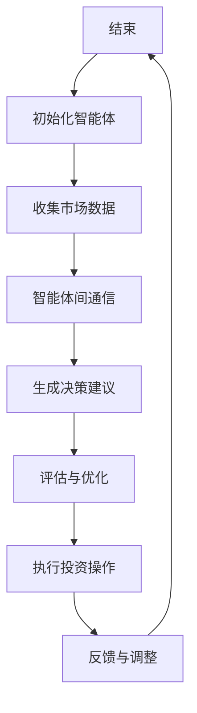
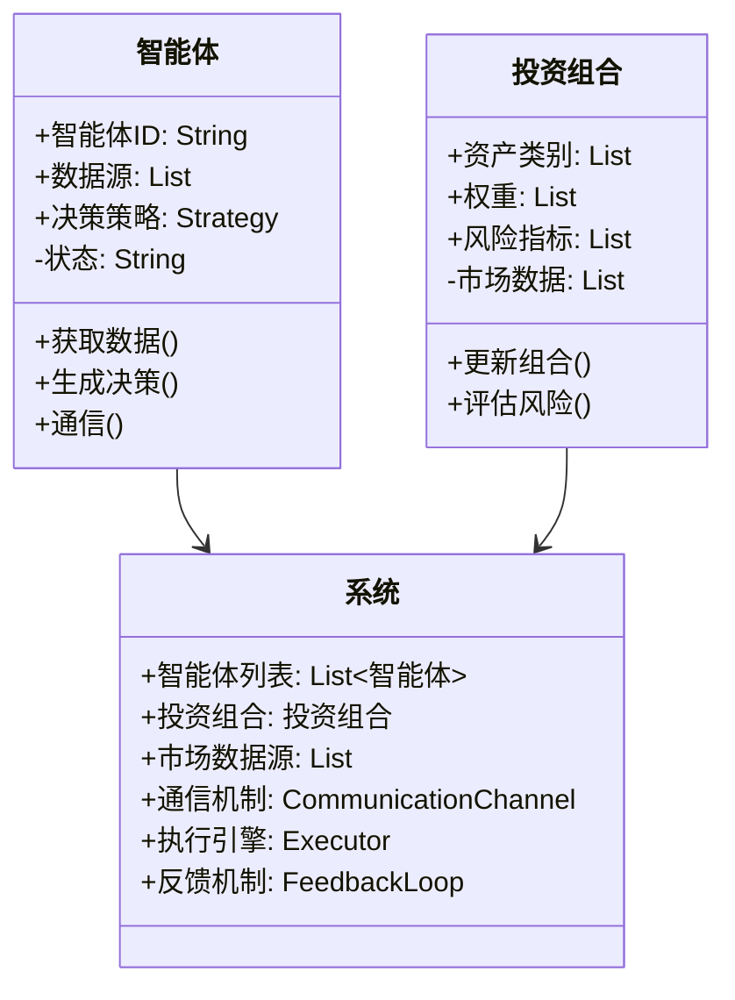
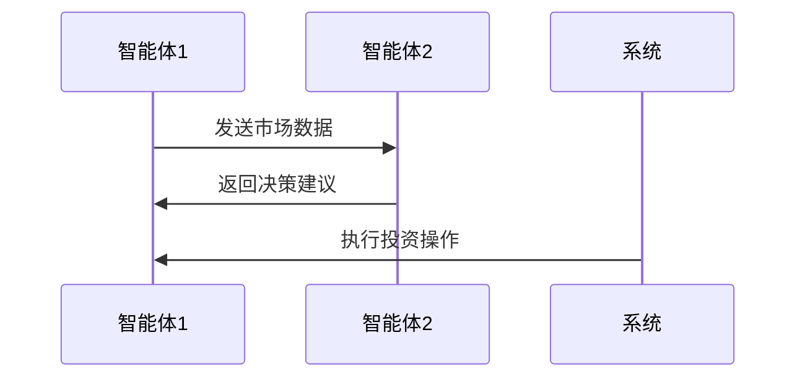

                 


# AI增强的投资组合再平衡策略：多智能体协作模型

**关键词**：投资组合再平衡，多智能体协作模型，人工智能，量化投资，投资策略

**摘要**：  
本文探讨了如何利用人工智能技术，特别是多智能体协作模型，来优化投资组合的再平衡策略。传统投资组合管理方法在面对复杂市场环境时存在诸多局限性，而多智能体协作模型通过模拟多个智能体之间的协作与竞争，能够更高效地捕捉市场机会、降低风险。本文首先介绍投资组合再平衡的基本概念和传统方法的局限性，接着深入分析多智能体协作模型的核心原理、算法流程及其优势，最后通过实际案例展示如何将该模型应用于投资组合再平衡策略，并提出相关的实现方案和优化建议。

---

## 第1章 投资组合再平衡的背景与问题背景

### 1.1 传统投资组合管理的局限性
传统投资组合管理依赖于历史数据分析和人为判断，这种方法在面对复杂多变的市场环境时往往显得力不从心。投资者需要实时调整投资组合以应对市场波动、经济周期变化以及突发事件的影响。然而，传统方法在以下几个方面存在明显不足：

1. **信息处理能力有限**：市场数据的复杂性和多样性使得人类难以快速捕捉所有关键信息。
2. **决策滞后性**：传统方法通常基于定期评估，无法实现实时调整。
3. **主观性过强**：投资决策往往受到主观判断的影响，难以避免人为情绪的干扰。

### 1.2 投资组合再平衡的定义与作用
投资组合再平衡是指根据市场变化和投资者风险偏好的调整，重新分配资产权重以维持目标投资组合的过程。其主要作用包括：
1. **降低风险**：通过调整资产配置，避免单一资产或行业风险的过度集中。
2. **优化收益**：根据市场变化动态调整投资组合，以捕捉更多收益机会。
3. **适应投资者需求**：满足不同投资者的风险承受能力和收益目标。

### 1.3 多智能体协作模型的核心概念
多智能体协作模型是一种基于分布式计算和人工智能技术的协作机制，通过多个智能体之间的信息共享和协同决策，实现复杂问题的最优解。在投资组合再平衡的应用中，每个智能体可以代表不同的资产类别、市场数据源或风险指标，通过协作实现投资组合的动态优化。

---

## 第2章 多智能体协作模型的原理与特征

### 2.1 多智能体协作模型的基本原理
多智能体协作模型的核心在于智能体之间的信息交互与协同决策。每个智能体负责处理特定类型的数据或任务，并通过通信机制共享信息，最终达成一致的决策。其主要步骤包括：
1. **信息收集**：智能体从多个数据源获取市场数据、历史表现等信息。
2. **信息处理**：对收集到的信息进行分析和加工，生成决策建议。
3. **协同决策**：通过通信机制，智能体之间共享信息并达成一致的决策。
4. **执行与反馈**：根据决策结果执行投资操作，并根据市场反馈调整策略。

### 2.2 多智能体协作模型的特征对比
与传统的投资组合管理方法相比，多智能体协作模型具有以下显著优势：

| **特征**       | **传统方法**                     | **多智能体协作模型**             |
|----------------|----------------------------------|----------------------------------|
| 数据处理能力   | 依赖人工分析，信息处理有限       | 能够处理海量数据，实时更新       |
| 决策效率       | 决策周期较长，反应速度较慢       | 实时决策，快速响应市场变化       |
| 风险控制       | 主观判断为主，风险控制有限       | 基于数据驱动的精准风险评估       |
| 灵活性         | 资产配置调整较为僵化             | 灵活适应市场变化，动态调整配置   |

### 2.3 实体关系图（ER图）展示
为了更好地理解多智能体协作模型的结构，我们可以用ER图来展示各实体之间的关系。

```mermaid
er
    %% 用于展示多智能体协作模型的实体关系
    entity 投资组合 {
        类别：资产类别
        权重：资产权重
        风险：风险指标
    }
    entity 智能体 {
        智能体ID：ID
        数据源：数据来源
        决策策略：决策规则
    }
    entity 市场数据 {
        时间戳：Timestamp
        资产价格：AssetPrice
        市场情绪：MarketSentiment
    }
    relationship 投资组合与智能体的协作关系 {
        <抽屉关系，表示投资组合与智能体之间的协作>
    }
```

---

## 第3章 多智能体协作模型的算法流程

### 3.1 算法流程概述
多智能体协作模型的算法流程可以分为以下几个步骤：



### 3.2 算法实现的数学模型
为了量化投资组合的收益与风险，我们可以使用以下数学模型：

#### 收益函数
$$ \text{收益} = \sum_{i=1}^{n} w_i \times r_i $$
其中，\( w_i \) 表示第 \( i \) 个资产的权重，\( r_i \) 表示其收益。

#### 风险函数
$$ \text{风险} = \sqrt{\sum_{i=1}^{n} w_i^2 \times \sigma_i^2} $$
其中，\( \sigma_i \) 表示第 \( i \) 个资产的波动率。

---

## 第4章 系统分析与架构设计方案

### 4.1 系统功能设计
为了实现多智能体协作模型的投资组合再平衡策略，我们需要设计一个包含以下几个功能模块的系统：

#### 领域模型


### 4.2 系统架构设计
为了确保系统的高效运行，我们可以采用以下架构：


### 4.3 接口与交互设计
系统中的接口设计需要考虑智能体之间的通信机制，例如：



---

## 第5章 项目实战

### 5.1 环境安装
为了实现多智能体协作模型，我们需要以下环境：

1. **编程语言**：Python 3.8+
2. **库与框架**：NumPy, Pandas, Scikit-learn, Plotly
3. **开发工具**：Jupyter Notebook 或 VS Code

### 5.2 核心代码实现

#### 智能体类实现
```python
class Agent:
    def __init__(self, agent_id, data_source):
        self.agent_id = agent_id
        self.data_source = data_source
        self.state = "idle"
        
    def get_data(self):
        # 获取市场数据
        pass
    
    def generate_decision(self, data):
        # 生成决策建议
        pass
    
    def communicate(self, other_agent):
        # 智能体间通信
        pass
```

#### 投资组合管理类实现
```python
class PortfolioManager:
    def __init__(self, assets, weights):
        self.assets = assets
        self.weights = weights
        self.risk = self.calculate_risk(weights)
    
    def calculate_risk(self, weights):
        # 计算风险
        return sum(w**2 * var for w, var in zip(weights, asset_variances))
```

### 5.3 案例分析
通过一个简单的案例，我们可以验证多智能体协作模型的有效性。假设我们有两个智能体，分别负责股票和债券的数据分析：

```python
agent1 = Agent("StockAgent", "stock_data.csv")
agent2 = Agent("BondAgent", "bond_data.csv")
portfolio = PortfolioManager(["股票", "债券"], [0.6, 0.4])
```

通过协作，智能体可以动态调整资产权重，以优化投资组合的风险收益比。

---

## 第6章 总结与注意事项

### 6.1 最佳实践
- 定期监控市场数据，确保模型的实时性。
- 根据市场变化动态调整智能体的决策策略。
- 定期评估投资组合的绩效，优化模型参数。

### 6.2 小结
多智能体协作模型通过模拟多个智能体的协作与竞争，能够有效优化投资组合的再平衡策略。其优势在于实时性、灵活性和数据驱动的精准性。

### 6.3 注意事项
- 数据质量对模型的性能至关重要，需确保数据来源可靠。
- 模型的复杂性可能增加实现难度，需合理简化设计。
- 需注意模型的可解释性，确保投资者能够理解决策过程。

### 6.4 拓展阅读
- 《Reinforcement Learning: Theory and Algorithms》
- 《Multi-Agent Systems: Complexity and Control》
- 《Advances in Financial Machine Learning》

---

**作者：AI天才研究院/AI Genius Institute & 禅与计算机程序设计艺术 /Zen And The Art of Computer Programming**

