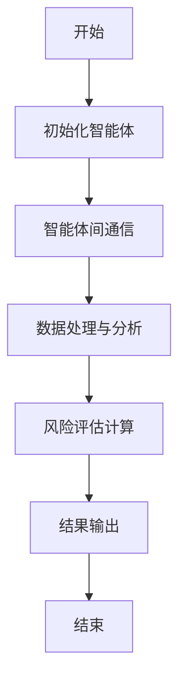
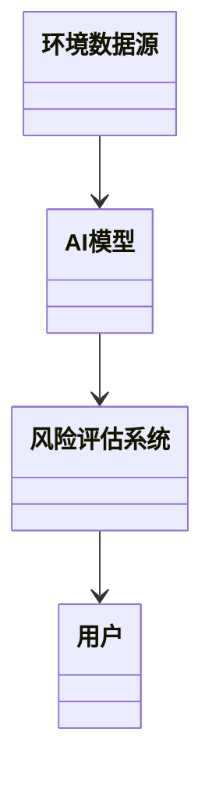

                 


# AI增强的环境风险评估：多智能体协作模型

> 关键词：环境风险评估，人工智能，多智能体协作模型，系统架构，算法原理

> 摘要：本文探讨了如何利用AI技术，特别是多智能体协作模型，来增强环境风险评估的效率和准确性。文章从背景介绍、核心概念、算法原理、系统架构、项目实战到最佳实践，全面分析了AI在环境风险评估中的应用，旨在为相关领域的研究人员和实践者提供理论和实践的双重指导。

---

## 目录

# 第1章: 环境风险评估与AI的结合

## 1.1 环境风险评估的定义与重要性
### 1.1.1 环境风险评估的核心概念
环境风险评估是指对可能影响环境的因素进行分析和预测，以制定有效的风险管理策略。传统的环境风险评估方法依赖于人工数据收集和分析，效率较低且容易受到主观因素的影响。

### 1.1.2 环境风险评估的传统方法与局限性
传统方法通常包括问卷调查、现场监测和数据统计分析。然而，这些方法存在数据获取成本高、分析复杂度高、结果不够精确等问题。

### 1.1.3 AI技术在环境风险评估中的潜力
人工智能技术，尤其是机器学习和深度学习，能够快速处理大量数据，发现数据中的潜在规律，从而提高环境风险评估的效率和准确性。

## 1.2 多智能体协作模型的基本概念
### 1.2.1 多智能体协作模型的定义
多智能体协作模型是指多个智能体协同工作，共同完成特定任务的系统。每个智能体都有自己的目标和功能，通过协作实现整体目标。

### 1.2.2 多智能体协作模型的特点与优势
- 分布式计算：每个智能体独立运行，减少单点故障。
- 高度协作：智能体之间能够高效通信和协作，提高整体效率。
- 自适应性：能够根据环境变化动态调整协作策略。

### 1.2.3 多智能体协作模型在环境风险评估中的应用前景
通过多智能体协作模型，可以实现环境数据的实时监测、风险预测和应急响应，从而显著提升环境风险管理能力。

## 1.3 本章小结
本章介绍了环境风险评估的重要性和AI技术在其中的应用潜力，重点阐述了多智能体协作模型的基本概念和优势。

---

# 第2章: 多智能体协作模型的原理与结构

## 2.1 多智能体协作模型的组成要素
### 2.1.1 智能体的定义与分类
智能体是一种能够感知环境并采取行动的实体。根据功能和智能水平，可以将智能体分为简单智能体和复杂智能体。

### 2.1.2 智能体之间的协作机制
协作机制是多智能体系统的核心，包括通信协议、任务分配和冲突解决等关键部分。

### 2.1.3 智能体的通信与信息共享
智能体之间通过通信模块进行信息交换，确保协作过程的顺利进行。

## 2.2 多智能体协作模型的实体关系图
```mermaid
erDiagram
    actor 用户
    actor 环境数据源
    actor AI模型
    actor 风险评估系统
    用户 --> 环境数据源: 提供环境数据
    环境数据源 --> AI模型: 数据输入
    AI模型 --> 风险评估系统: 输出评估结果
    风险评估系统 --> 用户: 提供风险评估报告
```

## 2.3 多智能体协作模型的属性对比
| 属性 | 描述 |
|------|------|
| 智能体类型 | 单智能体、多智能体 |
| 协作方式 | 并行协作、串行协作 |
| 信息共享 | 高度共享、部分共享 |

## 2.4 本章小结
本章详细阐述了多智能体协作模型的组成要素和协作机制，并通过实体关系图展示了各角色之间的关系。

---

# 第3章: 多智能体协作模型的算法原理

## 3.1 多智能体协作模型的算法流程


## 3.2 算法实现细节
### 3.2.1 数据预处理
- 数据清洗：去除噪声数据，确保数据质量。
- 数据标准化：将不同来源的数据统一格式。

### 3.2.2 智能体协作
```python
class Agent:
    def __init__(self, id):
        self.id = id
        self.data = []
    
    def receive_data(self, data):
        self.data.append(data)
    
    def send_data(self, target_agent):
        target_agent.receive_data(self.data[-1])
```

### 3.2.3 风险评估计算
$$\text{风险评分} = \sum_{i=1}^{n} w_i x_i$$
其中，\(w_i\) 是权重，\(x_i\) 是输入特征。

## 3.3 本章小结
本章通过流程图和代码示例，详细讲解了多智能体协作模型的算法实现过程。

---

# 第4章: 系统分析与架构设计

## 4.1 问题场景介绍
假设我们正在设计一个城市空气质量监测系统，需要实时监测多个监测点的数据，并评估潜在的环境风险。

## 4.2 系统功能设计
### 4.2.1 领域模型类图


## 4.3 系统架构设计
### 4.3.1 系统架构图


## 4.4 系统接口设计
### 4.4.1 接口定义
- 数据输入接口：接收环境数据。
- 数据输出接口：输出风险评估结果。

## 4.5 本章小结
本章通过系统架构图和类图，详细描述了多智能体协作模型在环境风险评估中的应用架构。

---

# 第5章: 项目实战

## 5.1 环境安装与配置
- 安装Python和相关库（如NumPy、Pandas、Scikit-learn）。
- 配置开发环境（如Jupyter Notebook）。

## 5.2 核心代码实现
### 5.2.1 智能体类实现
```python
class Agent:
    def __init__(self, id):
        self.id = id
        self.data = []
    
    def receive_data(self, data):
        self.data.append(data)
    
    def send_data(self, target_agent):
        target_agent.receive_data(self.data[-1])
```

### 5.2.2 环境数据处理
```python
import pandas as pd
data = pd.read_csv('environment_data.csv')
```

## 5.3 案例分析
### 5.3.1 数据分析与可视化
使用Matplotlib对环境数据进行可视化分析。

### 5.3.2 风险评估结果展示
展示风险评估结果，并分析其对环境管理的启示。

## 5.4 本章小结
本章通过实际案例，详细讲解了多智能体协作模型在环境风险评估中的具体应用。

---

# 第6章: 最佳实践与总结

## 6.1 小结
总结全文的主要内容和研究成果。

## 6.2 注意事项
- 数据隐私保护
- 系统可扩展性
- 算法的实时性要求

## 6.3 未来研究方向
- 更复杂的多智能体协作机制
- 高效的数据处理算法
- 实时环境风险评估系统

## 6.4 拓展阅读
推荐相关领域的书籍和论文，供读者深入学习。

---

# 附录

## 附录A: 术语表
- 多智能体协作模型：多个智能体协同工作的系统。

## 附录B: 参考文献
- [1] Russell, S., & Norvig, P. (2010). Artificial Intelligence: A Modern Approach.

---

# 作者信息

作者：AI天才研究院/AI Genius Institute & 禅与计算机程序设计艺术 /Zen And The Art of Computer Programming

---

通过以上目录，您可以逐步深入了解AI增强的环境风险评估：多智能体协作模型的理论与实践。

