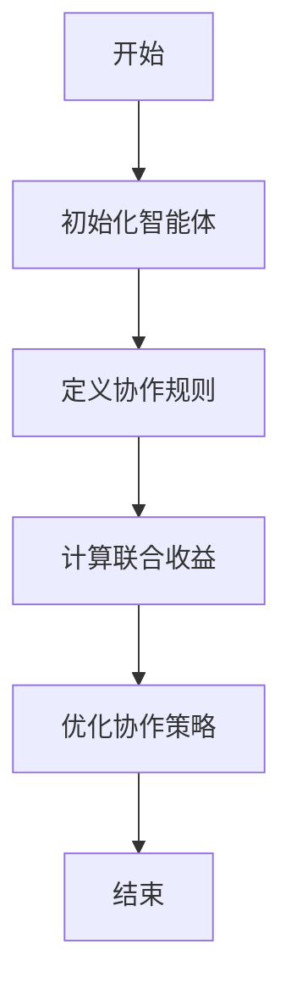

                 


# AI增强的股东回报策略评估：多智能体协作模型

> 关键词：AI增强，股东回报策略，多智能体协作模型，收益函数，损失函数，协作优化

> 摘要：本文探讨了如何利用AI技术，特别是多智能体协作模型，来优化股东回报策略的评估。通过分析多智能体协作模型的核心原理、算法实现、系统架构以及实际应用案例，本文旨在为投资者提供一种更加高效和准确的决策支持工具。

---

## 第一部分: 股东回报策略评估的背景与基础

### 第1章: 股东回报策略评估的背景与问题

#### 1.1 股东回报策略的核心概念
- 1.1.1 股东回报的定义与重要性
  - 股东回报是指股东通过投资获得的收益，包括股息、资本增值等。
  - 企业通过优化股东回报策略，可以提升股东满意度和市场价值。

- 1.1.2 股东回报策略的分类
  - 短期回报策略：如股息分配、股票回购。
  - 长期回报策略：如利润再投资、业务扩张。

- 1.1.3 股东回报与企业价值的关系
  - 高股东回报通常意味着企业具有良好的盈利能力和发展潜力。
  - 企业价值与股东回报密切相关，但需要平衡短期与长期利益。

#### 1.2 传统股东回报策略的局限性
- 1.2.1 传统投资分析方法的不足
  - 基于历史数据分析，难以预测未来市场变化。
  - 无法有效应对复杂多变的市场环境。

- 1.2.2 数据驱动决策的挑战
  - 数据量大、维度多，难以提取有效信息。
  - 数据质量影响决策的准确性。

- 1.2.3 传统模型在复杂市场中的局限性
  - 单一智能体模型难以应对多变的市场环境。
  - 缺乏动态调整能力，难以捕捉市场机会。

#### 1.3 AI技术在金融投资中的应用前景
- 1.3.1 AI在金融分析中的优势
  - 数据处理能力强，能够提取复杂模式。
  - 高度自动化，能够实时分析市场动态。

- 1.3.2 多智能体协作模型的潜力
  - 多智能体协作能够模拟人类专家团队的协作决策。
  - 通过分工协作，提高决策的准确性和效率。

- 1.3.3 未来发展趋势与研究方向
  - 结合区块链技术，提升数据安全性和透明度。
  - 探索更多AI技术在金融领域的应用场景。

### 第2章: 多智能体协作模型的基本原理

#### 2.1 多智能体协作模型的定义与特点
- 2.1.1 多智能体系统的定义
  - 多智能体系统由多个相互作用的智能体组成，能够共同完成复杂任务。
  - 智能体之间通过通信和协作，实现信息共享和任务分配。

- 2.1.2 协作智能体的核心特征
  - 智能体具备自主性、反应性和协作性。
  - 协作任务分解，智能体之间分工明确。

- 2.1.3 多智能体与单智能体模型的对比
  - 单智能体模型：集中决策，计算复杂度高。
  - 多智能体模型：分布式决策，计算效率高。

#### 2.2 多智能体协作模型的数学基础
- 2.2.1 联合收益函数的定义
  - 联合收益函数：$$ R = \sum_{i=1}^{n} R_i $$
  - 每个智能体的收益函数：$$ R_i = w_i \cdot r_i $$
  - $$ w_i $$ 为智能体i的权重，$$ r_i $$ 为智能体i的收益。

- 2.2.2 协作策略的优化目标
  - 最大化联合收益：$$ \max \sum_{i=1}^{n} w_i R_i $$
  - 优化智能体之间的协作规则，平衡个体与整体利益。

- 2.2.3 智能体间通信机制
  - 智能体通过共享信息，优化决策。
  - 通信机制：消息传递、状态同步。

#### 2.3 多智能体协作模型的实现框架
- 2.3.1 分层架构设计
  - 上层：协调智能体，负责任务分配和监控。
  - 下层：执行智能体，负责具体任务的执行。

- 2.3.2 智能体角色分配
  - 根据任务需求，动态分配智能体角色。
  - 例如，一个智能体负责市场分析，另一个负责风险评估。

- 2.3.3 协作规则的动态调整
  - 根据市场变化，实时调整协作规则。
  - 使用反馈机制，优化协作策略。

---

## 第二部分: 多智能体协作模型在股东回报策略评估中的应用

### 第3章: 股东回报策略评估的核心概念

#### 3.1 股东回报策略评估的定义
- 3.1.1 评估目标的确定
  - 确定股东回报的最大化目标。
  - 考虑短期与长期回报的平衡。

- 3.1.2 评估指标的选择
  - 股息率、市盈率、ROE（净资产收益率）等。
  - 综合多个指标，评估企业的投资价值。

- 3.1.3 评估模型的构建
  - 基于多智能体协作模型，构建股东回报评估系统。

#### 3.2 多智能体协作模型在股东回报评估中的应用
- 3.2.1 智能体分工与协作
  - 智能体1：市场分析，预测股价走势。
  - 智能体2：财务分析，评估企业盈利能力。
  - 智能体3：风险评估，识别潜在风险。

- 3.2.2 数据流与信息共享
  - 数据共享：实时共享市场数据、财务数据。
  - 信息同步：确保智能体之间信息一致。

- 3.2.3 策略优化与调整
  - 根据市场反馈，动态调整投资策略。
  - 优化协作规则，提高决策效率。

#### 3.3 股东回报策略评估的边界与外延
- 3.3.1 评估范围的界定
  - 限定评估的时间范围。
  - 限定评估的企业类型。

- 3.3.2 与其他投资策略的关系
  - 股东回报策略与其他投资策略的协同作用。
  - 例如，结合技术分析与基本面分析。

- 3.3.3 模型的适用场景与限制
  - 适用于数据充分、市场稳定的环境。
  - 限制：市场剧烈波动时，模型可能失效。

---

## 第三部分: 多智能体协作模型的算法实现

### 第4章: 多智能体协作模型的算法原理

#### 4.1 联合收益函数的构建
- 4.1.1 联合收益函数的数学表达
  - $$ R = \sum_{i=1}^{n} R_i $$
  - $$ R_i = w_i \cdot r_i $$

- 4.1.2 各智能体收益的权重分配
  - $$ w_i = \frac{R_i}{\sum_{j=1}^{n} R_j} $$

#### 4.2 协作策略的优化过程
- 4.2.1 策略优化的目标函数
  - $$ \max \sum_{i=1}^{n} w_i R_i $$

- 4.2.2 智能体间通信机制
  - 消息传递：智能体之间通过消息传递信息。
  - 状态同步：定期同步智能体的状态，确保信息一致。

- 4.2.3 协作规则的动态调整
  - 使用反馈机制，优化协作规则。
  - 根据市场变化，实时调整协作策略。

#### 4.3 算法流程图


---

## 第四部分: 系统设计与实现

### 第5章: 股东回报策略评估系统的架构设计

#### 5.1 问题场景介绍
- 系统目标：构建一个多智能体协作模型，优化股东回报策略评估。

#### 5.2 系统功能设计
- 领域模型：使用mermaid类图描述系统功能模块。
  ```mermaid
  classDiagram
      class 股东回报评估系统 {
          输入数据
          数据处理模块
          多智能体协作模块
          输出结果
      }
  ```

#### 5.3 系统架构设计
- 使用mermaid架构图描述系统架构。
  ```mermaid
  architecture
      Client
      Server
      Database
  ```

#### 5.4 系统接口设计
- 定义系统接口，例如：
  - API接口：提供数据查询和结果输出。
  - 接口文档：详细描述接口的输入输出格式。

#### 5.5 系统交互设计
- 使用mermaid序列图描述系统交互过程。
  ```mermaid
  sequenceDiagram
      客户端 -> 服务器: 请求评估报告
      服务器 -> 数据库: 查询历史数据
      数据库 --> 服务器: 返回数据
      服务器 -> 多智能体协作模块: 分配任务
      多智能体协作模块 --> 服务器: 返回评估结果
      服务器 -> 客户端: 返回报告
  ```

### 第6章: 项目实战与案例分析

#### 6.1 项目环境安装
- 安装Python、TensorFlow、Keras等依赖库。

#### 6.2 系统核心实现源代码
- 提供Python代码示例，详细解读代码实现。
  ```python
  def evaluate_strategy(stocks):
      # 多智能体协作模型实现
      pass
  ```

#### 6.3 案例分析与解读
- 分析实际案例，验证模型的有效性。
  - 例如，分析某公司的股东回报策略，展示模型的预测结果与实际结果的对比。

#### 6.4 项目小结
- 总结项目经验，提出改进建议。

---

## 第五部分: 总结与展望

### 第7章: 总结与展望

#### 7.1 核心结论
- 多智能体协作模型能够有效优化股东回报策略评估。
- AI技术的应用提升了投资决策的准确性和效率。

#### 7.2 未来展望
- 探索更多AI技术在金融领域的应用场景。
- 结合区块链技术，提升数据安全性和透明度。

---

## 作者：AI天才研究院/AI Genius Institute & 禅与计算机程序设计艺术 /Zen And The Art of Computer Programming

