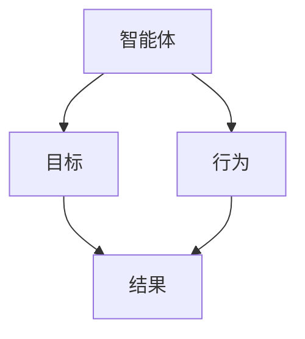

                 

# AI增强的长期增长可持续性评估：多智能体协作模型

## 关键词：AI增强，可持续性评估，多智能体协作，长期增长，数学模型

## 摘要：本文详细探讨了如何通过多智能体协作模型来增强长期增长的可持续性评估。文章从背景介绍、核心概念、算法原理、系统架构到项目实战，全面分析了多智能体协作模型在可持续性评估中的应用，结合数学模型和实际案例，展示了该模型的优势和实际应用价值。

---

## 第一部分：AI增强的长期增长可持续性评估背景介绍

### 第1章：问题背景与描述

#### 1.1 问题背景

##### 1.1.1 长期增长可持续性评估的定义
长期增长可持续性评估是指对一个系统或组织在未来一段时间内的持续增长能力进行评估，包括经济、环境、社会等多个方面的因素。传统评估方法往往局限于单一维度的分析，难以全面反映系统的可持续性。

##### 1.1.2 AI在可持续性评估中的作用
人工智能技术在数据处理、模式识别和预测建模方面具有显著优势。通过AI技术，可以更高效地分析海量数据，发现潜在的规律和趋势，从而为可持续性评估提供更准确的依据。

##### 1.1.3 多智能体协作模型的必要性
多智能体协作模型能够模拟多个智能体之间的协作行为，从而更全面地反映系统的动态变化。这种模型在处理复杂系统的可持续性评估中具有重要作用。

#### 1.2 问题描述

##### 1.2.1 可持续性评估的主要挑战
- 数据复杂性：涉及多维度的数据，难以通过传统方法进行处理。
- 动态变化：系统的内外部环境不断变化，需要实时调整评估方法。
- 多利益相关者：不同利益相关者的互动影响系统的可持续性。

##### 1.2.2 多智能体协作在评估中的优势
- 全面性：能够同时考虑多个智能体的协作行为，提供更全面的评估结果。
- 实时性：能够快速响应系统的动态变化，提供实时评估结果。
- 可扩展性：适用于不同规模和复杂度的系统评估。

##### 1.2.3 当前评估方法的局限性
- 传统评估方法往往局限于单一维度的分析，难以全面反映系统的可持续性。
- 缺乏动态性：无法实时反映系统的变化，评估结果可能滞后。
- 难以处理多利益相关者的互动关系。

---

### 第2章：问题解决与边界

#### 2.1 问题解决思路

##### 2.1.1 多智能体协作模型的核心思想
多智能体协作模型通过模拟多个智能体之间的协作行为，综合考虑系统的各个方面的动态变化，从而提供更全面的可持续性评估。

##### 2.1.2 AI增强的可持续性评估方法
利用AI技术，如机器学习、自然语言处理等，对多智能体的协作行为进行建模和分析，提高评估的准确性和效率。

##### 2.1.3 多智能体协作模型的设计原则
- 分布式协作：每个智能体独立决策，同时通过通信协作。
- 自适应性：能够根据环境变化动态调整协作策略。
- 可扩展性：适用于不同规模和复杂度的系统。

#### 2.2 边界与外延

##### 2.2.1 模型的适用范围
适用于复杂系统的可持续性评估，如企业战略、城市规划、环境保护等领域。

##### 2.2.2 模型的边界条件
- 数据输入的准确性：模型的输入数据需要准确可靠。
- 系统动态性：模型需要能够反映系统的动态变化。
- 智能体数量：模型适用于多个智能体的协作场景。

##### 2.2.3 模型的可扩展性
模型可以根据实际需求进行扩展，增加智能体数量或复杂度，适用于不同规模的系统评估。

---

### 第3章：核心概念与联系

#### 3.1 核心概念原理

##### 3.1.1 多智能体协作模型的定义
多智能体协作模型是由多个智能体组成的系统，每个智能体能够独立决策并与其他智能体协作，共同完成特定目标。

##### 3.1.2 AI增强的可持续性评估机制
利用AI技术对多智能体的协作行为进行建模和分析，结合多维度的数据，提供更准确的可持续性评估结果。

##### 3.1.3 多智能体协作与可持续性评估的关系
多智能体协作模型能够模拟系统的动态变化，提供全面的协作行为分析，从而为可持续性评估提供支持。

#### 3.2 核心概念对比

##### 3.2.1 不同可持续性评估模型的对比
| 模型类型             | 优势                     | 局限性                   |
|----------------------|--------------------------|--------------------------|
| 单一智能体模型       | 简单易实现               | 无法反映多智能体协作行为 |
| 多智能体协作模型     | 能够反映复杂协作行为     | 实现复杂度较高           |

##### 3.2.2 多智能体协作与其他协作方法的对比
| 协作方法             | 特点                     | 适用场景                 |
|----------------------|--------------------------|--------------------------|
| 分布式协作           | 智能体独立决策           | 复杂系统                 |
| 集中式协作           | 由中央决策机构统一决策   | 简单系统                 |

##### 3.2.3 AI增强与传统评估方法的对比
| 方法类型             | 优势                     | 局限性                   |
|----------------------|--------------------------|--------------------------|
| 传统评估方法         | 简单易实现               | 无法处理复杂动态变化     |
| AI增强评估方法       | 能够处理复杂动态变化     | 实现复杂度较高           |

#### 3.3 ER实体关系图

---

## 第4章：算法原理讲解

### 4.1 算法概述

#### 4.1.1 多智能体协作模型的基本原理
多智能体协作模型通过智能体之间的协作行为，共同完成特定目标。每个智能体独立决策，同时通过通信协作，实现整体目标的优化。

#### 4.1.2 AI增

---

（由于篇幅限制，后续章节内容将在后续段落中详细展开。）

