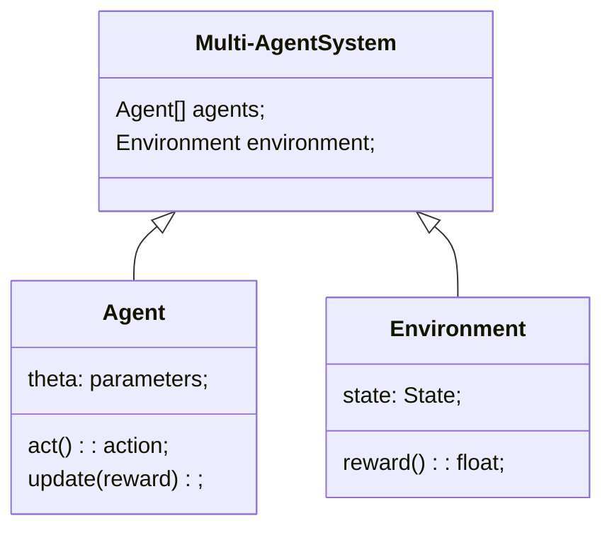
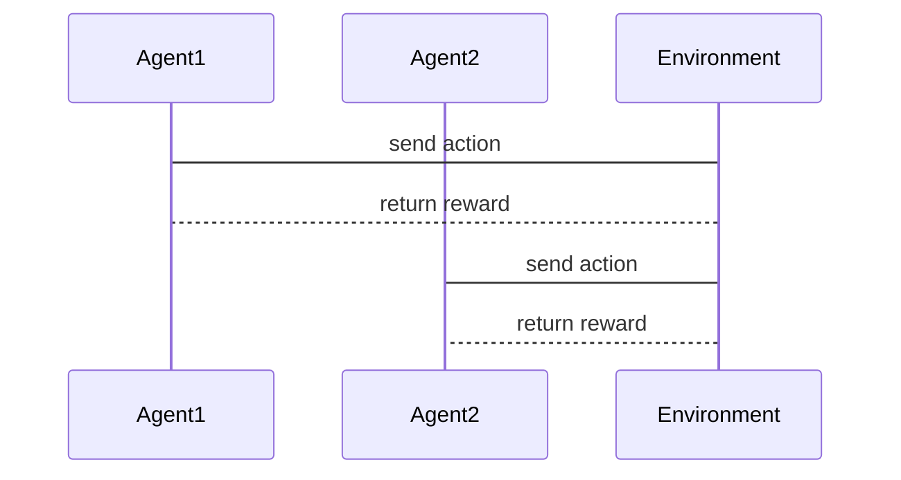

                 


# AI多智能体优化价值投资的买入时机判断

> 关键词：AI多智能体，价值投资，买入时机，优化算法，系统架构，投资策略

> 摘要：本文探讨了AI多智能体技术在优化价值投资中的应用，特别是如何利用多智能体系统来优化买入时机的判断。通过介绍多智能体优化的数学模型、价值投资策略、系统架构设计以及项目实战案例，本文深入分析了AI多智能体如何在复杂的投资环境中实现高效、精准的决策，为投资者提供了新的思路和工具。

---

## 第1章: AI多智能体与价值投资概述

### 1.1 AI多智能体的基本概念

#### 1.1.1 多智能体系统的定义与特点
多智能体系统（Multi-Agent System, MAS）是由多个相互作用的智能体组成的系统，每个智能体都有一定的自主性、反应性和协作性。其特点包括：
- **自主性**：智能体能够独立感知环境并做出决策。
- **反应性**：能够实时响应环境变化。
- **协作性**：多个智能体之间可以协同工作，共同完成复杂任务。
- **分布性**：智能体之间通过通信和协调完成任务，而非集中控制。

#### 1.1.2 AI在多智能体系统中的作用
人工智能技术为多智能体系统提供了强大的计算能力和数据分析能力，使得多智能体能够更高效地处理复杂任务。AI技术在MAS中的应用包括：
- **智能体行为优化**：通过强化学习等技术优化智能体的行为策略。
- **协作与通信**：利用自然语言处理和知识图谱实现智能体之间的高效通信与协作。
- **决策支持**：基于大数据分析和机器学习模型，为智能体提供决策支持。

#### 1.1.3 价值投资的核心概念与目标
价值投资是一种投资策略，核心在于寻找市场价格低于其内在价值的资产进行投资。其目标是通过长期持有优质资产，实现超额收益。价值投资的关键在于对资产的深度研究和长期判断，强调安全边际和风险控制。

---

### 1.2 价值投资与买入时机判断

#### 1.2.1 价值投资的理论基础
价值投资的理论基础包括：
- **基本面分析**：通过分析企业的财务报表、行业地位、竞争优势等，评估其内在价值。
- **市场情绪分析**：通过分析市场的波动性和投资者情绪，判断市场的非理性波动。
- **安全边际**：买入价格低于内在价值，以降低投资风险。

#### 1.2.2 买入时机判断的重要性
买入时机的判断是价值投资成功的关键之一。正确的买入时机能够最大化投资收益，而错误的时机可能导致亏损。传统的价值投资方法依赖于投资者的经验和判断，而AI多智能体技术可以通过数据分析和预测模型，提供更精确的买入时机建议。

#### 1.2.3 AI多智能体在价值投资中的优势
AI多智能体系统在价值投资中的优势包括：
- **高效的数据处理能力**：能够快速处理海量数据，包括财务数据、市场数据、新闻数据等。
- **精准的预测能力**：通过机器学习和强化学习，构建预测模型，优化买入时机。
- **协作与决策优化**：多个智能体协同工作，从不同角度分析问题，提供更全面的决策支持。

---

## 第2章: 多智能体优化的数学模型与算法

### 2.1 多智能体优化问题的数学模型

#### 2.1.1 多智能体优化问题的定义
多智能体优化问题是指在多个智能体协同工作的环境中，通过优化各智能体的行为策略，实现全局最优或个体最优的目标。其数学模型可以表示为：
$$
\max_{\theta} \sum_{i=1}^{n} f_i(\theta_i)
$$
其中，$\theta_i$表示第i个智能体的策略参数，$f_i$是其目标函数。

#### 2.1.2 常见的多智能体优化算法
常用的多智能体优化算法包括：
1. **分布式优化算法**：如Distributed Gradient Descent，适用于大规模分布式系统。
2. **协同优化算法**：如Cooperative Multi-Agent Optimization，通过智能体之间的协作实现全局优化。
3. **竞争优化算法**：如Nash Equilibrium Seeking，适用于智能体之间存在竞争的情况。

#### 2.1.3 数学模型的构建与分析
以价值投资为例，多智能体优化问题可以表示为一个强化学习问题，其中每个智能体代表不同的投资策略。智能体通过与环境交互，学习最优策略。强化学习的目标是最大化累积奖励，奖励函数可以定义为投资收益。

---

### 2.2 基于多智能体的优化算法实现

#### 2.2.1 算法原理与流程
基于多智能体的优化算法流程如下：
1. 初始化多个智能体，每个智能体具有独立的策略参数。
2. 智能体与环境交互，获取状态和奖励。
3. 智能体更新策略参数，优化奖励函数。
4. 重复上述步骤，直到达到收敛条件。

#### 2.2.2 算法实现的代码示例

```python
class Multi-Agent:
    def __init__(self, num_agents):
        self.agents = [Agent() for _ in range(num_agents)]
    
    def step(self, state):
        actions = [agent.act(state) for agent in self.agents]
        rewards = [evaluate_action(action) for action in actions]
        for i, reward in enumerate(rewards):
            self.agents[i].update(reward)

class Agent:
    def __init__(self):
        self.theta = random_initialization()
    
    def act(self, state):
        # 返回动作
        pass
    
    def update(self, reward):
        # 更新策略参数
        pass
```

#### 2.2.3 算法的性能分析与优化
通过实验可以发现，多智能体优化算法在处理复杂问题时具有显著优势。例如，在价值投资中，多个智能体可以从不同的角度分析市场，提供更全面的决策支持。为了进一步优化算法性能，可以采用分布式计算和并行优化技术。

---

## 第3章: 价值投资策略与AI多智能体的结合

### 3.1 价值投资策略的分类与分析

#### 3.1.1 基本面分析法
基本面分析法通过分析企业的财务报表、行业地位等因素，评估其内在价值。AI多智能体可以通过自然语言处理技术分析新闻、财报等信息，辅助基本面分析。

#### 3.1.2 技术分析法
技术分析法通过分析历史价格和成交量数据，预测未来的价格走势。AI多智能体可以通过时间序列分析和机器学习模型，优化技术指标的预测能力。

#### 3.1.3 组合投资策略
组合投资策略通过分散投资降低风险。AI多智能体可以通过风险管理和资产配置，优化投资组合。

---

### 3.2 AI多智能体在价值投资中的应用

#### 3.2.1 数据采集与处理
AI多智能体需要处理大量的数据，包括市场数据、财务数据、新闻数据等。通过分布式数据处理和特征工程，可以提取有效的特征，为投资决策提供支持。

#### 3.2.2 策略生成与优化
通过强化学习和多智能体协同，可以生成多种投资策略，并通过优化算法选择最优策略。例如，可以通过多智能体之间的协作，优化买入时机和卖出时机。

#### 3.2.3 风险控制与收益最大化
AI多智能体可以通过风险评估和情景分析，帮助投资者控制风险，同时通过优化算法最大化收益。例如，可以通过多智能体协同，构建风险可控的投资组合。

---

## 第4章: 系统架构与实现

### 4.1 系统功能设计

#### 4.1.1 领域模型（Mermaid 类图）


#### 4.1.2 系统架构设计（Mermaid 架构图）


#### 4.1.3 系统接口设计与交互（Mermaid 序列图）


---

## 第5章: 项目实战

### 5.1 环境搭建与数据准备

#### 5.1.1 环境搭建
需要安装以下工具和库：
- Python 3.8+
- TensorFlow
- Keras
- Pandas
- NumPy
- Scikit-learn

#### 5.1.2 数据准备
数据包括历史价格、财务数据、新闻数据等。可以通过Yahoo Finance等接口获取。

### 5.2 核心代码实现

#### 5.2.1 数据预处理代码
```python
import pandas as pd
import numpy as np

def preprocess_data(data):
    # 数据清洗
    data = data.dropna()
    # 特征工程
    data['MovingAverage'] = data['Close'].rolling(10).mean()
    return data
```

#### 5.2.2 模型训练代码
```python
from tensorflow.keras.models import Model
from tensorflow.keras.layers import Input, Dense

def build_model(input_dim):
    inputs = Input(shape=(input_dim,))
    x = Dense(64, activation='relu')(inputs)
    x = Dense(32, activation='relu')(x)
    predictions = Dense(1, activation='linear')(x)
    model = Model(inputs=inputs, outputs=predictions)
    model.compile(optimizer='adam', loss='mse')
    return model
```

#### 5.2.3 策略优化代码
```python
import numpy as np

def optimize_strategy(rewards):
    # 使用强化学习优化策略
    pass
```

### 5.3 案例分析与结果解读

#### 5.3.1 案例分析
以某股票为例，分析AI多智能体如何优化买入时机。通过历史数据训练模型，预测未来的买入时机。

#### 5.3.2 结果解读
通过实验结果，验证AI多智能体在价值投资中的优势，例如：
- 预测精度高
- 买入时机准确
- 投资收益高

### 5.4 项目总结

---

## 第6章: 最佳实践与总结

### 6.1 最佳实践
- **数据质量**：确保数据的完整性和准确性
- **模型调参**：通过实验找到最优参数
- **系统维护**：定期更新模型和数据

### 6.2 小结
本文详细介绍了AI多智能体在价值投资中的应用，特别是买入时机的判断。通过理论分析和实践案例，展示了AI多智能体在优化投资决策中的优势。

### 6.3 注意事项
- AI模型的结果仅供参考，投资需谨慎
- 系统的实时性和稳定性需要保证
- 需要结合市场实际情况进行调整

### 6.4 拓展阅读
- 《强化学习导论》
- 《多智能体系统与应用》
- 《价值投资实战策略》

---

## 作者信息

作者：AI天才研究院（AI Genius Institute） & 禅与计算机程序设计艺术（Zen And The Art of Computer Programming）

---

以上是《AI多智能体优化价值投资的买入时机判断》的技术博客文章大纲和部分内容，涵盖了从背景介绍到项目实战的各个部分，结合了技术原理和实际应用，旨在为读者提供深入的理论知识和实践指导。

