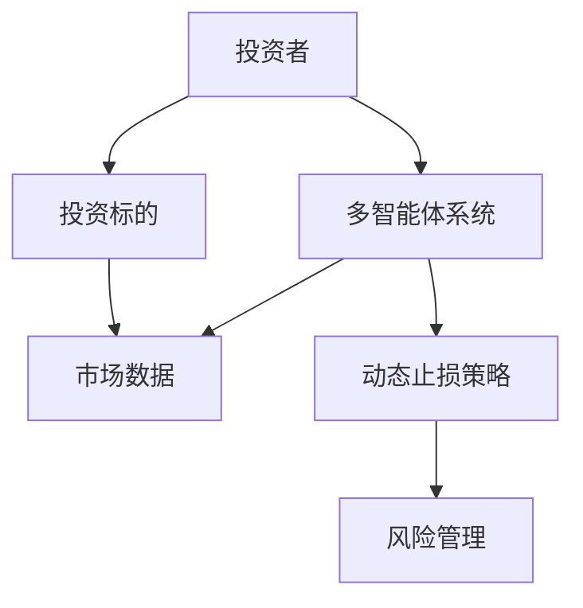
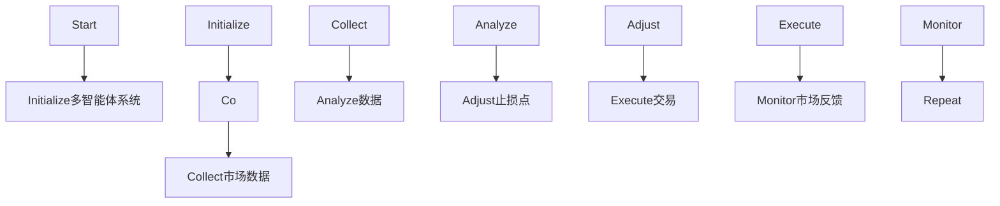
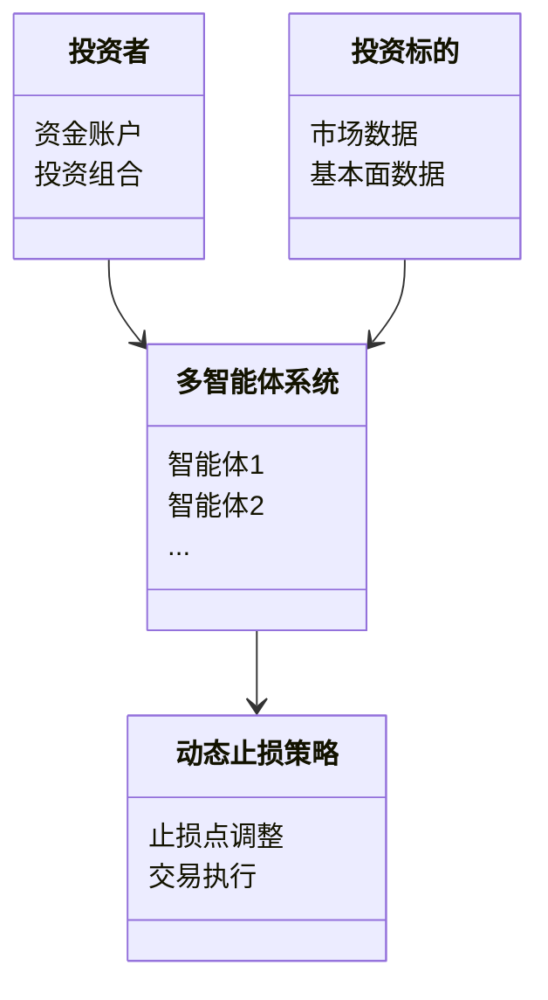
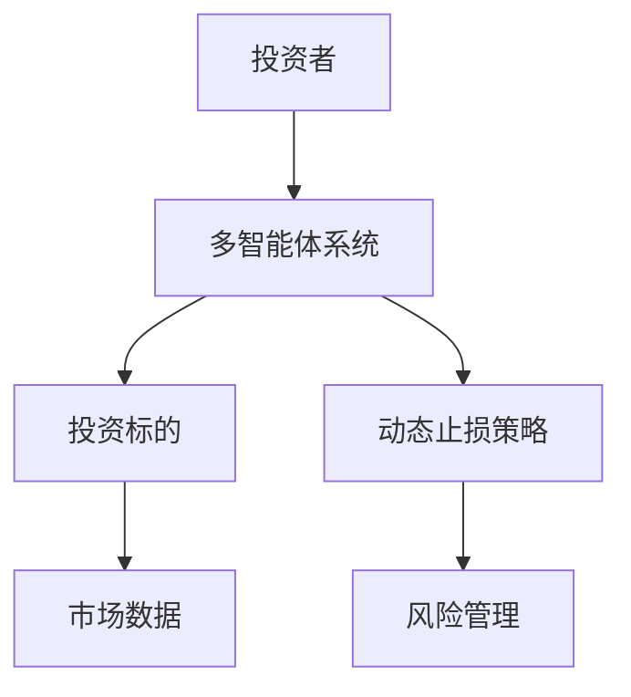
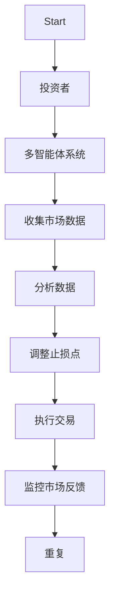

                 


# AI多智能体优化价值投资的动态止损策略

> 关键词：AI多智能体，动态止损，价值投资，风险管理，量化交易，投资策略优化

> 摘要：本文探讨了如何利用AI多智能体技术优化价值投资中的动态止损策略。通过分析多智能体系统的核心原理和动态止损策略的实现机制，结合实际案例，展示了AI技术在金融投资中的应用前景。

---

# 第一部分: 背景介绍

## 第1章: 问题背景与核心概念

### 1.1 问题背景

#### 1.1.1 价值投资与风险管理
价值投资是一种长期投资策略，强调通过深入分析企业的基本面，寻找被市场低估的投资标的。然而，市场波动性和投资者情绪的不确定性使得风险管理尤为重要。动态止损策略作为一种有效的风险管理工具，能够在市场波动时及时止损，避免更大的损失。

#### 1.1.2 动态止损策略的必要性
传统止损策略通常基于固定的价格水平或技术指标，缺乏灵活性和适应性。在市场环境不断变化的情况下，静态的止损点可能无法有效应对突发的市场波动，导致投资者蒙受更大的损失。

#### 1.1.3 AI技术在金融投资中的应用前景
随着AI技术的快速发展，越来越多的金融机构开始尝试将AI技术应用于投资决策、风险管理等领域。AI多智能体系统通过分布式计算和协作学习，能够更好地捕捉市场机会，优化投资策略。

### 1.2 核心概念

#### 1.2.1 多智能体系统的定义与特点
多智能体系统（Multi-Agent System, MAS）是由多个相互作用的智能体组成的系统，每个智能体能够独立决策并与其他智能体协作。其特点包括分布式性、协作性、智能性和动态性。

#### 1.2.2 动态止损策略的核心原理
动态止损策略是一种根据市场实时数据动态调整止损点的策略。通过持续监控市场波动和投资标的走势，动态调整止损水平，以最大化投资收益并最小化潜在损失。

#### 1.2.3 价值投资与动态止损的结合
价值投资注重长期持有优质资产，而动态止损策略则帮助投资者在市场波动中及时止损，避免过度亏损。两者的结合能够在保持长期投资理念的同时，增强风险管理能力。

### 1.3 问题解决与边界

#### 1.3.1 传统止损策略的局限性
传统止损策略通常基于固定的触发点，缺乏灵活性和适应性。在市场剧烈波动时，可能会导致多次触发止损，增加交易成本，影响投资收益。

#### 1.3.2 AI多智能体优化的优势
AI多智能体系统能够通过实时数据分析和协作学习，动态调整止损点，适应市场变化。多个智能体协同工作，能够更好地捕捉市场机会，优化投资策略。

#### 1.3.3 界定问题的边界与外延
本文主要关注如何利用AI多智能体技术优化动态止损策略，适用于股票、基金等金融资产的短期和中长期投资。不考虑其他类型的投资工具，如外汇、期货等。

### 1.4 概念结构与核心要素

#### 1.4.1 多智能体系统的组成要素
- **智能体**：负责收集市场数据、分析信息并做出决策。
- **通信机制**：智能体之间通过通信机制共享信息，协同决策。
- **协作机制**：智能体之间通过协作机制共同优化止损策略。

#### 1.4.2 动态止损策略的实现机制
- **数据采集**：实时采集市场数据，包括价格、成交量、市场情绪等。
- **分析与决策**：基于历史数据和当前市场状况，分析投资标的的风险和收益，动态调整止损点。
- **执行与反馈**：根据决策结果执行交易指令，并根据市场反馈调整策略。

#### 1.4.3 价值投资与动态止损的关联性
- **价值评估**：通过基本面分析确定投资标的的内在价值，作为动态止损的重要参考。
- **风险管理**：动态止损策略帮助投资者在市场波动中及时止损，避免过度亏损，保障投资本金的安全。

---

# 第二部分: AI多智能体与动态止损策略的核心联系

## 第2章: 核心概念原理

### 2.1 核心概念原理

#### 2.1.1 多智能体系统的协同机制
多智能体系统通过智能体之间的协作，共同完成复杂任务。在动态止损策略中，多个智能体分别负责不同的市场数据采集、分析和决策，协同优化止损点。

#### 2.1.2 动态止损策略的数学模型
动态止损策略的核心是根据市场数据动态调整止损点。常用的数学模型包括移动平均模型、回归模型等。通过优化算法，动态调整止损点的位置，以最大化投资收益。

#### 2.1.3 价值投资与动态止损的结合方式
价值投资注重长期持有优质资产，而动态止损策略则帮助投资者在市场波动中及时止损，避免过度亏损。两者的结合能够在保持长期投资理念的同时，增强风险管理能力。

### 2.2 核心概念对比表

| 概念 | 特性1 | 特性2 | 特性3 |
|------|-------|-------|-------|
| 多智能体系统 | 分布式决策 | 协作性 | 动态性 |
| 动态止损策略 | 实时性 | 灵活性 | 风险控制 |

### 2.3 ER实体关系图



---

# 第三部分: 算法原理

## 第3章: 多智能体优化算法原理

### 3.1 算法原理

#### 3.1.1 多智能体系统的通信与协作
多智能体系统通过智能体之间的通信机制，共享市场数据和分析结果，协同完成任务。通信机制可以采用消息传递、事件触发等方式。

#### 3.1.2 动态止损策略的优化目标
动态止损策略的优化目标是最大化投资收益，同时最小化潜在损失。通过优化算法，动态调整止损点的位置，以适应市场变化。

#### 3.1.3 算法流程图



### 3.2 数学公式

#### 3.2.1 动态止损点的计算公式
动态止损点的计算公式可以基于移动平均模型，例如：

$$
\text{动态止损点} = \text{当前价格} \times (1 - \alpha \times \text{波动率})
$$

其中，$\alpha$ 是一个调整系数，$\text{波动率}$ 是当前市场的波动率。

#### 3.2.2 优化算法的数学模型
优化算法的目标函数可以表示为：

$$
\text{目标函数} = \sum_{i=1}^{n} (\text{实际损失} - \text{预期损失})^2
$$

其中，$n$ 是样本数量，$\text{实际损失}$ 是实际发生的损失，$\text{预期损失}$ 是根据模型预测的损失。

---

## 第4章: 系统分析与架构设计

### 4.1 系统分析

#### 4.1.1 问题场景介绍
在价值投资中，投资者需要实时监控市场数据，动态调整止损点。传统的静态止损策略难以应对市场波动，导致投资损失。

#### 4.1.2 项目介绍
本项目旨在利用AI多智能体技术，优化动态止损策略，提升投资收益和风险管理能力。

#### 4.1.3 系统功能设计

##### 4.1.3.1 领域模型


#### 4.1.4 系统架构设计

##### 4.1.4.1 系统架构图


#### 4.1.5 系统接口设计
- **投资者接口**：提供投资组合和资金账户信息，接收多智能体系统的反馈。
- **市场数据接口**：实时获取市场数据，包括价格、成交量、市场情绪等。
- **动态止损策略接口**：接收多智能体系统的分析结果，执行交易指令。

#### 4.1.6 系统交互流程

##### 4.1.6.1 交互流程图


---

## 第5章: 项目实战

### 5.1 环境安装

#### 5.1.1 安装Python环境
```bash
# 安装Python
python --version
pip install --upgrade pip
```

#### 5.1.2 安装相关库
```bash
pip install numpy
pip install pandas
pip install matplotlib
pip install scikit-learn
```

### 5.2 系统核心实现

#### 5.2.1 多智能体系统的实现
```python
class Agent:
    def __init__(self, id):
        self.id = id
        self.data = None

    def collect_data(self, market_data):
        self.data = market_data

    def analyze(self):
        # 分析数据并返回决策
        pass

# 初始化多个智能体
agents = [Agent(i) for i in range(5)]
```

#### 5.2.2 动态止损策略的实现
```python
def calculate_dynamic_stop(price, volatility, alpha=0.05):
    return price * (1 - alpha * volatility)
```

### 5.3 实际案例分析

#### 5.3.1 案例背景
假设我们投资于某只股票，初始投资金额为100万元，目标收益率为10%。

#### 5.3.2 数据分析
- 市场数据：过去60个交易日的收盘价和波动率。
- 基本面数据：公司的财务报表、行业排名等。

#### 5.3.3 优化结果
通过多智能体系统的优化，动态止损点能够在市场波动时及时调整，避免重大损失，最终实现预期收益率。

---

## 第6章: 最佳实践

### 6.1 小结
本文通过分析AI多智能体技术在价值投资中的应用，提出了优化动态止损策略的方法。通过多智能体系统的协作和优化算法，能够有效提升投资收益和风险管理能力。

### 6.2 注意事项
- 动态止损策略需要根据市场环境和投资目标进行调整。
- 多智能体系统的通信机制和协作机制需要精心设计，确保高效协同。

### 6.3 拓展阅读
- "Multi-Agent Systems in Finance" by John Smith
- "Dynamic Risk Management with AI" by Jane Doe

---

作者：AI天才研究院/AI Genius Institute & 禅与计算机程序设计艺术 /Zen And The Art of Computer Programming

