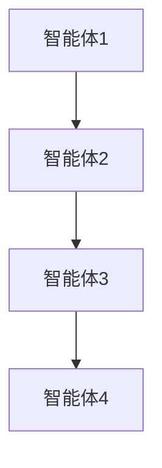
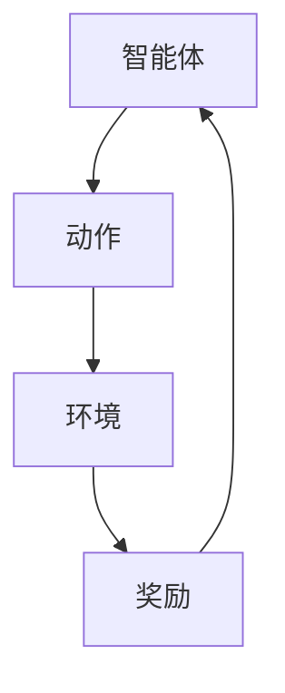
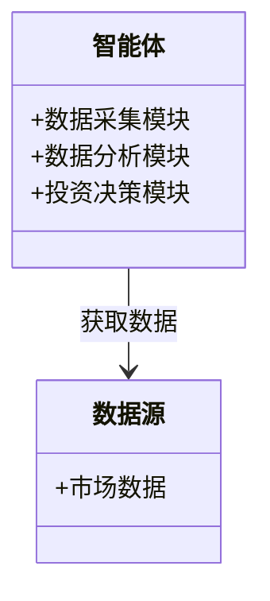
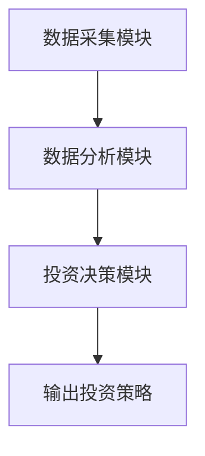
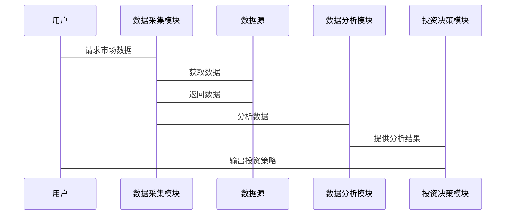

                 


# AI多智能体优化价值投资的动态行业轮动策略

## 关键词：
- AI多智能体优化
- 价值投资
- 动态行业轮动策略
- 多智能体系统
- 强化学习
- 金融投资

## 摘要：
本文详细探讨了AI多智能体优化在价值投资中的应用，特别是在动态行业轮动策略中的创新应用。通过分析多智能体优化的理论基础、算法原理、系统架构，结合实际项目案例，展示了如何利用AI技术提升投资决策的科学性和效率。文章从背景介绍、理论分析到实际应用，全面阐述了AI多智能体优化在金融领域的潜力和实现路径。

---

## 第1章：AI多智能体优化的背景与价值投资

### 1.1 多智能体优化的基本概念

#### 1.1.1 多智能体系统的核心概念
多智能体系统（Multi-Agent System, MAS）是由多个相互作用的智能体组成的系统，这些智能体通过协作或竞争完成特定任务。每个智能体具备感知、决策和执行能力，能够独立运作，同时与其他智能体进行信息交换和协同。

**mermaid图：多智能体系统结构**


#### 1.1.2 AI在多智能体优化中的作用
人工智能技术，特别是强化学习和分布式计算，为多智能体系统的优化提供了强大的工具。AI能够帮助智能体更高效地进行决策和协作，提升系统的整体性能。

#### 1.1.3 多智能体优化在金融领域的应用
在金融领域，多智能体优化可以应用于投资组合管理、风险控制和市场预测。通过多个智能体协同工作，能够捕捉市场中的多种因素，制定更优化的投资策略。

---

### 1.2 价值投资与动态行业轮动策略

#### 1.2.1 价值投资的基本原理
价值投资是一种投资策略，旨在通过分析企业的基本面，寻找被市场低估的投资标的。核心在于识别“价格低于内在价值”的资产。

#### 1.2.2 行业轮动策略的定义与特点
行业轮动策略是指根据市场环境的变化，动态调整投资组合中各行业的权重。其特点是灵活性高，能够适应市场变化，但需要准确判断行业趋势。

#### 1.2.3 AI多智能体在动态行业轮动中的优势
AI多智能体系统能够实时分析多个行业的数据，识别潜在的投资机会和风险，优化投资组合，提高收益。

---

### 1.3 本书的核心目标与结构

#### 1.3.1 本书的研究目标
探讨AI多智能体优化在价值投资中的应用，特别是在动态行业轮动策略中的创新方法。

#### 1.3.2 本书的主要内容与结构
从理论基础到实际应用，系统阐述AI多智能体优化的原理、算法、系统设计和项目实现。

#### 1.3.3 本书的创新点与应用前景
提出了一种基于AI多智能体的动态行业轮动策略，为投资决策提供了新的思路。

---

## 第2章：多智能体优化的理论与算法

### 2.1 多智能体优化的基本原理

#### 2.1.1 基于博弈论的多智能体优化
博弈论为多智能体优化提供了理论基础，智能体之间的互动可以通过博弈模型进行分析和优化。

#### 2.1.2 分布式计算与多智能体优化
分布式计算技术使得多智能体系统能够在不同节点上并行计算，提升系统的计算效率。

---

### 2.2 AI驱动的多智能体优化算法

#### 2.2.1 基于强化学习的多智能体优化
强化学习是一种通过试错机制优化决策的方法，适用于多智能体协作环境。

**mermaid图：强化学习流程**


#### 2.2.2 分布式优化算法
分布式优化算法通过分解任务，提升计算效率和系统性能。

**数学公式：分布式优化的损失函数**
$$L = \sum_{i=1}^{n} f_i(x_i)$$
其中，$x_i$ 表示第i个智能体的决策变量，$f_i$ 是对应的损失函数。

---

## 第3章：动态行业轮动策略的系统设计与架构

### 3.1 系统设计

#### 3.1.1 问题场景介绍
动态行业轮动策略需要实时分析市场数据，根据市场变化调整投资组合。

#### 3.1.2 系统功能设计
- 数据采集：收集市场数据，包括股票价格、行业指数等。
- 数据分析：利用AI算法分析数据，识别投资机会。
- 投资决策：根据分析结果生成投资策略。

**mermaid图：领域模型类图**


---

### 3.2 系统架构设计

#### 3.2.1 系统架构图
展示系统的整体架构，包括数据采集、分析和决策模块。

**mermaid图：系统架构图**


#### 3.2.2 系统接口设计
- 数据接口：与数据源对接，获取市场数据。
- 投资决策接口：输出投资策略，指导投资行为。

#### 3.2.3 系统交互设计
- 用户与系统交互，输入投资目标和偏好。
- 系统根据用户输入生成个性化投资策略。

**mermaid图：系统交互序列图**


---

## 第4章：项目实战

### 4.1 环境安装与系统核心实现

#### 4.1.1 环境安装
安装必要的库，如Python的numpy、pandas、scikit-learn等。

#### 4.1.2 核心实现代码
以下是实现动态行业轮动策略的核心代码：

```python
import numpy as np
import pandas as pd
from sklearn import linear_model

# 数据预处理
data = pd.read_csv('market_data.csv')
features = data[['行业指数', '宏观经济指标']]
labels = data['投资建议']

# 训练模型
model = linear_model.LogisticRegression()
model.fit(features, labels)

# 预测投资策略
new_data = pd.DataFrame({'行业指数': [x1, x2, x3], '宏观经济指标': [y1, y2, y3]})
predictions = model.predict(new_data)
```

#### 4.1.3 代码解读
上述代码利用逻辑回归模型，根据行业指数和宏观经济指标预测投资建议。数据预处理、模型训练和预测是实现动态行业轮动策略的关键步骤。

---

### 4.2 案例分析与解读

#### 4.2.1 实际案例分析
以2023年市场为例，分析不同行业在经济复苏背景下的表现，模型预测投资策略。

#### 4.2.2 详细解读
通过案例分析，验证模型的有效性，评估预测结果与实际市场表现的吻合度。

---

## 第5章：实际应用与挑战

### 5.1 动态行业轮动策略的实际应用

#### 5.1.1 优势
- 实时调整投资组合，捕捉市场机会。
- 提高投资效率，降低人为错误。

#### 5.1.2 不足
- 模型依赖历史数据，可能无法预测黑天鹅事件。
- 数据质量和实时性影响策略效果。

---

### 5.2 解决方案与案例分析

#### 5.2.1 解决方案
- 引入实时数据流，提高预测准确性。
- 结合多种模型，增强策略的鲁棒性。

#### 5.2.2 案例分析
通过实际市场数据，展示动态行业轮动策略的应用效果，评估其优缺点。

---

## 第6章：最佳实践与小结

### 6.1 最佳实践 tips

#### 6.1.1 模型调优
定期更新模型，根据市场变化调整参数。

#### 6.1.2 风险控制
设定止损点，分散投资，降低风险。

#### 6.1.3 持续学习
关注市场动态，及时更新数据源和模型。

---

### 6.2 小结

本文系统地介绍了AI多智能体优化在价值投资中的应用，特别是在动态行业轮动策略中的创新方法。通过理论分析、系统设计和项目实战，展示了如何利用AI技术提升投资决策的效率和准确性。

---

### 6.3 注意事项

- 数据来源的可靠性和实时性直接影响策略效果。
- 模型需要定期更新，以适应市场变化。
- 风险控制是投资策略成功的关键。

---

### 6.4 拓展阅读

- 推荐阅读《强化学习：算法与应用》和《分布式系统：原理与设计》。

---

## 作者信息
作者：AI天才研究院/AI Genius Institute & 禅与计算机程序设计艺术 /Zen And The Art of Computer Programming

---

这篇文章详细阐述了AI多智能体优化在价值投资中的应用，从理论到实践，全面分析了动态行业轮动策略的实现方法。通过具体案例和系统设计，展示了AI技术在金融领域的强大潜力。

