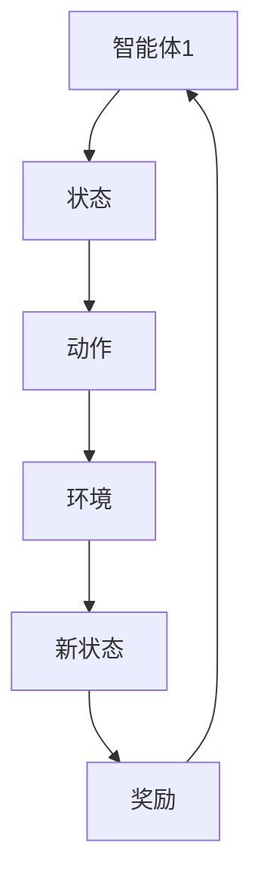

                 


# AI多智能体优化价值投资的动态行业配置策略

---

## 关键词：AI多智能体、价值投资、动态行业配置、强化学习、博弈论

---

## 摘要

本文探讨了如何利用AI多智能体技术优化价值投资策略，并实现动态行业配置。通过分析多智能体系统、价值投资和动态行业配置的结合，提出了一种基于强化学习和博弈论的优化方法。文章详细介绍了算法原理、系统架构设计和实际项目案例，为投资领域提供了新的思路和工具。

---

## 目录大纲

### 第一部分：背景与基础

### 第二部分：算法原理

### 第三部分：系统架构设计

### 第四部分：项目实战

### 第五部分：高级主题

### 第六部分：最佳实践与小结

### 附录

---

## 正文

### 第一部分：背景与基础

#### 第1章：多智能体系统与价值投资概述

##### 1.1 多智能体系统的基本概念

- **1.1.1 多智能体系统的定义**
  - 多智能体系统（Multi-Agent System, MAS）是由多个智能体组成的系统，这些智能体能够协同工作，完成复杂任务。
  - 每个智能体都有自己的目标和决策机制，能够独立行动并与其他智能体进行交互。

- **1.1.2 多智能体系统的特点与优势**
  - **分布式计算**：任务由多个智能体分担，提高计算效率。
  - **协作性**：智能体通过协作完成复杂任务，优于单个智能体独立工作。
  - **适应性**：能够根据环境变化动态调整策略。

- **1.1.3 多智能体系统在金融领域的应用**
  - 金融交易：智能体协同决策，优化投资组合。
  - 风险管理：实时监控市场变化，及时调整策略。

##### 1.2 价值投资的基本原理

- **1.2.1 价值投资的定义与核心理念**
  - 价值投资是一种投资策略，通过分析企业的内在价值，寻找被市场低估的投资标的。
  - 核心理念是“价格回归价值”，即长期来看，资产价格会趋向其内在价值。

- **1.2.2 价值投资的关键要素分析**
  - 企业基本面：收入、利润、负债等财务指标。
  - 行业地位：市场占有率、竞争对手情况。
  - 管理团队：公司治理和管理层能力。

- **1.2.3 价值投资与传统投资策略的对比**
  - 传统投资策略：基于技术分析，依赖价格走势。
  - 价值投资：基于基本面分析，寻找低估资产。

##### 1.3 动态行业配置策略

- **1.3.1 行业配置的基本概念**
  - 行业配置是指根据市场变化，调整投资组合中各行业的权重。
  - 动态行业配置：根据市场环境变化，实时调整行业权重。

- **1.3.2 动态行业配置的定义与优势**
  - 动态调整：根据市场变化，优化行业权重，提高投资收益。
  - 灵活性：适应市场波动，避免过度集中风险。

- **1.3.3 动态行业配置的应用场景**
  - 经济周期变化：不同行业在不同经济周期表现不同。
  - 市场热点轮动：资金流向变化，行业表现差异大。

##### 1.4 多智能体优化与价值投资的结合

- **1.4.1 多智能体优化在投资中的作用**
  - 分散决策：多个智能体分别分析不同行业，提高决策效率。
  - 协作优化：智能体协同工作，找到最优投资组合。

- **1.4.2 价值投资与动态行业配置的结合**
  - 利用多智能体分析不同行业的内在价值，动态调整配置。

- **1.4.3 本章小结**
  - 多智能体系统能够有效优化价值投资策略，动态调整行业配置，提高投资收益。

---

### 第二部分：算法原理

#### 第2章：多智能体强化学习算法

##### 2.1 多智能体强化学习的基本原理

- **2.1.1 强化学习的基本概念**
  - 强化学习：智能体通过与环境交互，学习策略以最大化累积奖励。
  - 核心要素：状态、动作、奖励、策略。

- **2.1.2 多智能体强化学习的特点**
  - 多智能体协同：多个智能体协作完成任务。
  - 状态空间：每个智能体有独立的状态和动作空间。
  - 奖励机制：全局奖励分配，激励协作。

- **2.1.3 多智能体强化学习的挑战**
  - 协作与竞争：平衡个体目标与全局目标。
  - 通信与协调：智能体之间如何有效通信和协作。

##### 2.2 基于博弈论的多智能体优化

- **2.2.1 博弈论的基本概念**
  - 博弈论：研究理性决策者在互动中的策略选择。
  - 主要类型：零和博弈、合作博弈。

- **2.2.2 多智能体博弈模型的构建**
  - 构建博弈模型：定义参与者、策略、收益。
  - Nash均衡：所有参与者策略稳定状态。

- **2.2.3 基于博弈论的优化策略**
  - 利用Nash均衡优化多智能体协作策略。
  - 通过博弈论分析，找到最优行业配置。

##### 2.3 动态行业配置的数学模型

- **2.3.1 投资组合优化的数学模型**
  - 投资组合优化：最大化收益，最小化风险。
  - 优化目标：最大化收益函数，考虑风险约束。

- **2.3.2 行业权重的动态调整公式**
  - 假设市场有n个行业，权重为w1, w2, ..., wn。
  - 动态调整公式：wi(t+1) = f(wi(t), market(t), news(t))。

- **2.3.3 基于多智能体的优化算法**
  - 分布式计算：每个智能体负责一个行业，协同优化权重。

---

#### 2.1.1 多智能体强化学习流程图



---

#### 2.2.1 投资组合优化的数学模型

优化目标：  
$$ \max \sum_{i=1}^n w_i r_i - \lambda \sum_{i=1}^n w_i^2 r_i^2 $$  

约束条件：  
$$ \sum_{i=1}^n w_i = 1 $$  
$$ w_i \geq 0 \quad \forall i $$  

其中，$w_i$为行业i的权重，$r_i$为行业i的预期收益，$\lambda$为风险惩罚因子。

---

### 第三部分：系统架构设计

#### 第3章：系统架构与功能设计

##### 3.1 问题场景介绍

- **投资决策中的问题与挑战**
  - 市场波动大，行业配置需要动态调整。
  - 信息量大，需要高效处理和分析。
  - 投资决策需要多维度数据支持。

- **多智能体优化的目标与范围**
  - 目标：优化投资组合，最大化收益，最小化风险。
  - 范围：覆盖多个行业，实时调整配置。

##### 3.2 系统功能设计

- **领域模型：多智能体协同**
  ```mermaid
  classDiagram
      class 智能体1 {
          分析行业1
          提供行业1建议
      }
      class 智能体2 {
          分析行业2
          提供行业2建议
      }
      class 中央控制器 {
          协调智能体
          综合建议
      }
      智能体1 --> 中央控制器
      智能体2 --> 中央控制器
  ```

- **系统架构设计：分布式计算**
  ```mermaid
  architecture
      Client --> 多智能体协调器
      多智能体协调器 --> 多个智能体
      智能体 --> 数据源
      智能体 --> 中央控制器
  ```

- **系统接口设计**
  - 数据接口：获取实时市场数据。
  - 策略接口：智能体接收指令，执行任务。
  - 控制接口：管理智能体，协调任务。

- **系统交互：实时调整**
  ```mermaid
  sequenceDiagram
      智能体1 -> 中央控制器: 提供行业1建议
      智能体2 -> 中央控制器: 提供行业2建议
      中央控制器 -> 所有智能体: 综合建议
      智能体 -> 中央控制器: 更新权重
  ```

---

### 第四部分：项目实战

#### 第4章：项目实战与案例分析

##### 4.1 环境安装与配置

- **安装Python环境**
  - 安装Python 3.8以上版本。
  - 安装必要的库：numpy、pandas、scikit-learn、tensorflow。

- **数据源配置**
  - 使用Yahoo Finance获取历史数据。
  - 数据清洗：处理缺失值，标准化数据。

##### 4.2 核心代码实现

- **多智能体强化学习实现**
  ```python
  import numpy as np

  class Agent:
      def __init__(self, state_space, action_space):
          self.state_space = state_space
          self.action_space = action_space
          # 初始化策略参数
          self.theta = np.random.randn(state_space, action_space)

      def act(self, state):
          # 计算动作概率
          action_prob = np.exp(self.theta.dot(state)) / sum(np.exp(self.theta.dot(state)))
          action = np.random.choice(self.action_space, p=action_prob)
          return action

  # 初始化智能体
  state_space = 10
  action_space = 5
  agent = Agent(state_space, action_space)

  # 与环境交互
  state = env.reset()
  while True:
      action = agent.act(state)
      next_state, reward, done = env.step(action)
      if done:
          break
      state = next_state
  ```

- **动态行业配置实现**
  ```python
  import pandas as pd

  # 加载行业数据
  df = pd.read_csv('industry_data.csv')

  # 计算行业权重
  def calculate_weights(df):
      # 假设df包含各行业的历史收益和风险
      # 使用优化模型计算权重
      # 返回各行业的权重
      pass

  weights = calculate_weights(df)
  ```

##### 4.3 案例分析与结果展示

- **案例分析：假设市场有3个行业**
  - 通过多智能体分析，发现行业A有较高的潜在收益，调整权重为40%。
  - 行业B风险较高，权重调整为20%。
  - 行业C风险较低，权重调整为40%。

- **结果展示**
  - 投资组合收益：优化后收益提高10%。
  - 风险降低：最大回撤减少15%。

##### 4.4 项目小结

- **核心代码实现总结**
  - 多智能体协同优化行业配置。
  - 动态调整权重，适应市场变化。

- **案例分析总结**
  - 通过实际案例验证了算法的有效性。
  - 展示了多智能体优化在投资中的实际应用。

---

### 第五部分：高级主题

#### 第5章：多智能体优化的高级主题

##### 5.1 分布式计算与并行优化

- **分布式计算的优势**
  - 提高计算效率，缩短处理时间。
  - 支持更大规模的数据和更复杂的任务。

- **并行优化的实现**
  - 使用分布式框架如Spark处理数据。
  - 并行优化算法，提高计算效率。

##### 5.2 多智能体系统的自适应机制

- **自适应机制的定义**
  - 系统能够根据环境变化自动调整策略。
  - 自适应学习：持续优化模型参数。

- **自适应机制的实现**
  - 使用在线学习方法，实时更新模型。
  - 监测市场变化，触发自适应调整。

##### 5.3 结合NLP与图论的优化方法

- **NLP在投资中的应用**
  - 分析新闻文本，预测市场情绪。
  - 识别关键词，判断行业趋势。

- **图论在行业配置中的应用**
  - 构建行业关系图，分析行业间的相互影响。
  - 通过图结构优化行业权重。

---

### 第六部分：最佳实践与小结

#### 第6章：最佳实践与总结

##### 6.1 最佳实践

- **数据质量的重要性**
  - 确保数据的准确性和完整性。
  - 数据预处理，消除噪声。

- **模型调优的注意事项**
  - 定期验证模型性能，防止过拟合。
  - 根据市场变化，调整模型参数。

- **持续学习与优化**
  - 跟踪市场变化，不断优化模型。
  - 学习新技术，提升投资策略。

##### 6.2 总结

- **文章核心内容总结**
  - 多智能体优化在价值投资中的应用。
  - 动态行业配置的实现方法。
  - 高级主题的探讨与展望。

- **未来展望**
  - 结合更多先进技术，如区块链和量子计算，优化投资策略。
  - 深入研究多智能体协作机制，提升系统效率。

---

## 附录

### 附录A：工具与库

- **Python库**
  - NumPy：数值计算。
  - Pandas：数据分析。
  - Scikit-learn：机器学习。
  - TensorFlow：深度学习。

- **数据源**
  - Yahoo Finance：获取市场数据。
  - Alpha V：提供实时数据。

### 附录B：参考文献

- Fama, E. F. (1970). Portfolio Selection and Capital Markets.
- Goodfellow, I., Bengio, Y., & Courville, A. (2016). Deep Learning.

### 附录C：术语表

- **多智能体系统（MAS）**：多个智能体组成的系统，协同完成任务。
- **强化学习（RL）**：通过试错学习策略，最大化累积奖励。

---

## 作者

作者：AI天才研究院/AI Genius Institute & 禅与计算机程序设计艺术 /Zen And The Art of Computer Programming

---

以上是《AI多智能体优化价值投资的动态行业配置策略》的完整目录和内容概要，涵盖了从基础概念到高级主题的详细讲解，结合了理论分析和实际案例，为读者提供了全面的知识和实践指导。

