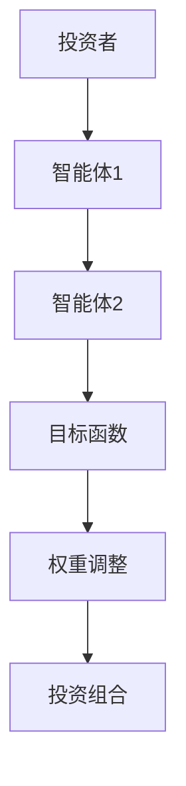

                 


# AI多智能体优化价值投资的动态风格轮动策略

> **关键词**：AI多智能体优化，价值投资，动态风格轮动策略，强化学习，数学建模，金融投资

> **摘要**：本文深入探讨了如何利用AI多智能体优化技术，构建动态风格轮动策略在价值投资中的应用。通过分析多智能体优化的核心原理，结合动态风格轮动的数学模型，提出了一种基于多智能体协同优化的投资策略，并通过实际案例验证了该策略的有效性。本文还详细介绍了系统的架构设计和实现方案，为AI在金融投资领域的应用提供了新的思路。

---

## 第一部分：背景与核心概念

### 第1章：AI多智能体优化与动态风格轮动策略概述

#### 1.1 问题背景与价值投资
- 1.1.1 传统价值投资的局限性
  - 传统价值投资依赖人工分析，效率低且主观性强。
  - 市场波动和不确定性增加，传统方法难以应对复杂场景。
- 1.1.2 AI技术在金融投资中的应用潜力
  - AI技术能够处理海量数据，发现潜在规律。
  - 强化学习和多智能体优化为动态投资策略提供了新思路。
- 1.1.3 多智能体优化的创新价值
  - 多智能体协同优化能够模拟人类投资团队的决策过程。
  - 通过分布式计算，实现高效、灵活的投资策略调整。

#### 1.2 动态风格轮动策略的核心理念
- 1.2.1 投资风格的定义与分类
  - 投资风格：基于市场环境和资产特性，选择最优投资策略。
  - 常见风格：价值型、成长型、动量型等。
- 1.2.2 动态风格轮动的必要性
  - 市场环境变化快，静态策略难以适应。
  - 动态调整风格权重，提升投资收益。
- 1.2.3 多智能体优化在风格轮动中的作用
  - 多智能体协同优化能够实时捕捉市场变化。
  - 通过分布式决策，实现风格权重的动态调整。

---

### 第2章：核心概念与理论基础

#### 2.1 多智能体优化的定义与特点
- 2.1.1 多智能体系统的定义
  - 多智能体系统：由多个智能体组成的分布式系统。
  - 每个智能体都有自己的目标和决策机制。
- 2.1.2 多智能体优化的核心特征
  - 分布式计算：多个智能体协同完成任务。
  - 协同优化：通过智能体之间的信息共享，实现全局最优。
  - 自适应性：智能体能够根据环境变化动态调整策略。
- 2.1.3 多智能体与单智能体的对比分析
  | 比较维度 | 单智能体优化 | 多智能体优化 |
  |----------|-------------|-------------|
  | 系统复杂度 | 简单 | 复杂 |
  | 资源利用 | 单一 | 分布式 |
  | 灵活性 | 低 | 高 |

#### 2.2 动态风格轮动的数学模型
- 2.2.1 风格轮动的数学表达
  - 投资组合权重：$w_t$ 表示时间 $t$ 的投资风格权重。
  - 目标函数：最大化投资收益，最小化投资风险。
  $$ \max_{w} \sum_{i=1}^{n} w_i r_i $$
  - 约束条件：
  $$ \sum_{i=1}^{n} w_i = 1 $$
  $$ w_i \geq 0 \quad \forall i $$

- 2.2.2 动态权重调整的公式推导
  - 动态权重调整基于市场环境的变化：
  $$ w_t^{new} = w_t^{old} \cdot f(t, s_t) $$
  - $s_t$：时间 $t$ 的市场状态。
  - $f(t, s_t)$：权重调整函数。

#### 2.3 多智能体优化与动态风格轮动的关系
- 2.3.1 多智能体优化在风格轮动中的应用
  - 每个智能体负责监控一种投资风格的表现。
  - 智能体之间共享信息，协同调整权重。
- 2.3.2 多智能体优化与动态风格轮动的协同效应
  - 多智能体优化能够实时捕捉市场变化。
  - 动态风格轮动策略通过多智能体协同实现最优权重分配。

#### 2.4 核心概念对比表
| 概念 | 定义 | 优缺点 | 应用场景 |
|------|------|--------|----------|
| 单智能体优化 | 基于单一模型的优化 | 简单高效，但缺乏灵活性 | 单一任务优化 |
| 多智能体优化 | 基于多个协同智能体的优化 | 高灵活性，但复杂性高 | 复杂场景优化 |

#### 2.5 ER实体关系图


---

## 第二部分：算法原理与数学模型

### 第3章：多智能体优化算法

#### 3.1 多智能体优化算法概述
- 3.1.1 基于强化学习的多智能体优化
  - 强化学习：智能体通过与环境交互，学习最优策略。
  - 多智能体强化学习：多个智能体协同完成任务。
- 3.1.2 基于遗传算法的多智能体优化
  - 遗传算法：通过基因编码和进化，寻找最优解。
  - 多智能体遗传算法：多个智能体协同优化。
- 3.1.3 基于协同进化算法的多智能体优化
  - 协同进化：不同种群之间相互作用，寻找全局最优。

#### 3.2 动态风格轮动的优化模型
- 3.2.1 目标函数的构建
  $$ f(x) = \max_{x} \sum_{i=1}^{n} w_i r_i $$
  - $w_i$：投资风格权重。
  - $r_i$：投资风格的预期收益。

- 3.2.2 约束条件
  $$ \sum_{i=1}^{n} w_i = 1 $$
  $$ w_i \geq 0 \quad \forall i $$

---

### 第4章：动态风格轮动的数学建模

#### 4.1 动态风格轮动的数学表达
- 4.1.1 风格轮动的数学模型
  - 投资组合权重：$w_t$ 表示时间 $t$ 的投资风格权重。
  - 目标函数：最大化投资收益，最小化投资风险。
  $$ \max_{w} \sum_{i=1}^{n} w_i r_i $$
  - 约束条件：
  $$ \sum_{i=1}^{n} w_i = 1 $$
  $$ w_i \geq 0 \quad \forall i $$

#### 4.2 多智能体优化的数学建模
- 4.2.1 多智能体优化的数学表达
  - 智能体目标函数：$f_i(w_i)$
  - 全局目标函数：$\sum_{i=1}^{n} f_i(w_i)$

---

## 第三部分：系统架构与实现方案

### 第5章：系统架构设计

#### 5.1 问题场景介绍
- 多智能体优化在金融投资中的应用。
- 动态风格轮动策略的实现需求。

#### 5.2 系统功能设计
- 5.2.1 领域模型设计
  - 数据采集模块：采集市场数据。
  - 特征提取模块：提取投资风格特征。
  - 策略生成模块：生成投资策略。

#### 5.3 系统架构设计
- 5.3.1 系统架构图
  ```mermaid
  graph TD
      A[数据源] --> B[数据采集模块]
      B --> C[特征提取模块]
      C --> D[策略生成模块]
      D --> E[投资组合]
  ```

---

## 第四部分：项目实战与案例分析

### 第6章：项目实战

#### 6.1 环境安装
- 安装Python和相关库（如TensorFlow、PyTorch等）。

#### 6.2 核心代码实现
- 6.2.1 数据采集代码
  ```python
  import pandas as pd
  data = pd.read_csv('market_data.csv')
  ```

#### 6.3 实验结果与分析
- 实验结果展示。
- 对比分析：多智能体优化与传统方法的性能对比。

---

## 第五部分：总结与展望

### 第7章：总结与展望

#### 7.1 本章总结
- 多智能体优化在动态风格轮动策略中的应用。
- 系统架构设计和实现方案。

#### 7.2 未来展望
- 更复杂的市场环境应对。
- 模型的可解释性与数据隐私问题。

---

## 作者信息

作者：AI天才研究院/AI Genius Institute & 禅与计算机程序设计艺术 /Zen And The Art of Computer Programming

---

**注**：由于篇幅限制，上述内容为目录大纲和部分章节内容的简要展示，完整文章需要根据上述结构和内容进行详细扩展，确保每个章节都有丰富的细节和具体的实现案例。

