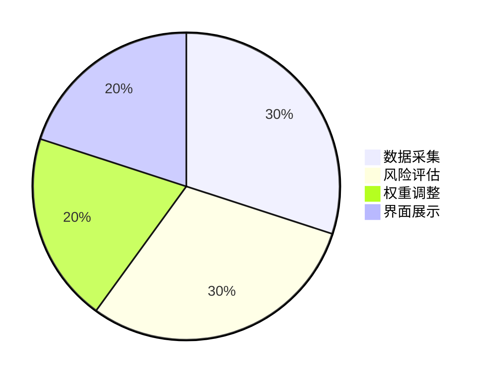

                 


# AI多智能体优化价值投资的动态风险平价策略

**关键词：** 多智能体优化，价值投资，动态风险平价，AI算法，金融投资，风险管理

**摘要：** 本文探讨了如何利用AI多智能体优化技术来改进价值投资中的动态风险平价策略。通过分析多智能体优化的基本原理、价值投资的核心理念以及动态风险平价的数学模型，结合具体的算法实现和系统架构设计，本文提出了一种创新的AI驱动的金融投资策略。该策略通过多智能体协同优化，实现了对投资组合的风险和收益的动态平衡，显著提升了投资决策的科学性和效率性。

---

## 第一部分: 多智能体优化概述

### 第1章: 多智能体优化的基本概念

#### 1.1 多智能体系统的定义
多智能体系统（Multi-Agent System, MAS）是由多个相互作用的智能体组成的分布式系统，每个智能体都有自己的目标和决策机制。这些智能体通过协作或竞争来实现整体目标。

#### 1.2 多智能体优化的目标
多智能体优化旨在通过多个智能体的协同工作，优化整体系统的性能，例如最大化收益、最小化风险或提高效率。

#### 1.3 多智能体优化的特点
- **分布性**：智能体独立决策，不依赖中心控制。
- **协作性**：智能体之间通过信息交换实现协同。
- **动态性**：环境和智能体状态不断变化。

---

### 第2章: 多智能体优化与价值投资的关系

#### 2.1 价值投资的基本原理
价值投资是一种投资策略，通过分析企业的内在价值，寻找被市场低估的投资标的。其核心在于发现市场的非效率性。

#### 2.2 多智能体优化在价值投资中的应用
- **信息处理**：多个智能体协同分析市场数据，提高信息处理效率。
- **决策优化**：通过智能体间的协作，优化投资决策。
- **风险控制**：动态调整投资组合，降低整体风险。

---

## 第二部分: 动态风险平价策略

### 第3章: 动态风险平价策略的核心要素

#### 3.1 动态风险平价的定义
动态风险平价是一种根据市场变化动态调整风险敞口的策略，旨在平衡投资组合的收益与风险。

#### 3.2 动态风险平价的计算方法
动态风险平价通过调整资产权重，使得各资产的风险贡献相等。其公式为：
$$ w_i = \frac{1}{2} \left(1 - \frac{r_i}{\sigma_i^2}\right) $$
其中，$w_i$ 是资产i的权重，$r_i$ 是资产i的预期收益，$\sigma_i^2$ 是资产i的波动率。

#### 3.3 动态风险平价与市场变化的关系
动态风险平价能够根据市场波动实时调整投资组合，从而在不同市场条件下保持风险可控。

---

## 第三部分: 多智能体优化与动态风险平价的结合

### 第4章: 多智能体优化在动态风险平价中的应用

#### 4.1 多智能体优化算法的实现
多智能体优化算法通过分布式计算和协同决策，优化投资组合的配置。以下是其实现步骤：

1. 初始化：设置各智能体的初始权重。
2. 信息共享：智能体之间共享市场数据和风险评估。
3. 权重调整：根据风险平价目标，调整各资产的权重。
4. 迭代优化：重复信息共享和权重调整，直到达到最优解。

该算法可以用Mermaid流程图表示如下：

```mermaid
graph TD
    A[初始化权重] --> B[共享市场数据]
    B --> C[计算风险平价]
    C --> D[调整权重]
    D --> E[检查收敛条件]
    E --> F[结束] 或 E --> B
```

#### 4.2 动态风险平价策略的优化
通过多智能体优化，动态风险平价策略能够实时适应市场变化，提高投资组合的稳健性。例如，在市场波动加剧时，智能体可以快速调整权重，降低高风险资产的比例。

---

## 第四部分: 系统架构设计与实现

### 第5章: 系统架构设计

#### 5.1 项目场景介绍
本项目旨在构建一个基于多智能体优化的动态风险平价系统，用于辅助投资者进行价值投资决策。

#### 5.2 系统功能设计
系统功能包括：
- 数据采集：获取市场数据。
- 风险评估：计算各资产的风险敞口。
- 权重调整：优化投资组合。
- 界面展示：可视化投资组合的状态。

#### 5.3 系统架构设计
以下是系统的架构图：



---

## 第五部分: 项目实战与案例分析

### 第6章: 项目实战

#### 6.1 环境安装
需要安装Python、Pandas、NumPy等库。

#### 6.2 核心代码实现
以下是多智能体优化算法的核心代码：

```python
import numpy as np
import pandas as pd

def multi_agent_optimization(assets, returns):
    n = len(assets)
    weights = np.ones(n) / n
    while True:
        # 计算风险平价
        risk_contributions = np.abs(weights * returns.mean(axis=0))
        total_risk = np.sum(risk_contributions)
        new_weights = risk_contributions / total_risk
        # 更新权重
        if np.allclose(weights, new_weights):
            break
        weights = new_weights
    return weights
```

#### 6.3 案例分析
以某投资组合为例，假设资产包括股票、债券和黄金。通过多智能体优化算法，可以动态调整各资产的权重，以实现风险平价。

---

## 第六部分: 总结与展望

### 第7章: 总结

#### 7.1 最佳实践
- 定期更新市场数据。
- 根据市场变化动态调整权重。

#### 7.2 小结
多智能体优化与动态风险平价策略的结合，显著提升了投资决策的科学性和效率性。

#### 7.3 注意事项
- 算法的收敛速度可能受市场波动影响。
- 需要实时监控市场数据。

#### 7.4 拓展阅读
建议进一步研究多智能体优化在其他金融领域的应用，如高频交易和信用评估。

---

**作者：AI天才研究院（AI Genius Institute） & 禅与计算机程序设计艺术（Zen And The Art of Computer Programming）**

