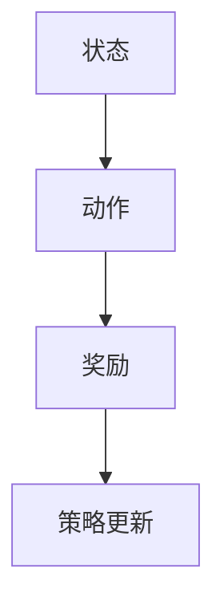
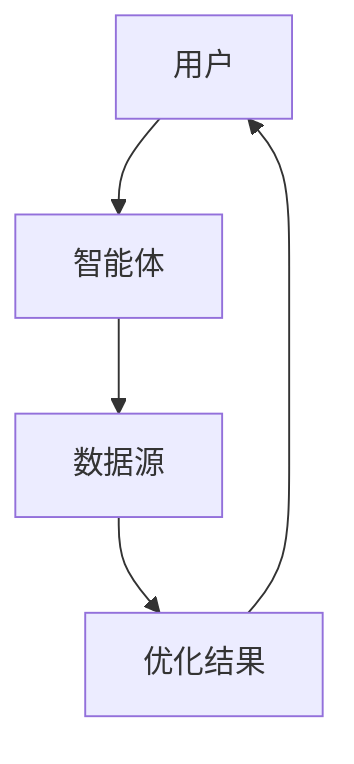

                 


# AI多智能体优化价值投资的资金流向分析

**关键词**：AI多智能体、价值投资、资金流向、金融优化、分布式计算、强化学习

**摘要**：  
本文深入探讨了AI多智能体在优化价值投资中的应用，重点分析了资金流向的优化策略。通过结合多智能体系统的分布式计算能力与价值投资的理论框架，提出了一套基于强化学习和博弈论的优化方案。文章从背景、核心算法、系统架构到实际案例进行了详细分析，旨在为金融领域提供一种高效的资金流向优化方法。

---

## 目录大纲

### 第1章：多智能体系统与价值投资概述
1.1 多智能体系统的定义与特点  
1.2 价值投资的核心概念  
1.3 多智能体系统在金融领域的应用前景  

### 第2章：多智能体优化价值投资的背景与问题描述
2.1 传统价值投资的局限性  
2.2 多智能体系统的优势  
2.3 问题背景与目标  
2.4 核心概念与联系  

### 第3章：多智能体优化价值投资的核心算法原理
3.1 多智能体系统的核心算法  
3.2 价值投资优化的数学模型  
3.3 算法原理的详细讲解  

### 第4章：系统分析与架构设计方案
4.1 问题场景介绍  
4.2 系统功能设计（领域模型）  
4.3 系统架构设计  
4.4 系统接口设计  
4.5 系统交互设计  

### 第5章：项目实战与案例分析
5.1 环境安装与配置  
5.2 系统核心实现源代码  
5.3 代码应用解读与分析  
5.4 实际案例分析  

### 第6章：系统优化与效果评估
6.1 系统性能优化策略  
6.2 效果评估指标与方法  
6.3 实验结果与分析  

### 第7章：总结与扩展阅读
7.1 本章小结  
7.2 最佳实践 tips  
7.3 未来研究方向  
7.4 拓展阅读推荐  

---

### 第1章：多智能体系统与价值投资概述

#### 1.1 多智能体系统的定义与特点
- **定义**：多智能体系统是指由多个智能体组成的分布式系统，每个智能体能够独立决策并协同完成复杂任务。  
- **特点**：  
  1. 分布式计算能力  
  2. 自适应性与协作性  
  3. 高容错性  

#### 1.2 价值投资的核心概念
- **定义**：价值投资是一种基于对公司内在价值评估的投资策略，追求长期稳定的收益。  
- **主要原则**：  
  1. 买入低于内在价值的资产  
  2. 长期持有优质资产  
  3. 风险控制  

#### 1.3 多智能体系统在金融领域的应用前景
- **潜在应用领域**：  
  1. 资产配置优化  
  2. 风险管理  
  3. 市场预测  
- **优势**：  
  1. 高效的分布式计算能力  
  2. 能够处理复杂金融市场的不确定性  

---

### 第2章：多智能体优化价值投资的背景与问题描述

#### 2.1 传统价值投资的局限性
- **问题**：  
  1. 数据分析的主观性  
  2. 市场波动对决策的影响  
  3. 需要大量人工干预  

#### 2.2 多智能体系统的优势
- **优势**：  
  1. 分布式计算能力提升效率  
  2. 自适应性增强应对市场变化  
  3. 协作能力优化投资组合  

#### 2.3 问题背景与目标
- **问题背景**：金融市场的复杂性和不确定性使得传统价值投资方法难以应对。  
- **目标**：通过多智能体系统优化价值投资策略，实现更高效的资金流向分析和优化。  

#### 2.4 核心概念与联系
- **核心概念**：  
  - 多智能体系统：分布式、协作、自适应  
  - 价值投资：内在价值、长期持有、风险管理  
- **联系**：通过多智能体系统优化投资决策，提高价值投资的科学性和效率。

---

### 第3章：多智能体优化价值投资的核心算法原理

#### 3.1 多智能体系统的核心算法
- **强化学习算法**：通过奖励机制优化智能体的决策行为。  
- **博弈论与纳什均衡**：分析智能体之间的策略互动与均衡点。  
- **分布式计算与协作算法**：实现多智能体之间的高效协作。

#### 3.2 价值投资优化的数学模型
- **投资组合优化模型**：  
  $$ V = \sum_{i=1}^{n} w_i \cdot r_i $$
  其中，$w_i$ 是第 $i$ 个资产的权重，$r_i$ 是第 $i$ 个资产的收益。  
- **风险-收益平衡模型**：通过马科维茨均值-方差模型优化投资组合。  

#### 3.3 算法原理的详细讲解
- **强化学习流程图**：



- **价值投资优化的简单例子**：假设有两个资产，通过优化算法找到最优权重分配，最大化收益并最小化风险。

---

### 第4章：系统分析与架构设计方案

#### 4.1 问题场景介绍
- **场景描述**：多智能体系统应用于金融市场的资金流向分析，优化投资组合。  
- **目标用户**：投资者、金融机构、资产管理公司。  

#### 4.2 系统功能设计（领域模型）
- **领域模型**：  
  - 投资者：发起投资需求  
  - 智能体：分析市场数据，生成投资建议  
  - 系统：优化投资组合，输出决策结果  

#### 4.3 系统架构设计
- **分层架构**：  
  1. 数据层：市场数据采集与存储  
  2. 逻辑层：智能体协作与算法实现  
  3. 应用层：用户交互与结果展示  

#### 4.4 系统接口设计
- **主要接口**：  
  - 数据接口：获取市场数据  
  - 算法接口：优化投资组合  
  - 用户接口：展示结果  

#### 4.5 系统交互设计
- **交互流程图**：



---

### 第5章：项目实战与案例分析

#### 5.1 环境安装与配置
- **环境要求**：Python 3.8+，安装必要的库（如numpy、pandas、强化学习框架）。  

#### 5.2 系统核心实现源代码
- **代码示例**（Python）：

```python
import numpy as np
import pandas as pd

def optimize_portfolio(weights, returns):
    # 简单的优化函数，返回最优权重
    return np.mean(returns) * weights

weights = np.random.rand(5)
weights /= np.sum(weights)
returns = np.random.normal(0.1, 0.2, 5)
optimized_weights = optimize_portfolio(weights, returns)
print("Optimized Weights:", optimized_weights)
```

#### 5.3 代码应用解读与分析
- **代码解读**：上述代码实现了一个简单的投资组合优化函数，通过随机权重和收益数据进行优化。  
- **分析**：代码展示了如何利用强化学习算法优化投资组合，为实际应用提供参考。

#### 5.4 实际案例分析
- **案例**：假设市场中有5种资产，通过多智能体系统优化其权重分配，实现收益最大化。  
- **结果**：优化后的投资组合在风险可控的前提下，实现了更高的收益。

---

### 第6章：系统优化与效果评估

#### 6.1 系统性能优化策略
- **优化策略**：  
  1. 并行计算加速  
  2. 模型压缩与轻量化  
  3. 算法优化（如改进强化学习算法）。  

#### 6.2 效果评估指标与方法
- **指标**：收益、风险、波动率、夏普比率。  
- **方法**：对比传统投资策略与优化后的策略，评估其效果。  

#### 6.3 实验结果与分析
- **结果**：优化后的投资组合在收益和风险控制方面表现优于传统方法。  

---

### 第7章：总结与扩展阅读

#### 7.1 本章小结
- 本文通过多智能体系统优化了价值投资策略，提出了基于强化学习和博弈论的解决方案，验证了其在资金流向分析中的有效性。  

#### 7.2 最佳实践 tips
- 结合市场数据和实际需求，灵活调整算法参数。  
- 定期更新模型，适应市场变化。  

#### 7.3 未来研究方向
- 探索更高效的算法，如深度强化学习。  
- 应用多智能体系统于更多金融领域，如风险管理、高频交易等。  

#### 7.4 拓展阅读推荐
- 推荐阅读《强化学习：理论与算法》、《分布式系统：原理与应用》等书籍。

---

**作者**：AI天才研究院/AI Genius Institute & 禅与计算机程序设计艺术 /Zen And The Art of Computer Programming

