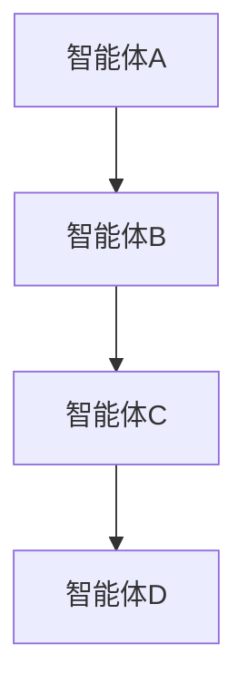
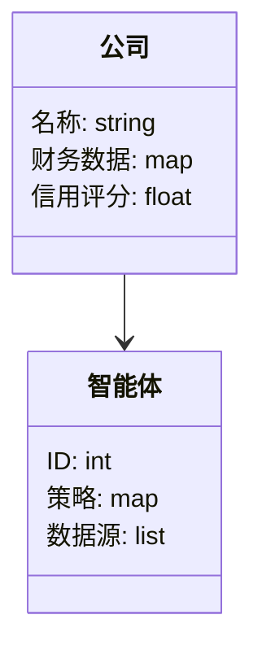
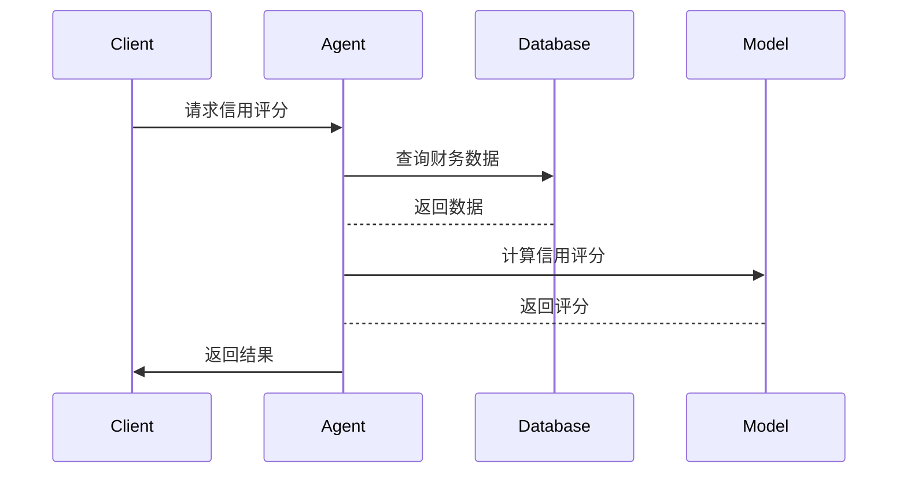

                 


# AI多智能体在价值投资中的信用风险分析

> 关键词：AI多智能体、信用风险分析、价值投资、算法原理、系统架构

> 摘要：本文探讨AI多智能体技术在信用风险分析中的应用，特别是其在价值投资中的重要性。通过详细分析AI多智能体的核心概念、算法原理和系统架构，结合实际案例，展示如何利用该技术提升信用风险评估的效率和准确性。

---

# 第一部分: AI多智能体与信用风险分析背景介绍

## 第1章: AI多智能体与信用风险分析概述

### 1.1 问题背景与描述

#### 1.1.1 信用风险分析的定义与重要性
信用风险分析是评估借款人或交易对手无法履行其债务义务的可能性。在价值投资中，准确的信用风险分析可以帮助投资者识别高风险投资标的，避免潜在的财务损失。

#### 1.1.2 价值投资中的信用风险问题
价值投资强调长期持有的优质资产，但其内在风险（如企业财务状况恶化）可能导致投资损失。传统的信用风险分析依赖于历史数据和静态模型，难以捕捉动态市场中的复杂风险因素。

#### 1.1.3 AI多智能体技术的应用潜力
AI多智能体通过分布式协作和实时数据处理，能够捕捉市场中的多维信息，提供更精准的信用风险评估。其在价值投资中的应用，可以显著提升风险分析的深度和广度。

### 1.2 AI多智能体的基本概念

#### 1.2.1 多智能体系统的定义
多智能体系统是指由多个自主或协作的智能体组成的系统，每个智能体具有一定的感知、决策和执行能力。这些智能体通过交互和协作，共同完成复杂任务。

#### 1.2.2 多智能体的核心特征
- **自主性**：智能体能够独立决策和行动。
- **反应性**：能够实时感知环境变化并做出反应。
- **协作性**：通过通信和协调完成共同目标。
- **分布性**：智能体之间分布式处理任务，避免单点故障。

#### 1.2.3 多智能体与传统单智能体的区别
| 特性 | 多智能体 | 单智能体 |
|------|----------|----------|
| 决策 | 分布式 | 集中式 |
| 灵活性 | 高 | 低 |
| 并行性 | 高 | 低 |

### 1.3 信用风险分析的核心要素

#### 1.3.1 信用风险的构成要素
信用风险由借款人的还款能力和还款意愿决定，涉及财务状况、市场环境、行业周期等多个因素。

#### 1.3.2 信用评分模型的基本原理
信用评分模型通过分析历史数据，评估借款人的信用风险等级。常用的模型包括逻辑回归、决策树和神经网络等。

#### 1.3.3 信用风险分析的边界与外延
信用风险分析不仅关注单个资产的风险，还需考虑其对整个投资组合的影响。多智能体技术能够帮助分析这些复杂关系。

## 1.4 本章小结
本章介绍了AI多智能体和信用风险分析的基本概念，并探讨了它们在价值投资中的潜在应用。多智能体系统通过协作和分布式处理，为信用风险分析提供了新的思路。

---

# 第二部分: 核心概念与联系

## 第2章: AI多智能体与信用风险分析的核心概念

### 2.1 核心概念原理

#### 2.1.1 多智能体协作机制
多智能体通过通信协议共享信息，协调各自的行动以实现共同目标。协作机制包括任务分配、信息共享和决策协商。

#### 2.1.2 信用风险分析的数学模型
信用风险分析通常使用概率模型，如：
$$ P(违约 | 财务特征) = \frac{e^{b x}}{1 + e^{b x}} $$
其中，$x$ 是财务特征向量，$b$ 是模型参数。

### 2.2 核心概念属性特征对比表
| 概念 | 属性 | 特征 |
|------|------|------|
| AI多智能体 | 分布式 | 各智能体独立决策 |
| 信用风险分析 | 集中式 | 依赖整体数据评估 |

### 2.3 ER实体关系图
```mermaid
erd
  entity 公司 {
    key: 名称
    attribute: 信用评分
    attribute: 财务数据
  }
  entity 智能体 {
    key: ID
    attribute: 策略
    attribute: 数据源
  }
  公司 -[拥有]-> 智能体
```

## 2.4 本章小结
本章详细讲解了AI多智能体与信用风险分析的核心概念，并通过对比表和ER图展示了它们的内在联系。

---

# 第三部分: 算法原理讲解

## 第3章: AI多智能体协作算法

### 3.1 算法原理

#### 3.1.1 多智能体协作的基本流程
1. 智能体感知环境并收集数据。
2. 各智能体通过通信协议共享信息。
3. 协作决策并执行行动。
4. 反馈结果并更新模型。

#### 3.1.2 联合学习机制
联合学习通过分布式训练提升模型性能，避免数据孤岛问题。

#### 3.1.3 跨智能体通信协议
通信协议定义智能体之间的信息交换格式和规则，确保协作的有效性。

### 3.2 算法实现

#### 3.2.1 算法流程图


#### 3.2.2 Python源代码实现
```python
class Agent:
    def __init__(self, id):
        self.id = id
        self.strategy = None
    def communicate(self, other_agent):
        self.strategy = self.strategy + other_agent.strategy
```

#### 3.2.3 算法的数学模型和公式
多智能体协作算法的数学模型可以表示为：
$$ S = \sum_{i=1}^{n} s_i $$
其中，$S$ 是总策略，$s_i$ 是第 $i$ 个智能体的策略。

### 3.3 本章小结
本章详细讲解了AI多智能体协作算法的原理和实现方式，并通过流程图和代码示例展示了其具体应用。

---

# 第四部分: 系统分析与架构设计方案

## 第4章: 系统分析与架构设计

### 4.1 问题场景介绍
在价值投资中，信用风险分析需要处理大量异构数据源，包括财务报表、市场数据和新闻资讯。

### 4.2 系统功能设计

#### 4.2.1 领域模型


### 4.3 系统架构设计

#### 4.3.1 系统架构图


### 4.4 系统接口设计

#### 4.4.1 接口描述
- `get_credit_score(company)`：获取公司信用评分。
- `update_strategy(agent)`：更新智能体策略。

### 4.5 系统交互流程图


## 4.6 本章小结
本章通过系统架构图和交互流程图展示了AI多智能体信用风险分析系统的整体设计。

---

# 第五部分: 项目实战

## 第5章: 项目实战

### 5.1 环境安装
安装必要的库，如`numpy`、`pandas`和`scikit-learn`。

### 5.2 系统核心实现源代码
```python
class CreditRiskAnalyzer:
    def __init__(self, agents):
        self.agents = agents
        self.models = {}
    
    def analyze(self, company):
        for agent in self.agents:
            data = agent.request_data(company)
            score = agent.analyze(data)
            self.models[agent.id] = score
        return self.combine_scores()
    
    def combine_scores(self):
        return sum(self.models.values()) / len(self.models)
```

### 5.3 实际案例分析
分析某公司的信用风险，利用多个智能体的协作结果，得到更准确的评分。

### 5.4 项目总结
通过项目实战，展示了AI多智能体技术在信用风险分析中的实际应用价值。

---

# 第六部分: 最佳实践

## 第6章: 最佳实践

### 6.1 小结
AI多智能体技术为信用风险分析提供了新的思路，通过协作和分布式处理提升了分析效率和准确性。

### 6.2 注意事项
- 确保智能体之间的通信安全。
- 定期更新模型以适应市场变化。
- 处理异构数据源时，需做好数据清洗和预处理。

### 6.3 拓展阅读
建议阅读相关领域的最新研究论文和书籍，深入了解多智能体系统的前沿技术。

---

# 作者
作者：AI天才研究院/AI Genius Institute  
作者：禅与计算机程序设计艺术/Zen And The Art of Computer Programming

