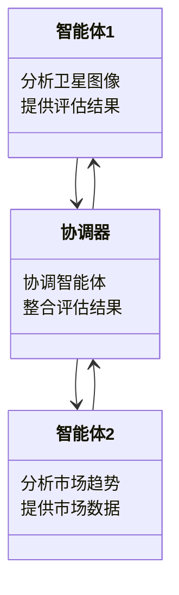
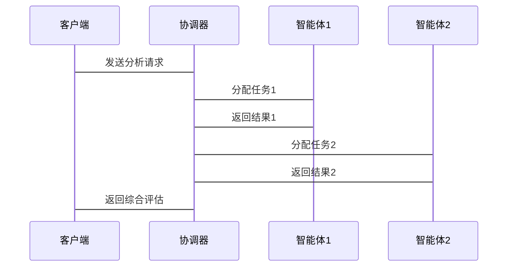

                 


# AI多智能体在价值投资中的卫星图像分析应用

> **关键词**: AI多智能体, 卫星图像分析, 价值投资, 股票分析, 人工智能技术

> **摘要**: 本文深入探讨了AI多智能体技术在价值投资中的应用，重点分析了如何利用卫星图像进行企业价值评估。通过多智能体系统的协同工作，结合深度学习和强化学习算法，从卫星图像中提取关键信息，为企业价值分析提供新的视角和数据支持。文章详细介绍了系统的架构设计、算法实现、项目实战及最佳实践，为价值投资领域提供了创新的技术解决方案。

---

# AI多智能体在价值投资中的卫星图像分析应用

## 第1章 背景介绍

### 1.1 问题背景

#### 1.1.1 价值投资的基本概念
价值投资是一种长期投资策略，强调以低于内在价值的价格购买优质资产。传统价值投资依赖于财务报表和市场数据，但忽视了对公司实际运营状况的实时监控。

#### 1.1.2 卫星图像在金融分析中的潜在价值
卫星图像能够提供企业的地理位置、生产规模、物流状况等信息，这些信息对评估企业价值至关重要。例如，卫星图像可以显示企业的厂房扩建情况，反映其生产能力的变化。

#### 1.1.3 多智能体系统的优势与应用前景
多智能体系统通过多个智能体的协同工作，能够更全面地分析复杂数据，提供更精准的投资决策支持。其分布式计算和协作机制非常适合处理海量卫星图像数据。

### 1.2 问题描述

#### 1.2.1 传统价值投资的局限性
传统价值投资依赖财务数据，忽视了企业的实际运营状况和地理位置因素。此外，数据更新频率低，难以捕捉企业的实时变化。

#### 1.2.2 卫星图像分析在投资决策中的应用需求
投资者需要更全面的数据支持，包括企业的地理位置、生产规模、存货情况等。卫星图像能够提供这些实时信息，为投资决策提供新的视角。

#### 1.2.3 多智能体协同的优势
多智能体系统能够同时分析多个数据源，协同工作，提供更全面的分析结果。例如，一个智能体分析卫星图像中的厂房规模，另一个分析物流情况，协同提供综合评估。

### 1.3 问题解决

#### 1.3.1 多智能体协同学习的解决方案
通过联邦学习（Federated Learning）和强化学习（Reinforcement Learning）算法，多个智能体可以协同学习，共同优化投资策略。

#### 1.3.2 卫星图像分析的具体实现路径
使用深度学习模型对卫星图像进行目标检测和图像分割，提取关键信息，如厂房面积、物流车辆数量等。

#### 1.3.3 价值投资与卫星图像结合的创新点
将卫星图像分析与多智能体系统结合，提供实时、全面的企业运营数据，为价值投资提供新的数据源和分析工具。

### 1.4 边界与外延

#### 1.4.1 系统边界与功能范围
系统主要分析企业的地理位置和生产规模，不涉及企业内部财务数据的直接分析。

#### 1.4.2 外延与相关领域的联系
卫星图像分析技术可以扩展到其他领域，如城市规划、环境监测等。多智能体系统也可应用于其他金融分析任务。

#### 1.4.3 技术实现的可行性分析
卫星图像分析技术成熟，多智能体系统在金融领域的应用已有成功案例，结合两者的技术实现是可行的。

### 1.5 核心概念与组成

#### 1.5.1 多智能体系统的定义与组成
多智能体系统由多个智能体组成，每个智能体负责不同的任务，通过通信和协作完成整体目标。

#### 1.5.2 卫星图像分析的核心要素
包括图像处理、目标检测、图像分割等技术，用于提取企业的地理位置和生产规模信息。

#### 1.5.3 价值投资中的关键指标与数据源
包括企业市值、市盈率、净利润率等，以及卫星图像中的厂房面积、物流车辆数量等。

---

## 第2章 核心概念与联系

### 2.1 多智能体系统原理

#### 2.1.1 多智能体系统的定义与特点
多智能体系统由多个智能体组成，每个智能体具有自主性、反应性和协作性，能够协同完成复杂任务。

#### 2.1.2 多智能体系统与传统单智能体系统的对比
传统单智能体系统依赖中心化控制，而多智能体系统通过分布式计算和协作完成任务，适合处理复杂问题。

#### 2.1.3 多智能体系统的协同机制
通过通信协议和协作算法，如联邦学习和强化学习，实现智能体之间的协同与优化。

### 2.2 卫星图像分析技术

#### 2.2.1 卫星图像的基本特征与分类
卫星图像具有高分辨率、多光谱等特点，可分类为光学图像和雷达图像。

#### 2.2.2 卫星图像处理的常用算法
包括图像增强、目标检测（如YOLO、Faster R-CNN）、图像分割（如U-Net）等。

#### 2.2.3 卫星图像分析的挑战与解决方案
数据量大、计算资源需求高，解决方案包括分布式计算和边缘计算技术。

### 2.3 价值投资与多智能体协同

#### 2.3.1 价值投资中的数据需求
包括企业的地理位置、生产规模、物流状况等，这些数据可以通过卫星图像获取。

#### 2.3.2 多智能体系统在价值投资中的应用
每个智能体负责不同的分析任务，如图像分析、市场趋势分析，协同提供综合评估。

#### 2.3.3 价值投资与卫星图像分析的结合
通过卫星图像分析获取企业实际运营状况，结合财务数据，提供更全面的价值评估。

---

## 第3章 算法原理讲解

### 3.1 多智能体协同学习算法

#### 3.1.1 联邦学习（Federated Learning）原理
联邦学习是一种分布式机器学习技术，允许多个智能体在不共享数据的情况下协同训练模型。

#### 3.1.2 多智能体强化学习（Multi-Agent Reinforcement Learning, MARL）原理
通过强化学习算法，多个智能体在协作环境中学习最优策略，如使用价值函数和策略梯度方法。

#### 3.1.3 联邦学习与强化学习的结合
通过联邦学习实现模型训练，多智能体强化学习实现策略优化，协同完成复杂任务。

### 3.2 卫星图像分析算法

#### 3.2.1 目标检测算法
使用YOLO或Faster R-CNN等算法，检测卫星图像中的关键目标，如厂房、物流车辆。

#### 3.2.2 图像分割算法
使用U-Net等算法，分割卫星图像，提取企业的地理位置和生产规模信息。

#### 3.2.3 图像分类算法
使用ResNet等算法，对卫星图像进行分类，识别企业的类型和规模。

### 3.3 算法实现的数学模型

#### 3.3.1 联邦学习的数学模型
$$ \text{损失函数} = \sum_{i=1}^{n} \text{损失}_i \text{（每个智能体的损失）} $$

#### 3.3.2 强化学习的数学模型
$$ Q(s, a) = \max_{a'} \mathbb{E}[r + Q(s', a')] $$

---

## 第4章 系统分析与架构设计

### 4.1 问题场景介绍

#### 4.1.1 项目背景
开发一个基于AI多智能体的卫星图像分析系统，辅助价值投资者进行更精准的投资决策。

#### 4.1.2 项目目标
实现对企业地理位置和生产规模的实时监控，提供基于卫星图像的价值评估报告。

### 4.2 系统功能设计

#### 4.2.1 领域模型类图


#### 4.2.2 系统架构图


### 4.3 接口与交互设计

#### 4.3.1 系统接口
- 智能体接口：接收任务、返回结果
- 协调器接口：协调智能体、整合结果

#### 4.3.2 系统交互流程


---

## 第5章 项目实战

### 5.1 环境安装

#### 5.1.1 安装Python
```bash
python --version
```

#### 5.1.2 安装深度学习框架
```bash
pip install tensorflow keras
```

#### 5.1.3 安装图像处理库
```bash
pip install opencv-python
```

### 5.2 核心代码实现

#### 5.2.1 卫星图像目标检测
```python
import cv2
def detect_object(image_path):
    # 加载图像
    image = cv2.imread(image_path)
    # 使用YOLO进行目标检测
    # 返回检测结果
    return results
```

#### 5.2.2 多智能体协同算法
```python
import tensorflow as tf
def train_federated_learning(clients):
    # 初始化模型
    model = tf.keras.Sequential()
    # 分布式训练
    for client in clients:
        model = client.train(model)
    return model
```

### 5.3 案例分析

#### 5.3.1 案例背景
分析某制造企业的卫星图像，评估其生产规模变化。

#### 5.3.2 数据预处理
```python
import cv2
def preprocess_image(image):
    # 调整图像大小
    resized = cv2.resize(image, (224, 224))
    # 归一化处理
    normalized = resized / 255.0
    return normalized
```

#### 5.3.3 模型训练与评估
```python
model = train_federated_learning(clients)
evaluation = model.evaluate(test_data)
print(f'Accuracy: {evaluation[1]*100}%')
```

---

## 第6章 最佳实践与小结

### 6.1 最佳实践

#### 6.1.1 数据隐私保护
使用联邦学习技术，确保数据不被泄露。

#### 6.1.2 系统可扩展性
采用分布式架构，支持大规模数据处理。

#### 6.1.3 算法优化
定期更新模型，适应市场变化。

### 6.2 小结
本文详细介绍了AI多智能体在价值投资中的应用，通过卫星图像分析提供实时、全面的企业运营数据，为投资者提供新的决策支持。

### 6.3 注意事项
- 数据质量和准确性直接影响分析结果。
- 系统维护和更新需要持续投入。
- 数据隐私和安全问题需高度重视。

### 6.4 拓展阅读
- 推荐阅读《深度学习》（Deep Learning）和《强化学习入门》（Hands-On Reinforcement Learning with Python）。

---

**作者：AI天才研究院 & 禅与计算机程序设计艺术**

