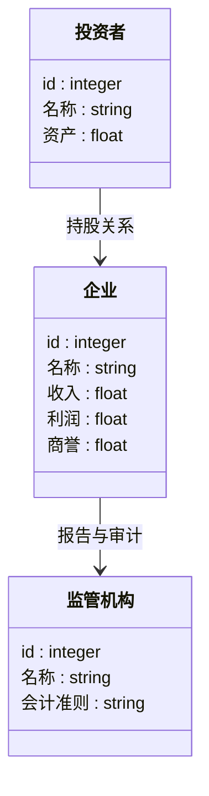
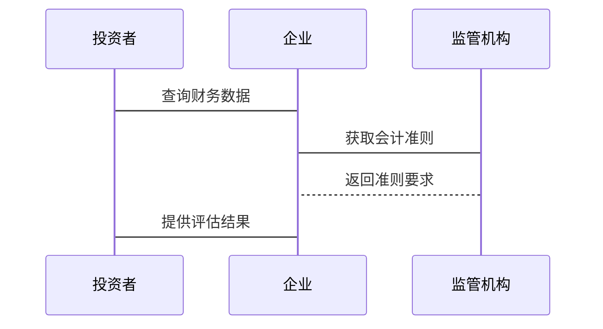

                 


# AI多智能体在价值投资中的商誉减值风险分析

**关键词：** AI多智能体，商誉减值，价值投资，风险分析，强化学习

**摘要：**  
本文探讨了AI多智能体系统在价值投资中的商誉减值风险分析的应用。通过分析商誉减值的基本概念、多智能体系统的原理，以及结合强化学习和博弈论的算法，本文详细阐述了如何利用AI技术提高商誉减值风险的预测和管理能力。文章还通过项目实战展示了系统的实现过程，并提出了实际应用中的最佳实践。

---

## 第一部分：AI多智能体在价值投资中的商誉减值风险分析基础

### 第1章：商誉减值风险与价值投资背景

#### 1.1 商誉减值风险的定义与重要性
##### 1.1.1 商誉的定义与会计处理
商誉是企业在收购其他公司时，支付的价格超过被收购公司净资产公允价值的部分。会计上，商誉需要定期进行减值测试，如果可收回金额低于账面价值，则需要计提减值准备。

##### 1.1.2 商誉减值的概念与计算方法
商誉减值是指由于市场环境变化、被收购公司业绩不佳等原因，导致商誉的账面价值超过其可收回金额。计算方法通常涉及对未来现金流的预测和折现率的确定。

##### 1.1.3 商誉减值对价值投资的影响
商誉减值直接影响企业的财务状况和市场价值，投资者需要准确评估商誉减值风险，以做出明智的投资决策。

#### 1.2 多智能体系统在金融领域的应用背景
##### 1.2.1 多智能体系统的定义与特点
多智能体系统由多个相互作用的智能体组成，每个智能体能够感知环境、自主决策并协同工作，具有分布式计算和自适应性等特点。

##### 1.2.2 多智能体系统在金融分析中的优势
多智能体系统能够同时处理多个信息源，进行实时数据分析和预测，提供更准确的决策支持。

##### 1.2.3 价值投资与商誉减值风险的关联性
价值投资注重长期价值，商誉减值风险分析是评估企业内在价值的重要部分，AI多智能体系统能够帮助投资者更准确地预测和管理这种风险。

#### 1.3 本章小结
本章介绍了商誉减值的基本概念、计算方法及其对价值投资的影响，同时探讨了多智能体系统在金融领域的应用背景及其优势。

---

### 第2章：AI多智能体系统的核心概念与联系

#### 2.1 商誉减值风险分析的核心概念
##### 2.1.1 商誉减值风险的关键要素
包括市场环境、企业财务状况、行业竞争状况等因素。

##### 2.1.2 价值投资中的关键指标
如市盈率、市净率、ROE等，这些指标帮助投资者评估企业的内在价值。

##### 2.1.3 多智能体系统在风险分析中的角色
通过分布式计算和协同决策，多智能体系统能够提高风险分析的准确性和效率。

#### 2.2 AI多智能体系统的原理与属性
##### 2.2.1 多智能体系统的组成结构
包括智能体、环境、通信机制等组成部分。

##### 2.2.2 AI智能体的决策机制
基于强化学习和博弈论，智能体能够根据环境反馈优化决策。

##### 2.2.3 系统的可扩展性与适应性
多智能体系统能够灵活扩展，适应不同的市场环境和数据规模。

#### 2.3 商誉减值风险分析的ER实体关系图
```mermaid
erDiagram
    投资者 //----------------------------------------------------------------
    + id : integer
    + 名称 : string
    + 资产 : float
    + 负债 : float
    + 所有者权益 : float

    企业 //----------------------------------------------------------------
    + id : integer
    + 名称 : string
    + 收入 : float
    + 成本 : float
    + 利润 : float
    + 商誉 : float

    监管机构 //----------------------------------------------------------------
    + id : integer
    + 名称 : string
    + 会计准则 : string
    + 审计标准 : string
    + 报告要求 : string

    投资者 --> 企业 : 持股关系
    企业 --> 监管机构 : 报告与审计
```

#### 2.4 本章小结
本章详细探讨了商誉减值风险分析的核心概念及其与AI多智能体系统的联系，并通过ER图展示了各实体之间的关系。

---

### 第3章：AI多智能体系统的算法原理

#### 3.1 强化学习在商誉减值风险分析中的应用
##### 3.1.1 强化学习的基本原理
强化学习通过智能体与环境的交互，学习最优策略。智能体通过状态、动作和奖励的循环不断优化决策。

##### 3.1.2 多智能体强化学习的框架
采用分布式多智能体框架，每个智能体负责特定任务，协同完成复杂的风险分析。

##### 3.1.3 算法在风险分析中的实现步骤
1. 状态表示：提取企业的财务指标和市场数据。
2. 动作选择：基于当前状态，选择最优投资动作。
3. 奖励机制：根据投资结果给予奖励或惩罚。

#### 3.2 博弈论与多智能体系统的结合
##### 3.2.1 博弈论的基本概念
涉及局中人、策略、收益等，分析各方利益冲突与合作。

##### 3.2.2 多智能体系统中的博弈模型
构建博弈模型，模拟市场中的竞争与合作，优化投资决策。

##### 3.2.3 算法的数学模型与公式
$$ V(s) = \max_a \min_b \{ R(s, a, b) \} $$
其中，\( V(s) \) 表示在状态 \( s \) 下的最大收益，\( a \) 和 \( b \) 分别表示两个智能体的动作。

#### 3.3 算法的实现与优化
通过强化学习和博弈论的结合，优化多智能体系统的决策过程，提高商誉减值风险的预测精度。

#### 3.4 本章小结
本章详细阐述了AI多智能体系统中强化学习和博弈论的应用，通过数学模型和算法流程图展示了实现步骤。

---

### 第4章：系统架构设计与实现

#### 4.1 系统功能设计
##### 4.1.1 领域模型设计
使用mermaid类图展示系统各模块及其关系。


##### 4.1.2 功能模块划分
包括数据采集、风险评估、决策优化等模块。

#### 4.2 系统架构设计
##### 4.2.1 分层架构
将系统分为数据层、业务逻辑层和应用层，便于模块化开发和维护。

##### 4.2.2 系统交互流程
使用mermaid序列图展示系统的交互过程。


#### 4.3 接口设计与实现
定义RESTful API接口，实现数据的交互和系统的集成。

#### 4.4 本章小结
本章通过系统架构设计和实现，展示了如何构建一个高效的AI多智能体系统，用于商誉减值风险分析。

---

### 第5章：项目实战与案例分析

#### 5.1 项目环境安装与配置
安装必要的Python库，如TensorFlow、Keras和Scikit-learn，搭建开发环境。

#### 5.2 核心代码实现
##### 5.2.1 数据预处理
读取企业财务数据和市场数据，进行清洗和特征提取。
```python
import pandas as pd

data = pd.read_csv('financial_data.csv')
data = data.dropna()
```

##### 5.2.2 模型训练
基于强化学习算法，训练AI多智能体模型。
```python
from tensorflow.keras import models, layers

model = models.Sequential()
model.add(layers.Dense(64, activation='relu', input_shape=(input_dim,)))
model.add(layers.Dense(1, activation='linear'))
model.compile(optimizer='adam', loss='mse')
model.fit(X_train, y_train, epochs=100, batch_size=32)
```

##### 5.2.3 模型评估
使用测试数据评估模型的准确性和稳定性。

#### 5.3 实际案例分析
通过具体案例，展示模型在商誉减值风险分析中的应用效果。

#### 5.4 本章小结
本章通过项目实战，详细讲解了AI多智能体系统在商誉减值风险分析中的实现过程，并通过案例展示了其实际应用效果。

---

### 第6章：最佳实践与小结

#### 6.1 最佳实践
##### 6.1.1 数据质量的重要性
确保数据的准确性和完整性，提高模型的预测精度。

##### 6.1.2 模型调优与优化
通过参数调节和算法优化，提升系统的性能和效率。

##### 6.1.3 系统维护与更新
定期更新模型，适应市场环境的变化，确保系统的持续有效性。

#### 6.2 本章小结
总结全文内容，强调AI多智能体系统在商誉减值风险分析中的重要性，并指出未来的研究方向和应用前景。

---

**作者：AI天才研究院 & 禅与计算机程序设计艺术**

