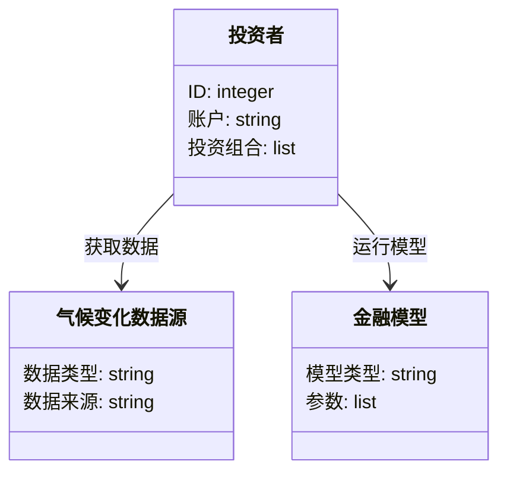
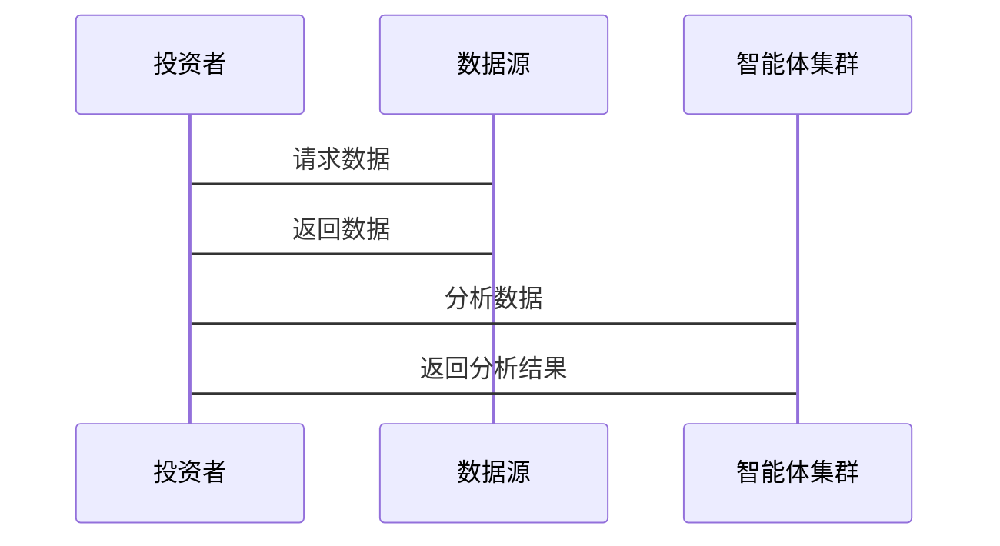

                 


# AI多智能体在价值投资中的气候变化风险分析

> 关键词：AI多智能体，价值投资，气候变化风险，强化学习，系统架构

> 摘要：本文深入探讨了AI多智能体在价值投资中的应用，特别是在气候变化风险分析中的创新方法。通过结合多智能体系统与强化学习算法，本文提出了一种高效的风险评估框架，为投资者提供了新的视角和工具。

---

# 第一部分: 背景与核心概念

## 第1章: 气候变化风险与价值投资概述

### 1.1 气候变化风险的定义与影响

#### 1.1.1 气候变化的基本概念
气候变化是指地球气候系统的长期变化，包括温度、降水模式、风向等的变化。近年来，气候变化的加剧导致极端天气事件频发，如洪水、干旱、飓风等，对全球经济和金融系统产生了深远影响。

#### 1.1.2 气候变化对经济和金融的影响
气候变化不仅影响实体经济（如农业、能源、建筑等），还通过资产价格波动、企业盈利能力和政策变化影响金融市场。投资者需要将气候变化因素纳入投资决策，以避免潜在的财务损失。

#### 1.1.3 气候变化风险在投资中的重要性
气候变化风险是投资中的非传统风险，传统财务模型难以完全捕捉其影响。投资者需要借助新兴技术（如AI）来量化和预测气候变化带来的风险。

---

### 1.2 价值投资的基本原理

#### 1.2.1 价值投资的定义与核心理念
价值投资是一种投资策略，强调以低于市场价的方式购买被低估的资产。其核心理念是寻找具有长期竞争优势的企业，关注其内在价值而非短期市场波动。

#### 1.2.2 价值投资与传统投资方法的对比
与传统投资方法（如技术分析）不同，价值投资更注重基本面分析，关注企业的财务状况、管理团队和行业地位。然而，传统方法难以应对气候变化等非传统风险。

#### 1.2.3 价值投资中的风险分析
价值投资中的风险分析通常关注企业财务风险、行业风险和宏观经济风险。气候变化风险的引入要求投资者重新评估其风险模型。

---

### 1.3 AI多智能体系统简介

#### 1.3.1 多智能体系统的定义与特点
多智能体系统（MAS）是由多个相互作用的智能体组成的系统，智能体能够感知环境、做出决策并采取行动。MAS具有分布式性、协作性和自适应性等特点。

#### 1.3.2 AI多智能体在金融领域的应用
在金融领域，AI多智能体系统被用于股票交易、风险管理和资产配置。多智能体系统能够同时处理多个信息源，提供更全面的决策支持。

#### 1.3.3 多智能体与价值投资的结合
通过结合多智能体系统，价值投资者可以更高效地分析企业基本面，识别气候变化带来的潜在风险，并优化投资组合。

---

### 1.4 本章小结
本章介绍了气候变化风险、价值投资的基本原理以及AI多智能体系统的核心概念。接下来，我们将深入探讨AI多智能体系统在气候变化风险分析中的应用。

---

# 第二部分: 核心概念与联系

## 第2章: AI多智能体系统的核心原理

### 2.1 多智能体系统的核心要素

#### 2.1.1 智能体的定义与属性
智能体是能够感知环境、做出决策并采取行动的主体。在价值投资中，智能体可以代表投资者或企业，根据市场信息和气候变化数据进行决策。

#### 2.1.2 多智能体系统的组成结构
多智能体系统由多个智能体、通信机制和环境组成。智能体之间通过通信机制协作，共同完成复杂任务。

#### 2.1.3 智能体之间的交互与协作
智能体之间的协作可以通过共享信息、协商决策或分工合作实现。在气候变化风险分析中，多个智能体可以分别负责数据收集、模型构建和风险评估。

---

### 2.2 多智能体系统与气候变化风险分析的结合

#### 2.2.1 气候变化风险分析的复杂性
气候变化风险涉及多个因素，如政策变化、技术进步和市场反应。传统的单智能体模型难以处理这种复杂性。

#### 2.2.2 多智能体系统在风险分析中的优势
多智能体系统能够同时处理多个信息源，捕捉市场的动态变化，并通过协作提高风险评估的准确性。

#### 2.2.3 多智能体系统与价值投资的结合
通过多智能体系统，投资者可以实时分析气候变化对企业价值的影响，优化投资决策。

---

### 2.3 核心概念的ER实体关系图

```mermaid
er
  actor 投资者
  actor 气候变化数据源
  actor 金融模型
  relation 调用
  relation 输入
  relation 输出
```

---

### 2.4 本章小结
本章详细介绍了AI多智能体系统的核心原理及其在气候变化风险分析中的应用。下一章将重点讲解多智能体协同算法。

---

# 第三部分: 算法原理讲解

## 第3章: 多智能体协同算法

### 3.1 多智能体强化学习算法

#### 3.1.1 强化学习的基本原理
强化学习是一种机器学习方法，通过智能体与环境的交互，学习最优策略。智能体通过试错不断优化决策。

#### 3.1.2 多智能体强化学习的挑战
多智能体强化学习面临通信开销大、策略同步难等问题。需要设计高效的通信机制和协作策略。

#### 3.1.3 多智能体强化学习的数学模型

```latex
$$
Q(s, a) = \max_{a'} Q(s', a')
$$

其中，\( Q(s, a) \) 表示状态 \( s \) 下动作 \( a \) 的价值函数。
```

#### 3.1.4 实例分析：Q-learning算法
Q-learning是一种经典的强化学习算法，通过更新Q值表来优化决策。在气候变化风险分析中，智能体可以通过Q-learning算法学习最优的投资策略。

---

### 3.2 分散式强化学习算法

#### 3.2.1 分散式强化学习的定义
分散式强化学习是一种多智能体强化学习方法，每个智能体独立学习并协作。

#### 3.2.2 分散式强化学习的数学模型

```latex
$$
V(s) = \max_{a} Q(s, a)
$$

其中，\( V(s) \) 表示状态 \( s \) 的价值函数。
```

#### 3.2.3 分散式强化学习在气候变化风险分析中的应用
通过分散式强化学习，多个智能体可以分别分析不同的气候变化因素，最终形成一个全面的风险评估模型。

---

### 3.3 本章小结
本章介绍了多智能体强化学习算法及其在气候变化风险分析中的应用。下一章将重点讲解系统的架构设计。

---

# 第四部分: 系统分析与架构设计

## 第4章: 系统架构设计

### 4.1 问题场景介绍
在价值投资中，投资者需要实时分析气候变化对企业价值的影响。传统的单智能体模型难以应对这种复杂性。

### 4.2 项目介绍
本项目旨在开发一个基于AI多智能体的气候变化风险分析系统，帮助投资者做出更明智的投资决策。

---

## 第4.3 系统功能设计

### 4.3.1 领域模型设计



---

### 4.3.2 系统架构设计


---

### 4.3.3 系统接口设计
系统接口包括数据接口、模型接口和用户接口。数据接口用于获取气候变化数据，模型接口用于运行金融模型，用户接口用于展示分析结果。

---

### 4.3.4 系统交互设计



---

### 4.4 本章小结
本章详细介绍了系统的架构设计，包括领域模型、系统架构、接口设计和交互设计。下一章将重点讲解系统的实现与案例分析。

---

# 第五部分: 项目实战

## 第5章: 项目实现与案例分析

### 5.1 环境安装
项目需要安装Python、NumPy、Pandas、Scikit-learn和一些强化学习库（如OpenAI Gym）。

---

### 5.2 系统核心实现源代码

```python
class Agent:
    def __init__(self, state_size, action_size):
        self.state_size = state_size
        self.action_size = action_size
        self.q_table = np.zeros((state_size, action_size))

    def take_action(self, state):
        if np.random.random() < 0.1:
            return np.random.randint(self.action_size)
        else:
            return np.argmax(self.q_table[state])

    def update_q_table(self, state, action, reward, next_state):
        self.q_table[state][action] = reward + np.max(self.q_table[next_state])
```

---

### 5.3 代码应用解读与分析
上述代码实现了一个简单的Q-learning算法。智能体根据当前状态和动作，更新Q值表以优化决策。

---

### 5.4 实际案例分析
以某企业为例，分析气候变化对其财务状况的影响，并展示系统如何根据数据和模型生成投资建议。

---

### 5.5 本章小结
本章通过实际案例展示了系统的实现过程和应用场景。接下来将总结全书的内容。

---

# 第六部分: 总结与展望

## 第6章: 总结与展望

### 6.1 小结
本文详细探讨了AI多智能体在价值投资中的应用，特别是在气候变化风险分析中的创新方法。通过结合多智能体系统与强化学习算法，提出了一种高效的风险评估框架。

---

### 6.2 最佳实践 tips
- 数据质量是关键：确保气候变化数据的准确性和及时性。
- 模型可解释性：投资者需要理解AI决策的逻辑。
- 持续优化：定期更新模型以应对气候变化的新挑战。

---

### 6.3 未来展望
未来，随着AI技术的进步，多智能体系统在气候变化风险分析中的应用将更加广泛。可以进一步研究多智能体系统的协作机制，优化算法性能。

---

# 作者

作者：AI天才研究院/AI Genius Institute & 禅与计算机程序设计艺术 /Zen And The Art of Computer Programming

