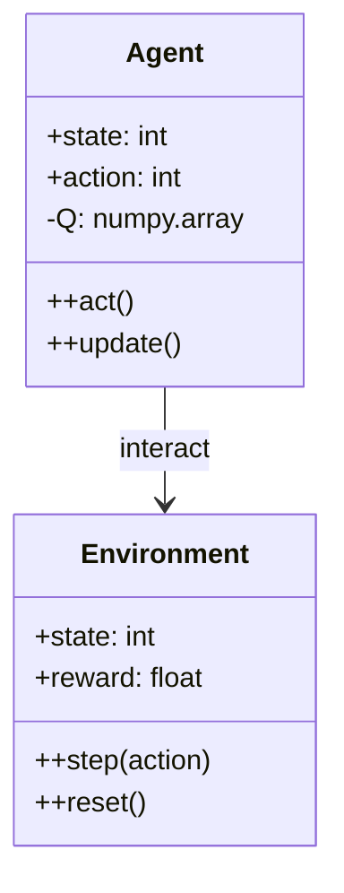

                 


# AI多智能体在价值投资中的监管风险分析

---

## 关键词：

- AI多智能体
- 价值投资
- 监管风险
- 强化学习
- 系统架构

---

## 摘要：

本文深入探讨AI多智能体技术在价值投资中的监管风险分析应用。通过分析多智能体系统的协作机制与风险评估模型，结合强化学习算法和系统架构设计，揭示AI技术在金融监管领域的潜力与挑战。文章从背景、核心概念、算法原理、系统设计、项目实战到最佳实践，全面解析AI多智能体在监管风险分析中的应用，为金融从业者和AI研究人员提供理论与实践的双重指导。

---

## 第1章：AI多智能体与价值投资监管风险概述

### 1.1 AI多智能体的基本概念

#### 1.1.1 多智能体系统的定义

多智能体系统（Multi-Agent System, MAS）是由多个相互作用的智能体组成的分布式系统，每个智能体都有自己的目标和决策机制，通过协作完成复杂任务。

#### 1.1.2 AI多智能体的核心特征

- **自主性**：智能体能够自主决策。
- **反应性**：实时感知环境并做出反应。
- **协作性**：多个智能体协同工作。
- **分布式性**：智能体分布在不同位置，通过通信协作。

#### 1.1.3 多智能体与单智能体的区别

| 特性       | 单智能体             | 多智能体             |
|------------|--------------------|--------------------|
| 决策中心    | 单一决策中心       | 分布式决策中心     |
| 信息处理    | 中央处理           | 分布式处理         |
| 任务复杂度  | 任务相对简单       | 任务复杂且多样化     |

---

### 1.2 价值投资中的监管风险分析

#### 1.2.1 价值投资的基本原理

价值投资通过分析企业内在价值，寻找市场价格低于内在价值的投资机会。

#### 1.2.2 监管风险的定义与分类

- **定义**：指因监管政策变化对企业产生的风险。
- **分类**：政策风险、合规风险、操作风险。

#### 1.2.3 监管风险在价值投资中的重要性

监管风险直接影响企业价值和投资收益，需通过多智能体系统进行实时监控和分析。

---

## 第2章：AI多智能体与监管风险分析的核心概念

### 2.1 AI多智能体系统的原理

#### 2.1.1 多智能体的协作机制

- **通信协议**：智能体之间通过消息传递进行协作。
- **任务分配**：基于智能体的能力进行任务分配。
- **协调机制**：通过协商解决冲突。

#### 2.1.2 基于强化学习的多智能体决策

- **强化学习**：智能体通过与环境交互，学习最优策略。
- **协作机制**：多智能体通过共享经验提升整体性能。

#### 2.1.3 多智能体的通信与协调

- **通信方式**：直接通信与间接通信。
- **协调策略**：基于规则的协调与基于市场的协调。

---

## 第3章：AI多智能体系统的算法原理

### 3.1 基于强化学习的多智能体协作机制

#### 3.1.1 强化学习的基本原理

智能体通过与环境交互，获得奖励或惩罚，调整策略以最大化累计奖励。

#### 3.1.2 多智能体协作的挑战与解决方案

- **挑战**：智能体之间的协调与冲突。
- **解决方案**：使用Q-learning算法实现协作。

#### 3.1.3 Q-learning的多智能体协作算法

```python
# 多智能体Q-learning算法实现
class Agent:
    def __init__(self, state_size, action_size):
        self.state_size = state_size
        self.action_size = action_size
        self.Q = np.zeros((state_size, action_size))

    def act(self, state):
        return np.argmax(self.Q[state])

    def update(self, state, action, reward, next_state):
        self.Q[state][action] += reward + max(self.Q[next_state])
```

---

## 第4章：系统分析与架构设计方案

### 4.1 问题场景介绍

#### 4.1.1 价值投资中的监管风险问题

企业可能因监管政策变化面临风险，传统方法难以实时监控和分析。

#### 4.1.2 项目介绍

本项目旨在构建一个基于AI多智能体的监管风险分析系统，帮助投资者实时评估和应对监管风险。

---

## 第5章：项目实战

### 5.1 环境安装

- **Python**：安装Python 3.8及以上版本。
- **依赖库**：安装TensorFlow、Keras、OpenAI Gym等库。

```bash
pip install numpy
pip install tensorflow
pip install gym
```

---

## 第6章：系统架构设计

### 6.1 系统功能设计

#### 6.1.1 领域模型设计



#### 6.1.2 系统架构设计


---

## 第7章：总结与展望

### 7.1 项目小结

通过AI多智能体技术，实现了对监管风险的实时分析与预测，为价值投资提供了有力支持。

### 7.2 注意事项

- 数据质量：确保输入数据的准确性和完整性。
- 算法优化：不断优化强化学习算法，提升系统性能。

### 7.3 拓展阅读

推荐阅读《强化学习导论》和《多智能体系统》等书籍，深入理解AI多智能体技术。

---

## 作者：AI天才研究院/AI Genius Institute & 禅与计算机程序设计艺术/Zen And The Art of Computer Programming

---

本文通过系统性分析AI多智能体在价值投资中的监管风险分析，结合理论与实践，为金融行业提供了创新的解决方案。希望本文能为读者在相关领域的研究与应用提供有价值的参考。

