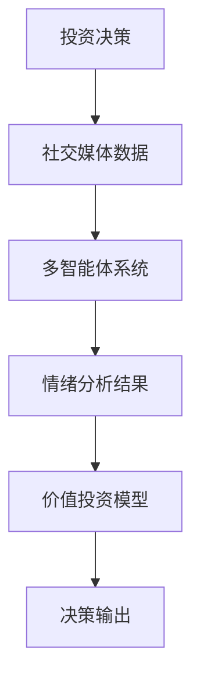
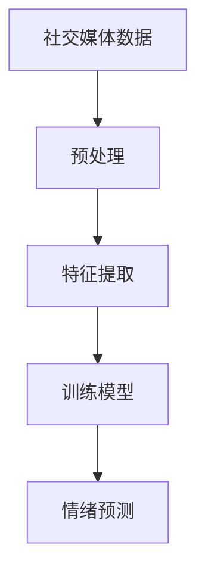
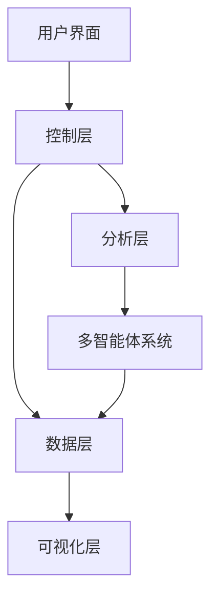
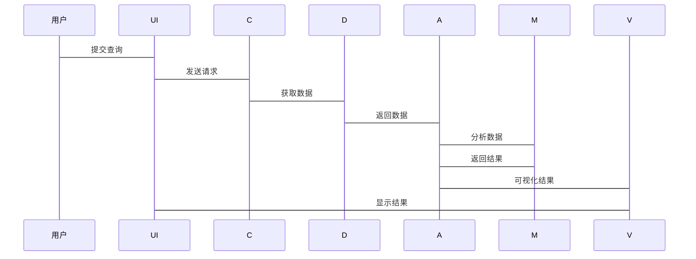

                 


# AI多智能体在价值投资中的社交媒体情绪分析应用

---

## 关键词

- AI多智能体
- 价值投资
- 社交媒体情绪分析
- 自然语言处理
- 机器学习

---

## 摘要

本文探讨AI多智能体在价值投资中的应用，特别是通过社交媒体情绪分析来辅助投资决策。文章从背景、理论、算法到系统设计和项目实战，全面解析如何利用多智能体系统分析社交媒体数据，提取情绪信息，并结合价值投资模型进行决策支持。通过详细的技术分析和案例展示，本文旨在为投资者和数据科学家提供有效的工具和方法。

---

# 第一部分：背景与概念

## 第1章：AI多智能体与价值投资概述

### 1.1 问题背景与重要性

- **价值投资的基本原理**  
  价值投资是一种长期投资策略，旨在通过分析公司的基本面来确定其内在价值。社交媒体上的信息可以帮助投资者识别市场情绪，从而辅助决策。

- **社交媒体在投资中的作用**  
  社交媒体平台（如Twitter、Reddit）成为投资者获取实时信息的重要来源。用户生成内容（UGC）反映了市场情绪，可能影响资产价格。

- **AI多智能体的优势**  
  多智能体系统能够协同工作，处理复杂任务。通过并行处理和分布式计算，多智能体可以高效分析海量社交媒体数据，捕捉情绪变化。

---

### 1.2 问题描述与解决

- **问题描述**  
  社交媒体数据量大、信息复杂，传统方法难以有效分析情绪。单一智能体难以同时处理多任务，效率低下。

- **解决方案**  
  使用AI多智能体系统，每个智能体专注于特定任务（如数据清洗、情感分类），协同完成复杂分析。

- **边界与外延**  
  本文主要关注社交媒体文本情绪分析，不涉及图像或视频数据。未来可能扩展至多模态数据处理。

---

## 第2章：核心概念与联系

### 2.1 多智能体系统

- **核心原理**  
  多智能体系统由多个智能体组成，每个智能体负责特定任务，通过通信协同完成目标。

- **智能体协作机制**  
  使用任务分配算法（如基于角色的分工）和信息共享协议（如Gossip协议）实现协作。

---

### 2.2 情绪分析

- **情感分类模型**  
  使用深度学习模型（如LSTM、Transformer）进行文本分类，识别情绪极性（正面、负面、中性）。

- **多模态分析**  
  综合文本、语音、图像等信息，提升情绪分析的准确性。

---

## 第2.3 价值投资模型

- **模型结构**  
  基于财务指标（如PE、ROE）和市场情绪（通过情绪分析获得）构建综合评分模型。

---

## 第2.4 概念对比表

| 概念        | 单智能体情绪分析 | 多智能体情绪分析 |
|-------------|------------------|------------------|
| 效率         | 低               | 高               |
| 处理能力     | 单一             | 分布式           |
| 任务处理     | 单线程           | 并行             |

---

## 第2.5 ER实体关系图



---

# 第二部分：算法原理与实现

## 第3章：情绪分析算法

### 3.1 算法流程



---

### 3.2 文本预处理

- **分词**  
  使用自然语言处理库（如NLTK、spaCy）对文本进行分词。

- **停用词处理**  
  �移除常见停用词（如“and”、“the”）。

- **词干提取**  
  使用算法（如Porter Stemmer）提取词干。

---

## 第3.3 特征提取

- **TF-IDF**  
  计算词频-逆文档频率，识别关键特征词。

- **Word2Vec**  
  将词转换为向量表示，捕捉语义信息。

---

## 第3.4 模型训练

- **机器学习模型**  
  使用SVM、随机森林等传统模型。

- **深度学习模型**  
  使用LSTM、Transformer等模型，捕捉长距离依赖关系。

---

## 第4章：多智能体协同算法

### 4.1 协作机制

- **任务分配**  
  基于智能体的能力分配任务。

- **信息共享**  
  使用共享数据库或消息队列同步信息。

---

## 4.2 智能体通信协议

- **数据格式**  
  使用JSON格式传输数据。

- **接口设计**  
  定义RESTful API接口，便于智能体间通信。

---

# 第三部分：系统架构与设计

## 第5章：系统架构设计

### 5.1 功能模块

- **数据采集模块**  
  从社交媒体API获取数据。

- **预处理模块**  
  清洗和转换数据。

- **分析模块**  
  应用多智能体系统进行情绪分析。

---

## 第5.2 系统架构图



---

## 第5.3 接口设计

- **RESTful API**  
  使用HTTP方法（GET、POST）进行数据交互。

---

## 第5.4 交互流程



---

# 第四部分：项目实战

## 第6章：项目实战

### 6.1 环境安装

- **工具安装**  
  安装Python、TensorFlow、Keras、NLTK、spaCy。

- **数据获取**  
  使用Twitter API获取推文数据。

---

## 第6.2 核心实现

```python
import tensorflow as tf
from tensorflow.keras.models import Sequential
from tensorflow.keras.layers import Dense, LSTM, Embedding

# 情绪分类模型
model = Sequential()
model.add(Embedding(input_dim=10000, output_dim=64))
model.add(LSTM(64))
model.add(Dense(3, activation='softmax'))

model.compile(optimizer='adam', loss='sparse_categorical_crossentropy', metrics=['accuracy'])
model.fit(X_train, y_train, epochs=10, batch_size=32)
```

---

## 第6.3 案例分析

- **案例选择**  
  分析某科技公司的社交媒体数据，预测市场情绪。

- **结果解读**  
  情绪分析结果与实际股价波动进行对比，验证模型的有效性。

---

## 第6.4 总结与反思

- **项目总结**  
  成功实现多智能体协同分析，提升情绪分析的准确性和效率。

- **问题反思**  
  数据质量和模型泛化能力仍需提升。

---

# 第五部分：总结与最佳实践

## 第7章：总结与最佳实践

### 7.1 小结

本文详细探讨了AI多智能体在价值投资中的应用，展示了如何通过社交媒体情绪分析辅助投资决策。

---

### 7.2 注意事项

- 数据隐私保护
- 模型调参与优化
- 多模态数据处理

---

## 7.3 拓展阅读

- 《情感计算入门》
- 《深度学习实战》
- 《分布式系统设计》

---

## 作者

作者：AI天才研究院/AI Genius Institute & 禅与计算机程序设计艺术 /Zen And The Art of Computer Programming

---

以上是《AI多智能体在价值投资中的社交媒体情绪分析应用》的完整目录和内容大纲。接下来，我会按照这个结构撰写整篇文章，确保每个部分都详细展开，符合技术博客的要求。

