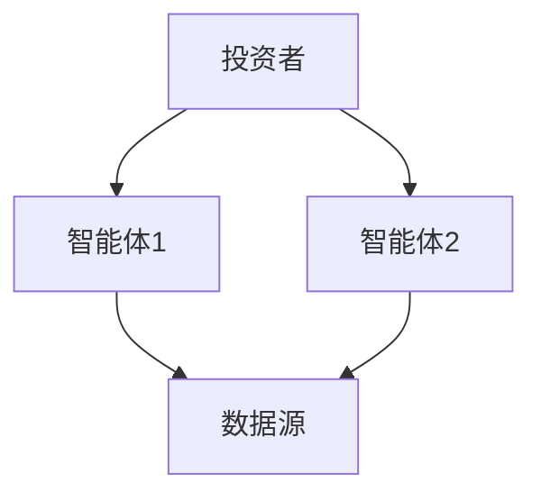
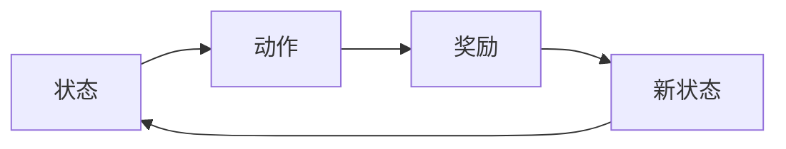

                 


# AI多智能体在价值投资中的风险评估应用

## 关键词：AI多智能体，价值投资，风险评估，金融数据分析，强化学习，分布式协作

## 摘要：本文探讨了AI多智能体技术在价值投资中的风险评估应用。通过分析多智能体系统的原理，结合实际案例，展示了如何利用AI多智能体进行分布式协作和自主决策，以提升风险评估的准确性和效率。文章详细讲解了相关算法原理，系统架构设计，以及项目实现的全过程，并提出了实践中的注意事项和未来发展方向。

---

# 第一部分: 背景介绍

## 第1章: AI多智能体与价值投资概述

### 1.1 AI多智能体的定义与特点
AI多智能体系统是指由多个智能体组成的分布式系统，这些智能体能够通过协作完成复杂的任务。其特点包括：
- **分布式协作**：多个智能体协同工作，而非单一中心化决策。
- **自主性**：每个智能体都能独立决策，同时与其他智能体通信。
- **动态适应性**：能够根据环境变化调整策略。

### 1.2 价值投资的基本原理
价值投资是一种投资策略，通过分析企业的基本面，寻找被市场低估的投资标的。其核心在于识别企业的内在价值，而非市场的短期波动。

### 1.3 风险评估在价值投资中的重要性
风险评估是价值投资中不可忽视的一环，用于衡量投资标的风险水平，帮助投资者制定合理的投资策略。

---

# 第二部分: 核心概念与联系

## 第2章: 多智能体系统的核心原理

### 2.1 多智能体系统的组成与功能
多智能体系统由多个智能体组成，每个智能体负责特定的任务，如数据收集、分析、决策等。

### 2.2 多智能体与传统AI的对比
| 特性 | 多智能体系统 | 传统AI系统 |
|------|--------------|------------|
| 结构  | 分布式       | 单中心化    |
| 决策  | 去中心化      | 中心化      |
| 协作   | 强调协作      | 单一决策    |

### 2.3 实体关系图


---

# 第三部分: 算法原理讲解

## 第3章: 多智能体协作算法

### 3.1 多智能体协作算法概述
多智能体协作算法通过智能体之间的通信与协作，完成复杂的任务。

### 3.2 Q-learning算法

数学模型：
$$ Q(s,a) = Q(s,a) + \alpha (r + \max Q(s',a') - Q(s,a)) $$

### 3.3 强化学习在风险评估中的应用
通过强化学习，智能体可以学习最优策略，提高风险评估的准确性。

---

# 第四部分: 系统分析与架构设计

## 第4章: 系统架构设计

### 4.1 系统功能设计
| 模块 | 功能描述 |
|------|----------|
| 数据预处理 | 清洗和转换数据 |
| 风险评估 | 计算投资风险 |
| 决策模块 | 制定投资策略 |

### 4.2 系统架构图


### 4.3 系统接口设计
API接口用于数据输入和输出，实现模块之间的通信。

---

# 第五部分: 项目实战

## 第5章: 项目实现

### 5.1 环境安装
安装必要的库，如TensorFlow、Keras等。

### 5.2 核心代码实现
```python
class Agent:
    def __init__(self, state_size, action_size):
        self.state_size = state_size
        self.action_size = action_size
        # 初始化Q值表
        self.q_table = np.zeros((state_size, action_size))
    
    def take_action(self, state):
        # 随机选择动作
        if np.random.random() < 0.1:
            return random.randint(0, self.action_size - 1)
        else:
            return np.argmax(self.q_table[state])
```

### 5.3 实际案例分析
通过具体案例，展示AI多智能体如何进行风险评估。

---

# 第六部分: 最佳实践

## 第6章: 实践总结

### 6.1 小结
AI多智能体在价值投资中的应用前景广阔，能够显著提升风险评估的效率和准确性。

### 6.2 注意事项
- 数据质量至关重要
- 算法需要不断优化
- 需要结合具体场景

### 6.3 未来展望
随着技术进步，AI多智能体在金融领域的应用将更加广泛。

---

# 结语

AI多智能体技术为价值投资中的风险评估提供了新的可能性，通过分布式协作和自主决策，能够帮助投资者更好地识别和管理风险。未来，随着技术的不断发展，AI多智能体在金融领域的应用将更加深入和广泛。

---

作者：AI天才研究院/AI Genius Institute & 禅与计算机程序设计艺术 /Zen And The Art of Computer Programming

