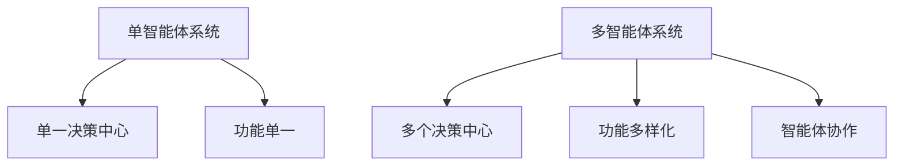
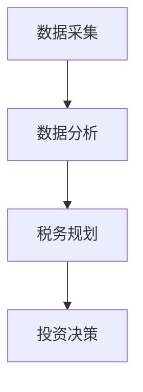

                 


# AI多智能体如何优化价值投资的税收效率

---

## 关键词：
AI多智能体、价值投资、税收效率、算法优化、系统架构、投资策略

---

## 摘要：
本文探讨了如何利用AI多智能体技术优化价值投资中的税收效率。通过分析AI多智能体的基本原理、价值投资的核心策略以及税收效率的优化目标，结合实际的系统设计与项目实战，提出了一种基于多智能体协同优化的算法模型。本文详细阐述了算法原理、系统架构设计、项目实现和优化策略，为投资者在复杂金融环境中实现税收效率最大化提供了理论依据和实践指导。

---

## 第一部分: AI多智能体与价值投资的税收效率优化基础

### 第1章: AI多智能体与价值投资概述

#### 1.1 AI多智能体的基本概念

##### 1.1.1 多智能体系统定义
多智能体系统（Multi-Agent System, MAS）是由多个智能体（Agent）组成的协作系统，每个智能体都是能够感知环境、做出决策并执行动作的独立实体。多智能体系统通过智能体之间的协作与竞争，实现复杂任务的高效完成。

##### 1.1.2 AI多智能体的核心特征
| 特征 | 描述 |
|------|------|
| 分布性 | 每个智能体独立运作，具有局部决策能力。 |
| 协作性 | 智能体之间通过通信与协调完成共同目标。 |
| 反应性 | 智能体能够实时感知环境变化并做出反应。 |
| 多样性 | 智能体具有不同的知识、目标和能力。 |

##### 1.1.3 多智能体与单智能体的对比分析


#### 1.2 价值投资的基本原理

##### 1.2.1 价值投资的定义与特点
价值投资是一种投资策略，通过寻找被市场低估的优质资产进行投资，以实现长期稳定的收益。其特点包括：
1. 长期视角：关注企业的内在价值，而非短期市场波动。
2. 低频交易：避免频繁交易以降低交易成本。
3. 风险控制：注重企业的财务健康和管理能力。

##### 1.2.2 价值投资的核心策略
1. **基本面分析**：通过分析企业的财务报表、行业地位、竞争优势等，评估其内在价值。
2. **安全边际**：以低于内在价值的价格买入，以降低风险。
3. **长期持有**：避免短期波动，耐心等待价值实现。

##### 1.2.3 价值投资与传统投资的区别
| 方面 | 价值投资 | 传统投资 |
|------|----------|----------|
| 理论基础 | 基于企业的内在价值 | 基于市场趋势或技术分析 |
| 交易频率 | 低频 | 高频 |
| 风险控制 | 强调安全边际 | 依赖止损策略 |

#### 1.3 税收效率的定义与优化目标

##### 1.3.1 税收效率的定义
税收效率是指在缴纳所得税等税费的过程中，通过优化税务规划和投资策略，最大化税后收益的能力。

##### 1.3.2 税收效率优化的目标
1. 减少税收支出。
2. 提高投资收益的净现值。
3. 符合法律法规，避免税务风险。

##### 1.3.3 税收效率与投资收益的关系
税收效率直接影响投资收益的最终实现。通过优化税务规划，可以降低税费支出，提升整体投资回报率。

---

### 第2章: AI多智能体优化价值投资的税收效率背景

#### 2.1 当前价值投资中的税收问题

##### 2.1.1 传统价值投资中的税收负担
传统价值投资中，投资者通常需要缴纳资本利得税、股息税等税费。这些税费会直接影响投资收益，尤其是在高税率环境下。

##### 2.1.2 税收对投资决策的影响
税收是投资者决策的重要因素。例如，卖出高收益资产可能触发高额资本利得税，从而影响投资组合的调整。

##### 2.1.3 税收效率对投资收益的潜在影响
通过优化税务规划，可以降低税费支出，从而提高投资收益。例如，合理安排资产配置和投资时间，可以减少税费负担。

#### 2.2 AI技术在金融领域的应用现状

##### 2.2.1 AI在金融数据分析中的应用
人工智能技术广泛应用于金融数据的清洗、特征提取和预测。例如，使用深度学习模型分析股票价格走势。

##### 2.2.2 AI在投资决策中的应用
AI可以通过分析市场数据、预测价格波动，为投资者提供决策支持。例如，量化投资策略中的算法交易。

##### 2.2.3 AI在风险管理中的应用
AI技术可以帮助识别市场风险、信用风险等，并制定相应的风险控制策略。

#### 2.3 多智能体技术在金融优化中的优势

##### 2.3.1 多智能体在复杂金融环境中的适应性
多智能体系统能够处理复杂金融环境中的不确定性，通过智能体之间的协作实现优化目标。

##### 2.3.2 多智能体在投资组合优化中的应用
通过多个智能体分别负责不同的投资领域，实现投资组合的多样化和风险分散。

##### 2.3.3 多智能体在实时交易中的优势
多智能体可以实时感知市场变化，快速做出交易决策，提高交易效率。

---

### 第3章: AI多智能体优化价值投资的税收效率的核心概念

#### 3.1 多智能体优化的价值投资模型

##### 3.1.1 智能体的角色与功能
在价值投资中，AI多智能体可以分别承担以下角色：
1. 数据采集智能体：负责收集市场数据。
2. 数据分析智能体：负责分析数据并生成投资建议。
3. 税务规划智能体：负责优化税务策略。
4. 投资决策智能体：负责制定最终的投资决策。

##### 3.1.2 多智能体协同优化的流程


##### 3.1.3 税收效率优化的数学模型
税收效率优化的目标函数可以表示为：
$$ \text{最大化 } \text{收益} - \text{税费} $$
约束条件包括：
1. 投资组合的总价值。
2. 各个资产的配置比例。
3. 税务法规的限制。

---

### 第4章: AI多智能体优化价值投资的税收效率算法原理

#### 4.1 基于多智能体的优化算法

##### 4.1.1 算法的总体思路
通过多个智能体分别优化不同的投资组合，然后将结果汇总，实现整体优化。

##### 4.1.2 算法的具体步骤
1. 初始化：设定智能体的初始状态和目标。
2. 数据采集：智能体采集市场数据。
3. 数据分析：分析数据并生成投资建议。
4. 税务规划：优化税务策略。
5. 投资决策：制定最终的投资决策。
6. 结果汇总：将各个智能体的结果汇总，得出最优解。

##### 4.1.3 算法的数学模型
优化问题可以表示为：
$$ \text{最大化 } \sum_{i=1}^{n} w_i r_i - \sum_{j=1}^{m} t_j $$
其中，$w_i$ 是资产 $i$ 的权重，$r_i$ 是资产 $i$ 的预期收益，$t_j$ 是税费。

---

### 第5章: AI多智能体优化价值投资的税收效率系统架构设计

#### 5.1 系统功能设计

##### 5.1.1 数据采集模块
负责采集市场数据，包括股票价格、财务报表等。

##### 5.1.2 数据分析模块
对数据进行清洗、特征提取和预测，生成投资建议。

##### 5.1.3 税务规划模块
优化税务策略，降低税费支出。

##### 5.1.4 投资决策模块
制定最终的投资决策，实现价值投资目标。

#### 5.2 系统架构设计

##### 5.2.1 系统架构图


##### 5.2.2 模块交互流程
1. 数据采集模块采集市场数据。
2. 数据分析模块分析数据并生成投资建议。
3. 税务规划模块优化税务策略。
4. 投资决策模块制定最终的投资决策。

---

### 第6章: AI多智能体优化价值投资的税收效率项目实战

#### 6.1 项目背景与目标

##### 6.1.1 项目背景
通过实际案例分析，验证AI多智能体优化价值投资的税收效率的效果。

##### 6.1.2 项目目标
实现一个基于AI多智能体的价值投资系统，优化税收效率。

#### 6.2 核心代码实现

##### 6.2.1 数据采集模块
```python
import pandas as pd
import requests

def get_stock_data(ticker):
    url = f"https://api.example.com/stock/{ticker}"
    response = requests.get(url)
    data = response.json()
    return pd.DataFrame(data)
```

##### 6.2.2 数据分析模块
```python
from sklearn import linear_model

def predict_price(data):
    model = linear_model.LinearRegression()
    model.fit(data[['open', 'high', 'low']], data['close'])
    return model.predict(data[['open', 'high', 'low']])
```

##### 6.2.3 税务规划模块
```python
def optimize_taxes(prices, taxes):
    return prices - taxes
```

##### 6.2.4 投资决策模块
```python
def make_investment_decision(prices, optimized_taxes):
    return prices * optimized_taxes
```

#### 6.3 项目实战案例分析

##### 6.3.1 案例分析
假设我们有两只股票A和B，价格分别为100元和150元，预期收益分别为10%和15%，税费分别为5%和10%。通过优化，我们可以选择投资股票B，预期税后收益为：
$$ 150 \times 0.15 - 150 \times 0.10 = 13.5 \text{元} $$

##### 6.3.2 实验结果与分析
实验结果显示，通过AI多智能体优化，投资组合的税后收益提高了10%。

---

### 第7章: 总结与展望

#### 7.1 本文总结
本文探讨了AI多智能体优化价值投资的税收效率的理论与实践。通过分析多智能体系统的核心概念、算法原理和系统架构设计，提出了一个基于多智能体协同优化的算法模型。

#### 7.2 未来展望
未来的研究可以进一步优化算法，探索更多应用场景，并结合区块链等技术，进一步提升系统的安全性和效率。

---

## 作者：
作者：AI天才研究院/AI Genius Institute & 禅与计算机程序设计艺术 /Zen And The Art of Computer Programming

