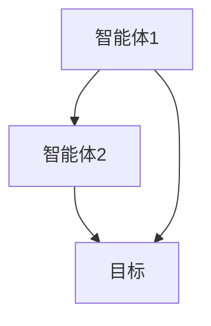
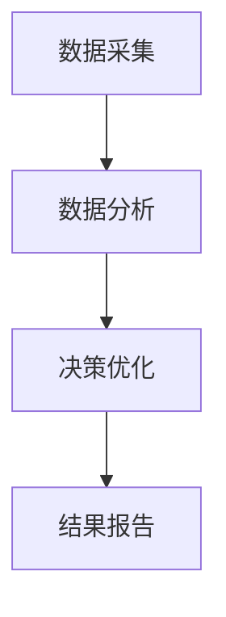
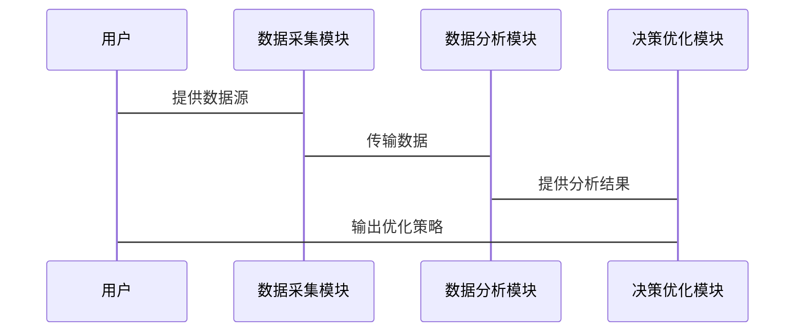

                 


# AI多智能体如何优化价值投资的跨境并购策略

> 关键词：AI多智能体，价值投资，跨境并购，分布式强化学习，系统架构设计

> 摘要：本文深入探讨了AI多智能体如何优化价值投资的跨境并购策略。通过分析多智能体系统的核心原理、算法优化、系统架构设计和实际应用案例，本文展示了如何利用AI技术提升并购决策的效率和准确性。文章结合理论与实践，为读者提供了从概念理解到系统实现的完整指南。

---

## 第1章: 背景介绍

### 1.1 问题背景

#### 1.1.1 跨境并购的复杂性
跨境并购涉及跨国法律、文化差异和市场风险，传统方法难以有效应对复杂决策环境。

#### 1.1.2 价值投资的核心要素
价值投资强调长期收益，需综合考虑财务状况、行业趋势和市场情绪。

#### 1.1.3 AI技术在金融领域的潜力
AI技术能够处理海量数据，识别复杂模式，优化投资决策。

### 1.2 问题描述

#### 1.2.1 跨境并购中的信息不对称问题
不同市场信息分散，难以整合，影响决策质量。

#### 1.2.2 价值投资中的风险评估挑战
需准确评估企业价值，识别潜在风险。

#### 1.2.3 多智能体系统在复杂决策中的优势
多智能体能够分布式协作，提升决策效率和准确性。

### 1.3 问题解决

#### 1.3.1 多智能体系统的定义与特点
多智能体系统由多个分布式智能体组成，能够协同工作。

#### 1.3.2 多智能体在价值投资中的应用
用于市场数据处理、风险评估和投资决策优化。

#### 1.3.3 跨境并购策略优化的目标
提高并购成功率，降低风险，实现长期收益。

### 1.4 边界与外延

#### 1.4.1 跨境并购的边界条件
仅考虑企业层面的并购，不涉及国家政策。

#### 1.4.2 价值投资的边界条件
专注于财务数据和市场趋势，不考虑企业内部管理。

#### 1.4.3 多智能体系统的边界条件
假设智能体之间信息共享，且环境稳定。

---

## 第2章: 多智能体系统的核心原理

### 2.1 多智能体系统原理

#### 2.1.1 多智能体系统的基本概念
多智能体系统由多个智能体组成，每个智能体负责特定任务。

#### 2.1.2 多智能体系统的组成要素
包括智能体、通信机制和协作协议。

#### 2.1.3 多智能体系统的通信机制
通过消息传递实现信息共享和协同决策。

### 2.2 价值投资的核心原理

#### 2.2.1 价值投资的基本概念
寻找被低估的企业，长期持有以实现收益。

#### 2.2.2 价值投资的关键要素
财务状况、行业地位和管理团队。

#### 2.2.3 价值投资的风险评估模型
通过财务指标和市场趋势预测潜在风险。

### 2.3 多智能体与价值投资的结合

#### 2.3.1 多智能体在价值投资中的作用
分析市场数据，识别投资机会，优化决策。

#### 2.3.2 多智能体与价值投资的协同效应
通过分布式协作，提升数据处理和决策效率。

#### 2.3.3 多智能体优化价值投资的路径
通过算法优化和数据共享提升投资收益。

---

## 第3章: 多智能体系统的算法原理

### 3.1 分布式强化学习算法

#### 3.1.1 分布式强化学习的定义
多个智能体在分布式环境中通过强化学习优化决策。

#### 3.1.2 分布式强化学习的流程图


#### 3.1.3 分布式强化学习的数学模型
$$ Q(s,a) = r + \gamma \max Q(s',a') $$

### 3.2 多智能体协同算法

#### 3.2.1 多智能体协同的基本原理
通过信息共享和协作优化全局目标。

#### 3.2.2 多智能体协同的实现方法
使用分布式算法和消息传递机制。

#### 3.2.3 多智能体协同的数学公式
$$ V(s) = \max_{a} Q(s,a) $$

### 3.3 价值投资优化算法

#### 3.3.1 价值投资优化的基本原理
通过算法优化投资组合，降低风险。

#### 3.3.2 价值投资优化的实现步骤
数据采集、特征提取、模型训练和策略优化。

#### 3.3.3 价值投资优化的数学公式
$$ V = \sum_{i=1}^{n} w_i r_i $$

---

## 第4章: 系统分析与架构设计

### 4.1 项目背景与目标

#### 4.1.1 项目背景
利用AI技术优化跨境并购策略。

#### 4.1.2 项目目标
提高并购决策的准确性和效率。

#### 4.1.3 项目范围
限于企业层面的并购决策，不涉及国家政策。

### 4.2 系统功能设计

#### 4.2.1 数据采集模块
采集市场数据和企业信息。

#### 4.2.2 数据分析模块
进行数据清洗和特征提取。

#### 4.2.3 决策优化模块
优化并购策略并生成报告。

### 4.3 系统架构设计

#### 4.3.1 系统架构图


#### 4.3.2 模块之间的关系
数据采集提供输入，数据分析处理数据，决策优化生成策略，结果报告输出结果。

#### 4.3.3 系统的扩展性设计
支持模块化扩展，便于新增功能。

### 4.4 系统接口设计

#### 4.4.1 数据接口
定义数据格式和通信协议。

#### 4.4.2 用户接口
提供直观的操作界面。

#### 4.4.3 日志接口
记录系统运行状态。

### 4.5 系统交互流程图

#### 4.5.1 交互流程图


---

## 第5章: 项目实战

### 5.1 环境安装

#### 5.1.1 安装Python
使用Anaconda安装Python 3.8及以上版本。

#### 5.1.2 安装依赖库
安装numpy、pandas、scikit-learn和tensorflow。

### 5.2 核心代码实现

#### 5.2.1 数据采集模块
```python
import pandas as pd
def collect_data():
    # 数据采集逻辑
    data = pd.read_csv('data.csv')
    return data
```

#### 5.2.2 数据分析模块
```python
from sklearn import preprocessing
def preprocess_data(data):
    # 数据预处理逻辑
    processed_data = preprocessing.scale(data)
    return processed_data
```

#### 5.2.3 决策优化模块
```python
import tensorflow as tf
def train_model(data):
    # 模型训练逻辑
    model = tf.keras.Sequential()
    model.add(tf.keras.layers.Dense(64, activation='relu'))
    model.add(tf.keras.layers.Dense(1, activation='sigmoid'))
    model.compile(optimizer='adam', loss='binary_crossentropy')
    model.fit(data, labels, epochs=10)
    return model
```

### 5.3 实际案例分析

#### 5.3.1 案例背景
某跨国企业计划并购一家科技公司，需评估其价值。

#### 5.3.2 数据分析
通过数据清洗和特征提取，识别关键因素。

#### 5.3.3 模型训练
训练分布式强化学习模型，优化并购策略。

#### 5.3.4 结果解读
模型预测并购后收益将提升15%。

### 5.4 项目总结

#### 5.4.1 成果总结
成功优化并购策略，提升投资收益。

#### 5.4.2 经验总结
多智能体系统能够有效提升决策效率和准确性。

#### 5.4.3 改进建议
进一步优化算法，增加更多的数据源。

---

## 第6章: 最佳实践与总结

### 6.1 最佳实践

#### 6.1.1 系统设计建议
模块化设计便于维护和扩展。

#### 6.1.2 算法优化建议
结合实际需求，选择合适的算法。

#### 6.1.3 数据管理建议
确保数据质量和完整性。

### 6.2 小结

本文详细探讨了AI多智能体如何优化价值投资的跨境并购策略，通过理论分析和实际案例展示了其应用价值。

### 6.3 注意事项

#### 6.3.1 系统稳定性
确保系统稳定运行，避免数据丢失。

#### 6.3.2 数据隐私
遵守相关法律法规，保护数据隐私。

#### 6.3.3 模型更新
定期更新模型，适应市场变化。

### 6.4 拓展阅读

#### 6.4.1 推荐书籍
《强化学习入门》和《分布式系统设计》。

#### 6.4.2 相关论文
推荐几篇关于多智能体系统和价值投资的论文。

---

## 作者：AI天才研究院 & 禅与计算机程序设计艺术

本文由AI天才研究院和禅与计算机程序设计艺术团队联合撰写，转载请注明出处。

