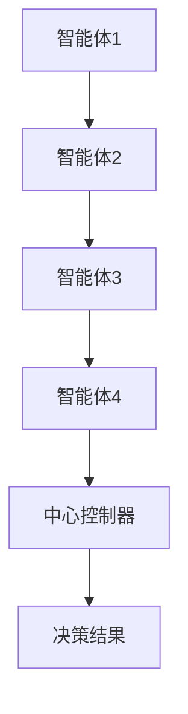
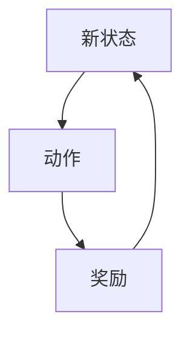
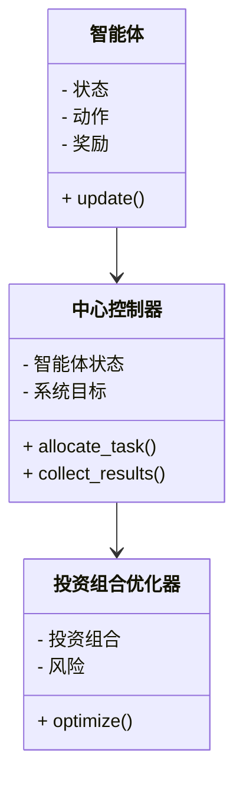
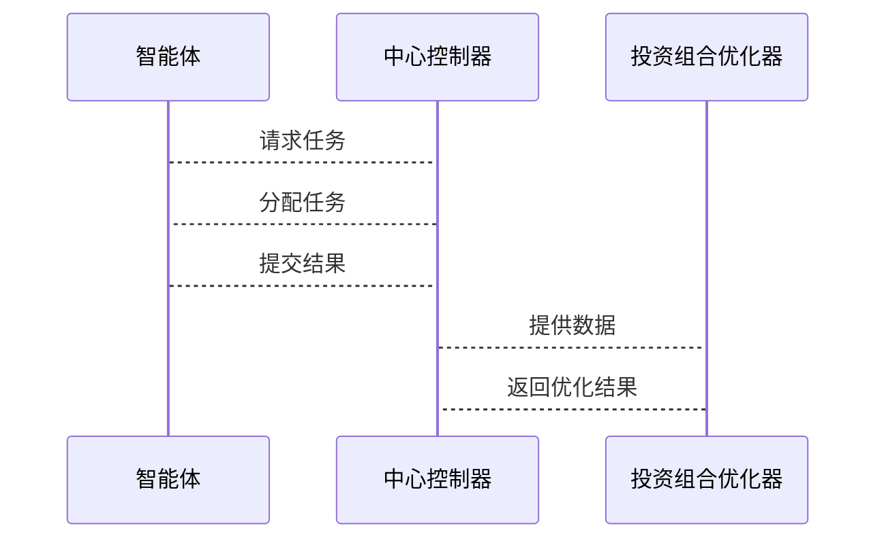

                 


# AI多智能体如何优化价值投资的长期复合增长策略

> 关键词：AI多智能体，价值投资，长期复合增长，优化策略，投资决策，系统架构

> 摘要：本文深入探讨了AI多智能体技术在优化价值投资长期复合增长策略中的应用。通过分析多智能体系统的协作机制、算法原理以及在投资决策中的实际应用，提出了一套基于AI多智能体的优化策略，并通过具体案例展示了其在价值投资中的优势和潜力。

---

# 第1章: AI多智能体与价值投资的背景与概念

## 1.1 AI多智能体的基本概念
### 1.1.1 多智能体系统的定义
多智能体系统（Multi-Agent System, MAS）是由多个智能体组成的协作系统，每个智能体都是一个独立的实体，能够感知环境、自主决策并执行任务。

### 1.1.2 AI多智能体的核心特征
- **自主性**：每个智能体都能自主决策。
- **反应性**：智能体能够实时感知环境变化并做出反应。
- **协作性**：多个智能体之间能够协同合作，完成复杂任务。
- **分布式性**：任务和决策分布在整个系统中，而非集中在一个智能体。

### 1.1.3 多智能体与单智能体的对比
| 特性      | 多智能体                   | 单智能体                 |
|-----------|---------------------------|--------------------------|
| 决策中心   | 分散在多个智能体           | 集中在一个智能体         |
| 信息处理   | 处理能力强，信息共享       | 信息处理有限             |
| 灵活性     | 高，适应性强               | 较低，适应性有限         |

## 1.2 价值投资的基本原理
### 1.2.1 价值投资的定义
价值投资是一种以基本面分析为基础的投资策略，旨在以低于内在价值的价格购买优质资产，长期持有以实现资本增值。

### 1.2.2 价值投资的核心理念
- **长期视角**：关注企业的长期价值，而非短期市场波动。
- **安全边际**：以低于内在价值的价格买入资产，降低投资风险。
- **分散投资**：通过分散投资降低风险，避免过度依赖单一资产。

### 1.2.3 价值投资的长期复合增长策略
价值投资的核心目标是通过长期持有优质资产，实现收益的复利增长。复利效应使得投资收益能够以指数形式增长，从而实现财富的长期复合增长。

## 1.3 AI多智能体在价值投资中的应用前景
### 1.3.1 AI多智能体在投资决策中的优势
- **信息处理能力**：能够快速处理大量数据，发现潜在的投资机会。
- **决策优化**：通过多智能体协作，优化投资决策，降低风险。
- **动态适应**：能够实时调整策略，适应市场变化。

### 1.3.2 价值投资与AI多智能体的结合潜力
- **数据驱动决策**：利用AI多智能体分析市场数据，辅助投资决策。
- **风险分散**：通过多智能体协作，分散投资风险，提高收益稳定性。
- **效率提升**：AI多智能体能够快速分析市场，提高投资效率。

### 1.3.3 当前应用现状与未来趋势
当前，AI多智能体在价值投资中的应用仍处于起步阶段，但随着技术的不断发展，其在投资决策中的潜力将逐步释放，未来将成为价值投资的重要工具。

---

# 第2章: 价值投资策略的优化问题

## 2.1 传统价值投资策略的局限性
### 2.1.1 信息处理的局限性
传统价值投资依赖于人工分析，信息处理能力有限，难以应对复杂多变的市场环境。

### 2.1.2 决策过程的主观性
投资决策往往受到主观因素影响，可能导致判断失误，影响投资收益。

### 2.1.3 市场变化的适应性不足
传统价值投资策略在面对市场快速变化时，难以迅速调整，导致投资机会的错失。

## 2.2 AI多智能体在优化价值投资策略中的作用
### 2.2.1 分散决策与集中控制的平衡
AI多智能体通过分散决策，避免过度集中风险，同时通过集中控制，优化整体投资策略。

### 2.2.2 多维度信息处理能力
AI多智能体能够同时处理多个维度的信息，包括市场数据、企业基本面、行业趋势等，从而做出更全面的投资决策。

### 2.2.3 动态调整与自适应能力
AI多智能体能够实时调整投资策略，根据市场变化动态优化投资组合，提高投资收益。

## 2.3 多智能体优化价值投资策略的核心问题
### 2.3.1 多智能体协作的机制设计
如何设计多智能体之间的协作机制，使得每个智能体能够高效协作，共同优化投资策略。

### 2.3.2 投资目标的分解与分配
如何将整体投资目标分解为多个子目标，并分配给不同的智能体进行优化。

### 2.3.3 系统性风险的分散与控制
如何通过多智能体协作，分散系统性风险，降低投资组合的整体波动性。

---

# 第3章: 多智能体系统的核心概念与原理

## 3.1 多智能体系统的架构
### 3.1.1 分层架构
分层架构将系统分为多个层次，每个层次负责不同的功能，如感知层、决策层、执行层。

### 3.1.2 分布式架构
分布式架构将功能分散到多个智能体，每个智能体负责不同的任务，通过协作完成整体目标。

### 3.1.3 集中式架构
集中式架构有一个中心智能体，负责协调和管理所有智能体的行动，确保系统整体目标的实现。

## 3.2 多智能体协作的机制
### 3.2.1 通信机制
智能体之间通过通信机制共享信息，协调行动。

### 3.2.2 协作机制
通过协作机制，智能体之间可以协同完成复杂任务，优化整体投资策略。

### 3.2.3 决策机制
智能体根据环境信息和协作需求，做出最优决策。

## 3.3 多智能体系统的数学模型
### 3.3.1 状态空间模型
状态空间模型描述了系统在不同状态下的情况，包括市场状态、资产状态等。

### 3.3.2 动作空间模型
动作空间模型描述了智能体在不同状态下的可能行动，如买入、卖出、持有等。

### 3.3.3 奖励函数设计
奖励函数设计用于评估智能体的行动效果，指导智能体做出最优决策。

---

# 第4章: 价值投资策略的数学模型与优化目标

## 4.1 价值投资的数学模型
### 4.1.1 内在价值计算
内在价值计算公式：
$$ V = \frac{CF}{r - g} $$
其中，CF为现金流，r为折现率，g为增长率。

### 4.1.2 投资组合优化
投资组合优化公式：
$$ \max \mu = \sum_{i=1}^{n} w_i r_i $$
$$ \text{约束条件}：\sum_{i=1}^{n} w_i = 1, w_i \geq 0 $$

## 4.2 多智能体优化价值投资策略的核心问题
### 4.2.1 投资目标的分解
将整体投资目标分解为多个子目标，分配给不同的智能体进行优化。

### 4.2.2 投资组合的动态调整
根据市场变化，动态调整投资组合，优化收益与风险的平衡。

### 4.2.3 风险控制
通过多智能体协作，分散投资风险，降低系统性风险的影响。

---

# 第5章: 基于AI多智能体的价值投资优化策略

## 5.1 AI多智能体优化价值投资的算法原理
### 5.1.1 多智能体协作算法
多智能体协作算法流程图：


### 5.1.2 强化学习算法
强化学习算法流程图：


## 5.2 优化策略的数学模型
### 5.2.1 投资组合优化模型
投资组合优化模型：
$$ \max \mu = \sum_{i=1}^{n} w_i r_i $$
$$ \text{约束条件}：\sum_{i=1}^{n} w_i = 1, w_i \geq 0 $$

### 5.2.2 风险控制模型
风险控制模型：
$$ \text{VaR} = \sum_{i=1}^{n} w_i \times \text{VaR}_i $$

## 5.3 系统架构设计
### 5.3.1 系统功能模块
系统功能模块类图：


### 5.3.2 系统接口设计
系统接口设计：
- 智能体与中心控制器之间的通信接口。
- 投资组合优化器与智能体之间的数据接口。

### 5.3.3 系统交互设计
系统交互序列图：


---

# 第6章: 项目实战——基于AI多智能体的价值投资优化系统

## 6.1 项目环境安装
### 6.1.1 安装Python
安装Python：
```bash
sudo apt-get install python3
```

### 6.1.2 安装必要的库
安装必要的库：
```bash
pip install numpy pandas scikit-learn
```

## 6.2 系统核心实现
### 6.2.1 多智能体协作算法实现
多智能体协作算法实现：
```python
class Agent:
    def __init__(self, id):
        self.id = id
        self.state = None
        self.reward = 0

    def act(self):
        pass

class CentralController:
    def __init__(self):
        self.agents = []
        self.tasks = []

    def allocate_task(self, task):
        self.tasks.append(task)

    def collect_result(self):
        pass
```

### 6.2.2 投资组合优化算法实现
投资组合优化算法实现：
```python
import numpy as np
from sklearn import linear_model

def optimize_portfolio(returns):
    model = linear_model.Lasso()
    model.fit(returns, np.ones(len(returns)))
    weights = model.coef_
    return weights
```

## 6.3 代码应用解读与分析
### 6.3.1 代码结构分析
代码结构分析：
- `Agent` 类：定义智能体的基本功能，包括状态、动作和奖励。
- `CentralController` 类：定义中心控制器的功能，包括任务分配和结果收集。
- `optimize_portfolio` 函数：利用Lasso回归模型进行投资组合优化。

### 6.3.2 系统运行流程
系统运行流程：
1. 初始化智能体和中心控制器。
2. 分配任务给智能体。
3. 智能体根据任务做出决策。
4. 收集智能体的结果并进行优化。
5. 输出优化后的投资组合。

## 6.4 实际案例分析
### 6.4.1 数据准备
数据准备：
- 收益率数据
- 市场数据

### 6.4.2 系统运行
系统运行：
```bash
python main.py
```

### 6.4.3 结果分析
结果分析：
- 投资组合的收益与风险
- 系统的优化效果
- 系统的运行效率

## 6.5 项目小结
项目小结：
- 通过AI多智能体技术，实现了价值投资策略的优化。
- 系统能够动态调整投资组合，降低风险，提高收益。
- 未来可以进一步优化算法，提升系统的性能和效果。

---

# 第7章: 总结与展望

## 7.1 全文总结
本文深入探讨了AI多智能体在优化价值投资长期复合增长策略中的应用，提出了基于多智能体的优化策略，并通过具体案例展示了其在实际投资中的优势和潜力。

## 7.2 最佳实践 tips
- **数据质量**：确保数据的准确性和完整性。
- **模型选择**：根据实际需求选择合适的算法和模型。
- **系统优化**：不断优化系统架构和算法，提高系统的性能和效果。

## 7.3 未来展望
未来，随着AI技术的不断发展，AI多智能体在价值投资中的应用将更加广泛和深入，成为价值投资的重要工具。

---

# 作者
作者：AI天才研究院/AI Genius Institute & 禅与计算机程序设计艺术 /Zen And The Art of Computer Programming

