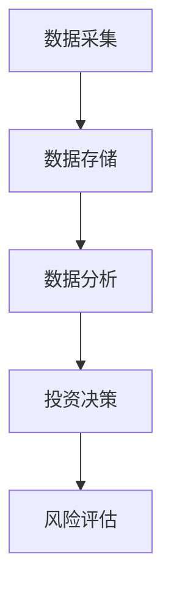

                 


# AI多智能体如何优化价值投资的长期持股策略

> 关键词：AI多智能体，价值投资，长期持股策略，强化学习，数学模型，系统架构

> 摘要：本文探讨了如何利用AI多智能体技术优化价值投资的长期持股策略。通过分析多智能体系统的协作机制、算法原理、数学模型和系统架构，展示了AI在金融投资中的潜力。文章从背景介绍、核心概念、算法实现到实际案例，全面解析了AI多智能体在优化投资决策中的应用。

---

## 第1章：AI多智能体与价值投资的背景

### 1.1 AI多智能体的基本概念

#### 1.1.1 多智能体系统的定义
多智能体系统（Multi-Agent System, MAS）是由多个智能体组成的系统，这些智能体能够协同工作以实现共同目标。每个智能体都有自己的目标、知识和决策能力。

#### 1.1.2 多智能体在金融领域的应用
在金融领域，多智能体系统用于复杂的投资决策，如股票交易、风险评估和投资组合优化。

#### 1.1.3 价值投资的定义
价值投资是一种投资策略，通过分析股票的内在价值，寻找低于市场价的股票进行长期投资。

---

### 1.2 长期持股策略的核心要素

#### 1.2.1 长期投资的定义与目标
长期投资是指持有资产超过一年，目标是通过资本增值和股息收入实现财富增长。

#### 1.2.2 价值投资的关键指标
关键指标包括市盈率（P/E）、市净率（P/B）、股息率等。

#### 1.2.3 风险管理在长期投资中的作用
风险管理是保护投资组合免受重大损失的重要策略，包括分散投资和止损机制。

---

## 第2章：AI多智能体的协作机制

### 2.1 多智能体系统的协作原理

#### 2.1.1 协作的定义与分类
协作是指智能体之间通过信息共享和任务分配共同完成目标。

#### 2.1.2 协作中的通信机制
通信机制包括直接通信和间接通信，用于信息共享和协调决策。

#### 2.1.3 协作中的任务分配
任务分配算法如基于角色的分配和基于优先级的分配，确保智能体高效协作。

---

### 2.2 价值投资中的多智能体协作

#### 2.2.1 数据收集与分析
多智能体协同收集和分析市场数据，识别投资机会。

#### 2.2.2 风险评估与预测
智能体协同评估风险，预测市场波动，优化投资组合。

#### 2.2.3 投资决策的协同过程
智能体协同制定投资决策，平衡收益与风险。

---

## 第3章：强化学习在多智能体系统中的应用

### 3.1 强化学习的基本原理

#### 3.1.1 强化学习的定义
强化学习是一种机器学习方法，通过试错和奖励机制优化决策策略。

#### 3.1.2 状态、动作、奖励的定义
状态表示环境的当前情况，动作是智能体的决策，奖励是对决策的反馈。

#### 3.1.3 Q-learning算法的介绍
Q-learning通过更新Q值表，学习最优策略。

---

### 3.2 多智能体强化学习的实现

#### 3.2.1 多智能体协作的挑战
包括通信开销、协调难度和任务分配问题。

#### 3.2.2 基于价值的方法（Q-learning）
使用Q值表进行决策，适用于多智能体协作。

#### 3.2.3 基于策略的方法（PPO）
PPO优化策略，适用于复杂协作任务。

---

## 第4章：数学模型与公式

### 4.1 收益预测模型

#### 4.1.1 收益预测的公式
收益预测公式：$$ R = \sum_{t=1}^{n} r_t $$，其中$r_t$是第t期的收益。

#### 4.1.2 收益预测的计算步骤
1. 收集历史数据。
2. 训练模型。
3. 预测未来收益。

---

### 4.2 风险评估模型

#### 4.2.1 风险评估的公式
风险评估公式：$$ \text{风险} = \text{标准差}(R) $$，标准差衡量收益波动。

#### 4.2.2 风险评估的计算步骤
1. 计算平均收益。
2. 计算每个收益与平均收益的偏差。
3. 平方偏差并求平均。

---

## 第5章：系统架构与设计

### 5.1 系统功能模块

#### 5.1.1 数据采集模块
负责收集市场数据，如股票价格、财务报表。

#### 5.1.2 数据分析模块
分析数据，识别投资机会。

#### 5.1.3 投资决策模块
基于分析结果，制定投资策略。

---

### 5.2 系统架构设计

#### 5.2.1 系统架构图


---

## 第6章：项目实战

### 6.1 环境配置

#### 6.1.1 环境要求
安装Python、TensorFlow、Keras等库。

---

### 6.2 核心代码实现

#### 6.2.1 Q-learning实现
```python
class QLearning:
    def __init__(self, state_space, action_space):
        self.Q = defaultdict(dict)
        self.state_space = state_space
        self.action_space = action_space

    def choose_action(self, state):
        if state not in self.Q or random.random() < 0.1:
            return random.choice(self.action_space)
        return max(self.Q[state], key=lambda k: self.Q[state][k])
```

---

### 6.3 案例分析

#### 6.3.1 案例：股票投资组合优化
使用多智能体系统优化投资组合，通过协作分析多只股票，降低风险，提高收益。

---

## 第7章：总结与展望

### 7.1 最佳实践

#### 7.1.1 系统设计
确保系统模块化，便于扩展和维护。

#### 7.1.2 算法选择
根据具体任务选择合适的算法，如Q-learning或PPO。

#### 7.1.3 风险管理
制定有效的风险管理策略，保护投资组合。

---

### 7.2 小结

本文详细探讨了AI多智能体在优化价值投资长期持股策略中的应用，从背景、算法到系统设计，展示了其潜力和优势。

---

### 7.3 注意事项

- 数据质量对结果影响重大，需确保数据准确。
- 算法选择需结合具体任务和数据特点。
- 系统设计需考虑可扩展性和维护性。

---

### 7.4 拓展阅读

推荐阅读《强化学习导论》和《多智能体系统》等书籍，深入理解相关理论。

---

作者：AI天才研究院/AI Genius Institute & 禅与计算机程序设计艺术 /Zen And The Art of Computer Programming

