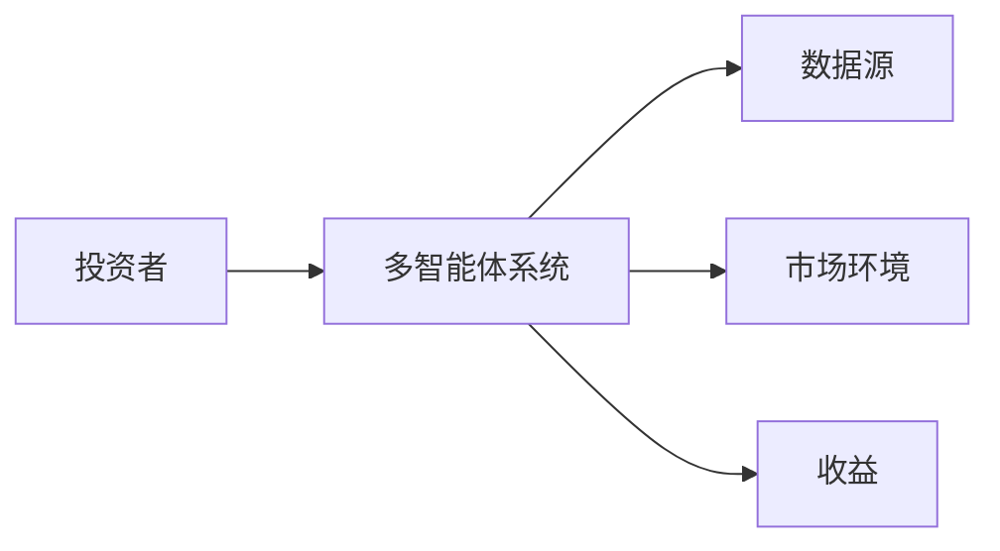

                 


# AI多智能体如何优化价值投资的长期股东回报策略

## 关键词：
AI多智能体、价值投资、长期股东回报、投资策略优化、强化学习、系统架构、案例分析

## 摘要：
本文探讨了AI多智能体在优化价值投资中的长期股东回报策略的应用。通过分析多智能体系统的核心原理，结合价值投资的关键特征，提出了一种基于强化学习的多智能体协作算法，旨在提升投资决策的效率和准确性。文章详细讲解了算法实现的步骤，并通过实际案例分析验证了该策略的有效性。

# 目录大纲

## 第一部分：背景介绍

### 第1章：价值投资与AI多智能体概述

#### 1.1 问题背景
- 1.1.1 价值投资的基本概念与特征
  - 价值投资的核心理念
  - 长期股东回报的定义
  - 价值投资与短期交易的对比
- 1.1.2 当前价值投资面临的挑战
  - 数据爆炸与信息过载
  - 市场波动性增加
  - 传统投资策略的局限性
- 1.1.3 AI技术在金融领域的潜力
  - AI在金融分析中的应用现状
  - 多智能体系统的优势
  - 人工智能如何提升投资决策的效率

#### 1.2 AI多智能体的基本概念
- 1.2.1 多智能体系统的定义
  - 多智能体系统的组成要素
  - 多智能体与单智能体的对比
  - 多智能体协作的基本原理
- 1.2.2 价值投资与AI多智能体的结合
  - 价值投资中的信息处理需求
  - 多智能体在投资决策中的应用
  - 多智能体如何优化投资策略
- 1.2.3 多智能体系统的特征
  - 分布式计算能力
  - 协作与竞争机制
  - 自适应性与学习能力

#### 1.3 价值投资与AI多智能体的结合
- 1.3.1 价值投资中的关键问题
  - 股票筛选与评估
  - 风险管理
  - 投资组合优化
- 1.3.2 AI多智能体在价值投资中的应用
  - 数据分析与特征提取
  - 投资决策优化
  - 动态市场适应能力
- 1.3.3 应用前景与挑战
  - 技术实现的难点
  - 市场接受度的问题
  - 未来的优化方向

## 第二部分：核心概念与联系

### 第2章：AI多智能体的核心原理

#### 2.1 多智能体系统的工作原理
- 2.1.1 多智能体系统的组成
  - 智能体的定义与特征
  - 智能体之间的协作机制
  - 中央控制器的作用
- 2.1.2 强化学习在多智能体中的应用
  - Q-learning算法的基本原理
  - 多智能体协作中的挑战
  - 分层强化学习的实现
- 2.1.3 多智能体系统的动态适应能力
  - 动态环境下的决策调整
  - 竞争与协作的平衡
  - 系统的自我优化能力

#### 2.2 价值投资的核心模型
- 2.2.1 股票估值模型
  - DCF模型的基本原理
  - 市盈率与市净率的计算
  - 财务指标的分析与应用
- 2.2.2 投资组合优化模型
  - 马科维茨均值-方差模型
  - 动态资产配置策略
  - 风险调整后的收益评估
- 2.2.3 投资决策模型
  - 数据驱动的决策过程
  - 多因素分析模型
  - 情景分析与压力测试

#### 2.3 多智能体与价值投资的关系
- 2.3.1 多智能体如何优化投资决策
  - 数据处理能力的提升
  - 投资策略的自动化与智能化
  - 风险管理能力的增强
- 2.3.2 价值投资与AI多智能体的结合点
  - 数据分析与特征提取
  - 投资组合优化
  - 动态市场适应能力
- 2.3.3 多智能体在价值投资中的创新应用
  - 非线性关系的发现
  - 高维数据的处理能力
  - 群智决策的优势

## 第三部分：算法原理与系统架构

### 第3章：算法原理讲解

#### 3.1 多智能体协作算法
- 3.1.1 基于强化学习的协作算法
  - Q-learning算法的实现
  - 多智能体协作中的挑战
  - 分层强化学习的实现
- 3.1.2 算法流程图
  ```mermaid
  graph LR
  A1[投资者] --> A2[数据源]
  A2 --> A3[特征提取]
  A3 --> A4[策略生成]
  A4 --> A5[投资决策]
  A5 --> A6[收益计算]
  ```
- 3.1.3 算法实现的步骤
  - 数据预处理与特征提取
  - 算法训练与参数调整
  - 投资策略的生成与优化

#### 3.2 数学模型与公式
- 3.2.1 Q-learning公式
  $$ Q(s, a) = Q(s, a) + \alpha (r + \gamma \max Q(s', a') - Q(s, a)) $$
- 3.2.2 投资组合优化的数学模型
  - 均值-方差模型
  - 资产配置优化
  - 风险调整后的收益模型

### 第4章：系统架构设计

#### 4.1 系统功能模块设计
- 4.1.1 数据采集模块
  - 数据源的选择与处理
  - 数据清洗与预处理
  - 数据存储与管理
- 4.1.2 特征提取模块
  - 基本财务指标提取
  - 市场情绪分析
  - 高维数据降维
- 4.1.3 投资策略生成模块
  - 策略生成算法
  - 策略优化与调整
  - 策略执行与监控

#### 4.2 系统架构图


#### 4.3 系统接口设计
- 4.3.1 数据接口
  - 数据输入接口
  - 数据输出接口
  - 数据处理接口
- 4.3.2 算法接口
  - 算法调用接口
  - 算法参数设置
  - 算法结果返回
- 4.3.3 用户接口
  - 界面设计
  - 用户输入
  - 结果展示

## 第四部分：项目实战与案例分析

### 第5章：项目实战

#### 5.1 环境搭建
- 5.1.1 Python环境安装
  - Python版本要求
  - 依赖库安装（如TensorFlow、Keras）
- 5.1.2 数据源获取
  - 数据获取方式
  - 数据格式转换
  - 数据存储方式
- 5.1.3 算法实现
  - 核心算法实现步骤
  - 代码示例
  - 算法优化与调整

#### 5.2 代码实现
- 5.2.1 数据预处理
  ```python
  import pandas as pd
  data = pd.read_csv('data.csv')
  data = data.dropna()
  ```
- 5.2.2 算法实现
  ```python
  import numpy as np
  from tensorflow.keras import models
  model = models.Sequential()
  model.add(layers.Dense(64, activation='relu'))
  model.add(layers.Dense(1, activation='sigmoid'))
  model.compile(optimizer='adam', loss='binary_crossentropy')
  model.fit(x_train, y_train, epochs=10, batch_size=32)
  ```
- 5.2.3 策略生成与优化
  ```python
  def generate_strategy(data):
      # 算法实现
      pass
  ```

#### 5.3 案例分析
- 5.3.1 实际案例
  - 案例背景介绍
  - 数据分析与特征提取
  - 算法实现与结果展示
- 5.3.2 实验结果
  - 算法表现分析
  - 收益率对比
  - 风险指标评估
- 5.3.3 结果解读
  - 算法的有效性验证
  - 改进方向与优化建议

## 第五部分：总结与展望

### 第6章：总结与展望

#### 6.1 项目总结
- 6.1.1 核心成果
  - 算法实现与优化
  - 系统设计与实现
  - 实验结果与分析
- 6.1.2 经验与教训
  - 项目实施中的问题
  - 解决方案与优化措施
  - 关键点总结

#### 6.2 未来展望
- 6.2.1 技术优化方向
  - 算法的进一步优化
  - 系统架构的改进
  - 新技术的应用探索
- 6.2.2 应用领域扩展
  - 其他金融领域的应用
  - 全球化市场的适应
  - 与其他投资策略的结合
- 6.2.3 市场前景分析
  - 市场需求的变化
  - 技术发展的趋势
  - 未来投资策略的发展方向

## 作者：AI天才研究院 & 禅与计算机程序设计艺术

