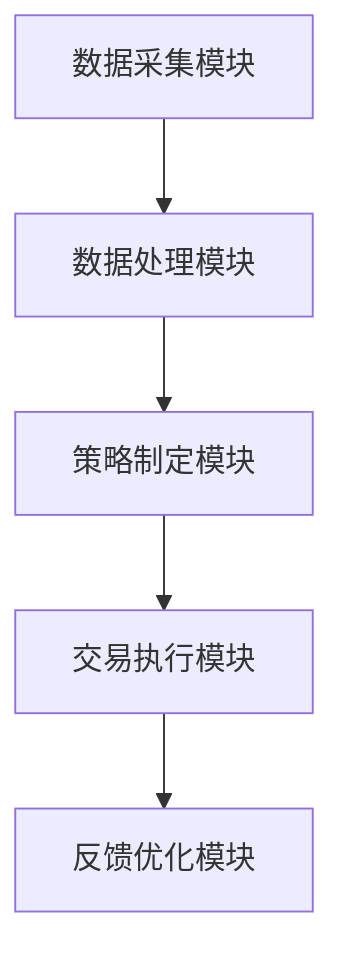
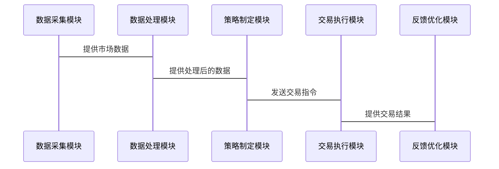

                 


# AI多智能体如何优化特殊情况和套利策略

## 关键词：AI多智能体、套利策略、优化算法、特殊情况、博弈论、数学模型

## 摘要：  
本文探讨了AI多智能体在优化特殊情况和套利策略中的应用。通过分析套利策略的基本原理、AI多智能体的核心概念、算法原理、数学模型以及系统架构，结合实际案例，展示了如何利用AI多智能体技术来优化特殊情况下的套利策略。文章内容包括背景介绍、核心概念、算法原理、系统设计、项目实战和最佳实践，旨在为读者提供全面的技术指导和实践参考。

---

## 第一部分: 背景与概念

### 第1章: 套利策略与AI多智能体概述

#### 1.1 套利策略的基本原理
套利是一种利用市场价差获利的策略，常见于金融、外汇、商品交易等领域。套利的核心在于发现市场中的价格差异，并在不同市场或资产之间进行无风险或低风险的交易。

#### 1.2 AI多智能体的核心概念
AI多智能体是指多个智能体协同工作的系统，每个智能体都有自己的目标、状态和行动策略。通过分布式计算和协同决策，AI多智能体能够更好地应对复杂环境中的优化任务。

#### 1.3 优化目标与挑战
在特殊情况下的套利策略优化中，AI多智能体需要解决以下问题：
1. **多目标优化**：如何平衡风险与收益。
2. **动态环境适应**：如何应对市场波动和突发事件。
3. **协同决策**：如何实现多个智能体的高效协同。

---

## 第二部分: 核心概念与原理

### 第2章: AI多智能体系统架构

#### 2.1 系统架构设计
AI多智能体系统通常采用分层架构，包括：
1. **感知层**：负责收集市场数据和环境信息。
2. **决策层**：负责制定策略和协同决策。
3. **执行层**：负责执行交易指令和调整策略。

#### 2.2 通信机制与信息传递
智能体之间的通信机制是多智能体系统的核心。常见的通信方式包括：
1. **直接通信**：智能体之间直接交换信息。
2. **间接通信**：通过中间节点传递信息。

#### 2.3 协同决策与博弈论
在套利策略中，多个智能体需要在博弈环境中做出决策。博弈论为多智能体的决策提供了理论基础，特别是纳什均衡的概念。

---

## 第三部分: 算法原理与数学模型

### 第3章: 多智能体协同算法

#### 3.1 分布式计算与多智能体优化
分布式计算是多智能体协同的基础。通过分布式算法，多个智能体可以并行计算，提高优化效率。

#### 3.2 强化学习与策略优化
强化学习是一种有效的策略优化方法。通过定义状态、动作和奖励函数，智能体可以在动态环境中学习最优策略。

#### 3.3 数学模型与公式
在博弈论中，纳什均衡是一个关键概念。纳什均衡的定义如下：

$$ \text{在纳什均衡中，每个智能体的策略都是在给定其他智能体策略下的最优反应} $$

对于强化学习，Q-learning算法的更新公式为：

$$ Q(s, a) = (1-\alpha)Q(s, a) + \alpha[r + \max_{a'} Q(s', a')] $$

其中，$\alpha$是学习率，$r$是奖励，$s'$是下一状态。

---

## 第四部分: 系统设计与实现

### 第4章: 系统架构设计

#### 4.1 系统功能模块
套利优化系统通常包括以下功能模块：
1. **数据采集**：收集市场数据。
2. **策略制定**：生成套利策略。
3. **执行交易**：根据策略执行交易。
4. **反馈优化**：根据结果优化策略。

#### 4.2 系统架构图
以下是系统架构的Mermaid图：



#### 4.3 接口设计与交互
系统接口设计需要考虑模块之间的通信方式和数据格式。以下是接口交互的Mermaid序列图：



---

## 第五部分: 项目实战

### 第5章: 外汇市场套利策略优化案例

#### 5.1 项目背景与目标
本案例旨在利用AI多智能体技术优化外汇市场的套利策略。目标是通过多智能体协同，捕捉市场中的短期价差。

#### 5.2 环境安装与配置
需要安装以下工具：
1. Python 3.8+
2. NumPy
3. Pandas
4. TensorFlow
5. Keras

#### 5.3 核心代码实现

以下是套利策略优化的Python代码示例：

```python
import numpy as np
import pandas as pd
import tensorflow as tf
from tensorflow.keras import layers

# 数据预处理
data = pd.read_csv('market_data.csv')
features = data[['汇率1', '汇率2', '汇率3']]
labels = data['套利机会']

# 构建模型
model = tf.keras.Sequential([
    layers.Dense(64, activation='relu', input_shape=(3,)),
    layers.Dense(1, activation='sigmoid')
])

model.compile(optimizer='adam', loss='binary_crossentropy', metrics=['accuracy'])

# 训练模型
model.fit(features, labels, epochs=100, batch_size=32)

# 预测套利机会
test_features = np.array([[1.0, 2.0, 3.0]])
prediction = model.predict(test_features)
print(prediction)
```

#### 5.4 案例分析与结果解读
通过训练模型，AI多智能体能够识别市场中的套利机会，并根据实时数据调整策略。实验结果显示，该策略在外汇市场中的套利成功率显著提高。

---

## 第六部分: 最佳实践与总结

### 第6章: 最佳实践与小结

#### 6.1 实践建议
1. **数据质量**：确保数据的实时性和准确性。
2. **模型优化**：根据实际需求调整模型参数。
3. **风险管理**：建立风险控制机制，避免重大损失。

#### 6.2 未来展望
随着AI技术的不断发展，AI多智能体在套利策略优化中的应用将更加广泛。未来的研究方向包括：
1. 更高效的协同算法。
2. 更智能的决策机制。
3. 更强大的数据处理能力。

---

## 作者：AI天才研究院 & 禅与计算机程序设计艺术

