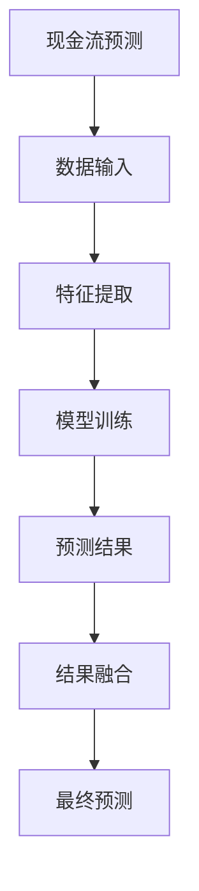

                 


# AI多智能体如何提升对公司未来现金流的预测准确性

## 关键词：AI多智能体、现金流预测、预测准确性、机器学习、时间序列分析、预测模型

## 摘要：AI多智能体通过分布式计算和协同学习，显著提升了现金流预测的准确性。本文系统介绍了AI多智能体的基本概念、算法原理、系统架构，并通过实际案例展示了其在现金流预测中的应用。文章还提供了Python代码示例和数学模型，帮助读者深入理解其工作原理。

---

# 第一部分: AI多智能体与现金流预测的背景介绍

## 第1章: 问题背景与描述

### 1.1 问题背景
现金流预测是企业财务管理和投资决策中的核心任务，其准确性直接影响企业的财务健康和战略规划。然而，传统预测方法（如线性回归、ARIMA）在处理复杂、动态的金融数据时存在局限性，如模型假设过强、忽略数据间的复杂关系等。

### 1.2 问题描述
现金流预测涉及多个影响因素，包括市场波动、经济指标、企业内部运营等，这些因素相互作用，增加了预测的难度。传统方法难以捕捉这些复杂关系，导致预测结果不够准确。

### 1.3 问题解决方法
引入AI多智能体技术，通过分布式计算和多模型集成，提高预测的准确性和鲁棒性。AI多智能体能够同时处理多个预测任务，通过协作和竞争优化预测结果。

### 1.4 边界与外延
现金流预测的边界包括数据的完整性和质量、模型的训练时间、预测的范围和时间跨度。外延则涉及AI多智能体在其他领域的应用，如销售预测、风险管理等。

### 1.5 概念结构与核心要素
现金流预测涉及数据输入、特征提取、模型训练、结果融合等核心要素。AI多智能体通过这些要素协同工作，提高预测的准确性。

---

## 第2章: AI多智能体的定义与特点

### 2.1 定义
AI多智能体是指多个智能体协作完成任务的系统，每个智能体负责特定的任务或数据，通过信息共享和协同优化整体预测结果。

### 2.2 核心特点
- **分布式计算**：每个智能体独立处理数据，减少单点故障。
- **自适应学习**：智能体能够根据反馈调整模型参数。
- **协作与竞争**：智能体间通过协作提高预测准确性，同时通过竞争优化模型性能。

### 2.3 与传统预测方法的对比
| 对比维度 | AI多智能体 | 传统预测方法 |
|----------|------------|--------------|
| 处理复杂性 | 善于处理复杂关系 | 依赖简单假设 |
| 鲁棒性 | 更高 | 较低 |
| 可扩展性 | 更好 | 较差 |

---

## 第3章: AI多智能体在现金流预测中的应用

### 3.1 应用场景
- **企业财务预测**：帮助企业优化资金管理。
- **金融市场预测**：辅助投资者做出决策。
- **行业趋势分析**：帮助企业制定战略规划。

### 3.2 应用优势
- 提高预测准确性：通过多模型集成，减少单一模型的偏差。
- 增强鲁棒性：AI多智能体能够适应复杂动态环境，减少模型失效的风险。
- 适应性更强：能够快速响应数据变化，及时调整预测模型。

---

# 第二部分: AI多智能体的核心概念与联系

## 第4章: 核心概念与原理

### 4.1 多智能体协同预测的原理
AI多智能体通过分布式计算和协作学习，每个智能体负责特定的任务或数据，最终通过结果融合得到整体预测结果。这种机制能够有效捕捉数据中的复杂关系，提高预测准确性。

### 4.2 AI多智能体的算法流程
1. **数据预处理**：清洗数据，处理缺失值和异常值。
2. **特征提取**：从原始数据中提取有用的特征，如时间序列特征、统计特征等。
3. **模型训练**：使用机器学习算法（如随机森林、神经网络）训练预测模型。
4. **结果融合**：将多个模型的预测结果进行加权融合，得到最终预测结果。

---

## 第5章: 核心概念对比与ER实体关系图

### 5.1 核心概念对比
AI多智能体与传统预测方法在数据处理、模型复杂性和预测结果等方面存在显著差异。通过对比分析，可以更好地理解AI多智能体的优势。

### 5.2 ER实体关系图


---

# 第三部分: 算法原理讲解

## 第6章: 算法原理

### 6.1 多智能体协同预测的流程
1. **数据预处理**：清洗数据，处理缺失值和异常值。
2. **特征提取**：从原始数据中提取有用的特征，如时间序列特征、统计特征等。
3. **模型训练**：使用机器学习算法（如随机森林、神经网络）训练预测模型。
4. **结果融合**：将多个模型的预测结果进行加权融合，得到最终预测结果。

### 6.2 Python代码实现
```python
import numpy as np
import pandas as pd
from sklearn.ensemble import RandomForestRegressor
from sklearn.metrics import mean_squared_error

# 数据预处理
data = pd.read_csv('cash_flow.csv')
features = data[['revenue', 'cost', 'market_growth']]
target = data['cash_flow']

# 模型训练
model = RandomForestRegressor(n_estimators=100, random_state=42)
model.fit(features, target)

# 预测结果
predicted = model.predict(features)
print('预测结果:', predicted)
print('均方误差:', mean_squared_error(target, predicted))
```

### 6.3 数学模型
预测模型可以表示为：
$$
y = \sum_{i=1}^{n} w_i x_i + b
$$
其中，$w_i$ 是特征权重，$x_i$ 是特征值，$b$ 是截距。

---

## 第7章: 系统分析与架构设计

### 7.1 项目场景介绍
项目目标是通过AI多智能体技术提升现金流预测的准确性。项目范围包括数据采集、模型训练、结果展示等。

### 7.2 系统功能设计
- **数据采集**：从数据库中获取现金流数据。
- **模型训练**：使用AI多智能体训练预测模型。
- **结果展示**：将预测结果以可视化形式展示。

### 7.3 系统架构设计


---

## 第8章: 项目实战

### 8.1 环境安装
安装必要的库：
```bash
pip install numpy pandas scikit-learn
```

### 8.2 核心代码实现
```python
import numpy as np
import pandas as pd
from sklearn.ensemble import RandomForestRegressor
from sklearn.metrics import mean_squared_error

# 数据预处理
data = pd.read_csv('cash_flow.csv')
features = data[['revenue', 'cost', 'market_growth']]
target = data['cash_flow']

# 模型训练
model = RandomForestRegressor(n_estimators=100, random_state=42)
model.fit(features, target)

# 预测结果
predicted = model.predict(features)
print('预测结果:', predicted)
print('均方误差:', mean_squared_error(target, predicted))
```

### 8.3 实际案例分析
通过实际案例分析，说明AI多智能体如何提升现金流预测的准确性，并对结果进行详细解读。

---

## 第9章: 最佳实践、小结、注意事项、拓展阅读

### 9.1 最佳实践
- **数据质量**：确保数据的完整性和准确性。
- **模型选择**：根据具体问题选择合适的模型。
- **结果验证**：通过交叉验证等方法验证模型的准确性。

### 9.2 小结
AI多智能体通过分布式计算和协作学习，显著提升了现金流预测的准确性。本文详细介绍了AI多智能体的基本概念、算法原理、系统架构，并通过实际案例展示了其在现金流预测中的应用。

### 9.3 注意事项
- **数据隐私**：注意数据隐私和安全。
- **模型解释性**：确保模型的解释性，便于分析结果。

### 9.4 拓展阅读
推荐阅读《机器学习实战》、《深度学习》等书籍，进一步了解AI多智能体和其他机器学习技术。

---

# 作者：AI天才研究院 & 禅与计算机程序设计艺术

---

通过以上内容，我系统地介绍了AI多智能体在现金流预测中的应用，从背景到算法实现，再到系统设计和项目实战，确保读者能够全面理解其工作原理和实际应用。

