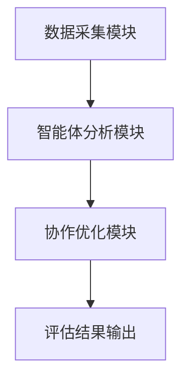
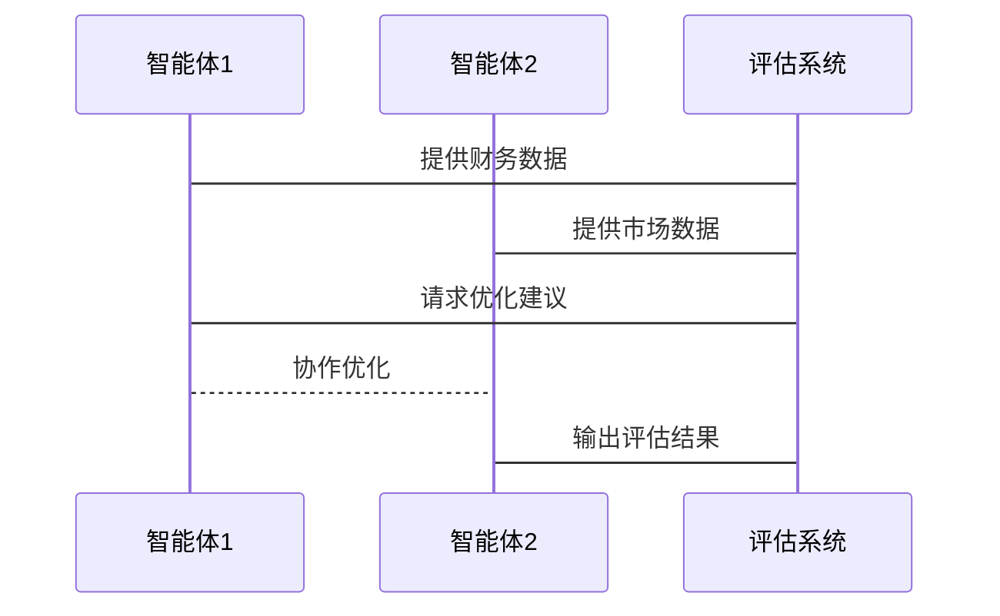

                 


# AI多智能体如何提升对公司长期盈利能力的评估

> 关键词：AI多智能体、企业盈利能力、长期盈利能力、多智能体系统、AI决策优化、企业评估系统

> 摘要：本文详细探讨了AI多智能体技术在提升企业长期盈利能力评估中的应用。通过分析AI多智能体的基本概念、系统原理、算法实现、系统架构设计、项目实战以及最佳实践，本文为读者提供了从理论到实践的全面指导，帮助企业在数字化转型中优化决策，提升盈利能力。

---

# 第一部分: AI多智能体与企业长期盈利能力评估的背景与概念

## 第1章: AI多智能体的基本概念与问题背景

### 1.1 AI多智能体的定义与特点

#### 1.1.1 多智能体系统的定义
多智能体系统（Multi-Agent System, MAS）是由多个智能体组成的分布式系统，每个智能体能够独立感知环境、自主决策并与其他智能体协作完成复杂任务。

#### 1.1.2 AI多智能体的核心特点
- **分布式性**：多个智能体分布在不同的位置，独立运作。
- **协作性**：智能体之间通过通信和协作完成共同目标。
- **自主性**：每个智能体都能自主决策，无需外部干预。
- **动态性**：环境和任务可能动态变化，智能体需实时调整策略。

#### 1.1.3 多智能体与单智能体的对比
| 对比维度 | 多智能体 | 单智能体 |
|----------|----------|----------|
| 系统结构 | 分布式   | 集中式   |
| 决策方式 | 分散决策 | 中央决策 |
| 可扩展性 | 高       | 低       |
| 灵活性   | 高       | 低       |

### 1.2 企业长期盈利能力评估的背景

#### 1.2.1 传统企业盈利能力评估方法的局限性
- **数据依赖性**：传统方法依赖历史数据，难以预测未来变化。
- **决策延迟**：人工分析耗时长，无法实时响应市场变化。
- **单一视角**：缺乏多维度的数据分析，决策不够全面。

#### 1.2.2 数字化转型对企业盈利能力的影响
- **数据驱动**：通过大数据分析优化决策。
- **智能化**：AI技术的应用提升预测和决策能力。
- **实时性**：实时数据分析支持快速响应。

#### 1.2.3 AI多智能体在企业决策中的潜在价值
- **多维度分析**：通过多个智能体分别分析财务、市场、运营等数据。
- **协同优化**：智能体协作找出最优解决方案。
- **动态调整**：实时适应市场变化，优化盈利能力。

### 1.3 问题描述与解决思路

#### 1.3.1 问题背景分析
企业在评估长期盈利能力时面临数据复杂、决策难度大、变化快等问题。

#### 1.3.2 问题解决的关键点
- **多维度数据分析**：通过多个智能体分别分析不同维度的数据。
- **智能体协作**：智能体协同工作，提供全面的评估结果。
- **动态优化**：根据市场变化实时调整评估策略。

#### 1.3.3 AI多智能体在企业盈利能力评估中的应用框架
AI多智能体系统通过数据采集、分析、协作和优化，帮助企业提升盈利能力评估的准确性和效率。

---

## 第2章: AI多智能体系统的原理与核心概念

### 2.1 多智能体系统的原理

#### 2.1.1 多智能体系统的组成结构
- **智能体**：独立的决策单元，负责特定任务。
- **通信机制**：智能体之间的信息交换方式。
- **协作机制**：智能体如何协同完成任务。

#### 2.1.2 智能体之间的通信机制
- **直接通信**：智能体间直接交换信息。
- **间接通信**：通过中间媒介传递信息。

#### 2.1.3 多智能体协作的基本原理
- **任务分解**：将整体任务分解为多个子任务。
- **协作协调**：智能体协作完成子任务，最终实现整体目标。

### 2.2 AI多智能体的核心概念

#### 2.2.1 智能体的自主性与社会性
- **自主性**：智能体能够独立决策。
- **社会性**：智能体之间需要协作完成任务。

#### 2.2.2 多智能体系统的动态性与复杂性
- **动态性**：环境和任务可能随时变化。
- **复杂性**：多个智能体协作可能导致系统复杂。

#### 2.2.3 AI多智能体的决策机制
- **分布式决策**：每个智能体独立决策。
- **协作决策**：智能体协作制定决策。

### 2.3 多智能体系统与企业盈利能力的关系

#### 2.3.1 多智能体系统在企业决策中的作用
- **数据整合**：多个智能体整合不同数据源的信息。
- **实时分析**：快速分析数据，提供实时决策支持。
- **优化建议**：通过协作找到最优解决方案。

#### 2.3.2 多智能体系统如何优化企业盈利能力
- **多维度分析**：从财务、市场、运营等多个维度分析企业盈利能力。
- **动态调整**：根据市场变化实时调整策略，提升盈利能力。

---

## 第3章: AI多智能体系统的算法与协作机制

### 3.1 多智能体协作的算法原理

#### 3.1.1 分布式计算与博弈论
- **分布式计算**：任务分解到多个智能体，分别计算。
- **博弈论**：智能体之间的策略选择和优化。

#### 3.1.2 基于博弈论的多智能体协作
- **纳什均衡**：多个智能体策略的稳定状态。
- **协作机制**：智能体如何通过博弈论找到最优策略。

#### 3.1.3 多智能体协作的数学模型
$$ V = \max_{i} \sum_{j=1}^{n} a_{ij} $$
其中，$V$ 是整体价值，$a_{ij}$ 是智能体$i$和$j$的协作收益。

### 3.2 多智能体系统的协作优化

#### 3.2.1 协作优化的数学模型
$$ \text{Maximize } \sum_{i=1}^{m} v_i $$
其中，$v_i$ 是智能体$i$的贡献值，$m$ 是智能体数量。

#### 3.2.2 基于强化学习的协作优化
- **强化学习**：智能体通过与环境互动，学习最优策略。
- **策略优化**：通过强化学习不断优化智能体的协作策略。

### 3.3 多智能体系统的动态适应

#### 3.3.1 动态环境下的协作机制
- **实时感知**：智能体实时感知环境变化。
- **动态调整**：根据环境变化调整协作策略。

#### 3.3.2 动态协作的实现方法
- **自适应算法**：智能体根据环境变化调整算法参数。
- **反馈机制**：通过反馈不断优化协作策略。

---

## 第4章: 企业盈利能力评估的系统设计与实现

### 4.1 系统架构设计

#### 4.1.1 系统功能模块
- **数据采集模块**：采集企业财务、市场、运营等数据。
- **智能体分析模块**：多个智能体分别分析不同数据。
- **协作优化模块**：智能体协作优化评估结果。

#### 4.1.2 系统架构图


### 4.2 系统交互流程

#### 4.2.1 交互流程图


### 4.3 系统实现与代码示例

#### 4.3.1 环境安装
- Python 3.8+
- NumPy, Pandas, Scikit-learn

#### 4.3.2 核心代码实现
```python
import numpy as np
import pandas as pd

class Agent:
    def __init__(self, data):
        self.data = data
        self.model = self.build_model()

    def build_model(self):
        # 构建模型
        pass

    def analyze(self):
        # 分析数据
        return self.model.predict(self.data)

def main():
    # 数据采集
    data = pd.read_csv('input.csv')
    agent1 = Agent(data)
    agent2 = Agent(data)
    
    result1 = agent1.analyze()
    result2 = agent2.analyze()
    
    # 协作优化
    optimized = np.max([result1, result2])
    
    print("优化结果:", optimized)

if __name__ == "__main__":
    main()
```

---

## 第5章: 项目实战与案例分析

### 5.1 项目背景与目标
- **项目背景**：提升某企业长期盈利能力的评估准确性。
- **项目目标**：利用AI多智能体技术优化评估过程。

### 5.2 项目实施步骤
1. 数据采集：收集企业的财务、市场、运营数据。
2. 系统设计：设计多智能体协作的系统架构。
3. 系统实现：编写智能体分析模块和协作优化模块。
4. 测试与优化：通过实际数据测试系统性能。
5. 应用与部署：将系统部署到企业中使用。

### 5.3 实际案例分析
通过实际案例，展示AI多智能体如何提升企业盈利能力评估的准确性和效率。

---

## 第6章: 最佳实践与未来展望

### 6.1 最佳实践 tips
- **数据质量**：确保数据的准确性和完整性。
- **模型优化**：定期优化智能体的协作算法。
- **系统维护**：及时更新系统，适应市场变化。

### 6.2 小结
本文详细探讨了AI多智能体技术在企业长期盈利能力评估中的应用，通过理论分析和实际案例，展示了其在提升企业决策能力中的巨大潜力。

### 6.3 未来展望
随着AI技术的不断发展，AI多智能体在企业盈利能力评估中的应用将更加广泛和深入，为企业带来更大的价值。

---

## 作者信息

作者：AI天才研究院 & 禅与计算机程序设计艺术

--- 

这篇文章详细介绍了AI多智能体在企业长期盈利能力评估中的应用，涵盖了从基本概念到系统设计、项目实战的各个方面，帮助读者全面理解并掌握相关技术。

