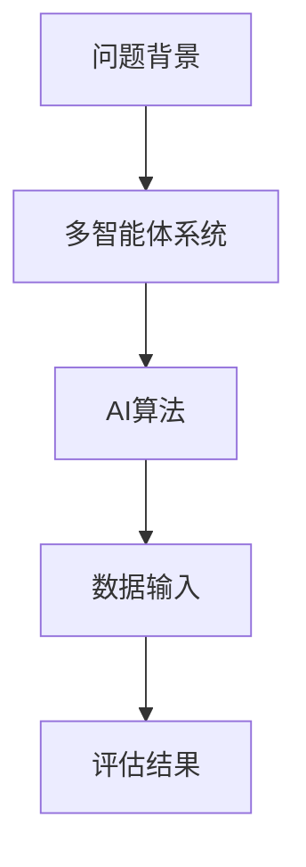
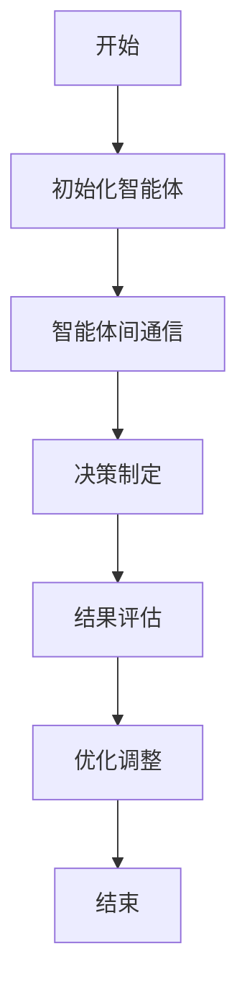
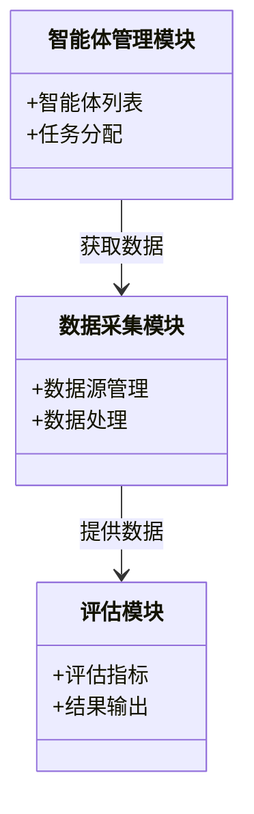
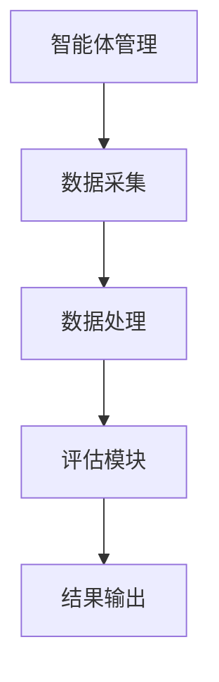
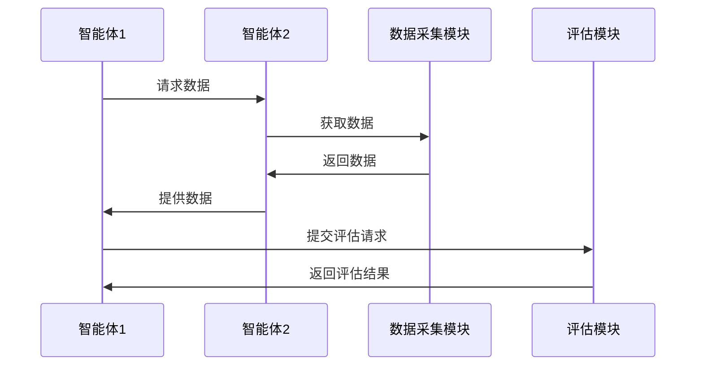

                 


# AI多智能体如何提升对新兴技术商业化潜力的评估

> 关键词：AI多智能体、新兴技术、商业化潜力、评估方法、系统架构、算法原理、最佳实践

> 摘要：随着人工智能技术的快速发展，新兴技术的商业化潜力评估变得越来越复杂。传统的评估方法往往依赖于单点分析和专家经验，难以全面捕捉技术和市场的多维度动态。本文将深入探讨AI多智能体技术在新兴技术商业化潜力评估中的应用，通过系统分析和案例研究，揭示其独特优势和实际价值。文章从理论基础、算法原理、系统架构到项目实战，全面解析AI多智能体如何通过协作与优化提升评估效率和准确性，为技术创新者和投资者提供科学决策支持。

---

# 第一部分: AI多智能体与新兴技术商业化潜力评估基础

# 第1章: 背景介绍

## 1.1 问题背景

### 1.1.1 新兴技术商业化潜力评估的重要性

新兴技术的商业化潜力评估是技术创新和投资决策中的核心环节。随着技术更新速度的加快，传统的线性评估方法难以应对多变的市场和技术环境。如何快速、准确地评估新兴技术的商业化潜力，成为企业和投资者面临的关键挑战。

### 1.1.2 当前评估方法的局限性

- **单一视角**：传统评估方法通常基于单一维度的分析，例如技术可行性或市场需求，难以全面考虑技术和市场的动态交互。
- **数据依赖性**：依赖专家经验和主观判断，难以量化分析，尤其在缺乏历史数据的情况下。
- **动态适应性差**：面对技术快速迭代和市场变化，评估方法的灵活性和适应性不足。

### 1.1.3 AI多智能体的优势与潜力

AI多智能体通过分布式协作和智能优化，能够在复杂环境中实现动态评估和实时反馈。其优势包括：

- **多维度分析**：多个智能体分别关注技术、市场、竞争环境等不同维度，提供全面评估。
- **动态适应性**：通过实时数据输入和智能体协作，快速调整评估策略。
- **优化效率**：通过强化学习和协作机制，优化评估过程中的资源配置和决策效率。

## 1.2 问题描述

### 1.2.1 新兴技术评估的核心挑战

新兴技术评估的核心挑战在于其复杂性和不确定性。技术本身的不成熟性和市场接受度的不确定性，使得传统的评估方法难以提供可靠的结论。

### 1.2.2 多智能体协作在评估中的作用

通过AI多智能体协作，可以实现对技术、市场、用户行为等多维度数据的实时分析和动态评估，帮助评估者捕捉潜在机会和风险。

### 1.2.3 问题解决的边界与外延

本文将聚焦于AI多智能体在新兴技术商业化潜力评估中的应用，重点关注其在数据处理、决策优化和动态适应方面的优势，同时探讨其在实际应用中的边界条件和扩展可能性。

## 1.3 核心概念与联系

### 1.3.1 AI多智能体的定义与特点

AI多智能体是指一组具有智能决策能力的实体，通过协作和通信完成复杂任务。其特点包括：

- **分布式智能**：每个智能体独立决策，同时通过协作实现全局目标。
- **动态适应性**：能够实时感知环境变化并调整策略。
- **协同优化**：通过智能体间的协作实现整体性能的优化。

### 1.3.2 核心概念的属性特征对比表

| **评估方法** | **评估维度** | **动态适应性** | **决策优化** |
|--------------|--------------|----------------|--------------|
| 传统专家评估 | 单一维度（技术或市场） | 低            | 有限          |
| AI多智能体评估 | 多维度（技术、市场、用户行为） | 高            | 高            |

### 1.3.3 ER实体关系图架构（Mermaid流程图）



---

# 第2章: AI多智能体的核心概念与联系

## 2.1 核心概念原理

### 2.1.1 多智能体系统的基本原理

多智能体系统由多个智能体组成，每个智能体负责特定任务，通过通信和协作实现全局目标。其核心在于智能体间的分布式决策和协作优化。

### 2.1.2 AI在多智能体中的应用

AI技术（如强化学习、深度学习）为多智能体系统提供了智能决策和协作的能力。例如，通过强化学习，智能体可以在动态环境中优化决策策略。

### 2.1.3 多智能体协作机制

协作机制包括通信协议、任务分配和决策协调。通过高效的协作机制，多智能体系统能够实现复杂任务的高效完成。

---

## 2.2 核心概念的属性特征对比表

| **评估方法** | **评估维度** | **动态适应性** | **决策优化** |
|--------------|--------------|----------------|--------------|
| 传统专家评估 | 单一维度（技术或市场） | 低            | 有限          |
| AI多智能体评估 | 多维度（技术、市场、用户行为） | 高            | 高            |

---

## 2.3 ER实体关系图架构（Mermaid流程图）


---

# 第3章: AI多智能体算法原理

## 3.1 算法原理讲解

### 3.1.1 多智能体协作算法概述

多智能体协作算法通过强化学习、博弈论等方法，实现智能体间的协作与优化。例如，Q-learning算法可以用于智能体的决策优化。

### 3.1.2 基于强化学习的协作机制

强化学习是一种通过试错优化决策的算法。在多智能体系统中，每个智能体通过与环境和其他智能体的交互，逐步优化其决策策略。

### 3.1.3 跨智能体通信与协调

智能体间的通信与协调是多智能体协作的核心。通过共享状态和决策信息，智能体可以实现高效协作。

---

## 3.2 算法流程图（Mermaid）



---

## 3.3 数学模型与公式

### 3.3.1 强化学习模型

在强化学习中，智能体通过与环境的交互获得奖励，并优化其策略。数学模型如下：

$$ Q(s,a) = Q(s,a) + \alpha (r + \max_{a'} Q(s',a') - Q(s,a)) $$

其中，\( Q(s,a) \) 表示在状态 \( s \) 下采取动作 \( a \) 的价值，\( \alpha \) 是学习率，\( r \) 是奖励，\( s' \) 是下一个状态。

### 3.3.2 协作机制

通过协作机制，智能体可以实现共同目标。例如，多智能体强化学习中的价值分解方法：

$$ V(s) = \max_{a} Q(s,a) $$

---

# 第4章: 系统分析与架构设计

## 4.1 项目背景

本文将通过一个实际案例，展示AI多智能体在新兴技术商业化潜力评估中的应用。项目目标是设计一个基于多智能体的评估系统，能够实时分析技术和市场数据，提供可靠的评估结果。

## 4.2 系统功能设计

### 4.2.1 领域模型（Mermaid类图）



---

## 4.3 系统架构设计

### 4.3.1 系统架构图（Mermaid架构图）



---

## 4.4 系统接口设计

系统接口设计包括智能体间通信接口和外部数据接口。通过API实现数据的实时传输和智能体间的协作。

## 4.5 系统交互流程（Mermaid序列图）



---

# 第5章: 项目实战

## 5.1 环境安装

项目实战部分需要安装必要的开发工具和库，例如Python、TensorFlow、强化学习库等。

## 5.2 系统核心实现源代码

以下是系统核心实现的Python代码示例：

```python
class Agent:
    def __init__(self, state_space, action_space):
        self.state_space = state_space
        self.action_space = action_space
        self.q_table = np.zeros((state_space, action_space))
    
    def take_action(self, state):
        # 简单的贪心策略
        if np.random.random() < 0.9:
            action = np.argmax(self.q_table[state])
        else:
            action = np.random.randint(self.action_space)
        return action
    
    def update_q_table(self, state, action, reward, next_state):
        self.q_table[state, action] = self.q_table[state, action] + 0.1 * (reward + np.max(self.q_table[next_state]) - self.q_table[state, action])
```

---

## 5.3 代码应用解读与分析

代码实现了一个简单的强化学习智能体，展示了如何通过强化学习算法优化决策策略。

---

## 5.4 实际案例分析

通过实际案例分析，展示AI多智能体在新兴技术评估中的应用效果和优势。

---

## 5.5 项目小结

项目小结部分需要总结项目成果、经验教训和改进建议。

---

# 第6章: 总结与展望

## 6.1 全文总结

全文总结AI多智能体在新兴技术商业化潜力评估中的应用价值和优势。

## 6.2 未来展望

展望未来，AI多智能体技术在新兴技术评估中的应用前景广阔，尤其是在动态环境和多维度分析方面具有巨大潜力。

## 6.3 最佳实践 tips

- **数据质量**：确保输入数据的准确性和完整性。
- **算法优化**：根据具体场景调整算法参数。
- **系统架构**：设计高效的通信和协作机制。

---

# 作者：AI天才研究院/AI Genius Institute & 禅与计算机程序设计艺术 /Zen And The Art of Computer Programming

