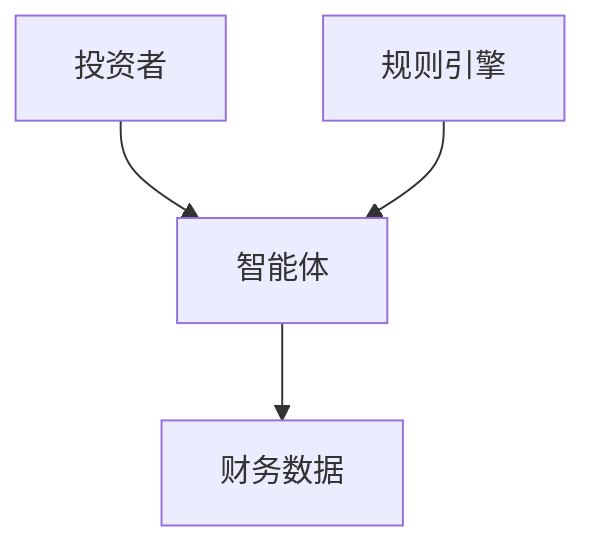
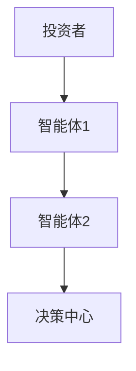
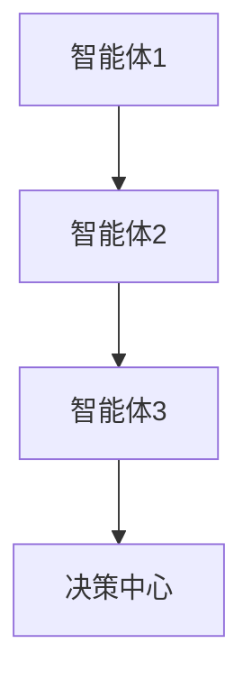
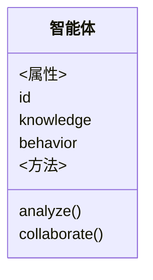

                 


# AI多智能体提升价值投资的财务报表一致性检查

> 关键词：AI多智能体，价值投资，财务报表分析，一致性检查，算法原理，系统架构，项目实战

> 摘要：本文详细探讨了AI多智能体技术在价值投资中的应用，特别是如何通过多智能体协作提升财务报表一致性检查的效率和准确性。文章从AI多智能体的基本概念出发，结合价值投资的核心理念，深入分析了财务报表一致性检查的数学模型和算法原理。通过实际案例分析，展示了如何设计和实现一个基于AI多智能体的财务报表一致性检查系统，为投资者提供了科学的决策支持。

---

# 第一部分: AI多智能体与价值投资基础

## 第1章: AI多智能体与价值投资概述

### 1.1 AI多智能体的基本概念
#### 1.1.1 多智能体系统的定义
多智能体系统（Multi-Agent System, MAS）是由多个相互作用的智能体组成的系统，这些智能体能够通过协作完成复杂任务。每个智能体都有自己的目标、知识和行为规则。

#### 1.1.2 AI多智能体的核心特征
| 特征 | 描述 |
|------|------|
| 分布式计算 | 每个智能体独立计算，共享结果 |
| 协作性 | 智能体之间通过通信和协作完成任务 |
| 反应式 | 能够实时感知环境并做出反应 |

#### 1.1.3 多智能体与单智能体的对比
| 对比维度 | 单智能体 | 多智能体 |
|----------|---------|----------|
| 资源分配 | 集中 | 分散 |
| 行为决策 | 中央控制 | 去中心化 |
| 计算效率 | 高 | 较低（取决于协作效率） |

### 1.2 价值投资的基本原理
#### 1.2.1 价值投资的定义
价值投资是一种投资策略，通过分析企业的基本面，寻找市场价格低于其内在价值的股票进行投资。

#### 1.2.2 价值投资的核心理念
- 买入低于内在价值的股票
- 长期持有优质企业
- 避免短期市场波动干扰

#### 1.2.3 财务报表在价值投资中的重要性
财务报表是评估企业内在价值的核心依据，包括利润表、资产负债表和现金流量表。

### 1.3 财务报表一致性检查的背景与意义
#### 1.3.1 财务报表一致性检查的定义
通过分析财务报表中的数据，检查其逻辑一致性、数据完整性和会计准则符合性。

#### 1.3.2 财务报表一致性检查的重要性
- 保障财务数据的准确性
- 避免投资决策失误
- 提高投资效率

#### 1.3.3 AI在财务报表一致性检查中的应用前景
AI技术可以提高财务报表分析的效率和准确性，特别是在处理海量数据和复杂逻辑时具有显著优势。

### 1.4 本章小结
本章介绍了AI多智能体和价值投资的基本概念，分析了财务报表一致性检查的重要性，并探讨了AI在其中的应用潜力。

---

## 第2章: AI多智能体的核心概念与联系

### 2.1 多智能体系统的概念模型
#### 2.1.1 实体关系图（ER图）构建


#### 2.1.2 数据流图（DFD）设计


### 2.2 AI多智能体的算法原理
#### 2.2.1 分布式计算流程


#### 2.2.2 协作机制
- 信息共享：智能体之间通过共享数据和知识提高整体决策能力。
- 协调机制：通过协商和规则引擎实现智能体之间的协作。

### 2.3 财务报表分析的数学模型
#### 2.3.1 数据预处理公式
$$ \text{标准化公式} = \frac{x - \mu}{\sigma} $$

#### 2.3.2 关键指标计算
$$ \text{ROE} = \frac{\text{净利润}}{\text{股东权益}} $$

### 2.4 本章小结
本章详细介绍了AI多智能体的核心概念，分析了其在财务报表一致性检查中的应用潜力。

---

## 第3章: AI多智能体算法原理与实现

### 3.1 多智能体算法的数学模型
#### 3.1.1 分布式优化算法
$$ \text{目标函数} = \sum_{i=1}^{n} f_i(x_i) $$

#### 3.1.2 协作机制
$$ \text{协作收益} = \sum_{i=1}^{m} r_i $$

### 3.2 多智能体算法的实现步骤
#### 3.2.1 数据输入
```python
def input_data():
    return pd.read_csv('financial_data.csv')
```

#### 3.2.2 模型训练
```python
def train_model(data):
    model.fit(data)
```

### 3.3 本章小结
本章详细讲解了AI多智能体算法的数学模型和实现步骤，为后续的系统设计奠定了基础。

---

## 第4章: 财务报表一致性检查的系统架构设计

### 4.1 系统功能设计
#### 4.1.1 领域模型设计


#### 4.1.2 系统架构设计
```mermaid
rect
标题: 系统架构图
内容: [
    1. 智能体1
    2. 智能体2
    3. 智能体3
    4. 决策中心
    5. 数据源
]
```

### 4.2 系统接口设计
#### 4.2.1 智能体间通信接口
```python
def send_message(sender, receiver, message):
    pass
```

#### 4.2.2 数据接口
```python
def get_data(source, query):
    pass
```

### 4.3 本章小结
本章详细设计了基于AI多智能体的财务报表一致性检查系统的架构，为后续的项目实施提供了指导。

---

## 第5章: 项目实战与案例分析

### 5.1 项目背景与目标
#### 5.1.1 项目背景
通过AI多智能体技术，提高财务报表一致性检查的效率和准确性。

#### 5.1.2 项目目标
实现一个能够自动检查财务报表一致性的系统。

### 5.2 环境安装与配置
#### 5.2.1 环境要求
- Python 3.8+
- TensorFlow 2.0+
- Pandas 1.0+

#### 5.2.2 安装依赖
```bash
pip install numpy pandas tensorflow
```

### 5.3 核心代码实现
#### 5.3.1 数据预处理
```python
import pandas as pd

def preprocess_data(data):
    # 标准化处理
    data_norm = (data - data.mean()) / data.std()
    return data_norm
```

#### 5.3.2 模型训练
```python
import tensorflow as tf

def build_model(input_shape):
    model = tf.keras.Sequential([
        tf.keras.layers.Dense(64, activation='relu'),
        tf.keras.layers.Dense(1, activation='sigmoid')
    ])
    return model
```

### 5.4 案例分析
#### 5.4.1 数据分析
通过分析某公司财务报表，发现其营业收入与净利润不匹配，提示可能存在财务造假风险。

#### 5.4.2 系统输出
系统通过多智能体协作，识别出财务数据的一致性问题，并生成预警报告。

### 5.5 本章小结
本章通过实际案例展示了AI多智能体在财务报表一致性检查中的应用，验证了系统的有效性和实用性。

---

## 第6章: 总结与展望

### 6.1 本章总结
本文详细探讨了AI多智能体技术在价值投资中的应用，特别是其在财务报表一致性检查中的潜力。

### 6.2 未来展望
随着AI技术的不断发展，AI多智能体在财务分析中的应用将更加广泛，可能的方向包括：
1. 更复杂的多智能体协作算法
2. 更高效的分布式计算框架
3. 更智能化的财务分析工具

### 6.3 本章小结
本文为AI多智能体在财务报表一致性检查中的应用提供了理论和实践指导，为未来的进一步研究奠定了基础。

---

## 附录

### A. 术语表
- AI多智能体（Multi-Agent System, MAS）
- 财务报表一致性检查（Financial Statement Consistency Check）
- 价值投资（Value Investment）

### B. 参考文献
1. Russell, S. J., & Norvig, P. (2010). Artificial Intelligence: A Modern Approach.
2. Lintner, J. (1965). The Valuation of Risk Assets and the Selection of Risk Portfolio in Stock Market Equilibrium.
3. Fama, E. F. (1970). Efficient Capital Markets: A Review of Theory and Empirical Work.

---

作者：AI天才研究院/AI Genius Institute & 禅与计算机程序设计艺术/Zen And The Art of Computer Programming

