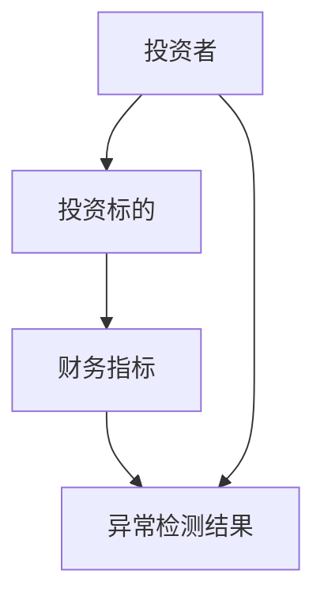
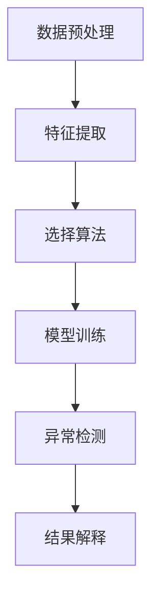
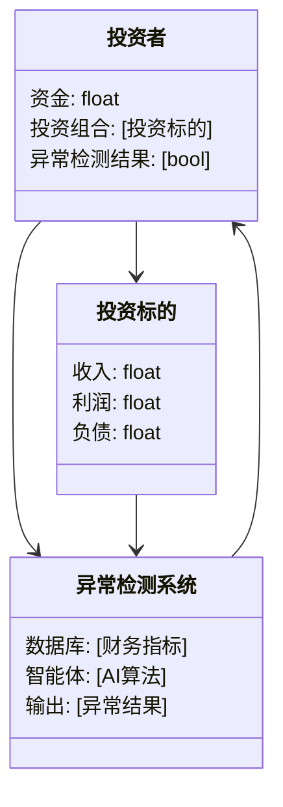
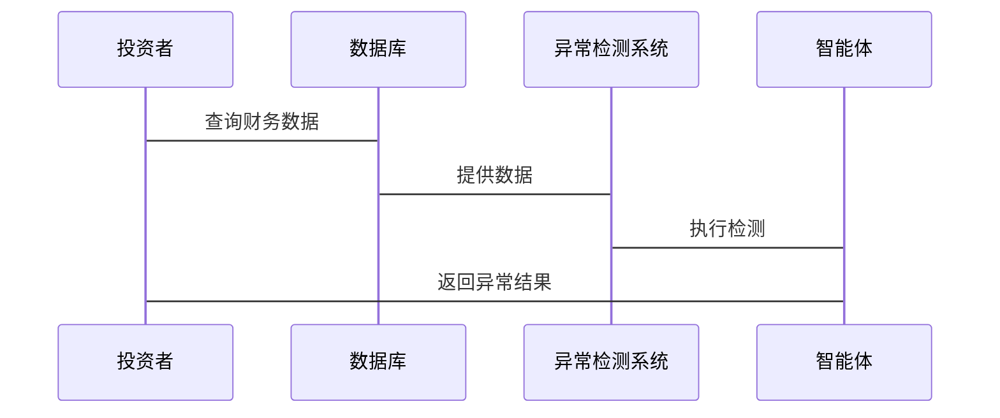

                 


# AI多智能体提升价值投资的财务指标异常检测

> **关键词**: 价值投资, 多智能体, 财务指标, 异常检测, 人工智能, 机器学习

> **摘要**: 本文探讨了如何利用AI多智能体技术提升价值投资中的财务指标异常检测。通过分析多智能体系统的原理、异常检测算法的数学模型，结合实际案例，展示了如何在金融领域应用这些技术，以实现高效、准确的异常检测，从而支持价值投资决策。

---

## 第1章: 价值投资与财务指标异常检测

### 1.1 价值投资的基本概念

#### 1.1.1 价值投资的定义

价值投资是一种投资策略，旨在通过分析企业的基本面，如财务状况、行业地位和管理团队，寻找被市场低估的投资标的。其核心理念是购买低于其内在价值的资产，长期持有，等待市场重新认识其价值。

#### 1.1.2 价值投资的核心理念

- **内在价值**: 资产的真实价值，与市场波动无关。
- **安全边际**: 投资价格低于内在价值的部分，提供安全空间。
- **长期视角**: 价值投资强调长期持有，避免短期市场波动的影响。

#### 1.1.3 价值投资在现代金融中的地位

价值投资是投资学的重要流派之一，尤其在市场波动剧烈时，其长期稳定的收益吸引了大量投资者。然而，传统价值投资依赖人工分析，效率低下且难以应对海量数据。

### 1.2 财务指标异常检测的重要性

#### 1.2.1 财务指标异常的定义

财务指标异常指财务数据偏离正常范围，可能反映企业经营问题或财务造假。常见的财务指标包括收入、利润、资产负债率等。

#### 1.2.2 异常检测在价值投资中的作用

- **识别风险**: 及时发现财务异常，避免投资损失。
- **提高效率**: 通过技术手段快速筛选异常企业。
- **增强决策**: 异常检测为投资决策提供数据支持。

#### 1.2.3 异常检测的挑战与机遇

- **挑战**: 数据噪声多、异常样本少、模型过拟合。
- **机遇**: AI技术的进步提供了新的解决方案。

### 1.3 AI多智能体技术的引入

#### 1.3.1 多智能体系统的定义

多智能体系统由多个分布式智能体组成，通过协同完成复杂任务。每个智能体负责特定子任务，通过通信和协调实现整体目标。

#### 1.3.2 多智能体在金融领域的应用

- **高频交易**: 多智能体协同决策提高交易效率。
- **风险控制**: 分布式智能体实时监控市场风险。
- **数据挖掘**: 多智能体协同分析大数据。

#### 1.3.3 AI多智能体的优势与潜力

- **分布式计算**: 提高处理效率。
- **协同决策**: 提升决策准确性。
- **适应性强**: 能够应对复杂金融环境。

---

## 第2章: 核心概念与联系

### 2.1 AI多智能体系统的原理

#### 2.1.1 多智能体系统的组成

- **智能体**: 具有感知和行动能力的实体。
- **通信机制**: 智能体间的信息交换方式。
- **协同算法**: 智能体协作的规则和方法。

#### 2.1.2 AI算法的核心原理

- **监督学习**: 基于标记数据训练模型。
- **无监督学习**: 通过数据内在结构发现规律。
- **强化学习**: 通过奖励机制优化决策。

#### 2.1.3 系统协同工作的机制

- **任务分配**: 根据智能体能力分配任务。
- **信息共享**: 智能体间共享数据和信息。
- **协调控制**: 中央控制节点协调智能体行动。

### 2.2 财务指标异常检测的数学模型

#### 2.2.1 异常检测的数学定义

异常检测旨在识别数据中的异常点，常用的距离度量包括欧氏距离和马氏距离。

#### 2.2.2 基于统计的异常检测方法

- **Z-score**: 衡量数据点与均值的距离。
  $$ Z = \frac{X - \mu}{\sigma} $$
- **箱线图**: 识别数据中的 outliers。

#### 2.2.3 基于机器学习的异常检测方法

- **Isolation Forest**: 通过树结构隔离异常点。
- **One-Class SVM**: 学习正常数据的分布，识别异常。

### 2.3 核心概念对比分析

#### 2.3.1 多智能体与单智能体的对比

| 特性            | 单智能体             | 多智能体             |
|-----------------|----------------------|----------------------|
| 处理能力        | 单一任务处理能力     | 多任务协同处理能力   |
| 并行性          | 串行处理             | 并行处理             |
| 容错性          | 单点故障风险         | 分布式容错能力       |

#### 2.3.2 ER实体关系图



---

## 第3章: 算法原理讲解

### 3.1 异常检测算法流程图



### 3.2 Python核心代码实现

```python
from sklearn.ensemble import IsolationForest

# 数据预处理
data = ...  # 加载数据
data = data.dropna()  # 删除缺失值

# 特征提取
features = data[[' revenue', 'profit', 'debt']]

# 模型训练
model = IsolationForest(n_estimators=100, random_state=42)
model.fit(features)

# 异常检测
outliers = model.predict(features)
outliers[outliers == -1] = 1  # 标记异常值

# 结果解释
result = pd.DataFrame({
    '财务指标': ['收入', '利润', '负债'],
    '异常值': [outliers[i] for i in range(len(features))]
})
print(result)
```

### 3.3 数学模型与公式

#### 3.3.1 Isolation Forest算法

Isolation Forest通过构建树结构隔离异常点。树的深度决定了异常点的隔离程度。

$$ \text{异常概率} = \frac{1}{2^{\text{树深度}}} $$

#### 3.3.2 One-Class SVM

One-Class SVM通过学习正常数据的分布，识别异常点。

$$ \text{损失函数} = \sum_{i=1}^{n} (y_i - y_{\text{pred}})^2 $$

---

## 第4章: 系统分析与架构设计

### 4.1 系统功能设计

#### 4.1.1 领域模型



#### 4.1.2 系统架构


#### 4.1.3 接口设计

- **输入接口**: 接收财务指标数据。
- **输出接口**: 提供异常检测结果。

#### 4.1.4 交互流程图



---

## 第5章: 项目实战

### 5.1 环境安装

- **Python**: 3.8+
- **库**: scikit-learn, pandas, mermaid

### 5.2 核心代码实现

```python
import pandas as pd
from sklearn.ensemble import IsolationForest

# 数据加载
data = pd.read_csv('financial_data.csv')

# 数据预处理
data = data.dropna()

# 特征提取
features = data[[' revenue', 'profit', 'debt']]

# 模型训练
model = IsolationForest(n_estimators=100, random_state=42)
model.fit(features)

# 检测异常
outliers = model.predict(features)
outliers[outliers == -1] = 1

# 结果分析
result = pd.DataFrame({
    '指标': ['收入', '利润', '负债'],
    '异常值': [outliers[i] for i in range(len(features))]
})
print(result)
```

### 5.3 案例分析

假设我们分析某公司财务数据，异常检测系统识别出收入和利润异常，提示可能存在财务造假。投资者据此调整投资策略，避免潜在损失。

---

## 第6章: 最佳实践与小结

### 6.1 小结

AI多智能体技术显著提升了财务指标异常检测的效率和准确性，为价值投资提供了有力支持。

### 6.2 注意事项

- **数据质量**: 确保数据准确性和完整性。
- **模型调优**: 根据实际情况调整算法参数。
- **实时监控**: 定期更新模型，适应市场变化。

### 6.3 拓展阅读

- [书籍]: 《Python机器学习》
- [论文]: "Isolation Forest: A New Supervised Algorithm for Fast Unsupervised Outlier Detection"

---

# 作者：AI天才研究院 & 禅与计算机程序设计艺术

