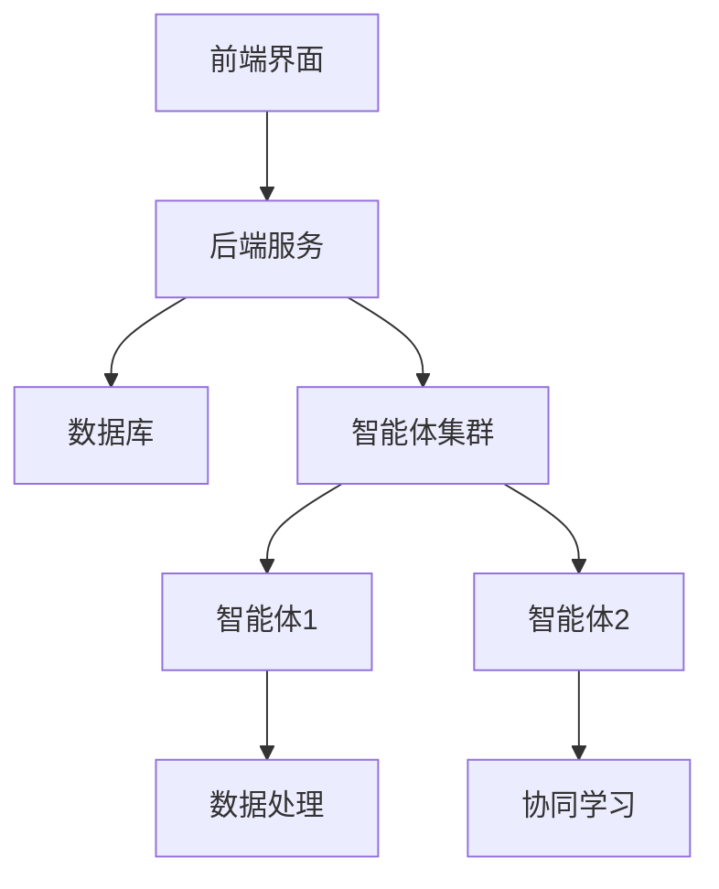

                 


# AI多智能体提升价值投资的财务舞弊检测

> **关键词**：AI多智能体、价值投资、财务舞弊检测、金融数据分析、异常检测、协同学习

> **摘要**：  
> 本文探讨了AI多智能体技术在价值投资中的应用，特别是如何利用多智能体系统提升财务舞弊检测的准确性。通过分析多智能体系统的协同学习机制、异常检测算法以及系统架构设计，本文详细阐述了如何利用AI技术优化财务数据分析流程，帮助投资者识别潜在的财务舞弊行为。文章结合理论与实践，提供了从系统设计到项目实现的完整解决方案。

---

# 第1章 AI多智能体与价值投资的背景介绍

## 1.1 AI多智能体的核心概念

### 1.1.1 多智能体系统的基本定义  
多智能体系统（Multi-Agent System, MAS）是由多个独立但协作的智能体组成的系统，每个智能体都有自己的目标、行为和决策机制。这些智能体通过通信和协作完成复杂的任务。

### 1.1.2 AI多智能体的独特优势  
AI多智能体结合了人工智能技术，能够实现自主学习、推理和优化。其优势包括：  
- **分布式计算**：通过多个智能体协同工作，提升计算效率。  
- **自适应性**：智能体能够根据环境变化调整行为。  
- **协作优化**：多个智能体通过协作实现全局最优解。

### 1.1.3 多智能体在金融领域的应用潜力  
在金融领域，多智能体系统可以用于股票交易、风险管理、市场预测等场景。特别是在财务舞弊检测方面，多智能体的协作能力能够显著提升检测的准确性和效率。

---

## 1.2 价值投资与财务舞弊检测

### 1.2.1 价值投资的基本原理  
价值投资是一种投资策略，通过分析企业的基本面（如财务报表、盈利能力、行业地位等）来判断其内在价值，寻找被市场低估的投资标的。

### 1.2.2 财务舞弊的定义与分类  
财务舞弊是指通过虚构、隐瞒或 manipulation财务数据，误导投资者或利益相关者的经济行为。常见的舞弊类型包括虚构收入、虚减费用、隐藏负债等。

### 1.2.3 财务舞弊检测的难点与挑战  
- 数据复杂性：财务数据涉及多个维度，且舞弊行为往往隐蔽。  
- 数据量大：需要处理大量的历史和实时数据。  
- 舞弊手段多样：舞弊者会不断变换手法，增加检测难度。

---

## 1.3 AI多智能体在财务舞弊检测中的应用前景

### 1.3.1 传统财务舞弊检测的局限性  
传统方法主要依赖财务指标分析和人工审核，存在效率低、漏检率高、难以应对复杂舞弊手段等问题。

### 1.3.2 AI多智能体的优势与创新  
- **高效性**：多智能体系统能够快速处理海量数据，提高检测效率。  
- **准确性**：通过协同学习和异常检测算法，提升舞弊识别的精准率。  
- **适应性**：能够实时调整检测策略，应对新型舞弊手段。

### 1.3.3 价值投资与财务舞弊检测的结合点  
通过AI多智能体技术，投资者可以在价值投资中更准确地识别财务舞弊行为，避免因虚假信息导致的投资损失。

---

## 1.4 本章小结  
本章介绍了AI多智能体的核心概念及其在金融领域的应用潜力，重点分析了价值投资与财务舞弊检测的基本原理和难点。通过对比传统方法与AI多智能体的优势，提出了利用多智能体技术提升财务舞弊检测的创新思路。

---

# 第2章 多智能体系统的核心概念与联系

## 2.1 多智能体系统的原理

### 2.1.1 多智能体系统的组成要素  
- **智能体**：具有感知、决策和行动能力的个体。  
- **通信机制**：智能体之间交换信息的通道。  
- **协作协议**：定义智能体协作规则的协议。  
- **环境**：智能体所处的外部环境。

### 2.1.2 多智能体系统的通信机制  
智能体之间的通信可以通过直接交换消息或通过中间媒介实现。通信内容包括数据、状态和指令。

### 2.1.3 多智能体系统的协同学习  
协同学习是多智能体系统的重要特征，通过智能体之间的协作，实现知识共享和任务优化。

---

## 2.2 财务舞弊检测的核心要素

### 2.2.1 财务数据的特征分析  
财务数据包括收入、支出、资产、负债等，需要分析其波动性、趋势和异常值。

### 2.2.2 财务舞弊的模式识别  
通过分析历史舞弊案例，识别常见的舞弊模式，如收入虚增、成本虚减等。

### 2.2.3 财务舞弊检测的评价指标  
- **准确率**：检测结果与实际舞弊情况的匹配程度。  
- **召回率**：检测出的舞弊案例占实际舞弊案例的比例。  
- **F1分数**：综合准确率和召回率的指标。

---

## 2.3 多智能体与财务舞弊检测的关联性分析

### 2.3.1 多智能体在数据处理中的作用  
多智能体系统能够并行处理大量财务数据，提高数据处理效率。

### 2.3.2 多智能体在模式识别中的应用  
通过协同学习，多智能体能够识别复杂的舞弊模式，提升检测准确性。

### 2.3.3 多智能体在决策支持中的优势  
多智能体系统能够提供实时的决策支持，帮助投资者快速识别潜在风险。

---

## 2.4 本章小结  
本章从多智能体系统的基本原理出发，分析了财务舞弊检测的核心要素，并探讨了多智能体技术在财务舞弊检测中的应用优势。通过关联性分析，明确了多智能体系统在价值投资中的重要作用。

---

# 第3章 多智能体系统在财务舞弊检测中的算法原理

## 3.1 多智能体协同学习算法

### 3.1.1 多智能体协同学习的基本流程  
1. 初始化：设置智能体的初始状态和参数。  
2. 信息共享：智能体之间交换数据和知识。  
3. 协同优化：通过协作学习提升整体性能。  
4. 决策输出：智能体协同完成最终决策。

### 3.1.2 基于强化学习的多智能体协作  
强化学习是一种通过奖励机制优化智能体行为的算法。多智能体强化学习通过智能体之间的协作与竞争，实现全局最优。

### 3.1.3 多智能体在异常检测中的应用  
通过多智能体协同学习，可以实时监控财务数据，发现异常行为。

---

## 3.2 异常检测算法

### 3.2.1 基于统计的异常检测方法  
- **均值-标准差法**：通过计算数据的均值和标准差，判断数据点是否异常。  
- **箱线图法**：通过箱线图识别数据中的异常值。

### 3.2.2 基于机器学习的异常检测方法  
- **孤立森林**：通过树状结构识别异常点。  
- **支持向量机（SVM）**：通过分类模型识别异常数据。

### 3.2.3 基于深度学习的异常检测方法  
- **自动编码器（Autoencoder）**：通过神经网络重构数据，识别异常点。  
- **变体自动编码器（VAE）**：通过生成对抗网络识别异常数据。

---

## 3.3 多智能体协同异常检测的数学模型

### 3.3.1 多智能体协同的数学表达  
设智能体集合为$A = \{A_1, A_2, ..., A_n\}$，每个智能体$A_i$的决策函数为$f_i(x)$，全局决策为$F(x) = \sum_{i=1}^{n} \alpha_i f_i(x)$，其中$\alpha_i$为权重系数。

### 3.3.2 基于强化学习的数学模型  
强化学习的目标是最大化累积奖励，智能体通过与环境的交互，更新策略函数$π(a|s)$，其中$a$为动作，$s$为状态。

### 3.3.3 案例分析与公式推导  
假设检测财务舞弊，智能体通过协同学习优化检测模型，最终输出的异常概率为$P(y|x) = \sum_{i=1}^{n} \beta_i P_i(y|x)$，其中$\beta_i$为智能体的权重。

---

## 3.4 本章小结  
本章详细讲解了多智能体协同学习算法和异常检测算法的原理，并通过数学模型和案例分析，展示了多智能体技术在财务舞弊检测中的应用。

---

# 第4章 系统分析与架构设计方案

## 4.1 项目背景与目标

### 4.1.1 项目背景介绍  
本项目旨在利用AI多智能体技术，提升财务舞弊检测的效率和准确性，为价值投资者提供可靠的决策支持。

### 4.1.2 项目目标设定  
- 构建多智能体协同学习系统。  
- 实现财务数据的实时监控与分析。  
- 提供智能化的财务舞弊检测报告。

---

## 4.2 系统功能设计

### 4.2.1 数据采集与预处理  
- 数据源：公司财务报表、行业数据、市场信息等。  
- 数据清洗：去除异常值和缺失值。  
- 数据标准化：统一数据格式，便于后续分析。

### 4.2.2 多智能体协同学习  
- 智能体分配：将数据分配给多个智能体处理。  
- 信息共享：智能体之间交换数据和知识。  
- 协同优化：通过强化学习优化检测模型。

### 4.2.3 异常检测与报告  
- 异常识别：基于多智能体协同学习的结果，识别潜在的财务舞弊行为。  
- 报告生成：生成详细的财务舞弊检测报告，包括风险等级和建议。

---

## 4.3 系统架构设计

### 4.3.1 系统组成  
- **前端界面**：用户交互界面，展示检测结果。  
- **后端服务**：处理数据和智能体协作逻辑。  
- **数据库**：存储财务数据和检测结果。  
- **智能体集群**：负责数据处理和协同学习。

### 4.3.2 系统架构图  


---

## 4.4 本章小结  
本章从项目背景出发，详细设计了系统的功能和架构，并通过架构图展示了系统的组成和流程。

---

# 第5章 项目实战

## 5.1 环境安装与配置

### 5.1.1 系统环境  
- 操作系统：Linux/Windows/MacOS  
- 开发工具：Python、Jupyter Notebook  
- 数据库：MySQL/PostgreSQL  
- 智能体框架：Multi-Agent Framework

### 5.1.2 依赖安装  
```bash
pip install numpy pandas scikit-learn tensorflow
```

---

## 5.2 核心代码实现

### 5.2.1 数据预处理  
```python
import pandas as pd

# 读取数据
data = pd.read_csv('financial_data.csv')

# 数据清洗
data.dropna(inplace=True)
data = data[~data.duplicated()]
```

### 5.2.2 多智能体协同学习  
```python
class Agent:
    def __init__(self, model):
        self.model = model
        self.memory = []

    def perceive(self, data):
        # 数据处理
        pass

    def decide(self, data):
        # 模型预测
        return self.model.predict(data)
```

### 5.2.3 异常检测  
```python
from sklearn.ensemble import IsolationForest

model = IsolationForest(n_estimators=100, random_state=42)
model.fit(X_train)
y_pred = model.predict(X_test)
```

---

## 5.3 案例分析与解读

### 5.3.1 数据分析  
假设检测某公司财务报表，通过多智能体协同学习，系统识别出收入虚增的异常行为。

### 5.3.2 检测结果  
系统输出检测报告，指出潜在的财务舞弊行为，并给出风险等级。

---

## 5.4 本章小结  
本章通过实际案例展示了AI多智能体技术在财务舞弊检测中的应用，从环境配置到代码实现，再到案例分析，提供了完整的项目实施流程。

---

# 第6章 总结与展望

## 6.1 本章总结  
本文详细探讨了AI多智能体技术在价值投资中的应用，特别是财务舞弊检测方面。通过理论分析和实践案例，展示了多智能体系统在提升检测效率和准确性方面的优势。

## 6.2 未来展望  
随着AI技术的不断发展，多智能体系统在金融领域的应用前景广阔。未来的研究方向包括：  
- 更高效的协同学习算法。  
- 更智能的异常检测模型。  
- 更广泛的应用场景探索。

---

# 作者：AI天才研究院/AI Genius Institute & 禅与计算机程序设计艺术 /Zen And The Art of Computer Programming

---

本文通过系统化的分析和实践，展示了AI多智能体技术在价值投资中的重要应用。希望本文能够为相关领域的研究者和从业者提供有益的参考。

