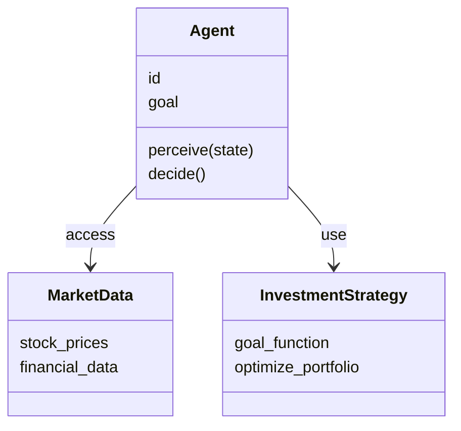
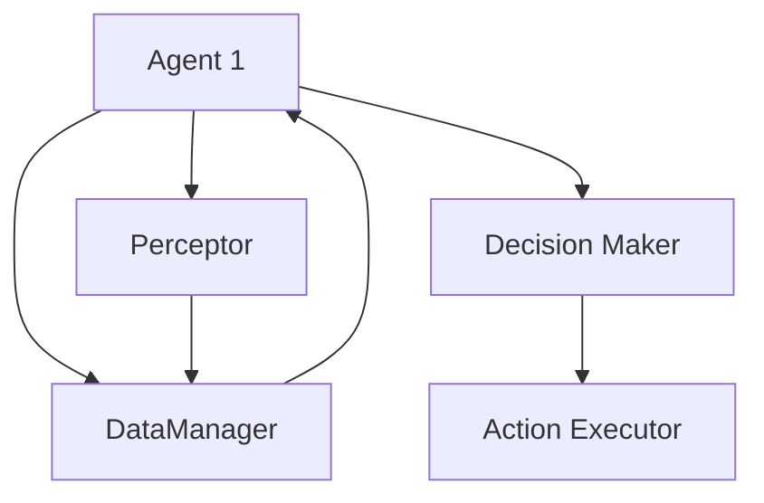
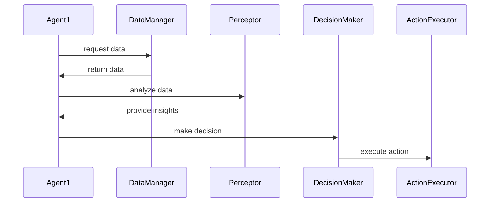

                 


# AI多智能体系统revolutionizing价值投资：新时代的投资决策

> 关键词：AI多智能体系统, 价值投资, 投资决策, 纳什均衡, 机器学习, 股票筛选, 组合优化

> 摘要：本文探讨了AI多智能体系统如何彻底改变传统的价值投资方式，通过详细分析多智能体系统的数学模型、算法原理以及实际应用，展示了其在新时代投资决策中的革命性作用。

---

## 第一部分: AI多智能体系统的背景与价值投资的结合

### 第1章: AI多智能体系统与价值投资概述

#### 1.1 AI多智能体系统的定义与特点
- **多智能体系统的定义**: 由多个智能体组成的系统，每个智能体能够独立决策并协作完成复杂任务。
- **AI多智能体系统的独特优势**: 高度协作、分布式计算、适应性强。
- **与传统AI的区别**: 传统AI依赖中心化决策，而多智能体系统强调去中心化协作。

#### 1.2 价值投资的核心概念
- **价值投资的定义**: 通过分析公司基本面，寻找被市场低估的投资标的。
- **价值投资的关键要素**: 财务指标分析、行业地位、管理团队、竞争优势。
- **价值投资与现代投资理论的联系**: 价值投资强调长期稳健回报，与现代投资组合理论相辅相成。

#### 1.3 AI多智能体系统在价值投资中的应用前景
- **多智能体系统在投资决策中的优势**: 提高决策效率、优化投资组合、降低风险。
- **价值投资与AI多智能体系统的结合点**: 通过多智能体协作，实现对市场、行业、个股的全面分析。
- **未来发展趋势与挑战**: 技术进步带来的效率提升，但需应对数据质量和模型复杂性等挑战。

---

### 第2章: AI多智能体系统的数学模型与算法原理

#### 2.1 多智能体系统的数学模型
- **多智能体系统的基本模型**: 多智能体系统由多个智能体组成，每个智能体都有自己的目标函数和决策空间。
- **博弈论在多智能体系统中的应用**: 将投资决策视为博弈过程，分析各智能体的策略选择。
- **纳什均衡的数学表达式**: 在博弈论中，纳什均衡是一个策略组合，其中每个智能体的策略都是最佳反应。
$$\text{纳什均衡条件: } \forall i, \forall a_i', u_i(a_i) \geq u_i(a_i')$$

#### 2.2 基于多智能体系统的投资决策算法
- **协作与竞争机制的数学建模**: 通过构建协作和竞争模型，优化投资组合。
- **多智能体系统中的分布式计算**: 各智能体独立计算，再通过通信协议进行协作。
- **联合优化模型的构建与求解**: 将多个智能体的目标函数联合优化，寻找全局最优解。

#### 2.3 实例分析: 多智能体系统在股票组合优化中的应用
- **案例背景与问题描述**: 某投资机构希望通过多智能体系统优化股票组合。
- **基于多智能体系统的优化算法实现**: 各智能体分别分析不同股票，协作生成最优组合。
- **实验结果与分析**: 与传统方法相比，多智能体系统优化的投资组合风险更低，收益更高。

---

### 第3章: 多智能体系统与价值投资的结合模型

#### 3.1 价值投资的核心要素与多智能体系统的关系
- **财务指标分析**: 多智能体系统中的每个智能体负责分析不同的财务指标。
- **市场情绪分析**: 通过多智能体协作，综合分析市场情绪对股价的影响。
- **风险评估与管理**: 多智能体系统能够实时监控风险，动态调整投资策略。

#### 3.2 多智能体系统在价值投资中的应用场景
- **股票筛选与组合优化**: 通过多智能体协作，筛选出具有潜力的股票并优化组合。
- **风险预警与投资策略调整**: 实时监控市场风险，及时调整投资策略。
- **市场趋势预测与投资决策**: 基于多智能体系统的预测模型，做出更精准的投资决策。

#### 3.3 多智能体系统与价值投资的结合模型设计
- **模型设计思路**: 将价值投资的关键要素分解为多个任务，分配给不同的智能体完成。
- **模型的数学表达式**: 通过数学建模，将各智能体的决策结果整合为最终的投资策略。
- **模型的验证与优化**: 使用历史数据验证模型效果，并不断优化以提高准确性。

---

### 第4章: 基于多智能体系统的投资决策算法实现

#### 4.1 算法实现的步骤与流程
- **数据采集与预处理**: 收集财务数据、市场数据等，并进行清洗和特征提取。
- **模型训练**: 基于训练数据，训练多智能体系统的各个组件。
- **系统集成与测试**: 将各智能体集成到系统中，进行功能测试和性能优化。

#### 4.2 算法实现的代码示例
```python
# 示例代码：多智能体系统中的一个智能体
class Agent:
    def __init__(self, id, goal):
        self.id = id
        self.goal = goal
        self.state = None

    def perceive(self, state):
        # 根据当前状态感知环境
        self.state = state

    def decide(self):
        # 根据感知到的状态做出决策
        return self.goal.function(self.state)

# 初始化多个智能体并进行协作
agents = [Agent(i, goal_function) for i in range(n_agents)]
for agent in agents:
    agent.perceive(current_state)
    action = agent.decide()
    # 通过通信协议将决策结果传递给其他智能体
```

#### 4.3 算法的数学模型与优化
- **数学模型**: 建立多智能体系统中的联合优化模型，通过数学方法寻找最优解。
- **优化策略**: 使用分布式优化算法，如分布式梯度下降，提高计算效率。
- **性能评估**: 通过实验验证算法的效率和准确性，确保其在实际应用中的有效性。

---

## 第五章: 系统分析与架构设计

### 5.1 系统分析
- **问题场景介绍**: 在股票市场中，投资者需要实时分析大量数据，做出最优决策。
- **项目介绍**: 基于多智能体系统的投资决策支持平台，帮助投资者优化投资组合。

### 5.2 系统功能设计
- **领域模型**: 通过领域模型类图展示系统中的各个组件及其关系。


### 5.3 系统架构设计
- **系统架构图**: 展示系统的整体架构，包括数据采集、处理、分析和决策模块。


### 5.4 系统接口设计
- **接口描述**: 定义各组件之间的接口，确保系统模块化设计。
- **交互流程图**: 展示系统中各模块的交互流程。


---

## 第六章: 项目实战

### 6.1 环境安装与配置
- **安装依赖**: 安装必要的Python库，如NumPy、Pandas、Scikit-learn。
- **环境配置**: 配置开发环境，确保各组件能够协同工作。

### 6.2 核心代码实现
- **数据采集**: 使用API获取股票数据。
```python
import pandas as pd
from pandas_datareader import data

# 获取股票数据
data.get_dataYahoo(tickers, start, end)
```

- **模型训练**: 训练多智能体系统的各个组件。
```python
# 训练单个智能体
agent = Agent(id, goal)
agent.train(data)
```

### 6.3 案例分析与结果展示
- **案例分析**: 分析具体案例，展示系统的实际应用效果。
- **结果展示**: 通过图表展示优化后的投资组合表现。

### 6.4 项目小结
- **经验总结**: 总结项目实施过程中的经验教训。
- **改进建议**: 提出未来可能的改进方向。

---

## 第七章: 最佳实践与未来展望

### 7.1 最佳实践 tips
- **数据质量管理**: 确保数据的准确性和完整性。
- **模型优化**: 定期更新模型，适应市场变化。
- **风险管理**: 建立完善的风险预警机制。

### 7.2 小结
- **系统优势**: 多智能体系统在价值投资中的独特优势。
- **未来展望**: 展望AI多智能体系统在投资领域的进一步发展。

### 7.3 注意事项
- **数据隐私**: 注意保护投资者的隐私数据。
- **模型复杂性**: 避免模型过于复杂，影响运行效率。

### 7.4 拓展阅读
- **推荐书籍**: 推荐相关的书籍和论文，供读者深入学习。

---

## 作者：AI天才研究院/AI Genius Institute & 禅与计算机程序设计艺术 /Zen And The Art of Computer Programming

---

通过以上结构，文章详细讲解了AI多智能体系统在价值投资中的应用，从理论到实践，从模型构建到代码实现，为读者提供了全面的知识和实用的指导。

