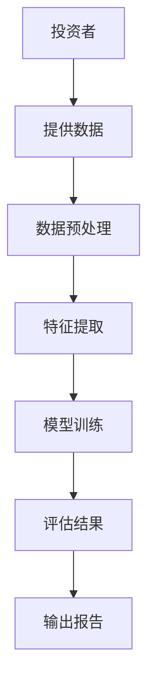
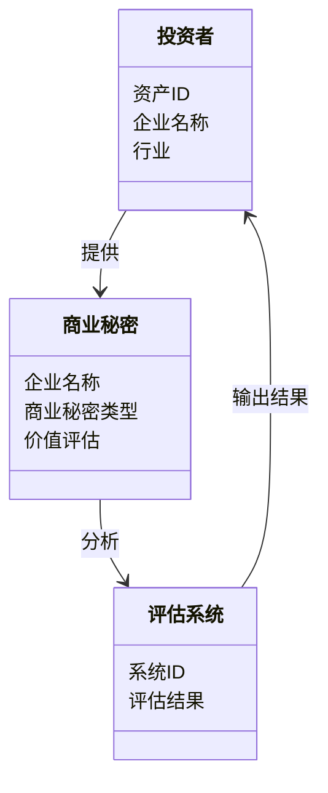
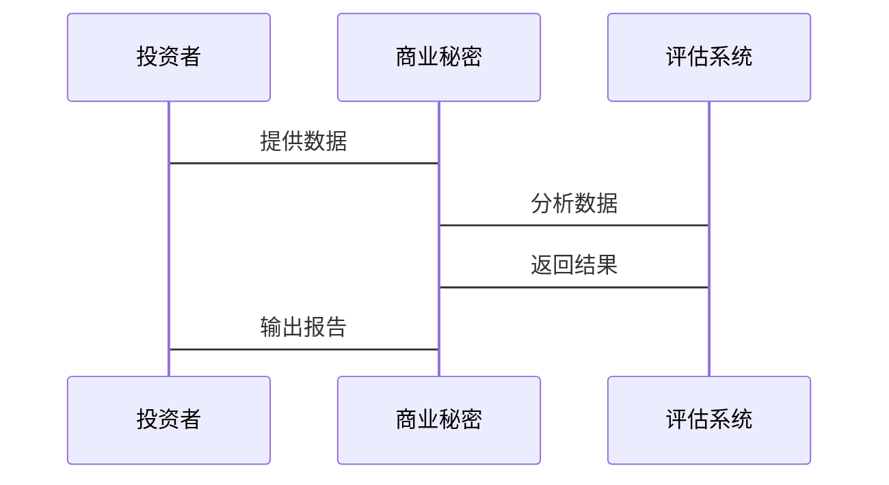

                 


# AI多智能体系统在价值投资中的商业秘密价值评估

## 关键词：
- AI多智能体系统
- 价值投资
- 商业秘密
- 价值评估
- 算法原理
- 系统架构

## 摘要：
本文系统性地探讨了AI多智能体系统在价值投资中的商业秘密价值评估的应用。通过分析商业秘密的价值评估挑战，结合AI多智能体系统的协作机制与算法原理，构建了一个基于多智能体的商业秘密价值评估系统。文章从理论到实践，详细阐述了系统的架构设计、算法实现和项目实战，为读者提供了一个全面的解决方案。

---

# 第1章 背景介绍

## 1.1 AI多智能体系统的基本概念

### 1.1.1 多智能体系统的定义
多智能体系统（Multi-Agent System, MAS）是由多个相互作用的智能体组成的系统，每个智能体都具有一定的自主性、反应性和协作能力。这些智能体通过信息交换和协作完成复杂的任务。

### 1.1.2 AI多智能体系统的演进
随着AI技术的发展，多智能体系统逐渐引入了机器学习、自然语言处理等技术，形成了更加智能化的协作机制。AI多智能体系统通过分布式计算和协作学习，能够更高效地处理复杂问题。

### 1.1.3 多智能体系统的核心特征
| 特征 | 描述 |
|------|------|
| 分布式 | 每个智能体独立运行，共同完成任务。 |
| 协作性 | 智能体之间通过信息共享和协作完成目标。 |
| 反应性 | 系统能够实时响应环境变化并调整策略。 |

## 1.2 价值投资的基本原理

### 1.2.1 价值投资的定义
价值投资是一种投资策略，旨在通过分析企业的基本面，寻找市场价格低于其内在价值的投资标的。其核心在于发现市场中的低估资产。

### 1.2.2 价值投资的关键要素
价值投资的关键要素包括企业的财务状况、行业地位、竞争优势和管理层能力等。通过分析这些要素，投资者可以评估企业的内在价值。

### 1.2.3 价值投资与AI的结合
AI技术的引入，使得价值投资的分析更加高效和精准。AI可以通过大数据分析和机器学习模型，帮助投资者发现潜在的价值低估企业。

## 1.3 商业秘密价值评估的挑战

### 1.3.1 商业秘密的定义与分类
商业秘密是指未公开的、具有商业价值的信息，通常包括技术信息和经营信息。商业秘密可以分为技术类和经营类两大类。

### 1.3.2 传统评估方法的局限性
传统评估方法通常依赖于财务数据和经验判断，存在主观性强、效率低下的问题。此外，商业秘密的非公开性和动态性使得传统方法难以准确评估其价值。

### 1.3.3 AI在商业秘密评估中的优势
AI技术可以通过大数据分析和深度学习，对海量数据进行挖掘和分析，发现隐藏的规律和价值点。AI多智能体系统的协作机制，使得评估过程更加智能化和高效。

---

# 第2章 核心概念与联系

## 2.1 多智能体系统的组成与协作

### 2.1.1 实体关系图（ER图）
```mermaid
erDiagram
    actor 投资者 {
        <primitive> string 资产ID
        <primitive> string 企业名称
        <primitive> string 行业
        <primitive> decimal 市场价值
        <primitive> decimal 内在价值
    }
    actor 商业秘密 {
        <primitive> string 企业名称
        <primitive> string 商业秘密类型
        <primitive> decimal 价值评估
    }
    actor 评估系统 {
        <primitive> string 系统ID
        <primitive> string 评估结果
    }
    投资者 --> 商业秘密: 提供
    商业秘密 --> 评估系统: 分析
    评估系统 --> 投资者: 输出结果
```

### 2.1.2 智能体之间的协作机制
智能体之间的协作机制包括信息共享、任务分配和协调同步。协作机制的效率直接影响系统的整体性能。

### 2.1.3 系统的动态性与适应性
系统需要能够根据市场变化和数据更新，实时调整评估策略和协作机制，确保评估结果的准确性和及时性。

## 2.2 商业秘密价值评估的核心要素

### 2.2.1 评估维度与指标
| 评估维度 | 指标 |
|------|------|
| 财务状况 | 营业收入、净利润率、资产负债率 |
| 行业地位 | 市场份额、行业排名 |
| 竞争优势 | 技术壁垒、成本优势 |
| 管理层能力 | 经验、声誉 |

### 2.2.2 数据来源与处理
数据来源包括企业财务报表、行业报告、新闻资讯等。数据处理过程包括数据清洗、特征提取和数据建模。

### 2.2.3 评估模型的构建
评估模型需要结合企业的多维度信息，构建一个多智能体协作的评估框架，确保评估结果的全面性和准确性。

## 2.3 AI多智能体系统的流程图



---

# 第3章 算法原理与数学模型

## 3.1 分布式计算与协作算法

### 3.1.1 分布式计算的基本原理
分布式计算将任务分解成多个子任务，分别在不同的智能体上执行，最后将结果汇总得到最终结果。这种计算方式能够提高系统的并行计算能力和资源利用率。

### 3.1.2 协作算法的实现步骤
1. 数据预处理：对数据进行清洗和标准化处理。
2. 任务分配：根据智能体的能力和负载情况分配任务。
3. 协作计算：智能体之间通过通信协议共享中间结果。
4. 结果汇总：将各智能体的计算结果汇总，得到最终结果。

### 3.1.3 算法的收敛性分析
算法的收敛性是评估其性能的重要指标。通过分析算法的收敛速度和稳定性，可以优化算法的参数设置和协作机制。

## 3.2 博弈论模型在价值评估中的应用

### 3.2.1 博弈论的基本概念
博弈论研究的是多个参与者在策略选择中的互动关系。在商业秘密价值评估中，可以将不同企业看作博弈中的参与者，分析它们的策略选择和竞争关系。

### 3.2.2 博弈论在商业秘密评估中的应用
通过构建博弈模型，可以模拟不同企业在市场中的竞争策略，预测市场变化对企业价值的影响。

### 3.2.3 竞争与合作的平衡点分析
在博弈论中，平衡点是指所有参与者在选择最优策略时，不再改变策略的点。通过分析平衡点，可以找到最优的协作策略。

## 3.3 数学模型与公式

### 3.3.1 价值评估模型的构建
商业秘密的价值评估模型可以表示为：
$$
V = \alpha \cdot F + \beta \cdot C + \gamma \cdot M
$$
其中，$V$ 是商业秘密的价值，$F$ 是财务状况，$C$ 是行业地位，$M$ 是竞争优势，$\alpha$、$\beta$、$\gamma$ 是各维度的权重系数。

### 3.3.2 协作算法的数学表达式
协作算法的数学表达式可以表示为：
$$
f_i = \sum_{j=1}^{n} w_{ij} \cdot x_j
$$
其中，$f_i$ 是智能体i的计算结果，$w_{ij}$ 是智能体i和j之间的权重，$x_j$ 是智能体j的输入数据。

### 3.3.3 竞争策略的优化公式
竞争策略的优化公式可以表示为：
$$
\theta = \arg \max_{\theta} \sum_{i=1}^{m} \log p(y_i|x_i,\theta)
$$
其中，$\theta$ 是优化参数，$y_i$ 是智能体i的输出结果，$x_i$ 是输入数据，$p$ 是概率分布函数。

---

# 第4章 系统分析与架构设计

## 4.1 问题场景介绍

### 4.1.1 项目背景
本项目旨在通过AI多智能体系统，实现商业秘密的价值评估。通过对企业的多维度信息进行分析，帮助投资者发现价值低估企业。

### 4.1.2 项目目标
项目目标是构建一个高效、准确的商业秘密价值评估系统，提供基于AI多智能体的评估服务。

## 4.2 系统功能设计

### 4.2.1 领域模型类图



### 4.2.2 系统架构设计


## 4.3 系统接口设计

### 4.3.1 接口描述
系统接口包括数据输入接口、模型调用接口和结果输出接口。投资者通过数据输入接口提供企业信息，评估系统通过模型调用接口进行分析，最后通过结果输出接口将评估结果返回给投资者。

### 4.3.2 交互流程图



---

# 第5章 项目实战

## 5.1 环境安装

### 5.1.1 安装Python
```bash
pip install python3
```

### 5.1.2 安装依赖库
```bash
pip install numpy pandas scikit-learn
```

## 5.2 系统核心实现源代码

### 5.2.1 数据预处理代码
```python
import pandas as pd

def preprocess_data(data):
    # 数据清洗
    data = data.dropna()
    # 特征提取
    features = data[['营业收入', '净利润率', '资产负债率']]
    return features
```

### 5.2.2 评估模型代码
```python
from sklearn.ensemble import RandomForestRegressor

def train_model(features, labels):
    model = RandomForestRegressor()
    model.fit(features, labels)
    return model
```

### 5.2.3 评估结果输出
```python
def output_result(result):
    print(f"商业秘密价值评估结果：{result}")
```

## 5.3 实际案例分析

### 5.3.1 案例介绍
以某企业为例，分析其商业秘密的价值。通过数据预处理、模型训练和结果输出，得到该企业的价值评估结果。

### 5.3.2 代码应用解读
通过运行上述代码，可以得到该企业的价值评估结果。代码实现了数据预处理、模型训练和结果输出的全过程。

## 5.4 项目小结
本项目通过AI多智能体系统，实现了商业秘密的价值评估。通过实际案例分析，验证了系统的可行性和有效性。

---

# 第6章 总结与展望

## 6.1 全文总结
本文系统性地探讨了AI多智能体系统在价值投资中的商业秘密价值评估的应用。通过分析商业秘密的价值评估挑战，结合AI多智能体系统的协作机制与算法原理，构建了一个基于多智能体的商业秘密价值评估系统。

## 6.2 未来研究方向
未来的研究方向包括优化协作算法、引入更复杂的数据挖掘技术以及提高系统的实时性和准确性。

## 6.3 应用前景
随着AI技术的不断发展，商业秘密价值评估的应用前景广阔。通过持续优化系统架构和算法模型，可以进一步提高评估的准确性和效率。

---

# 作者：AI天才研究院 & 禅与计算机程序设计艺术

---

通过以上思考过程，我们逐步完成了《AI多智能体系统在价值投资中的商业秘密价值评估》的技术博客文章。文章内容涵盖了从背景介绍到系统架构设计的各个方面，结合理论分析和实际案例，为读者提供了全面的解决方案。

