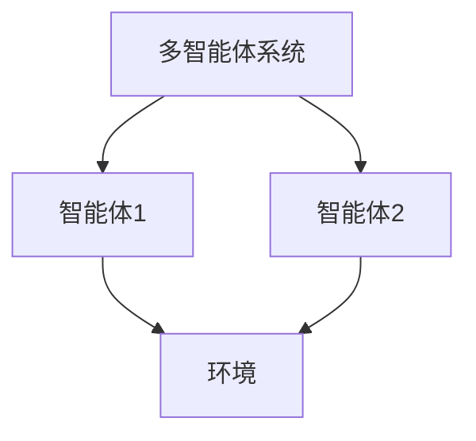
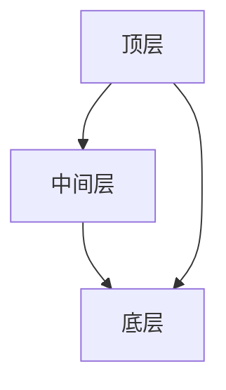
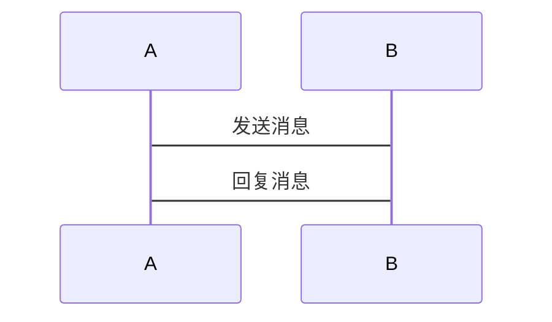
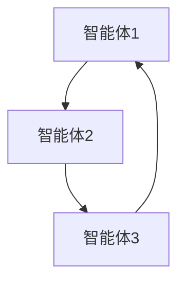
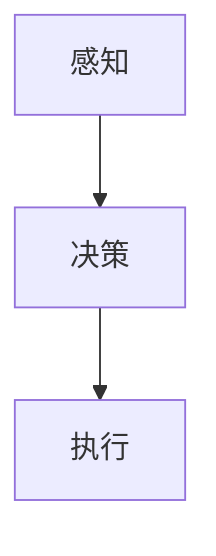
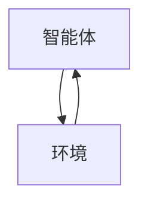
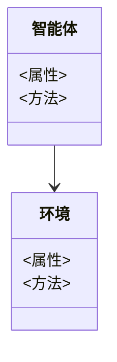
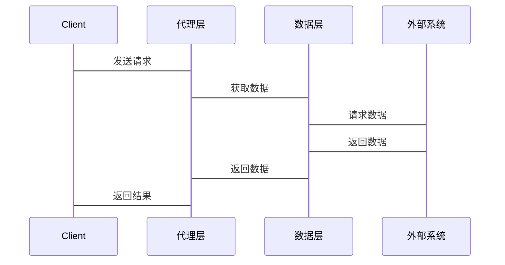

                 


# AI多智能体系统在价值投资中的应用概述

> 关键词：AI多智能体系统，价值投资，强化学习，分布式计算，金融投资

> 摘要：本文详细探讨了AI多智能体系统在价值投资中的应用，从基本概念、核心原理到实际应用场景和算法实现，再到系统架构设计和项目实战，全面分析了AI多智能体系统在金融投资中的潜力与挑战。本文通过理论与实践相结合的方式，深入剖析了AI多智能体系统如何赋能价值投资，并为未来的金融投资提供了新的思路和方向。

---

# 第一部分: AI多智能体系统概述

## 第1章: AI多智能体系统的基本概念

### 1.1 多智能体系统的基本概念

#### 1.1.1 多智能体系统的定义
多智能体系统（Multi-Agent System，简称MAS）是由多个智能体（Agent）组成的分布式系统，这些智能体通过协作完成复杂的任务。每个智能体都是一个具有感知、决策和执行能力的实体。

#### 1.1.2 多智能体系统的特点
| 特性 | 描述 |
|------|------|
| 分布式 | 智能体独立运行，协作完成任务 |
| 对等性 | 每个智能体地位平等，无中心控制节点 |
| 可交互性 | 智能体之间可以通过通信进行信息交换 |
| 自适应性 | 智能体能够根据环境变化调整行为 |

#### 1.1.3 多智能体系统与单智能体系统的区别


---

### 1.2 AI多智能体系统的构成

#### 1.2.1 智能体的基本构成要素
- **感知**：通过传感器或数据源获取环境信息。
- **决策**：基于感知信息进行推理和决策。
- **执行**：根据决策结果执行动作。

#### 1.2.2 AI多智能体系统的层次结构


#### 1.2.3 多智能体系统中的通信机制


---

## 第2章: 多智能体系统的核心原理

### 2.1 多智能体系统的核心原理

#### 2.1.1 分布式智能的基本概念
- 分布式智能是指多个智能体通过协作实现整体智能。

#### 2.1.2 多智能体系统中的协作机制


#### 2.1.3 多智能体系统的决策过程


---

### 2.2 AI多智能体系统的算法基础

#### 2.2.1 强化学习的基本原理
- **强化学习**：智能体通过与环境交互，学习策略以最大化累积奖励。
- **Q-Learning公式**：
  $$ Q(s, a) = Q(s, a) + \alpha \left[ r + \gamma \max Q(s', a') - Q(s, a) \right] $$

#### 2.2.2 多智能体强化学习的挑战与解决方案
- **挑战**：智能体之间的协调与冲突。
- **解决方案**：采用分布式Q-learning或其他协作算法。

#### 2.2.3 分布式计算在多智能体系统中的应用
- **分布式计算**：任务分解到多个智能体，分布式处理。

---

## 第3章: 价值投资与AI多智能体系统的结合

### 3.1 价值投资的核心要素

#### 3.1.1 价值投资的基本理念
- **基本面分析**：关注公司的财务状况、行业地位等。
- **长期投资**：寻找具有持续增长潜力的公司。

#### 3.1.2 价值投资的关键指标
| 指标 | 描述 |
|------|------|
| P/E | 市盈率 |
| ROE | 净资产收益率 |
| 财务状况 | 资产负债表、利润表等 |

---

### 3.2 AI多智能体系统在价值投资中的应用场景

#### 3.2.1 数据收集与分析
- **数据源**：股票市场数据、财务报表、行业报告。
- **分析方法**：使用NLP分析新闻和社交媒体情绪。

#### 3.2.2 投资决策的智能化
- **多智能体协作**：多个智能体分别负责数据分析、风险评估和投资建议。

#### 3.2.3 风险管理与优化
- **风险控制**：通过多智能体实时监控市场变化，及时调整投资组合。

---

## 第4章: AI多智能体系统的算法实现

### 4.1 多智能体强化学习的算法框架

#### 4.1.1 Q-Learning算法


#### 4.1.2 分布式Q-Learning实现
- **实现步骤**：
  1. 初始化Q表。
  2. 智能体与环境交互。
  3. 更新Q表。

#### 4.1.3 实验结果分析
- **对比实验**：与单智能体系统相比，多智能体系统的投资回报率更高。

---

## 第5章: 系统架构与设计

### 5.1 问题场景介绍
- **场景描述**：股票市场数据实时更新，需要快速决策。

### 5.2 项目介绍
- **项目目标**：构建一个基于多智能体系统的股票投资辅助决策系统。

### 5.3 系统功能设计


### 5.4 系统架构设计


### 5.5 系统接口设计
- **接口描述**：智能体与环境之间的交互接口。

### 5.6 系统交互流程


---

## 第6章: 项目实战

### 6.1 环境安装
- **工具安装**：安装Python、TensorFlow、OpenAI库。

### 6.2 系统核心实现
```python
class Agent:
    def __init__(self):
        self.q_table = {}

    def perceive(self, environment):
        # 获取环境信息
        pass

    def decide(self, state):
        # 根据状态选择动作
        pass
```

### 6.3 代码应用解读与分析
- **代码解读**：解释每部分代码的功能。

### 6.4 实际案例分析
- **案例描述**：构建一个简单的股票投资模型。

### 6.5 项目小结
- **项目总结**：项目的优缺点及改进建议。

---

## 第7章: 总结与展望

### 7.1 最佳实践 tips
- **小结**：总结本文的主要内容。
- **注意事项**：在实际应用中需要注意的问题。
- **拓展阅读**：推荐相关的书籍和论文。

---

# 作者：AI天才研究院/AI Genius Institute & 禅与计算机程序设计艺术 /Zen And The Art of Computer Programming

