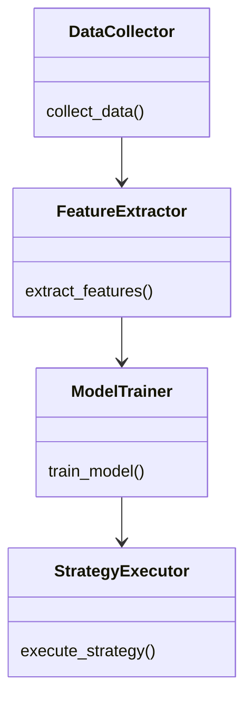

                 


# AI多智能体系统在价值投资中的技术分析整合

> 关键词：AI多智能体系统、价值投资、技术分析、金融建模、机器学习  
> 摘要：本文探讨了AI多智能体系统在价值投资中的应用，通过技术分析与机器学习的结合，展示了如何利用多智能体系统提升投资决策的智能化水平。文章从多智能体系统的算法原理、技术分析的核心指标、系统架构设计以及项目实战等方面进行了详细分析，为价值投资的智能化提供了新的思路。

---

# 第1章 引言

## 1.1 多智能体系统的定义与特点
多智能体系统（Multi-Agent System, MAS）是由多个具有智能行为的实体（智能体）组成的系统，这些智能体能够通过协同工作完成复杂任务。其特点包括分布性、自主性、反应性和协作性。

## 1.2 价值投资与技术分析的结合
价值投资关注于标的资产的内在价值，而技术分析则通过市场数据和指标预测价格走势。AI多智能体系统能够结合两者的优势，利用技术分析数据进行价值评估。

---

# 第2章 多智能体系统的核心算法

## 2.1 强化学习在多智能体系统中的应用
强化学习通过智能体与环境的交互，学习最优策略。例如，基于Q-learning的多智能体算法：

$$ Q(s, a) = r + \gamma \max Q(s', a') $$

其中，$s$是状态，$a$是动作，$r$是奖励，$\gamma$是折扣因子。

## 2.2 分布式计算与多智能体协作
分布式计算通过并行处理提高效率，多智能体协作通过通信协议实现信息共享。例如，使用消息传递接口（MPI）进行分布式计算：

```python
from mpi4py import MPI
comm = MPI.COMM_WORLD
rank = comm.rank
```

---

# 第3章 价值投资中的技术分析

## 3.1 技术分析的核心指标
技术分析依赖于多种指标，如移动平均线（MA）、相对强弱指数（RSI）和MACD。例如，RSI的计算公式为：

$$ RSI = \frac{100 - (100 - \frac{\text{上涨幅度}}{\text{总波动幅度}} \times 100)} $$

---

# 第4章 系统架构设计

## 4.1 系统功能设计
系统功能模块包括数据采集、特征提取、模型训练和策略执行。使用类图表示：



---

# 第5章 项目实战

## 5.1 环境安装
安装必要的库：

```bash
pip install numpy pandas scikit-learn
```

## 5.2 核心实现
实现多智能体系统的代码：

```python
import numpy as np
import pandas as pd

# 示例数据处理
data = pd.read_csv('stock_data.csv')
features = data[['MA', 'RSI', 'MACD']]
labels = data['target']
```

## 5.3 案例分析
以股票价格预测为例，训练一个基于强化学习的多智能体模型，并进行回测。

---

# 第6章 总结与展望

## 6.1 总结
本文探讨了AI多智能体系统在价值投资中的应用，展示了如何通过技术分析和机器学习提升投资决策的智能化水平。

## 6.2 展望
未来的研究方向包括更复杂的多智能体协作算法和更高效的数据处理方法。

---

作者：AI天才研究院/AI Genius Institute & 禅与计算机程序设计艺术 /Zen And The Art of Computer Programming

