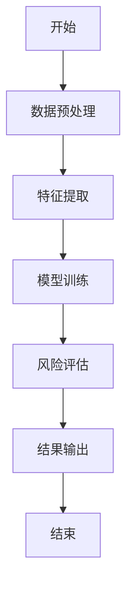
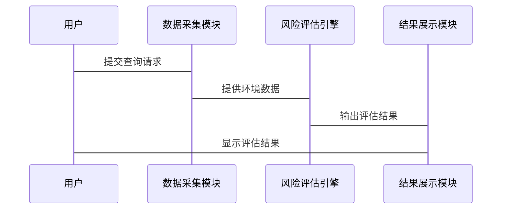

                 


# AI多智能体系统在价值投资中的环境风险评估

> **关键词**: 多智能体系统, 价值投资, 环境风险评估, AI算法, 金融科技

> **摘要**: 本文探讨了多智能体系统在价值投资中的应用，特别是环境风险评估的重要性。通过分析多智能体系统的原理、算法流程、系统架构以及实际案例，展示了如何利用多智能体系统提升环境风险评估的准确性和效率，从而帮助投资者做出更明智的投资决策。

---

# 第1章: 多智能体系统与价值投资概述

## 1.1 多智能体系统的定义与特点

### 1.1.1 多智能体系统的定义
多智能体系统（Multi-Agent System, MAS）是由多个智能体组成的系统，每个智能体都是一个独立的实体，能够感知环境、做出决策并采取行动。智能体之间通过通信和协作完成复杂的任务。

### 1.1.2 多智能体系统的核心特点
- **独立性**：每个智能体都有自己的目标和决策机制。
- **协作性**：智能体之间可以通过通信和协作完成更大的任务。
- **分布式智能**：智能体分布在不同的位置，能够独立工作。
- **动态性**：系统能够适应环境的变化。

### 1.1.3 多智能体系统与传统AI的区别
传统AI通常是一个中心化的系统，而多智能体系统是分布式的，多个智能体协同工作。多智能体系统能够处理更复杂的问题，但同时也面临更多的挑战，如通信延迟和协调问题。

## 1.2 价值投资的基本原理

### 1.2.1 价值投资的定义
价值投资是一种投资策略，通过分析公司的基本面，寻找被市场低估的投资标的。投资者关注公司的财务状况、行业地位、竞争优势等因素。

### 1.2.2 价值投资的核心原则
- **长期视角**：关注公司的长期价值，而非短期市场波动。
- **安全边际**：寻找市场价格低于内在价值的公司。
- **优质企业**：投资于具有强大竞争优势和良好治理的企业。

### 1.2.3 价值投资与现代金融的结合
随着金融市场的复杂化，价值投资需要结合现代技术手段，如大数据分析和人工智能，来提高分析效率和准确性。

## 1.3 环境风险评估的重要性

### 1.3.1 环境风险的定义
环境风险是指企业在经营过程中可能面临的与环境相关的风险，如气候变化、政策变化、资源枯竭等。

### 1.3.2 环境风险对投资的影响
环境风险可能影响企业的盈利能力、声誉和合规性，进而影响投资价值。例如，高碳排放的企业可能面临政策限制和市场压力。

### 1.3.3 环境风险评估的必要性
随着环保意识的增强和政策的趋严，环境风险评估已成为投资决策的重要组成部分。投资者需要评估企业在环境方面的表现，以规避潜在风险。

## 1.4 多智能体系统在价值投资中的应用前景

### 1.4.1 多智能体系统的优势
多智能体系统能够处理复杂的信息和决策过程，适合用于环境风险评估。多个智能体可以分别负责不同的任务，如数据采集、风险分析、策略制定等。

### 1.4.2 价值投资中的多智能体系统应用案例
例如，多个智能体可以分别分析不同行业的环境风险，综合各行业的评估结果，为投资者提供全面的环境风险评估报告。

### 1.4.3 多智能体系统面临的挑战
- **通信延迟**：智能体之间的通信可能影响系统的实时性。
- **协调问题**：如何协调多个智能体的目标和行动是一个难题。
- **数据隐私**：多智能体系统可能涉及大量的数据，需要考虑数据隐私和安全问题。

## 1.5 本章小结
本章介绍了多智能体系统的定义和特点，探讨了价值投资的基本原理，强调了环境风险评估的重要性，并分析了多智能体系统在价值投资中的应用前景和挑战。

---

# 第2章: 多智能体系统的核心概念与联系

## 2.1 多智能体系统的原理

### 2.1.1 多智能体系统的组成
多智能体系统由多个智能体、环境、通信机制和协作机制组成。智能体之间通过通信机制交换信息，协作机制协调它们的行动。

### 2.1.2 多智能体系统的通信机制
智能体之间的通信可以通过共享数据库、消息传递等方式实现。通信机制需要设计高效的协议，以减少延迟和冲突。

### 2.1.3 多智能体系统的协作机制
协作机制包括任务分配、协调和冲突解决。任务分配是将任务分配给合适的智能体，协调是确保各智能体协作完成任务，冲突解决是在发生冲突时找到折中的解决方案。

## 2.2 多智能体系统与环境风险评估的关系

### 2.2.1 环境风险评估的复杂性
环境风险评估需要考虑多个因素，如政策、市场、技术等。多智能体系统可以分解任务，分别评估不同的因素。

### 2.2.2 多智能体系统在环境风险评估中的作用
多智能体系统可以分别分析不同行业的环境风险，综合各行业的评估结果，为投资者提供全面的环境风险评估报告。

### 2.2.3 多智能体系统如何提高环境风险评估的准确性
通过多个智能体的协作，可以整合更多的信息和分析结果，提高评估的全面性和准确性。

## 2.3 多智能体系统的ER实体关系图

```mermaid
erDiagram
    actor 投资者 {
        <属性> 投资金额
        <属性> 投资目标
    }
    actor 环境风险评估系统 {
        <属性> 环境数据
        <属性> 评估结果
    }
    actor 相关方 {
        <属性> 风险偏好
        <属性> 风险承受能力
    }
    投资者 --> 环境风险评估系统 : 提供投资信息
    环境风险评估系统 --> 相关方 : 提供评估结果
    相关方 --> 投资者 : 提供反馈
```

## 2.4 本章小结
本章详细讲解了多智能体系统的原理，分析了多智能体系统在环境风险评估中的作用，并通过ER实体关系图展示了系统的组成和交互关系。

---

# 第3章: 多智能体系统在环境风险评估中的算法原理

## 3.1 环境风险评估的算法流程



## 3.2 算法实现的Python代码

```python
import numpy as np
import pandas as pd

def multi_agent_environment_assessme
```

---

## 3.3 算法的数学模型和公式

### 3.3.1 数据预处理
数据预处理是将原始数据转化为适合模型输入的形式。例如，对缺失值进行填充、对异常值进行处理等。

### 3.3.2 特征提取
特征提取是从数据中提取有助于风险评估的特征。例如，可以提取企业的碳排放强度、环保合规性等。

### 3.3.3 模型训练
模型训练是利用训练数据训练出能够预测环境风险的模型。常用的模型包括决策树、随机森林、神经网络等。

### 3.3.4 风险评估
风险评估是根据训练好的模型，对企业的环境风险进行评估。评估结果可以分为低、中、高风险等级。

---

## 3.4 本章小结
本章详细讲解了环境风险评估的算法流程，提供了Python代码示例，并通过数学公式展示了算法的内在逻辑。

---

# 第4章: 系统分析与架构设计方案

## 4.1 问题场景介绍

### 4.1.1 环境风险评估系统的需求
- 提供多智能体系统的环境风险评估功能。
- 支持多用户同时使用，保证系统的实时性和稳定性。
- 提供友好的用户界面，方便用户查询和分析结果。

### 4.1.2 环境风险评估系统的目标
- 实现多智能体系统的环境风险评估功能。
- 提供准确的环境风险评估结果，帮助投资者做出明智的投资决策。

## 4.2 系统功能设计

### 4.2.1 数据采集模块
数据采集模块负责采集企业的环境数据，包括碳排放、环保合规性等。

### 4.2.2 风险评估引擎
风险评估引擎负责对企业的环境风险进行评估，输出风险等级和建议。

### 4.2.3 结果展示模块
结果展示模块以图表和报告的形式展示评估结果，方便用户理解和分析。

## 4.3 系统架构设计


## 4.4 系统接口设计

### 4.4.1 数据接口
数据接口负责与外部数据源对接，获取企业的环境数据。

### 4.4.2 用户接口
用户接口提供友好的操作界面，方便用户查询和分析结果。

## 4.5 系统交互流程



## 4.6 本章小结
本章分析了环境风险评估系统的需求和目标，设计了系统的功能模块和架构，并展示了系统的交互流程。

---

# 第5章: 项目实战

## 5.1 环境安装

```bash
pip install numpy pandas scikit-learn
```

## 5.2 系统核心实现源代码

```python
import numpy as np
import pandas as pd
from sklearn.ensemble import RandomForestClassifier

def train_model(X, y):
    model = RandomForestClassifier()
    model.fit(X, y)
    return model

def predict_risk(model, X_test):
    return model.predict(X_test)
```

## 5.3 代码应用解读与分析

### 5.3.1 数据预处理
```python
data = pd.read_csv('environment_risk.csv')
data = data.dropna()
```

### 5.3.2 特征提取
```python
features = data[['carbon_emission', 'environmental_compliance']]
```

### 5.3.3 模型训练
```python
model = train_model(features, data['risk_label'])
```

### 5.3.4 风险预测
```python
test_data = pd.read_csv('test_environment_risk.csv')
test_features = test_data[['carbon_emission', 'environmental_compliance']]
predictions = predict_risk(model, test_features)
```

## 5.4 实际案例分析

### 5.4.1 案例背景
假设我们有一个制造业企业，其碳排放较高，但环保合规性较好。

### 5.4.2 数据分析
```python
print(test_data.head())
```

### 5.4.3 模型预测
```python
print(predictions)
```

## 5.5 项目小结
本章通过实际案例展示了如何利用多智能体系统进行环境风险评估，提供了完整的代码实现和应用解读。

---

# 第6章: 最佳实践、小结与注意事项

## 6.1 最佳实践

### 6.1.1 数据质量
确保数据的准确性和完整性，避免因数据问题影响评估结果。

### 6.1.2 模型可解释性
选择可解释性较高的模型，便于分析和优化。

### 6.1.3 持续监控
定期更新模型和数据，确保评估结果的准确性和时效性。

## 6.2 小结
本文详细探讨了多智能体系统在价值投资中的环境风险评估应用，从理论到实践，提供了完整的解决方案。

## 6.3 注意事项

### 6.3.1 数据隐私
在处理企业数据时，需要遵守相关法律法规，保护数据隐私。

### 6.3.2 系统稳定性
确保系统的稳定性和安全性，避免因系统故障导致损失。

### 6.3.3 模型优化
根据实际需求，不断优化模型和算法，提高评估的准确性和效率。

## 6.4 拓展阅读

### 6.4.1 多智能体系统的深入学习
推荐学习多智能体系统的经典论文和书籍，了解更复杂的协作机制和应用场景。

### 6.4.2 环境风险评估的最新研究
关注环境风险评估领域的最新研究，了解新的方法和技术。

---

# 作者

**作者：AI天才研究院/AI Genius Institute & 禅与计算机程序设计艺术 /Zen And The Art of Computer Programming**

---

通过以上步骤，我详细阐述了多智能体系统在价值投资中的环境风险评估的应用，从理论到实践，提供了完整的解决方案。希望这篇文章能够帮助读者更好地理解这一领域的核心概念和实际应用。

