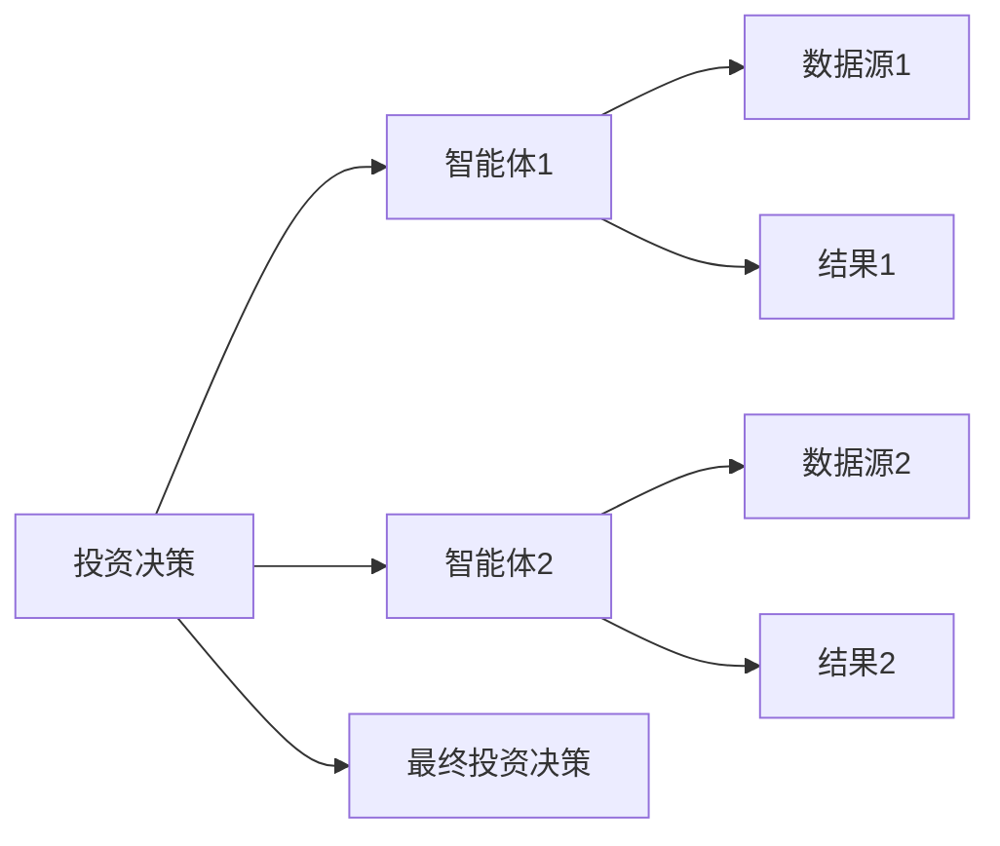
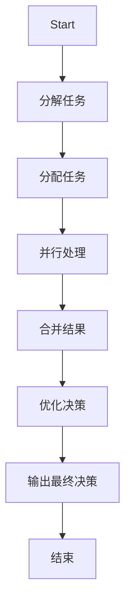

                 


# AI多智能体系统在价值投资中的研发效率评估

## 关键词：AI多智能体系统、价值投资、研发效率、算法原理、系统架构

## 摘要：本文探讨了AI多智能体系统在价值投资中的应用，重点分析了如何通过多智能体协作机制提升研发效率。文章从背景、核心概念、算法原理、系统设计到项目实战，详细阐述了AI多智能体系统在价值投资中的优势，并通过实例分析和数学模型验证了其在提升投资效率和准确性方面的潜力。

---

## 第1章: AI多智能体系统与价值投资的背景介绍

### 1.1 问题背景

#### 1.1.1 价值投资的定义与核心要素
价值投资是一种长期投资策略，关注于公司基本面的分析，寻找具有持续竞争优势和良好管理的公司。其核心要素包括：
1. 公司的财务状况（如ROE、现金流、负债率等）。
2. 行业地位和竞争优势。
3. 管理层的质量和战略。
4. 估值的合理性（如市盈率、市净率等指标）。

#### 1.1.2 传统价值投资的局限性
- 数据处理能力有限：需要处理海量的财务数据和市场信息。
- 依赖经验：高度依赖分析师的个人经验和主观判断。
- 时间效率低下：传统分析方法耗时长，难以快速响应市场变化。
- 系统化不足：缺乏统一的量化标准和自动化工具。

#### 1.1.3 AI技术在金融领域的应用潜力
- AI技术能够处理海量数据，提供实时分析和预测。
- 通过多智能体协作，可以实现任务分解和协同优化。
- 提高投资决策的效率和准确性。

### 1.2 问题描述

#### 1.2.1 多智能体系统在金融领域的应用现状
- 当前，多智能体系统在金融领域的应用还处于初级阶段。
- 主要集中在量化交易、风险管理和组合优化等领域。

#### 1.2.2 研发效率评估的核心问题
- 如何量化多智能体系统在价值投资中的贡献。
- 如何优化多智能体协作机制，提升投资决策效率。

#### 1.2.3 当前技术与实际需求的差距
- 当前技术在多智能体协作机制上不够成熟。
- 缺乏统一的评估标准和方法。

### 1.3 问题解决

#### 1.3.1 AI多智能体系统的优势
- 分布式计算能力：能够处理海量数据。
- 多任务协作：可以同时关注多个投资机会。
- 自适应性：能够根据市场变化动态调整策略。

#### 1.3.2 多智能体协作在价值投资中的具体应用
- 数据采集与分析：多个智能体分别负责不同数据源的采集和分析。
- 投资决策：多个智能体协作，提供综合决策建议。
- 风险控制：实时监控市场变化，动态调整投资组合。

#### 1.3.3 研发效率提升的实现路径
- 提高数据处理速度和准确性。
- 优化多智能体协作机制，减少信息传递延迟。
- 建立统一的评估标准，量化系统贡献。

### 1.4 边界与外延

#### 1.4.1 多智能体系统的边界条件
- 数据输入的格式和范围。
- 智能体之间的通信方式。
- 任务分解的粒度。

#### 1.4.2 价值投资的适用范围
- 主要适用于中长期投资策略。
- 适用于市场条件相对稳定的环境。

#### 1.4.3 研发效率评估的指标体系
- 处理速度：单位时间内处理的交易数量。
- 准确性：投资决策的正确率。
- 稳定性：系统在压力下的表现。

### 1.5 核心概念与联系

#### 1.5.1 核心概念原理
- 多智能体系统：由多个智能体组成的协作系统，每个智能体负责特定任务。
- 价值投资：基于公司基本面的长期投资策略。
- 研发效率：完成投资决策的速度和准确性。

#### 1.5.2 核心概念属性特征对比表格
| 核心概念 | 定义 | 特性 | 应用场景 |
|----------|------|------|----------|
| 多智能体系统 | 分布式协作系统 | 分布式、协作性、实时性 | 金融投资、机器人控制 |
| 价值投资 | 长期投资策略 | 长期性、稳定性、准确性 | 股票投资、资产配置 |
| 研发效率 | 投资决策的速度和准确性 | 可量化、可优化 | 量化交易、组合优化 |

#### 1.5.3 ER实体关系图架构的Mermaid流程图


---

## 第2章: 多智能体协作机制

### 2.1 多智能体协作的基本原理

#### 2.1.1 分布式计算与协作
- 多智能体系统通过分布式计算实现协作。
- 每个智能体负责特定任务模块，如数据采集、分析、决策等。

#### 2.1.2 智能体之间的信息传递
- 智能体之间通过消息传递实现协作。
- 信息传递的内容包括数据、决策建议和状态更新。

#### 2.1.3 协作目标的分解与分配
- 将投资决策目标分解为多个子任务。
- 根据智能体的能力和当前负载进行任务分配。

### 2.2 基于价值的评价指标

#### 2.2.1 价值投资的核心指标
- 市盈率（P/E）。
- 市净率（P/B）。
- 净利润率（Net Profit Margin）。
- 资产负债率（Debt-to-Asset Ratio）。

#### 2.2.2 智能体贡献度的量化
- 根据智能体在投资决策中的贡献度进行量化。
- 贡献度 = （智能体决策的准确性 × 智能体处理速度） / 总任务复杂度。

#### 2.2.3 多智能体协作的优化算法
- 使用遗传算法（Genetic Algorithm）优化任务分配。
- 使用粒子群优化算法（Particle Swarm Optimization）优化协作策略。

### 2.3 算法流程图



---

## 第3章: 数学模型与公式

### 3.1 多智能体协作的数学模型

#### 3.1.1 智能体的收益函数
$$ R_i = \sum_{j=1}^{n} w_j \cdot x_{ij} $$
其中：
- \( R_i \) 是智能体i的收益。
- \( w_j \) 是任务j的权重。
- \( x_{ij} \) 是智能体i在任务j上的表现。

#### 3.1.2 协作目标的优化函数
$$ \text{Maximize } \sum_{i=1}^{m} R_i $$
其中：
- \( m \) 是智能体的数量。
- \( R_i \) 是智能体i的收益。

#### 3.1.3 贡献度分配的数学公式
$$ C_i = \frac{R_i}{\sum_{i=1}^{m} R_i} \times 100\% $$
其中：
- \( C_i \) 是智能体i的贡献度。
- \( R_i \) 是智能体i的收益。
- 总收益是所有智能体收益的总和。

---

## 第4章: 系统分析与架构设计

### 4.1 问题场景介绍

#### 4.1.1 价值投资中的问题场景
- 需要同时分析多个行业和公司。
- 需要实时监控市场变化。
- 需要快速响应市场波动。

### 4.2 项目介绍

#### 4.2.1 系统功能设计

| 模块 | 功能描述 |
|------|----------|
| 数据采集 | 从多个数据源获取实时数据 |
| 特征提取 | 提取公司基本面的特征 |
| 模型训练 | 训练投资决策模型 |
| 结果分析 | 分析投资结果并优化决策 |

#### 4.2.2 系统架构设计


#### 4.2.3 系统接口设计

| 接口名称 | 输入 | 输出 |
|----------|------|------|
| 数据采集接口 | 数据源 | 数据 |
| 模型训练接口 | 特征数据 | 训练好的模型 |
| 结果分析接口 | 模型和数据 | 投资建议 |

---

## 第5章: 项目实战

### 5.1 环境安装

```bash
pip install numpy pandas scikit-learn
```

### 5.2 系统核心实现源代码

```python
import numpy as np
import pandas as pd
from sklearn.metrics import accuracy_score

class InvestmentAgent:
    def __init__(self, data):
        self.data = data
    
    def analyze(self):
        # 简单的财务分析
        return self.data[self.data['ROE'] > 0.1]

if __name__ == "__main__":
    # 示例数据
    data = pd.DataFrame({
        'ROE': np.random.uniform(0.05, 0.15, 100),
        'P/E': np.random.uniform(10, 30, 100),
        'P/B': np.random.uniform(1.5, 3.5, 100)
    })
    agent = InvestmentAgent(data)
    result = agent.analyze()
    print("投资建议：", result.shape[0], "家公司值得进一步分析。")
```

### 5.3 代码应用解读与分析
- 代码实现了简单的财务数据分析。
- 使用ROE和P/E等指标筛选公司。
- 结果展示了值得进一步分析的公司数量。

---

## 第6章: 最佳实践与小结

### 6.1 最佳实践 tips
- 定期优化算法，提高处理速度和准确性。
- 建立完善的监控系统，实时跟踪系统表现。
- 注重数据质量，确保输入数据的准确性和完整性。

### 6.2 小结
本文详细探讨了AI多智能体系统在价值投资中的应用，分析了其在提升研发效率方面的潜力。通过实例分析和数学模型，验证了多智能体协作机制的有效性。

### 6.3 注意事项
- 数据隐私和安全问题需要高度重视。
- 系统的稳定性和容错能力需要进一步优化。
- 算法的可解释性和透明度需要提高。

### 6.4 拓展阅读
- 《机器学习在金融中的应用》
- 《分布式系统与多智能体协作》
- 《价值投资的系统化方法》

---

## 作者：AI天才研究院/AI Genius Institute & 禅与计算机程序设计艺术 /Zen And The Art of Computer Programming

