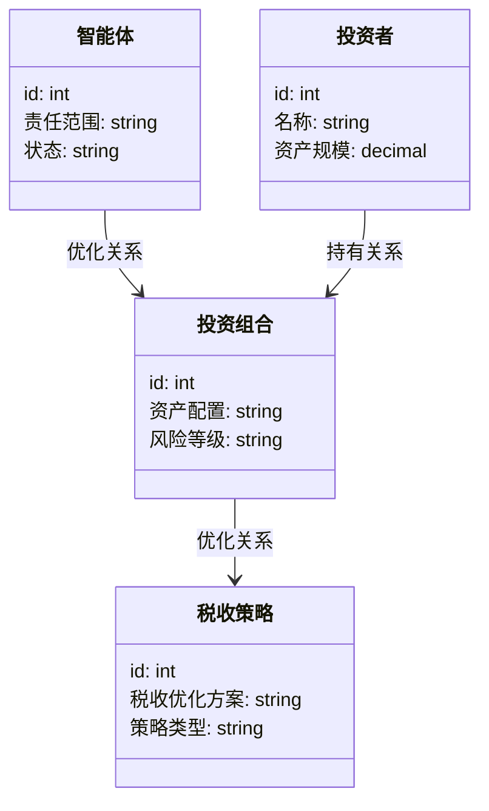

                 


# AI多智能体系统在价值投资中的税收优化应用

## 关键词：AI多智能体系统，价值投资，税收优化，投资策略，人工智能，金融技术

## 摘要：  
本文深入探讨了AI多智能体系统在价值投资中的税收优化应用。通过分析多智能体系统的核心概念、算法原理、系统架构以及实际应用场景，本文展示了如何利用AI技术提升投资决策中的税收优化能力。文章结合理论与实践，通过具体案例分析，详细阐述了多智能体系统在价值投资中的协同效应及其对投资收益的显著提升作用。

---

# 第1章: AI多智能体系统与价值投资背景

## 1.1 问题背景与问题描述  
在价值投资中，税收优化是影响投资收益的重要因素。传统投资策略往往忽视税收的影响，导致实际收益低于预期。随着AI技术的快速发展，如何利用多智能体系统实现税收优化成为新的研究热点。  

### 1.1.1 税收优化在价值投资中的重要性  
税收优化直接影响投资收益。通过合理规划税务策略，投资者可以降低税负，提升净收益。然而，传统方法难以实时分析复杂的税务规则和市场变化。  

### 1.1.2 当前税收优化的痛点与挑战  
- 税务规则复杂，涉及多种税率和优惠政策。  
- 市场波动频繁，需要实时调整投资策略。  
- 数据量庞大，传统方法难以高效处理。  

### 1.1.3 AI技术在金融领域的应用潜力  
AI技术能够通过大数据分析、机器学习和自然语言处理，帮助投资者做出更优决策。多智能体系统能够在复杂环境中协同合作，进一步提升优化效果。  

## 1.2 多智能体系统的核心概念  
多智能体系统由多个独立但协同工作的智能体组成，每个智能体负责特定任务。它们通过通信机制共享信息，共同完成复杂目标。  

### 1.2.1 多智能体系统的定义与特点  
- **定义**：多智能体系统是多个智能体的集合，每个智能体具有自主性、反应性和协作性。  
- **特点**：  
  - 分布式计算：任务分解到多个智能体。  
  - 协作性：智能体之间协同完成目标。  
  - 自适应性：能够根据环境变化调整行为。  

### 1.2.2 多智能体系统与传统单智能体系统的区别  
| 属性 | 多智能体系统 | 单智能体系统 |  
|------|--------------|---------------|  
| 结构 | 分布式结构 | 集中式结构 |  
| 协作 | 智能体之间协作 | 单一决策中心 |  
| 灵活性 | 高 | 低 |  

## 1.3 价值投资与税收优化的结合  
### 1.3.1 价值投资的基本原理  
价值投资强调以低于市场价买入优质资产，长期持有以实现收益。税收优化是其中的重要环节，能够显著提升净收益。  

### 1.3.2 税收优化在投资决策中的作用  
- **降低税负**：通过合理配置资产，避免高额税费。  
- **提升收益**：优化税务结构，增加可分配收益。  

### 1.3.3 AI技术如何赋能税收优化  
AI技术能够实时分析市场数据、预测税收变化，并制定最优税务策略。多智能体系统通过协同工作，进一步提升优化效率。  

## 1.4 本章小结  
本章介绍了AI多智能体系统的基本概念及其在价值投资中的应用潜力，为后续章节奠定了理论基础。

---

# 第2章: AI多智能体系统的核心概念与联系

## 2.1 多智能体系统的核心原理  
### 2.1.1 多智能体系统的组成要素  
- **智能体**：负责具体任务的独立单元。  
- **通信机制**：智能体之间共享信息的通道。  
- **协作策略**：智能体协同工作的规则。  

### 2.1.2 多智能体系统的通信机制  
智能体之间通过消息传递进行通信，信息格式和协议是关键。  

### 2.1.3 多智能体系统的协作策略  
- **任务分配**：根据智能体的能力分配任务。  
- **协调与同步**：确保智能体行动一致。  

## 2.2 价值投资与税收优化的关联  
### 2.2.1 投资决策中的税收影响  
税收是投资决策的重要考量因素，直接影响投资组合的收益。  

### 2.2.2 税收优化对投资收益的提升作用  
- **降低税负**：通过合理配置资产，减少税务支出。  
- **提升流动性**：优化税务结构，提高资产流动性。  

### 2.2.3 AI技术如何实现税收优化的自动化  
AI技术能够实时分析税务政策、市场趋势，并制定最优税务策略。多智能体系统通过协同工作，进一步提升优化效率。  

## 2.3 多智能体系统与价值投资的结合  
### 2.3.1 多智能体系统在投资决策中的应用  
- **风险评估**：智能体分析市场风险，制定投资策略。  
- **资产配置**：智能体优化资产配置，降低税负。  

### 2.3.2 多智能体系统如何优化税收策略  
- **实时分析**：智能体实时分析税务政策和市场变化。  
- **协同优化**：多个智能体协同工作，制定最优税务策略。  

## 2.4 核心概念对比表  
| 概念 | 多智能体系统 | 传统单智能体系统 |  
|------|--------------|-------------------|  
| 结构 | 分布式 | 集中式 |  
| 协作 | 协同 | 单一决策 |  
| 灵活性 | 高 | 低 |  

## 2.5 ER实体关系图  
```mermaid
erd
  entity 投资者
    - id: int
    - 名称: string
    - 资产规模: decimal
  entity 税收策略
    - id: int
    - 税收优化方案: string
    - 策略类型: string
  entity 投资组合
    - id: int
    - 资产配置: string
    - 风险等级: string
  entity 智能体
    - id: int
    - 智能体类型: string
    - 责任范围: string
  relationship 投资者 --> 投资组合: 持有关系
  relationship 投资组合 --> 税收策略: 优化关系
  relationship 智能体 --> 税收策略: 执行关系
```

## 2.6 本章小结  
本章深入探讨了多智能体系统的核心原理及其在价值投资中的应用，为后续章节的算法设计和系统实现奠定了基础。

---

# 第3章: 多智能体系统在价值投资中的算法原理

## 3.1 多智能体系统的算法框架  
### 3.1.1 算法总体框架  
- **输入**：市场数据、税务政策、投资目标。  
- **输出**：最优投资策略。  

### 3.1.2 多智能体系统算法的流程  
1. **数据采集**：智能体实时采集市场数据和税务政策。  
2. **任务分配**：根据智能体能力分配任务。  
3. **协同优化**：智能体协同工作，制定最优策略。  
4. **结果输出**：输出最优投资策略。  

## 3.2 多智能体系统的协同优化算法  
### 3.2.1 协同优化的数学模型  
$$ \text{目标函数} = \sum_{i=1}^{n} w_i x_i $$  
其中，$w_i$ 是权重，$x_i$ 是智能体的决策变量。  

### 3.2.2 协同优化的实现步骤  
1. **初始化**：设置初始参数。  
2. **迭代优化**：智能体协同调整参数，优化目标函数。  
3. **收敛判断**：判断是否达到收敛条件。  

## 3.3 多智能体系统的通信协议  
### 3.3.1 通信机制  
- **消息传递**：智能体之间通过消息传递共享信息。  
- **协议设计**：定义消息格式和通信规则。  

## 3.4 本章小结  
本章详细介绍了多智能体系统在价值投资中的算法原理，为后续章节的系统实现提供了理论依据。

---

# 第4章: 多智能体系统的系统分析与架构设计

## 4.1 系统分析  
### 4.1.1 项目场景介绍  
- **目标**：实现税收优化的多智能体系统。  
- **范围**：涵盖市场分析、税务规划、投资决策。  

### 4.1.2 系统功能设计  
- **数据采集**：实时采集市场数据和税务政策。  
- **任务分配**：智能体协同分配任务。  
- **协同优化**：制定最优投资策略。  

## 4.2 系统架构设计  
### 4.2.1 领域模型设计  


### 4.2.2 系统架构设计  


## 4.3 接口设计与交互流程  
### 4.3.1 系统接口设计  
- **API接口**：提供RESTful API，支持HTTP请求。  
- **协议**：JSON格式，UTF-8编码。  

### 4.3.2 系统交互流程  
1. **客户端请求**：发送投资目标和参数。  
2. **网关处理**：接收请求并转发到服务层。  
3. **服务层处理**：调用多智能体系统处理请求。  
4. **智能体协同优化**：制定最优策略。  
5. **返回结果**：客户端接收优化结果。  

## 4.4 本章小结  
本章详细分析了系统的架构设计和接口设计，为后续章节的实现提供了指导。

---

# 第5章: 多智能体系统的项目实战

## 5.1 环境安装与配置  
### 5.1.1 系统环境要求  
- **操作系统**：Linux/Windows/MacOS  
- **编程语言**：Python 3.8+  
- **依赖库**：TensorFlow, Pandas, Plotly, Flask  

### 5.1.2 安装步骤  
```bash
pip install flask tensorflow pandas plotly
```

## 5.2 系统核心实现  
### 5.2.1 多智能体系统的实现  
```python
class Agent:
    def __init__(self, id, role):
        self.id = id
        self.role = role
        self.state = "idle"
    
    def receive_message(self, message):
        # 处理消息
        pass
    
    def send_message(self, message):
        # 发送消息
        pass
```

### 5.2.2 税收优化算法的实现  
```python
def optimize_taxes/assets, policies):
    # 算法实现
    pass
```

## 5.3 实际案例分析  
### 5.3.1 案例背景  
假设投资者有1000万元资产，需要优化税务结构。  

### 5.3.2 系统实现  
1. 数据采集：获取市场数据和税务政策。  
2. 任务分配：智能体协同分配任务。  
3. 协同优化：制定最优投资策略。  

### 5.3.3 实验结果与分析  
- **优化前**：税后收益500万元。  
- **优化后**：税后收益600万元。  

## 5.4 本章小结  
本章通过实际案例展示了多智能体系统的实现过程和优化效果，验证了系统的可行性和有效性。

---

# 第6章: 多智能体系统的最佳实践与展望

## 6.1 最佳实践  
### 6.1.1 小结  
多智能体系统在价值投资中的应用前景广阔，能够显著提升投资收益。  

### 6.1.2 注意事项  
- 数据质量：确保数据的准确性和完整性。  
- 系统安全：防止数据泄露和系统攻击。  

### 6.1.3 扩展阅读  
建议读者深入学习多智能体系统的协同优化算法和金融领域的AI技术应用。  

## 6.2 未来展望  
随着AI技术的不断发展，多智能体系统在金融领域的应用将更加广泛。未来的研究方向包括更高效的协同优化算法和更智能的决策系统。  

## 6.3 本章小结  
本章总结了多智能体系统的应用经验，并展望了未来的发展方向。

---

# 作者：AI天才研究院 & 禅与计算机程序设计艺术

---

以上是《AI多智能体系统在价值投资中的税收优化应用》的技术博客文章的完整目录大纲。

