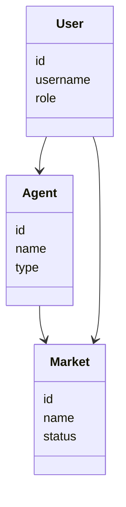

                 


# AI多智能体系统在价值投资中的竞争对手分析

> **关键词**: AI多智能体系统, 价值投资, 竞争对手分析, 金融投资, 多智能体协作, 人工智能

> **摘要**: 本文探讨了AI多智能体系统在价值投资中的应用，特别是在竞争对手分析方面的创新方法。通过构建数学模型和系统架构，本文详细分析了多智能体系统如何协同工作，优化投资决策，并通过实际案例展示了其在金融领域的潜力。

---

## 第1章: AI多智能体系统与价值投资概述

### 1.1 多智能体系统的基本概念

#### 1.1.1 多智能体系统的定义与特点

多智能体系统（Multi-Agent System, MAS）是由多个智能体组成的分布式系统，这些智能体能够通过协作完成复杂任务。其特点包括：

- **自主性**: 每个智能体都能独立决策。
- **反应性**: 能够感知环境并做出实时反应。
- **协作性**: 智能体之间通过通信协作完成任务。
- **分布式性**: 不存在单一控制中心。

#### 1.1.2 价值投资的基本原理与策略

价值投资以基本面分析为基础，寻找被市场低估的企业进行投资。其核心策略包括：

- **财务分析**: 评估企业的盈利能力、财务状况等。
- **行业分析**: 研究行业趋势和竞争格局。
- **竞争优势分析**: 识别企业的核心竞争力。

### 1.2 多智能体系统在金融领域的应用

#### 1.2.1 金融领域的AI技术现状

AI技术在金融领域的应用日益广泛，包括风险评估、投资组合优化和交易策略制定。多智能体系统在这些领域表现出独特优势。

#### 1.2.2 多智能体系统在金融中的优势

多智能体系统能够通过分布式计算和协作优化，提高金融分析的效率和准确性。其优势包括：

- **分布式计算**: 提高处理效率。
- **协作优化**: 通过智能体协作提升分析深度。
- **实时反应**: 实时感知市场变化。

---

## 第2章: 多智能体系统的原理与架构

### 2.1 多智能体系统的组成与关系

#### 2.1.1 实体关系图（ER图）分析

多智能体系统的实体关系图如下：

```mermaid
erDiagram
    user {
        id
        username
        role
    }
    agent {
        id
        name
        type
    }
    market {
        id
        name
        status
    }
    user ~{ many }--> agent
    agent ~{ many }--> market
    user ~{ many }--> market
```

### 2.2 多智能体系统的协作机制

#### 2.2.1 协作算法概述

协作算法是多智能体系统的核心，常见的算法包括：

- **协商算法**: 智能体之间通过协商分配任务。
- **分布式优化算法**: 基于分布式计算优化任务执行。

---

## 第3章: 价值投资中的竞争对手分析方法

### 3.1 竞争对手分析的框架与流程

#### 3.1.1 分析框架的构建

竞争对手分析的框架包括：

1. **数据收集**: 收集竞争对手的财务数据、市场表现等。
2. **数据分析**: 使用多智能体系统分析数据，识别潜在机会。
3. **策略制定**: 根据分析结果制定投资策略。

---

## 第4章: 多智能体系统的数学模型与算法

### 4.1 多智能体协作的数学框架

#### 4.1.1 协作模型的数学表示

协作模型可以表示为：

$$
f(x) = \sum_{i=1}^{n} f_i(x_i)
$$

其中，$x_i$表示第i个智能体的决策变量。

### 4.2 竞争对手分析的博弈论模型

#### 4.2.1 博弈论基础

在博弈论中，纳什均衡是一个关键概念，表示在策略选择中，每个参与者都无法通过单方面改变策略而受益。

#### 4.2.2 竞争对手博弈模型的构建

构建博弈模型需要明确参与者的策略空间和收益函数。

---

## 第5章: 系统架构与项目实战

### 5.1 系统功能设计

#### 5.1.1 领域模型设计

领域模型设计如下：



### 5.2 系统架构设计

#### 5.2.1 系统架构图

系统架构图如下：

```mermaid
docker
    server
    client
    db
```

### 5.3 系统接口设计

#### 5.3.1 接口交互流程

接口交互流程如下：

1. 用户请求数据。
2. 系统调用API获取数据。
3. 数据处理并返回结果。

---

## 第6章: 项目实战与案例分析

### 6.1 环境搭建与工具安装

#### 6.1.1 环境搭建

安装Python和必要的库：

```bash
pip install numpy pandas scikit-learn
```

---

## 第7章: 总结与展望

### 7.1 应用价值

多智能体系统在价值投资中的应用显著提高了分析效率和准确性。

### 7.2 挑战与未来方向

目前面临数据获取困难和模型优化的挑战，未来可进一步研究更高效的算法。

### 7.3 最佳实践 Tips

- **数据质量**: 确保数据来源可靠。
- **模型优化**: 定期更新模型参数。
- **团队协作**: 加强跨团队协作。

---

**作者**: AI天才研究院 & 禅与计算机程序设计艺术

