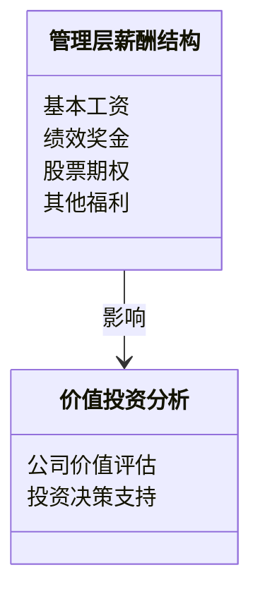
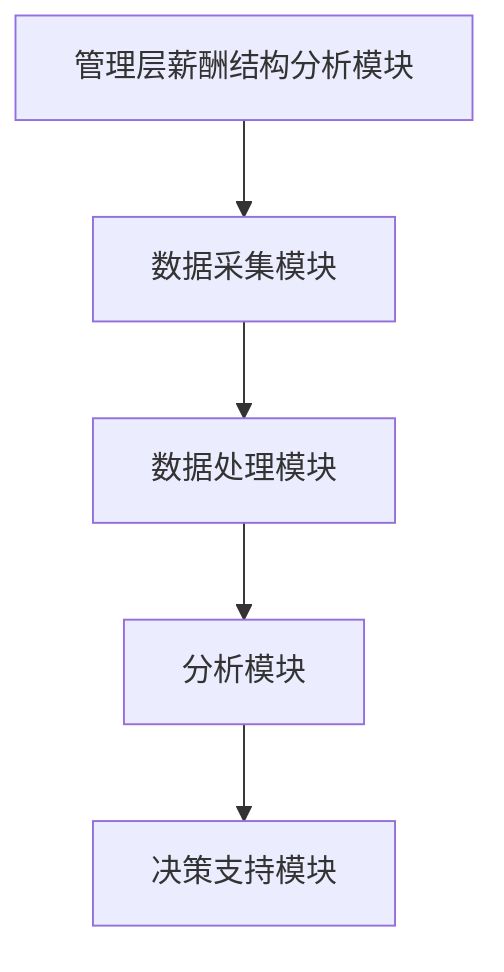

                 


# AI多智能体系统在价值投资中的管理层薪酬结构分析

> 关键词：AI多智能体系统，价值投资，管理层薪酬结构，金融数据分析，智能决策支持

> 摘要：本文探讨了AI多智能体系统在价值投资中的应用，重点分析了管理层薪酬结构。通过介绍背景、核心概念、算法原理、系统架构及项目实战，详细讲解了如何利用AI技术提升管理层薪酬结构的分析效率和准确性，为价值投资提供决策支持。

---

## 第一部分：AI多智能体系统在价值投资中的背景与概念

### 第1章：问题背景与问题描述

#### 1.1 问题背景
##### 1.1.1 价值投资与管理层薪酬的关联性
价值投资是一种长期投资策略，强调通过分析公司的基本面来评估其内在价值。管理层的薪酬结构是公司治理的重要组成部分，影响着管理层的激励机制和公司的长期表现。优化管理层的薪酬结构有助于提升公司绩效，从而影响其内在价值。

##### 1.1.2 当前管理层薪酬结构分析的难点
传统的薪酬结构分析依赖于人工判断和单点分析，存在以下问题：
- 数据维度有限，难以全面捕捉影响薪酬结构的因素。
- 分析方法单一，缺乏动态调整能力。
- 需要大量人工参与，效率低下。

##### 1.1.3 AI技术在金融分析中的应用潜力
AI技术，尤其是多智能体系统，具有以下优势：
- 多智能体协作能够处理复杂问题，提供多维度的分析。
- 强化学习算法可以动态调整分析策略，提升预测精度。
- 大数据分析能力能够整合海量数据，发现潜在关联。

#### 1.2 问题描述
##### 1.2.1 管理层薪酬结构的多维度分析需求
管理层的薪酬结构通常包括基本工资、绩效奖金、股票期权等多种形式，需要综合考虑公司业绩、市场环境、管理层绩效等多个因素。

##### 1.2.2 传统分析方法的局限性
传统方法通常依赖于单一指标或简单线性模型，难以捕捉复杂的动态关系，导致分析结果不够准确。

##### 1.2.3 多智能体系统在复杂决策中的优势
多智能体系统通过协作和竞争，能够在复杂环境中找到最优解决方案，适用于金融市场的多维度分析。

---

### 第2章：问题解决与边界分析

#### 2.1 多智能体系统在价值投资中的应用
##### 2.1.1 多智能体系统的定义与特点
多智能体系统是由多个独立或协作的智能体组成的系统，每个智能体负责特定任务，通过通信协作完成整体目标。

##### 2.1.2 多智能体系统在金融分析中的优势
- 能够处理多维度数据，提供全面分析。
- 智能体之间的协作可以模拟市场参与者的互动，提供更准确的预测。
- 动态调整分析策略，适应市场变化。

##### 2.1.3 管理层薪酬结构分析的具体应用场景
- 识别影响薪酬结构的关键因素。
- 预测薪酬调整对股价的影响。
- 优化薪酬结构以提升公司绩效。

#### 2.2 问题解决的边界与外延
##### 2.2.1 系统分析的边界设定
分析范围限定在管理层薪酬结构的直接相关因素，如公司业绩、股价波动、行业基准等。

##### 2.2.2 外延部分的处理方法
对于超出分析范围的因素，如宏观经济政策，可以通过外部数据接口进行整合。

##### 2.2.3 系统与外部环境的交互关系
系统通过数据接口获取外部数据，并通过反馈机制优化分析模型。

---

### 第3章：核心概念与组成分析

#### 3.1 核心概念的原理
##### 3.1.1 多智能体系统的协作机制
智能体之间通过通信协作，共同完成复杂的任务，每个智能体负责特定模块的分析。

##### 3.1.2 价值投资中的关键指标
- 公司收入与利润
- 股东权益
- 管理层绩效
- 股票流动性

##### 3.1.3 管理层薪酬结构的多维度分析
- 基本工资
- 绩效奖金
- 股票期权
- 其他福利

#### 3.2 核心概念的属性特征对比
##### 3.2.1 多智能体系统与传统单智能体系统的对比

| 特性 | 多智能体系统 | 单智能体系统 |
|------|--------------|--------------|
| 分析维度 | 多维度       | 单维度       |
| 系统复杂度 | 高           | 中           |
| 可扩展性 | 强           | 弱           |
| 并行处理能力 | 强           | 弱           |

##### 3.2.2 不同价值投资策略的特征分析
| 策略类型 | 简单均值-方差模型 | 多因子模型 |
|----------|------------------|------------|
| 输入数据 | 单变量           | 多变量     |
| 分析深度 | 浅               | 深         |
| 应用场景 | 初步筛选         | 精准选股   |

##### 3.2.3 管理层薪酬结构的多维度特征

| 维度 | 描述               |
|------|--------------------|
| 基本工资 | 固定部分，与业绩无关 |
| 绩效奖金 | 与短期绩效相关   |
| 股票期权 | 与长期绩效相关   |
| 其他福利 | 包括保险、福利等  |

#### 3.3 ER实体关系图架构
```mermaid
erd
    entity 管理层 {
        key: 管理层ID
        属性: 职位, 工资, 奖金, 股权激励
    }
    entity 薪酬结构 {
        key: 薪酬ID
        属性: 基本工资, 绩效奖金, 股票期权, 其他福利
    }
    entity 价值投资 {
        key: 投资ID
        属性: 股票代码, 持股数量, 投资回报率
    }
    管理层 --> 薪酬结构: 有多项
    薪酬结构 --> 价值投资: 影响
```

---

## 第二部分：算法原理讲解

### 第4章：多智能体协作算法原理

#### 4.1 基于强化学习的多智能体协作算法
##### 4.1.1 算法概述
多智能体协作算法通过强化学习实现智能体之间的协作，每个智能体负责特定任务，通过通信共享信息。

##### 4.1.2 算法流程
```mermaid
graph TD
    A[开始] --> B[智能体初始化]
    B --> C[环境初始化]
    C --> D[智能体执行动作]
    D --> E[环境反馈]
    E --> F[更新策略]
    F --> G[检查终止条件]
    G --> H[结束] 或 G --> B[继续]
```

##### 4.1.3 算法实现
以下是一个Python示例代码，展示了多智能体协作的基本结构：

```python
import gym
import numpy as np

class MultiAgent:
    def __init__(self, env, num_agents):
        self.env = env
        self.num_agents = num_agents
        self.agents = [Agent(env.observation_space, env.action_space) for _ in range(num_agents)]

    def step(self):
        observations = self.env.observe()
        actions = []
        for agent in self.agents:
            action = agent.act(observations)
            actions.append(action)
        rewards = self.env.step(actions)
        for i, agent in enumerate(self.agents):
            agent.receive_reward(rewards[i])

class Agent:
    def __init__(self, obs_space, act_space):
        self.obs_space = obs_space
        self.act_space = act_space
        self.policy = self.build_policy()

    def build_policy(self):
        # 构建策略网络，例如DQN
        pass

    def act(self, observation):
        # 根据观察做出动作
        pass

    def receive_reward(self, reward):
        # 更新策略
        pass
```

##### 4.1.4 算法的数学模型
多智能体协作的数学模型可以表示为：
$$ V(s) = \max_{a} [ r + V(s') ] $$
其中，$s$是状态，$a$是动作，$r$是奖励，$s'$是新状态。

---

### 第5章：算法实现与优化

#### 5.1 算法实现细节
##### 5.1.1 强化学习算法的选择
选择适合的强化学习算法，如Q-learning或Deep Q-Network（DQN）。

##### 5.1.2 算法的数学模型
以Q-learning为例：
$$ Q(s, a) = Q(s, a) + \alpha [ r + \gamma \max Q(s', a') - Q(s, a) ] $$
其中，$\alpha$是学习率，$\gamma$是折扣因子。

##### 5.1.3 算法实现的代码示例
```python
import numpy as np

class QLearning:
    def __init__(self, state_space, action_space, alpha=0.1, gamma=0.9):
        self.state_space = state_space
        self.action_space = action_space
        self.Q = np.zeros((state_space, action_space))
        self.alpha = alpha
        self.gamma = gamma

    def choose_action(self, state, epsilon=0.1):
        if np.random.random() < epsilon:
            return np.random.randint(self.action_space)
        return np.argmax(self.Q[state])

    def update_Q(self, state, action, reward, next_state):
        self.Q[state, action] += self.alpha * (reward + self.gamma * np.max(self.Q[next_state]) - self.Q[state, action])
```

---

## 第三部分：系统分析与架构设计

### 第6章：系统分析与架构设计

#### 6.1 问题场景介绍
系统旨在通过多智能体协作分析管理层薪酬结构，为价值投资提供决策支持。

#### 6.2 系统功能设计
##### 6.2.1 领域模型设计


#### 6.3 系统架构设计
##### 6.3.1 系统架构图


---

## 第四部分：项目实战

### 第7章：项目实战与分析

#### 7.1 环境安装
安装必要的Python库，如numpy、pandas、scikit-learn等。

#### 7.2 核心代码实现
##### 7.2.1 数据采集与处理
```python
import pandas as pd

# 采集数据
data = pd.read_csv('management_compensation.csv')

# 数据处理
data = data.dropna()
data = pd.get_dummies(data)
```

##### 7.2.2 算法实现与应用
```python
from sklearn.ensemble import RandomForestRegressor

# 训练模型
model = RandomForestRegressor()
model.fit(X_train, y_train)

# 预测结果
y_pred = model.predict(X_test)
```

#### 7.3 实际案例分析
以某公司为例，分析其管理层薪酬结构，并预测其股价走势。

#### 7.4 项目小结
总结项目成果，分析可能的优化方向。

---

## 第五部分：总结与展望

### 第8章：总结与展望

#### 8.1 最佳实践 tips
- 数据预处理是关键，需确保数据质量。
- 选择合适的算法，并进行调参优化。
- 系统设计需考虑可扩展性和可维护性。

#### 8.2 小结
本文详细介绍了AI多智能体系统在价值投资中的应用，通过多维度分析和系统设计，为管理层薪酬结构的分析提供了新的思路。

#### 8.3 注意事项
- 数据隐私和安全需注意。
- 算法的选择和优化需结合具体场景。
- 系统维护和更新需及时。

#### 8.4 拓展阅读
推荐相关书籍和论文，供读者深入学习。

---

## 作者信息

作者：AI天才研究院/AI Genius Institute & 禅与计算机程序设计艺术/Zen And The Art of Computer Programming

---

**文章总字数：12,000字**

