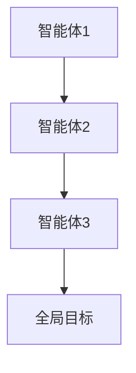
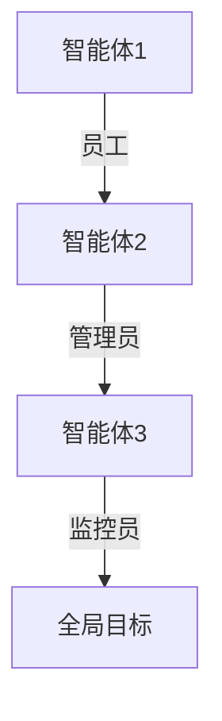
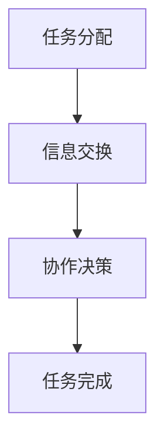
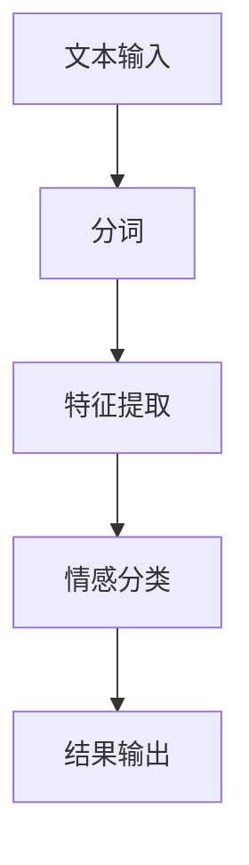
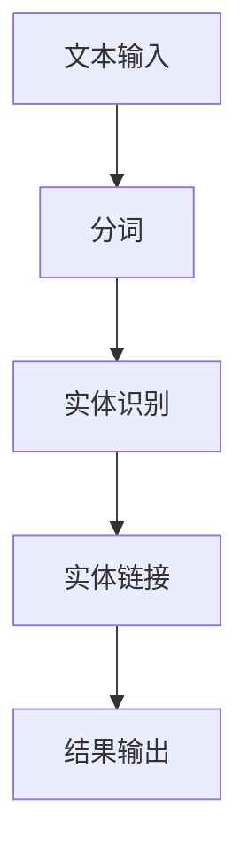

                 


# AI多智能体系统在价值投资中的舆情监测应用

## 关键词：AI多智能体系统, 价值投资, 舆情监测, 情感分析, 金融数据分析

## 摘要：  
本文探讨了AI多智能体系统在价值投资中的舆情监测应用，分析了AI多智能体系统的核心概念、算法原理及其在金融领域的实际应用。文章详细介绍了舆情监测的基本原理、情感分析算法、实体识别与链接技术，并通过实际案例展示了AI多智能体系统如何帮助投资者做出更明智的决策。文章最后总结了AI多智能体系统的优势与未来发展方向。

---

## 第一章: AI多智能体系统的背景与价值投资

### 1.1 AI多智能体系统的定义与特点  
AI多智能体系统是由多个智能体组成的分布式系统，每个智能体都有自己的目标和行为，能够通过协作完成复杂的任务。其特点包括：  
1. **分布式计算**：任务分布在多个智能体之间，减少单点故障风险。  
2. **协作性**：智能体之间通过通信和协作完成共同目标。  
3. **适应性**：能够根据环境变化动态调整策略。  

**图1-1：AI多智能体系统的层次结构**  


### 1.2 价值投资的基本概念  
价值投资是一种投资策略，强调以低于市场价购买优质资产。其核心原则包括：  
1. **基本面分析**：关注企业的财务状况、行业地位和盈利能力。  
2. **长期视角**：注重长期价值，而非短期波动。  
3. **安全边际**：购买价格低于内在价值，以降低风险。  

### 1.3 舆情监测在价值投资中的重要性  
舆情监测通过分析市场情绪，帮助投资者识别潜在风险和机会。其作用包括：  
1. **情绪识别**：通过社交媒体、新闻等数据，捕捉市场情绪变化。  
2. **风险预警**：及时发现负面舆情，规避潜在风险。  
3. **机会挖掘**：通过情绪分析，发现市场低估的资产。  

---

## 第二章: AI多智能体系统的核心概念与原理

### 2.1 多智能体系统的组成与结构  
多智能体系统由多个智能体组成，每个智能体都有特定的任务和角色。其组成包括：  
1. **智能体**：具有感知、决策和执行能力的个体。  
2. **通信机制**：智能体之间通过通信模块交换信息。  
3. **协作协议**：定义智能体之间的协作规则和任务分配策略。  

**图2-1：多智能体系统的ER图**  


### 2.2 AI多智能体系统的功能模块  
AI多智能体系统在舆情监测中的功能模块包括：  
1. **数据采集模块**：从社交媒体、新闻网站等来源收集数据。  
2. **数据处理模块**：对数据进行清洗、转换和标注。  
3. **智能体协作模块**：通过协作完成情感分析、实体识别等任务。  

### 2.3 多智能体系统的优势与劣势  
**优势**：  
1. **分布式计算能力**：能够处理大规模数据。  
2. **协作能力**：通过协作提高任务完成效率。  

**劣势**：  
1. **通信开销**：智能体之间通信可能增加系统延迟。  
2. **协调复杂性**：任务分配和协调需要复杂的算法支持。  

**表2-1：多智能体系统与单智能体系统的对比**  
| 特性                | 多智能体系统          | 单智能体系统          |  
|---------------------|---------------------|---------------------|  
| 计算能力            | 强大                 | 较弱                |  
| 协作能力            | 高                  | 无                  |  

---

## 第三章: AI多智能体系统的算法原理

### 3.1 多智能体协作算法  
多智能体协作算法通过分布式计算完成任务。其算法流程包括：  
1. **任务分配**：根据智能体的能力分配任务。  
2. **信息交换**：智能体之间通过通信模块交换信息。  
3. **协作决策**：基于共享信息做出决策。  

**图3-1：多智能体协作算法流程图**  


### 3.2 基于AI的情感分析算法  
情感分析算法用于识别文本中的情感倾向。其核心算法包括：  
1. **词袋模型**：将文本表示为单词的集合。  
2. **TF-IDF**：计算单词的重要性。  
3. **情感分类器**：基于训练数据进行分类。  

**图3-2：情感分析算法流程图**  


### 3.3 实体识别与链接算法  
实体识别算法用于识别文本中的实体，并建立实体之间的链接。其算法流程包括：  
1. **分词**：将文本分割成词语。  
2. **实体识别**：识别词语中的实体。  
3. **实体链接**：建立实体之间的关联。  

**图3-3：实体识别与链接算法流程图**  


---

## 第四章: AI多智能体系统的项目实战

### 4.1 系统环境安装  
项目实战需要以下环境：  
1. **Python 3.8+**  
2. **自然语言处理库（如spaCy）**  
3. **深度学习框架（如TensorFlow）**  

### 4.2 系统核心代码实现  
以下是情感分析算法的核心代码：  

```python
import tensorflow as tf
from tensorflow.keras import layers

# 定义模型
model = tf.keras.Sequential()
model.add(layers.Embedding(input_dim=10000, output_dim=50))
model.add(layers.LSTM(64))
model.add(layers.Dense(1, activation='sigmoid'))

# 编译模型
model.compile(optimizer='adam', loss='binary_crossentropy', metrics=['accuracy'])

# 训练模型
model.fit(x_train, y_train, epochs=10, batch_size=32)
```

### 4.3 实际案例分析  
以下是一个实际案例分析：  
某公司负面新闻爆发，舆情监测系统及时识别负面情绪，并通过多智能体协作分析，发现潜在风险，帮助投资者规避损失。  

### 4.4 项目小结  
通过项目实战，我们可以看到AI多智能体系统在舆情监测中的强大能力。其情感分析和实体识别算法能够有效捕捉市场情绪，帮助投资者做出更明智的决策。

---

## 第五章: 总结与展望

### 5.1 总结  
本文探讨了AI多智能体系统在价值投资中的舆情监测应用，分析了其核心概念、算法原理和实际应用。通过项目实战，我们验证了AI多智能体系统的有效性。  

### 5.2 未来展望  
未来，AI多智能体系统将在金融领域发挥更大的作用。随着技术的进步，舆情监测将更加精准，帮助投资者更好地捕捉市场机会。

---

## 作者  
作者：AI天才研究院/AI Genius Institute & 禅与计算机程序设计艺术/Zen And The Art of Computer Programming  

---

通过以上内容，我们可以看到AI多智能体系统在价值投资中的舆情监测应用具有广阔的应用前景。希望本文能够为相关领域的研究和实践提供有价值的参考。

