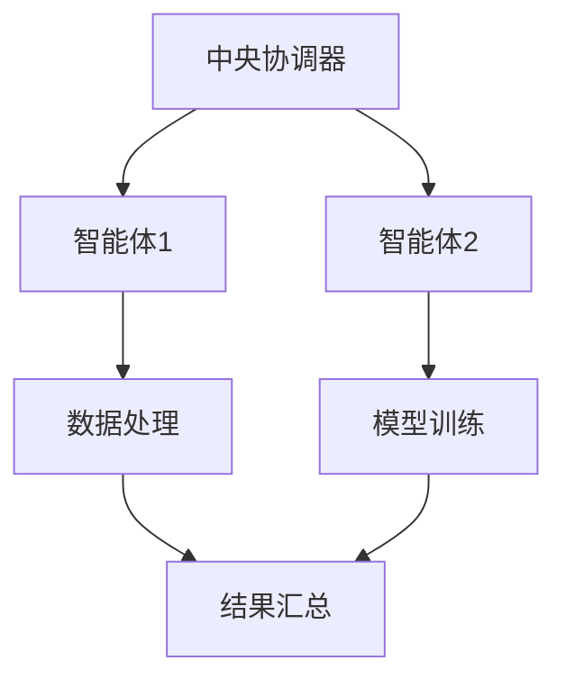
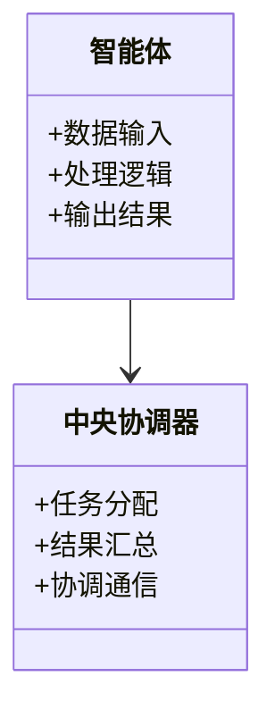
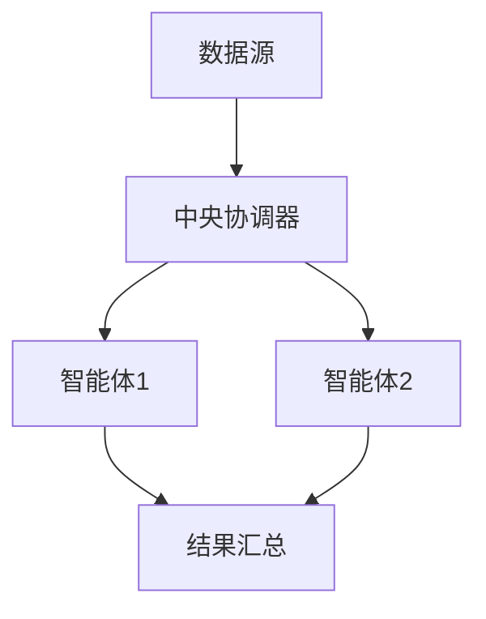

                 


# AI多智能体系统在预测公司内在价值中的优势

> 关键词：AI多智能体系统，公司内在价值预测，算法原理，系统架构，项目实战

> 摘要：本文探讨了AI多智能体系统在预测公司内在价值中的应用优势。通过分析多智能体系统的协作机制、算法原理和系统架构，结合实际项目案例，展示了其在提高预测准确性、优化决策过程中的潜力。文章还提供了最佳实践建议，帮助读者更好地理解和应用这一技术。

---

## 第一部分: 背景介绍

### 第1章: 问题背景

#### 1.1 公司内在价值预测的重要性
公司内在价值预测是投资决策中的核心问题，准确的预测能够帮助投资者识别潜在的投资机会和风险。传统的预测方法依赖于单一模型，往往难以捕捉市场的复杂性和多维度信息。

#### 1.2 当前预测方法的局限性
现有的预测方法通常基于单一模型，存在以下问题：
- 数据维度有限，难以全面反映公司状况。
- 模型缺乏灵活性，难以应对市场变化。
- 计算效率低下，难以处理大规模数据。

#### 1.3 AI多智能体系统的引入
AI多智能体系统通过多个智能体的协作，能够更好地处理复杂数据和场景，提供更准确的预测结果。其优势在于能够分解问题，利用分布式计算提高效率和准确性。

---

## 第二部分: 核心概念与联系

### 第2章: 核心概念与联系

#### 2.1 多智能体系统的核心原理
多智能体系统由多个智能体组成，每个智能体负责特定任务，通过协作完成整体目标。其核心原理包括：
- 分布式计算：任务分解到各个智能体，提高处理效率。
- 信息共享：智能体之间共享数据，提升整体决策能力。
- 协作机制：通过协调和通信，确保系统目标的实现。

#### 2.2 公司内在价值预测的模型构建
公司内在价值预测需要考虑多维度数据，包括财务指标、市场表现、行业趋势等。通过构建多智能体系统，可以分别处理不同维度的数据，然后整合结果，提高预测精度。

---

## 第三部分: 算法原理

### 第3章: 多智能体协作算法

#### 3.1 分布式计算流程
多智能体系统通过分布式计算，将任务分解到各个智能体，每个智能体处理特定部分的数据，最后汇总结果。



#### 3.2 信息共享机制
智能体之间通过通信模块共享数据，确保信息的准确传递和利用。

### 第4章: 预测模型的算法实现

#### 4.1 数据预处理与特征选择
数据预处理包括清洗和标准化，特征选择通过相关性分析确定关键指标。

#### 4.2 神经网络模型构建
使用深度神经网络模型，通过多层感知机（MLP）进行预测。

$$
y = \sigma(wx + b)
$$

其中，$w$ 是权重，$x$ 是输入，$b$ 是偏置，$\sigma$ 是激活函数。

---

## 第四部分: 系统分析与架构设计

### 第5章: 系统架构设计

#### 5.1 系统功能设计
系统功能包括数据采集、模型训练和结果展示。



#### 5.2 系统架构图
系统架构包括智能体模块、中央协调器和数据源。



---

## 第五部分: 项目实战

### 第6章: 项目实战

#### 6.1 环境安装与配置
安装必要的库和工具，如Python、TensorFlow和Keras。

#### 6.2 核心代码实现
实现多智能体协作算法和预测模型。

```python
import numpy as np
import tensorflow as tf

# 定义智能体类
class Agent:
    def __init__(self, input_dim, output_dim):
        self.model = self.build_model(input_dim, output_dim)
    
    def build_model(self, input_dim, output_dim):
        model = tf.keras.Sequential([
            tf.keras.layers.Dense(64, activation='relu', input_dim=input_dim),
            tf.keras.layers.Dense(output_dim, activation='linear')
        ])
        return model

# 中央协调器类
class CentralCoordinator:
    def __init__(self, num_agents):
        self.agents = [Agent(input_dim, 1) for _ in range(num_agents)]
        self.num_agents = num_agents

    def coordinate(self, inputs):
        outputs = []
        for agent in self.agents:
            output = agent.model.predict(np.array([inputs]))
            outputs.append(output[0][0])
        return np.mean(outputs)
```

#### 6.3 案例分析
通过实际案例分析，验证系统的预测能力。

---

## 第六部分: 最佳实践与总结

### 第7章: 最佳实践

#### 7.1 系统优化建议
- 定期更新模型参数，保持预测准确性。
- 增强智能体之间的通信机制，提高协作效率。

#### 7.2 项目小结
本文详细介绍了AI多智能体系统在预测公司内在价值中的应用，展示了其在提高预测准确性和优化决策过程中的优势。

---

作者：AI天才研究院 & 禅与计算机程序设计艺术

---

通过以上结构，文章详细探讨了AI多智能体系统在预测公司内在价值中的优势，结合理论分析和实际案例，为读者提供了全面的指导和见解。

