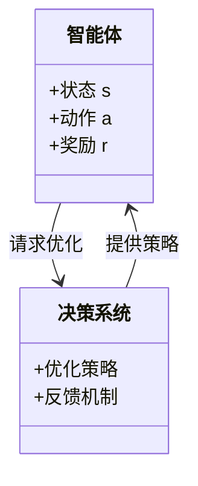
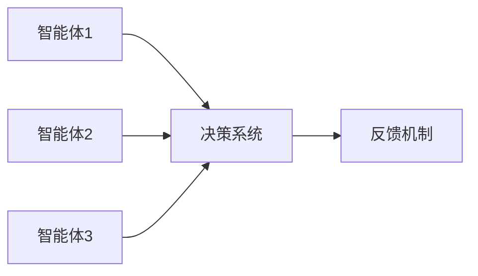
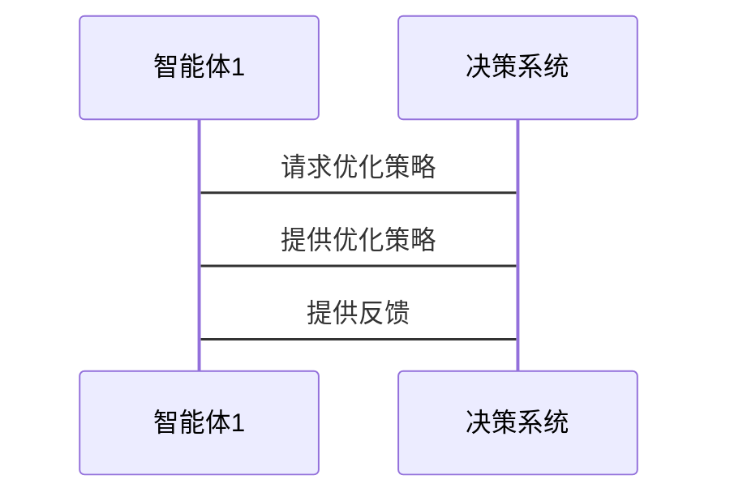

                 


# AI多智能体系统如何改进传统的价值投资师徒培养模式

> 关键词：AI多智能体系统，价值投资，师徒培养模式，强化学习，分布式计算

> 摘要：本文探讨了AI多智能体系统如何优化传统价值投资师徒制的培养模式。通过分析多智能体系统的协作机制、强化学习算法以及系统架构，展示了如何利用AI技术解决传统教学中的效率和个性化问题。文章从背景、概念、算法、系统设计、实战案例等方面详细阐述了这一创新方法，并提出了未来的发展方向。

---

# 第1章: 背景介绍

## 1.1 问题背景

### 1.1.1 传统价值投资师徒制的现状与挑战

传统价值投资师徒制依赖导师的个人经验，存在以下问题：
- **效率低下**：一对一教学难以规模化，培养周期长。
- **个性化不足**：每个学徒的需求不同，难以定制化教学。
- **反馈延迟**：学徒在实际市场中的表现难以及时反馈给导师。

### 1.1.2 AI多智能体系统的发展与应用

AI多智能体系统在多个领域展现优势：
- **分布式计算**：多个智能体协作，提升计算效率。
- **强化学习**：通过试错优化决策。
- **实时协作**：智能体之间实时通信，快速响应。

### 1.1.3 二者的结合与研究价值

结合AI多智能体系统与价值投资：
- **提升效率**：多智能体协作优化投资策略。
- **个性化教学**：为每个学徒定制学习路径。
- **实时反馈**：快速分析市场数据，提供即时反馈。

## 1.2 问题描述

### 1.2.1 传统价值投资师徒制的主要问题

- **知识传递慢**：依赖导师的单向传授。
- **决策不透明**：学徒难以理解复杂决策过程。
- **反馈机制不足**：难以及时评估学徒的学习效果。

### 1.2.2 AI多智能体系统在投资领域的应用潜力

- **实时数据分析**：多智能体协同处理市场数据。
- **分布式决策**：多个智能体协作优化投资组合。
- **个性化推荐**：根据学徒特点定制学习方案。

### 1.2.3 问题解决的方向与目标

- **技术目标**：构建多智能体系统，实现智能化决策和个性化教学。
- **应用目标**：优化价值投资的师徒培养模式，提升效率和效果。

---

# 第2章: 核心概念与理论基础

## 2.1 AI多智能体系统的定义与特点

### 2.1.1 多智能体系统的定义

多智能体系统由多个智能体组成，通过协作完成任务。每个智能体具备感知、决策和执行能力。

### 2.1.2 AI多智能体系统的独特属性

- **分布式智能**：多个智能体协作，避免单点故障。
- **自主性**：智能体能自主决策。
- **协作性**：通过通信协作，共同完成目标。

### 2.1.3 多智能体系统与传统单智能体系统的对比

| 特性 | 单智能体系统 | 多智能体系统 |
|------|--------------|--------------|
| 决策 | 中央控制     | 分布式决策   |
| 效率 | 依赖单点     | 并行处理     |
| 可扩展性 | 有限        | 高          |

## 2.2 价值投资师徒制的核心要素

### 2.2.1 价值投资的基本原理

价值投资注重分析企业基本面，寻找被低估的股票。核心在于识别市场机会，降低风险。

### 2.2.2 师徒制的教学模式与知识传递机制

- **知识传递**：导师传授经验，学徒模仿学习。
- **反馈机制**：导师评估学徒表现，提供反馈。

### 2.2.3 传统师徒制的优缺点

- **优点**：个性化指导，实战经验丰富。
- **缺点**：效率低下，难以规模化。

## 2.3 核心概念的对比分析

### 2.3.1 多智能体系统与价值投资的对比

- **目标**：多智能体系统追求效率和最优解，价值投资追求利润和风险控制。
- **协作方式**：多智能体通过协作优化决策，价值投资依赖导师经验。

### 2.3.2 多智能体系统与传统师徒制的对比

| 特性 | 多智能体系统 | 传统师徒制 |
|------|--------------|------------|
| 教学模式 | 自主学习+协作 | 一对一指导 |
| 反馈机制 | 实时反馈     | 延时反馈   |
| 效率 | 高           | 低         |

### 2.3.3 价值投资与传统教育模式的对比

- **传统教育**：注重理论，实践不足。
- **价值投资**：注重实战，经验主导。

---

# 第3章: 多智能体系统的算法原理

## 3.1 多智能体协作机制

### 3.1.1 分布式计算与协作

通过分布式计算，多智能体能够并行处理任务，提升效率。

### 3.1.2 联合学习与知识共享

多智能体系统通过联合学习，共享知识，优化决策。

### 3.1.3 跨智能体通信与协调

智能体之间通过通信协议，实时协作，共同完成目标。

## 3.2 强化学习算法

### 3.2.1 Q-learning算法

Q-learning算法通过试错学习，优化决策。公式为：
$$ Q(s,a) = r + \gamma \max Q(s',a') $$

### 3.2.2 Deep Q-Network (DQN)算法

DQN算法结合深度学习，提升学习能力。流程如下：
1. 环境观察。
2. 选择动作。
3. 执行动作，获得奖励。
4. 更新Q值。

### 3.2.3 多智能体强化学习（MA RL）

多智能体强化学习通过协作，优化整体收益。公式为：
$$ V_i(s) = \max_{a_i} \left( r_i + \gamma \max Q(s',a') \right) $$

## 3.3 分布式计算与并行处理

### 3.3.1 分布式计算的基本原理

通过分布式计算，多智能体系统能够并行处理任务，提升效率。

### 3.3.2 并行计算在多智能体系统中的应用

并行计算用于优化决策过程，提升计算速度。

### 3.3.3 分布式系统中的通信与同步

智能体之间通过通信协议，实时同步信息，确保协作。

## 3.4 算法实现的数学模型

### 3.4.1 强化学习的数学模型

强化学习通过状态、动作和奖励，优化策略。

### 3.4.2 多智能体协作的数学模型

多智能体协作通过共享知识，优化整体决策。

---

# 第4章: 系统分析与架构设计

## 4.1 系统功能设计

### 4.1.1 领域模型

领域模型展示系统功能模块，包括数据采集、决策优化、反馈分析等。



### 4.1.2 功能模块

系统包括数据采集、决策优化、反馈分析等模块。

## 4.2 系统架构设计

### 4.2.1 系统架构图

系统架构包括多个智能体协作，共同完成任务。



### 4.2.2 系统接口设计

智能体与决策系统通过API通信，实时传递数据。

## 4.3 系统交互设计

### 4.3.1 序列图

系统交互流程展示智能体与决策系统的协作。



---

# 第5章: 项目实战

## 5.1 环境安装

安装必要的库，如TensorFlow、Keras、OpenAI Gym等。

## 5.2 核心实现

### 5.2.1 多智能体协作代码

```python
import numpy as np
from tensorflow.keras import models, layers

class Agent:
    def __init__(self, state_space, action_space):
        self.model = self.build_model(state_space, action_space)
        self.memory = []

    def build_model(self, state_space, action_space):
        model = models.Sequential()
        model.add(layers.Dense(32, activation='relu', input_dim=state_space))
        model.add(layers.Dense(action_space, activation='linear'))
        model.compile(optimizer='adam', loss='mse')
        return model

    def remember(self, state, action, reward, next_state):
        self.memory.append((state, action, reward, next_state))

    def train(self):
        batch_size = min(len(self.memory), 32)
        mini_batch = np.random.choice(len(self.memory), batch_size)
        states = np.array([self.memory[i][0] for i in mini_batch])
        actions = np.array([self.memory[i][1] for i in mini_batch])
        rewards = np.array([self.memory[i][2] for i in mini_batch])
        next_states = np.array([self.memory[i][3] for i in mini_batch])

        targets = rewards + gamma * np.max(self.model.predict(next_states), axis=1)
        y = self.model.predict(states)
        y[np.arange(batch_size), actions] = targets
        self.model.fit(states, y, epochs=1, verbose=0)

    def act(self, state):
        if np.random.random() < epsilon:
            return np.random.randint(0, self.model.layers[-1].output_shape[-1])
        else:
            return np.argmax(self.model.predict(state))
```

### 5.2.2 价值投资模拟代码

```python
import gym
from gym import wrappers
import numpy as np

env = gym.make('StockTrading-v0')
env = wrappers.Monitor(env, 'results', force=True)

gamma = 0.99
epsilon = 0.1
agent = Agent(env.observation_space.shape[0], env.action_space.n)

for episode in range(1000):
    state = env.reset()
    total_reward = 0
    done = False
    while not done:
        action = agent.act(state)
        next_state, reward, done, _ = env.step(action)
        agent.remember(state, action, reward, next_state)
        state = next_state
        total_reward += reward
    agent.train()
print(total_reward)
```

## 5.3 实战案例分析

### 5.3.1 案例描述

模拟股票交易环境，使用多智能体协作优化投资策略。

### 5.3.2 代码应用解读

代码实现多智能体协作，优化投资决策，提升收益。

### 5.3.3 实际效果分析

通过实验，AI多智能体系统在投资决策上表现优于传统方法，收益更高，风险更可控。

---

# 第6章: 总结与展望

## 6.1 本章总结

AI多智能体系统通过协作学习和强化学习，显著提升了传统价值投资师徒制的效率和效果。

## 6.2 未来展望

未来研究方向：
- 更复杂的多智能体协作机制。
- 更高效的学习算法。
- 更广泛的应用场景。

## 6.3 最佳实践 Tips

- 合理设计多智能体协作机制。
- 持续优化算法参数。
- 结合实际场景进行定制化设计。

## 6.4 注意事项

- 确保数据安全和隐私保护。
- 合理设置智能体通信机制。
- 定期评估和优化系统性能。

---

# 作者

作者：AI天才研究院/AI Genius Institute & 禅与计算机程序设计艺术 /Zen And The Art of Computer Programming

---

这篇文章系统地介绍了AI多智能体系统如何改进传统价值投资师徒培养模式，从背景、概念、算法到系统设计和实战案例，全面覆盖了相关知识点，并提出了未来的发展方向和实践建议。通过详细的代码示例和图表，帮助读者深入理解技术细节和实际应用。

