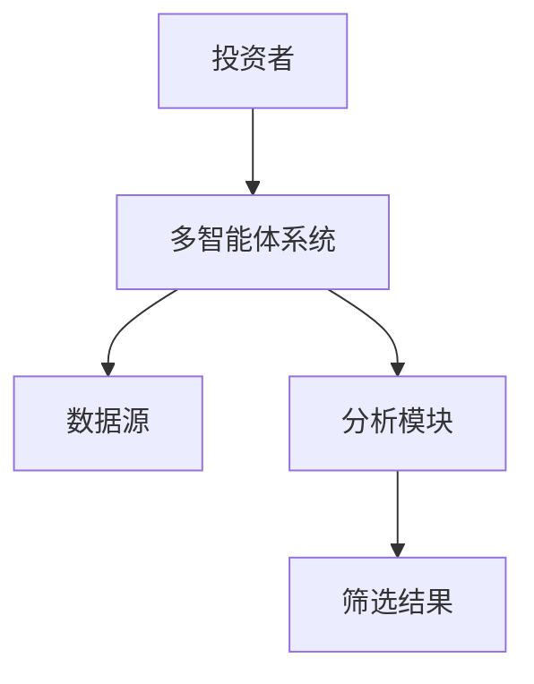
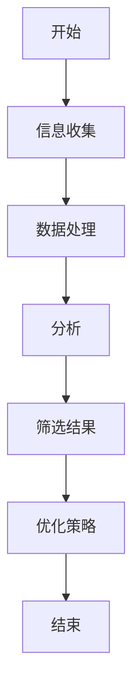
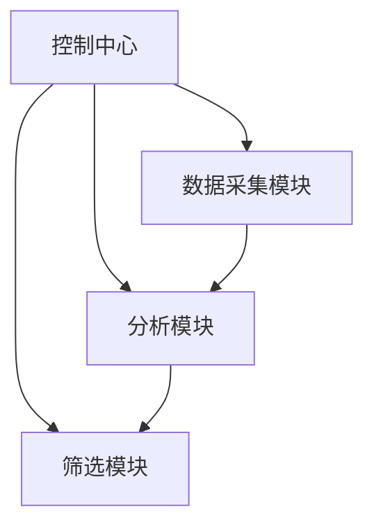

                 


# AI多智能体系统如何改进传统的价值投资筛选方法

> 关键词：AI多智能体系统、价值投资、筛选方法、金融数据分析、分布式计算、机器学习

> 摘要：本文探讨了AI多智能体系统如何通过分布式计算和协作学习来优化传统价值投资的筛选方法。通过分析多智能体系统的协作机制、算法原理和系统架构，展示了其在提升数据处理效率、多维度分析能力和实时反馈机制方面的优势。结合实际案例和项目实战，详细阐述了如何将AI多智能体技术应用于价值投资筛选，并提出了最佳实践建议。

---

# 第一部分: AI多智能体系统与价值投资的背景与基础

## 第1章: AI多智能体系统的概述

### 1.1 AI多智能体系统的定义与特点
AI多智能体系统是指由多个相互作用的智能体组成的系统，这些智能体通过协作或竞争来实现共同目标。与传统的单智能体系统相比，AI多智能体系统具有以下特点：
- **分布式计算**：多个智能体独立运行，协同完成任务。
- **协作与竞争**：智能体之间可以协作或竞争，提升整体性能。
- **自适应性**：能够根据环境变化动态调整策略。

### 1.2 价值投资的基本原理
价值投资是一种以基本面分析为基础的投资策略，旨在通过分析公司的财务状况、行业地位等因素，寻找被市场低估的投资标的。传统价值投资的筛选方法通常依赖于财务指标（如市盈率、市净率等）和行业分析。

## 第2章: 传统价值投资筛选方法的局限性

### 2.1 传统价值投资筛选方法的优缺点
- **优点**：基于财务数据的分析具有较高的准确性。
- **缺点**：面对海量数据时处理效率较低，且难以实时更新。

### 2.2 传统方法在复杂市场环境中的挑战
- **数据量爆炸**：传统方法难以处理来自多种数据源的海量信息。
- **动态变化**：市场环境的快速变化要求投资筛选方法具有更高的实时性。
- **多因素分析**：传统方法难以同时考虑多个影响因素。

## 第3章: AI多智能体系统的优势与潜力

### 3.1 AI多智能体系统在金融领域的应用前景
- **高效数据处理**：AI多智能体系统能够快速处理和分析海量数据。
- **实时决策支持**：通过实时反馈机制，提升投资决策的及时性。
- **多维度分析**：能够同时考虑多个影响因素，提高分析的全面性。

### 3.2 多智能体系统如何提升价值投资筛选效率
- **分布式计算**：通过分布式计算，提升数据处理效率。
- **多智能体协作**：智能体之间的协作能够优化决策过程。
- **实时反馈机制**：通过实时反馈，优化投资策略。

---

# 第二部分: AI多智能体系统的核心概念与价值投资的结合

## 第4章: AI多智能体系统的原理与价值投资的结合

### 4.1 多智能体系统的协作机制
AI多智能体系统的协作机制包括：
- **信息共享**：智能体之间共享数据和信息。
- **任务分配**：根据任务特点分配不同的智能体执行。
- **协调与同步**：确保智能体之间的协作高效有序。

### 4.2 价值投资筛选方法的改进方向
- **数据来源扩展**：引入更多数据源（如社交媒体情绪数据）。
- **多维度分析**：同时考虑财务、市场、行业等多种因素。
- **实时反馈机制**：动态调整投资策略。

## 第5章: AI多智能体系统与价值投资的实体关系图

### 5.1 实体关系图（ER图）设计


### 5.2 多智能体协作流程图


---

# 第三部分: AI多智能体系统的算法与数学模型

## 第6章: AI多智能体系统的算法原理

### 6.1 多智能体协作算法
多智能体协作算法包括：
- **分布式计算算法**：如分布式优化算法。
- **协作学习算法**：如多智能体强化学习。

### 6.2 强化学习算法
强化学习是一种通过智能体与环境互动来优化策略的算法。其数学模型如下：

$$
Q(s, a) = Q(s, a) + \alpha \left[r + \max_{a'} Q(s', a') - Q(s, a)\right]
$$

其中，\( Q(s, a) \) 表示在状态 \( s \) 下执行动作 \( a \) 的价值。

---

# 第四部分: 系统分析与架构设计

## 第7章: 系统分析与架构设计

### 7.1 项目介绍
本项目旨在开发一个基于AI多智能体系统的价值投资筛选平台。

### 7.2 系统功能设计
- **数据采集模块**：采集财务数据、市场数据等。
- **分析模块**：进行多维度分析。
- **筛选模块**：生成投资筛选结果。

### 7.3 系统架构设计


---

# 第五部分: 项目实战

## 第8章: 项目实战

### 8.1 环境安装
需要安装Python、TensorFlow、Keras等工具。

### 8.2 核心代码实现
以下是核心代码示例：
```python
import numpy as np
import tensorflow as tf

# 定义多智能体协作模型
class MultiAgentModel:
    def __init__(self):
        self_agents = tf.keras.Sequential([
            tf.keras.layers.Dense(64, activation='relu'),
            tf.keras.layers.Dense(1, activation='linear')
        ])
```

### 8.3 案例分析
通过具体案例分析，展示AI多智能体系统在价值投资中的应用效果。

### 8.4 项目总结
总结项目成果和经验教训。

---

# 第六部分: 最佳实践与小结

## 第9章: 最佳实践

### 9.1 小结
AI多智能体系统通过分布式计算和协作学习，显著提升了传统价值投资筛选方法的效率和准确性。

### 9.2 注意事项
- **数据质量**：确保数据来源的可靠性和准确性。
- **算法优化**：持续优化协作算法，提升系统性能。
- **风险管理**：建立有效的风险管理机制，降低投资风险。

---

# 作者

作者：AI天才研究院/AI Genius Institute & 禅与计算机程序设计艺术 /Zen And The Art of Computer Programming

